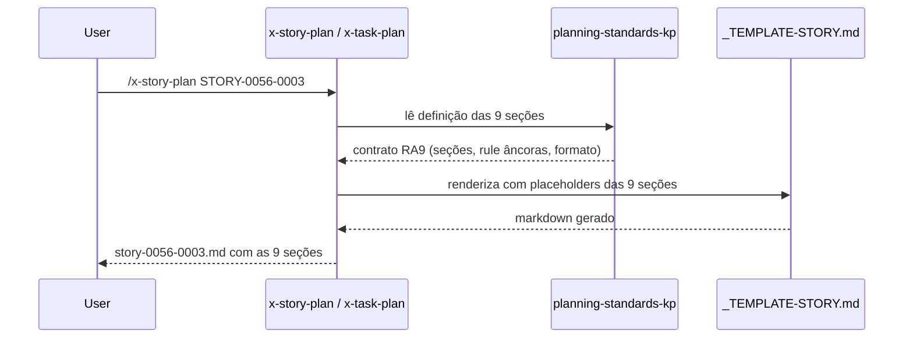

# História: KP `planning-standards-kp` — fonte da verdade RA9

**ID:** story-0056-0001
**Chave Jira:** —
**Status:** Pendente

## 1. Dependências

| Blocked By | Blocks |
| :--- | :--- |
| — | story-0056-0002, story-0056-0003, story-0056-0004, story-0056-0005 |

## 2. Regras Transversais Aplicáveis

| ID | Título |
| :--- | :--- |
| RULE-001 | 9 seções fixas em todos os níveis |
| RULE-005 | KP `planning-standards-kp` como fonte da verdade |
| RULE-002 | Decision Rationale obrigatória em Epic e Story |
| RULE-003 | Packages Hexagonal com direção validada |

## 3. Descrição

Como **arquiteto de plataforma**, eu quero criar um knowledge pack único que centralize a definição das 9 seções RA9 e o mapeamento rule ↔ seção, garantindo que todas as skills de plan referenciem uma fonte da verdade única em vez de duplicar a definição inline.

Esta é a fundação do épico: todas as outras stories consomem as regras definidas aqui. O KP precisa ser `user-invocable: false` (Rule 22 — KPs internos não aparecem no menu `/`) e ficar sob a subpasta `plan/` da taxonomia de skills (EPIC-0036).

### 3.1 Conteúdo obrigatório do KP

- Tabela das 9 seções (nome, rule âncora, KP âncora, conteúdo obrigatório)
- Tabela de granularidade por nível (Epic/Story/Task)
- Formato fixo da seção 8 (Decision Rationale) com micro-template de 4 linhas
- Mapeamento rule ↔ seção (tabela)
- Exemplos preenchidos curtos (1 exemplo de seção 2, 1 de seção 8)

### 3.2 Frontmatter YAML

```yaml
---
name: planning-standards-kp
description: Fonte da verdade do modelo RA9 (Rule-Aligned 9-Section) para templates de planejamento Epic/Story/Task.
user-invocable: false
---
```

## 3.5 Entrega de Valor

- **Valor Principal:** Referência única e versionável das 9 seções RA9 — qualquer mudança nas regras propaga automaticamente para todos os 4 skills de plan que referenciam o KP.
- **Métrica de Sucesso:** KP aparece na listagem de `.claude/skills/` após `ia-dev-env generate`; referenciável via `@planning-standards-kp` em outros SKILL.md.
- **Impacto no Negócio:** Elimina duplicação da definição do contrato RA9 em 4 lugares (uma entrada por skill de plan), reduzindo risco de divergência.

## 4. Definições de Qualidade Locais

### DoR Local (Definition of Ready)

- [ ] Spec aprovada
- [ ] Decisão "substituição direta" confirmada (sem v1+v2)
- [ ] Path `java/src/main/resources/targets/claude/skills/plan/` existe

### DoD Local (Definition of Done)

- [ ] Arquivo `SKILL.md` criado com frontmatter válido
- [ ] As 9 seções documentadas com rule âncora, KP âncora e conteúdo obrigatório
- [ ] Micro-template de Decision Rationale presente
- [ ] Tabela de granularidade Epic/Story/Task presente
- [ ] Pelo menos 1 teste automatizado validando que o KP carrega sem erro de parsing
- [ ] Smoke test passando (`ia-dev-env generate` não quebra)

### Global Definition of Done (DoD)

- **Cobertura:** ≥ 95% Line, ≥ 90% Branch
- **Testes Automatizados:** teste de parsing do SKILL.md + presença de seções obrigatórias
- **Documentação:** KP aparece em `.claude/README.md` (gerado)

## 5. Contratos de Dados (Data Contract)

### 5.1 Estrutura do SKILL.md (contrato)

| Campo | Tipo | M/O | Validações | Exemplo |
| :--- | :--- | :--- | :--- | :--- |
| `name` | `String` | M | match `^planning-standards-kp$` | `planning-standards-kp` |
| `description` | `String(≤ 300)` | M | não vazio | `Fonte da verdade ...` |
| `user-invocable` | `Boolean` | M | `false` obrigatório | `false` |

### 5.3 Error Codes Mapeados

| HTTP Status | Error Code | Condição | Mensagem (RFC 7807) |
| :--- | :--- | :--- | :--- |
| N/A | `KP_PARSE_FAIL` | Frontmatter inválido no SKILL.md | `Planning-standards KP frontmatter inválido: <detalhe>` |

## 6. Diagramas

### 6.1 Fluxo de referência do KP



## 7. Critérios de Aceite (Gherkin)

```gherkin
Cenario: KP ausente (caso degenerado)
  DADO que o arquivo planning-standards-kp/SKILL.md não existe
  QUANDO `ia-dev-env generate` for executado
  ENTÃO a geração deve abortar com erro claro mencionando o KP faltante

Cenario: KP carrega com frontmatter válido (happy path)
  DADO que planning-standards-kp/SKILL.md existe com frontmatter `user-invocable: false`
  QUANDO `ia-dev-env generate` for executado
  ENTÃO o KP deve aparecer em .claude/skills/planning-standards-kp/SKILL.md
  E o KP deve NÃO aparecer no menu de slash-commands do Claude Code

Cenario: Frontmatter inválido (error path)
  DADO que o SKILL.md tem `user-invocable: true` (violação de Rule 22)
  QUANDO o audit for executado
  ENTÃO deve falhar com código KP_VISIBILITY_VIOLATION
  E mensagem orientando a correção

Cenario: KP é referenciado por 4 skills (boundary)
  DADO que o KP foi criado
  QUANDO os 4 skills de plan (x-epic-create, x-epic-decompose, x-story-plan, x-task-plan) forem atualizados
  ENTÃO todos devem conter a string `@planning-standards-kp` em seu SKILL.md
  E nenhum deles deve ter a definição das 9 seções inline
```

### 7.1 Scenario Ordering (TPP)
Ordem: degenerado (KP ausente) → happy path (carga correta) → error path (frontmatter inválido) → boundary (4 referências).

### 7.2 Mandatory Scenario Categories
- [x] Degenerate cases
- [x] Happy path
- [x] Error paths
- [x] Boundary values

### 7.3 TDD Implementation Notes
- Double-Loop: primeiro cenário (KP ausente) vira teste de aceite outer; cenários 2-4 guiam testes unitários.

## 8. Tasks

### TASK-0056-0001-001: Criar arquivo planning-standards-kp/SKILL.md com frontmatter válido

- **Layer:** Doc
- **Test Type:** Unit
- **Size:** M
- **Dependencies:** —
- **Branch:** `feat/task-0056-0001-001-create-kp-skeleton`
- **Testability:** Config + VerificationTest
- **Files:**
  - `java/src/main/resources/targets/claude/skills/plan/planning-standards-kp/SKILL.md`
- **Acceptance Criteria:**
  - [ ] Frontmatter `name`, `description`, `user-invocable: false` presente
  - [ ] Estrutura de cabeçalhos `## 1. ...` até `## 9. ...`

### TASK-0056-0001-002: Preencher conteúdo das 9 seções e tabela de granularidade

- **Layer:** Doc
- **Test Type:** Unit
- **Size:** L
- **Dependencies:** TASK-0056-0001-001
- **Branch:** `feat/task-0056-0001-002-fill-nine-sections`
- **Testability:** Config + VerificationTest
- **Files:**
  - `java/src/main/resources/targets/claude/skills/plan/planning-standards-kp/SKILL.md`
- **Acceptance Criteria:**
  - [ ] Tabela das 9 seções com rule âncora preenchida
  - [ ] Tabela de granularidade Epic/Story/Task preenchida
  - [ ] Micro-template Decision Rationale (4 linhas) presente

### TASK-0056-0001-003: Adicionar teste de parsing do KP

- **Layer:** Test
- **Test Type:** Verification
- **Size:** S
- **Dependencies:** TASK-0056-0001-002
- **Branch:** `feat/task-0056-0001-003-kp-parse-test`
- **Testability:** Config + VerificationTest
- **Files:**
  - `java/src/test/java/dev/iadev/generator/kp/PlanningStandardsKpTest.java`
- **Acceptance Criteria:**
  - [ ] Teste valida frontmatter `user-invocable: false`
  - [ ] Teste valida presença das 9 seções numeradas

### TASK-0056-0001-004: [Test] Smoke/E2E — generate completo com KP

- **Layer:** Test
- **Test Type:** Smoke
- **Size:** S
- **Dependencies:** TASK-0056-0001-003
- **Branch:** `feat/task-0056-0001-004-smoke-generate`
- **Testability:** Config + VerificationTest
- **Files:**
  - `java/src/test/java/dev/iadev/smoke/GenerateWithKpSmokeTest.java`
- **Acceptance Criteria:**
  - [ ] Teste roda `ia-dev-env generate` e valida que `.claude/skills/planning-standards-kp/SKILL.md` é gerado
