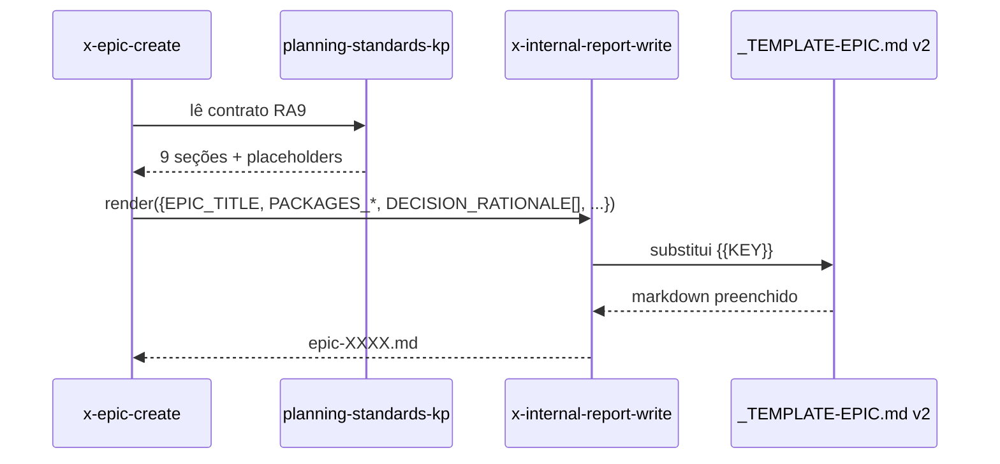

# História: `_TEMPLATE-EPIC.md` v2 com as 9 seções RA9

**ID:** story-0056-0002
**Chave Jira:** —
**Status:** Pendente

## 1. Dependências

| Blocked By | Blocks |
| :--- | :--- |
| story-0056-0001 | story-0056-0006, story-0056-0007 |

## 2. Regras Transversais Aplicáveis

| ID | Título |
| :--- | :--- |
| RULE-001 | 9 seções fixas em todos os níveis |
| RULE-002 | Decision Rationale obrigatória em Epic e Story |
| RULE-003 | Packages Hexagonal com direção validada |
| RULE-004 | Substituição direta |

## 3. Descrição

Como **mantenedor do gerador `ia-dev-env`**, eu quero sobrescrever `_TEMPLATE-EPIC.md` com a estrutura RA9 (9 seções fixas), garantindo que épicos gerados a partir deste merge tenham Decision Rationale, Packages (Hexagonal) e mapeamento rule ↔ seção uniforme.

Esta story substitui o template v1 diretamente (Rule 004). Seções que existem hoje e sobrevivem (Visão Geral, DoR/DoD Global, Regras Transversais, Índice de Histórias) são preservadas mas reorganizadas nas 9 categorias. Os placeholders atuais (`<CHAVE-JIRA>`, `{{PLANNING_STATUS}}`) são mantidos.

### 3.1 Mapeamento das seções antigas → RA9

| v1 | v2 (RA9) |
| :--- | :--- |
| 1. Visão Geral | 1. Contexto & Escopo |
| 2. Anexos | 1. Contexto (subseção) |
| 3. DoR/DoD Global | 5. Quality Gates |
| 4. Regras Transversais | 4. Materialização SOLID / Clean Code (regras transversais viram aqui) |
| 5. Índice de Histórias | 9. Dependências & File Footprint |
| *(nova)* | 2. Packages (Hexagonal) |
| *(nova)* | 3. Contratos & Endpoints |
| *(nova)* | 6. Segurança |
| *(nova)* | 7. Observabilidade |
| *(nova)* | 8. Decision Rationale ⭐ |

### 3.2 Novos placeholders

- Seção 2: `{{PACKAGES_DOMAIN}}`, `{{PACKAGES_APPLICATION}}`, `{{PACKAGES_ADAPTER_INBOUND}}`, `{{PACKAGES_ADAPTER_OUTBOUND}}`, `{{PACKAGES_INFRASTRUCTURE}}`, `{{DEPENDENCY_DIRECTION_NOTE}}`
- Seção 8: `{{DECISION_RATIONALE}}` (lista `{{#each}}` com micro-template de 4 linhas)

## 3.5 Entrega de Valor

- **Valor Principal:** Épicos futuros gerados com `/x-epic-decompose` terão estrutura uniforme com Decision Rationale e Packages Hexagonais declarados no topo.
- **Métrica de Sucesso:** Diff manual de 3 épicos sintéticos (gerados antes e depois) mostra redução ≥ 30% nas decisões repetidas entre stories.
- **Impacto no Negócio:** Menos retrabalho em code review; decisões estruturais (schema, eventos, cascade) ficam documentadas antes da implementação.

## 4. Definições de Qualidade Locais

### DoR Local
- [ ] KP `planning-standards-kp` mergeado (story 0056-0001)
- [ ] Mapeamento v1→v2 revisado

### DoD Local
- [ ] `_TEMPLATE-EPIC.md` sobrescrito com 9 seções
- [ ] Placeholders novos presentes e renderizáveis via `x-internal-report-write`
- [ ] Pelo menos 1 teste automatizado validando estrutura
- [ ] Smoke test passando

## 5. Contratos de Dados (Data Contract)

### 5.1 Estrutura esperada do template

| Seção | Presença | Placeholders principais |
| :--- | :--- | :--- |
| 1. Contexto & Escopo | M | `{{EPIC_TITLE}}`, `{{EPIC_RATIONALE}}` |
| 2. Packages (Hexagonal) | M | `{{PACKAGES_DOMAIN}}`, `{{DEPENDENCY_DIRECTION_NOTE}}` |
| 3. Contratos & Endpoints | M | `{{ENDPOINTS_CATALOG}}` (pode ser `—`) |
| 4. SOLID | M | `{{SOLID_NOTES}}` |
| 5. Quality Gates | M | `{{COVERAGE_TARGET}}`, `{{DOR}}`, `{{DOD}}` |
| 6. Segurança | M | `{{SECURITY_NOTES}}` |
| 7. Observabilidade | M | `{{OBSERVABILITY_NOTES}}` |
| 8. Decision Rationale | M (1+ item) | `{{DECISION_RATIONALE}}` |
| 9. Dependências | M | `{{STORY_INDEX}}` |

## 6. Diagramas

### 6.1 Fluxo de renderização



## 7. Critérios de Aceite (Gherkin)

```gherkin
Cenario: Template sem seção 8 (degenerado)
  DADO um draft do template v2 sem a seção Decision Rationale
  QUANDO o teste estrutural for executado
  ENTÃO deve falhar com TEMPLATE_MISSING_SECTION_8

Cenario: Renderização completa das 9 seções (happy path)
  DADO o template v2 mergeado
  QUANDO x-internal-report-write renderiza com todos os placeholders
  ENTÃO o output deve conter os 9 headers `## N. ...`
  E a seção 2 deve listar as 5 camadas hexagonais
  E a seção 8 deve ter pelo menos 1 item `**Decisão:**`

Cenario: Placeholder não resolvido (error path)
  DADO o template v2 e dados sem `{{PACKAGES_DOMAIN}}`
  QUANDO renderizar
  ENTÃO deve falhar com PLACEHOLDER_UNRESOLVED

Cenario: Compatibilidade com placeholders legacy (boundary)
  DADO o template v2
  QUANDO renderizar com `<CHAVE-JIRA>` e `{{PLANNING_STATUS}}` legados
  ENTÃO ambos devem resolver corretamente (preserva integração com EPIC-0046 lifecycle)
```

### 7.1 Scenario Ordering (TPP)
Degenerado → happy → error → boundary.

### 7.2 Mandatory Scenario Categories
- [x] Degenerate cases
- [x] Happy path
- [x] Error paths
- [x] Boundary values

## 8. Tasks

### TASK-0056-0002-001: Rascunhar estrutura v2 das 9 seções (rename/reorganização)

- **Layer:** Doc
- **Test Type:** Verification
- **Size:** M
- **Dependencies:** —
- **Branch:** `feat/task-0056-0002-001-draft-v2`
- **Testability:** Config + VerificationTest
- **Files:**
  - `java/src/main/resources/shared/templates/_TEMPLATE-EPIC.md`
- **Acceptance Criteria:**
  - [ ] Os 9 headers `## 1.` até `## 9.` presentes
  - [ ] Mapeamento v1→v2 preserva seções legadas

### TASK-0056-0002-002: Adicionar placeholders de Packages e Decision Rationale

- **Layer:** Doc
- **Test Type:** Unit
- **Size:** M
- **Dependencies:** TASK-0056-0002-001
- **Branch:** `feat/task-0056-0002-002-placeholders`
- **Testability:** Config + VerificationTest
- **Files:**
  - `java/src/main/resources/shared/templates/_TEMPLATE-EPIC.md`
- **Acceptance Criteria:**
  - [ ] `{{PACKAGES_DOMAIN}}` e 4 similares presentes
  - [ ] `{{DECISION_RATIONALE}}` com loop `{{#each}}`

### TASK-0056-0002-003: Teste estrutural de presença das 9 seções

- **Layer:** Test
- **Test Type:** Verification
- **Size:** S
- **Dependencies:** TASK-0056-0002-002
- **Branch:** `feat/task-0056-0002-003-structure-test`
- **Testability:** Config + VerificationTest
- **Files:**
  - `java/src/test/java/dev/iadev/generator/templates/TemplateEpicV2StructureTest.java`
- **Acceptance Criteria:**
  - [ ] Teste valida presença dos 9 headers
  - [ ] Teste valida pelo menos 6 placeholders RA9-específicos

### TASK-0056-0002-004: [Test] Smoke/E2E — render completo via x-internal-report-write

- **Layer:** Test
- **Test Type:** Smoke
- **Size:** S
- **Dependencies:** TASK-0056-0002-003
- **Branch:** `feat/task-0056-0002-004-smoke-render`
- **Testability:** Port + Adapter + IT
- **Files:**
  - `java/src/test/java/dev/iadev/smoke/EpicTemplateRenderSmokeTest.java`
- **Acceptance Criteria:**
  - [ ] Renderização com payload completo produz markdown com 9 seções
