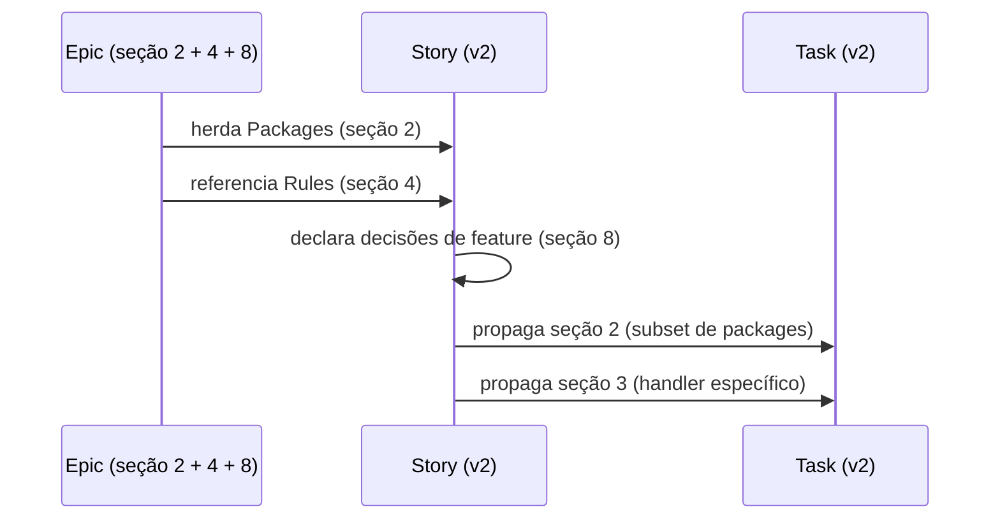

# História: `_TEMPLATE-STORY.md` v2 com as 9 seções RA9

**ID:** story-0056-0003
**Chave Jira:** —
**Status:** Pendente

## 1. Dependências

| Blocked By | Blocks |
| :--- | :--- |
| story-0056-0001 | story-0056-0006, story-0056-0007 |

## 2. Regras Transversais Aplicáveis

| ID | Título |
| :--- | :--- |
| RULE-001 | 9 seções fixas |
| RULE-002 | Decision Rationale obrigatória em Story |
| RULE-003 | Packages Hexagonal |
| RULE-004 | Substituição direta |

## 3. Descrição

Como **autor de histórias**, eu quero um `_TEMPLATE-STORY.md` com 9 seções fixas (incluindo Packages, Decision Rationale e Contratos & Endpoints uniformes), para registrar decisões de feature e herdar invariantes do épico sem improvisação.

Esta story substitui o template v1 diretamente. As seções atuais (Dependências, Descrição, Entrega de Valor, Contratos de Dados, Diagramas, Gherkin, Tasks) são preservadas e reorganizadas nas 9 categorias. A seção "Critérios de Aceite (Gherkin)" é mantida como subseção **5.2 — Acceptance Criteria** dentro de Quality Gates.

### 3.1 Mapeamento v1 → v2

| v1 | v2 (RA9) |
| :--- | :--- |
| 1. Dependências | 9. Dependências & File Footprint |
| 2. Regras Transversais | 4. SOLID (regras referenciadas aqui) |
| 3. Descrição + 3.5 Entrega de Valor | 1. Contexto & Escopo |
| 4. DoR/DoD Local | 5. Quality Gates |
| 5. Contratos de Dados | 3. Contratos & Endpoints |
| 6. Diagramas | referência para `_TEMPLATE-ARCHITECTURE-PLAN.md` (opcional) |
| 7. Gherkin | 5.2 (subseção de Quality Gates) |
| 8. Tasks | 9 (subseção — breakdown) |
| *(nova)* | 2. Packages (Hexagonal) |
| *(nova)* | 6. Segurança |
| *(nova)* | 7. Observabilidade |
| *(nova)* | 8. Decision Rationale |

## 3.5 Entrega de Valor

- **Valor Principal:** Histórias passam a ter slot nomeado para decisões de feature (cache, fallback, retry, timeout) — reduz improviso na implementação.
- **Métrica de Sucesso:** Audit `RA9_RATIONALE_EMPTY` roda verde em 100% das histórias geradas após merge.
- **Impacto no Negócio:** Tech Lead review acelera — decisões estão rastreáveis no plan, não no código.

## 4. Definições de Qualidade Locais

### DoR Local
- [ ] KP `planning-standards-kp` mergeado
- [ ] Gherkin preservado conforme subseção 5.2

### DoD Local
- [ ] `_TEMPLATE-STORY.md` sobrescrito com as 9 seções
- [ ] Gherkin ordering TPP mantido (subseção 5.2.1)
- [ ] Task breakdown mantido (subseção de 9)
- [ ] Testes estrutural + smoke passando

## 5. Contratos de Dados

### 5.1 Estrutura esperada

| Seção | Presença | Conteúdo |
| :--- | :--- | :--- |
| 1 | M | User story + entrega de valor |
| 2 | M | Subset de packages da story |
| 3 | M | Endpoints específicos ou `—` |
| 4 | M | SOLID aplicado + regras aplicáveis do épico |
| 5 | M | DoR/DoD + Gherkin (5.2) |
| 6 | M | OWASP mapeados |
| 7 | M | Logs/métricas da feature |
| 8 | M (1+ item) | Decisions de feature |
| 9 | M | Blocked By/Blocks + Task breakdown + file footprint |

## 6. Diagramas

### 6.1 Fluxo de uso do template v2



## 7. Critérios de Aceite (Gherkin)

```gherkin
Cenario: Template sem seção 2 (degenerado)
  DADO draft do template v2 sem seção Packages
  QUANDO teste estrutural rodar
  ENTÃO deve falhar com TEMPLATE_MISSING_SECTION_2

Cenario: Gherkin preservado em 5.2 (happy path)
  DADO template v2 mergeado
  QUANDO uma story for gerada via /x-story-create
  ENTÃO a subseção 5.2 deve conter pelo menos 4 cenários Gherkin ordenados por TPP

Cenario: Packages não listados (error path)
  DADO template v2 e payload sem packages
  QUANDO renderizar
  ENTÃO deve produzir `—` em todas as 5 camadas, sem falhar
  MAS o audit RA9_PACKAGES_MISSING deve WARNING (não bloqueante para story gerada, bloqueante só em audit CI)

Cenario: Task breakdown preservado (boundary)
  DADO template v2
  QUANDO uma story com 8 tasks for renderizada
  ENTÃO a seção 9 deve conter o task breakdown sem perda de informação
```

### 7.1 TPP
Degenerado → happy → error → boundary.

### 7.2 Mandatory
- [x] Degenerate · [x] Happy · [x] Error · [x] Boundary

## 8. Tasks

### TASK-0056-0003-001: Rascunhar estrutura v2 (9 seções + subseções 5.2 e 9)

- **Layer:** Doc
- **Test Type:** Verification
- **Size:** L
- **Dependencies:** —
- **Branch:** `feat/task-0056-0003-001-draft-story-v2`
- **Testability:** Config + VerificationTest
- **Files:**
  - `java/src/main/resources/shared/templates/_TEMPLATE-STORY.md`
- **Acceptance Criteria:**
  - [ ] 9 headers presentes
  - [ ] Gherkin em 5.2
  - [ ] Task breakdown em 9

### TASK-0056-0003-002: Adicionar placeholders de Packages e Rationale

- **Layer:** Doc
- **Test Type:** Unit
- **Size:** M
- **Dependencies:** TASK-0056-0003-001
- **Branch:** `feat/task-0056-0003-002-placeholders`
- **Testability:** Config + VerificationTest
- **Files:**
  - `java/src/main/resources/shared/templates/_TEMPLATE-STORY.md`
- **Acceptance Criteria:**
  - [ ] Placeholders Packages/Rationale presentes

### TASK-0056-0003-003: Teste estrutural story v2

- **Layer:** Test
- **Test Type:** Verification
- **Size:** S
- **Dependencies:** TASK-0056-0003-002
- **Branch:** `feat/task-0056-0003-003-structure-test`
- **Testability:** Config + VerificationTest
- **Files:**
  - `java/src/test/java/dev/iadev/generator/templates/TemplateStoryV2StructureTest.java`
- **Acceptance Criteria:**
  - [ ] Teste valida 9 headers + Gherkin em 5.2

### TASK-0056-0003-004: [Test] Smoke/E2E — gerar story completa via x-story-create

- **Layer:** Test
- **Test Type:** Smoke
- **Size:** S
- **Dependencies:** TASK-0056-0003-003
- **Branch:** `feat/task-0056-0003-004-smoke-story-create`
- **Testability:** Port + Adapter + IT
- **Files:**
  - `java/src/test/java/dev/iadev/smoke/StoryTemplateV2SmokeTest.java`
- **Acceptance Criteria:**
  - [ ] Renderização com payload válido produz story com as 9 seções
