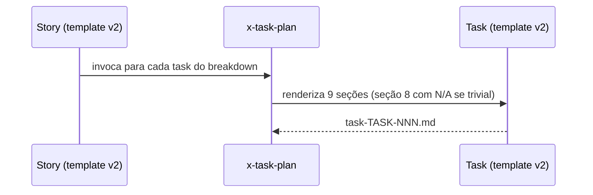

# História: `_TEMPLATE-TASK.md` v2 com as 9 seções RA9 (Rationale opcional)

**ID:** story-0056-0004
**Chave Jira:** —
**Status:** Pendente

## 1. Dependências

| Blocked By | Blocks |
| :--- | :--- |
| story-0056-0001 | story-0056-0006, story-0056-0007 |

## 2. Regras Transversais Aplicáveis

| ID | Título |
| :--- | :--- |
| RULE-001 | 9 seções fixas |
| RULE-002 | Decision Rationale (opcional em Task, N/A aceito) |
| RULE-004 | Substituição direta |

## 3. Descrição

Como **implementador de tasks**, eu quero um `_TEMPLATE-TASK.md` com as 9 seções RA9 adaptadas ao nível operacional (packages com 1-3 arquivos, contrato de 1 handler, Rationale opcional com `N/A` aceito), para registrar decisões locais (retry count, lazy vs eager) apenas quando relevante.

Esta story substitui o template v1 diretamente. Seções "Contratos I/O" e "Plano de Implementação" do v1 são absorvidas pelas seções 3 e 9 do RA9.

### 3.1 Mapeamento v1 → v2

| v1 | v2 |
| :--- | :--- |
| Objetivo | 1. Contexto & Escopo |
| Contratos I/O | 3. Contratos & Endpoints |
| DoD | 5. Quality Gates |
| Dependências | 9. Dependências & File Footprint |
| Plano de Implementação | referência para `plan-task-TASK-*.md` |
| *(nova)* | 2. Packages (1-3 arquivos) |
| *(nova)* | 4, 6, 7 (SOLID, Segurança, Observabilidade) |
| *(nova, opcional)* | 8. Decision Rationale (N/A aceito) |

### 3.2 Tratamento especial da seção 8

Task pode ter literal `## 8. Decision Rationale\n\nN/A — <motivo curto>`. Audit `RA9_RATIONALE_EMPTY` **não se aplica** a tasks — só a presença da seção é verificada (`RA9_SECTIONS_MISSING`).

## 3.5 Entrega de Valor

- **Valor Principal:** Tasks operacionais têm estrutura uniforme; decisões locais (quando existem) ficam registradas sem forçar conteúdo em tasks triviais.
- **Métrica de Sucesso:** Tasks com `N/A` na seção 8 passam no audit; tasks sem a seção falham.
- **Impacto no Negócio:** Reduz overhead em tasks triviais; mantém rastreabilidade de decisões locais não-triviais.

## 4. Definições de Qualidade Locais

### DoR Local
- [ ] KP `planning-standards-kp` mergeado
- [ ] Decisão "Rationale opcional em Task" confirmada na spec

### DoD Local
- [ ] `_TEMPLATE-TASK.md` sobrescrito
- [ ] Seção 8 aceita `N/A — <motivo>` sem erro
- [ ] Teste estrutural + smoke passando

## 5. Contratos de Dados

### 5.1 Estrutura

| Seção | Presença | Conteúdo em Task |
| :--- | :--- | :--- |
| 1 | M | 1 frase + link para story pai |
| 2 | M | 1-3 arquivos/classes |
| 3 | M | Assinatura de 1 handler ou `—` |
| 4 | M | 1 regra específica (ex: "não chamar repo direto") |
| 5 | M | Comando de teste exato |
| 6 | M | Validação de 1 input (se aplicável) ou `—` |
| 7 | M | 1 log/trace point ou `—` |
| 8 | M | Rationale OU literal `N/A — <motivo>` |
| 9 | M | File footprint exato + task deps |

## 6. Diagramas

### 6.1 Fluxo de geração de task



## 7. Critérios de Aceite (Gherkin)

```gherkin
Cenario: Task sem seção 8 (degenerado)
  DADO draft do template v2 sem a seção Rationale
  QUANDO teste estrutural rodar
  ENTÃO deve falhar com TEMPLATE_MISSING_SECTION_8

Cenario: Task com N/A na seção 8 (happy path)
  DADO template v2 mergeado
  QUANDO uma task trivial (ex: "criar DTO") for renderizada com `N/A — VO imutável, sem trade-off`
  ENTÃO audit RA9_SECTIONS_MISSING passa
  E audit RA9_RATIONALE_EMPTY não se aplica (permitido em Task)

Cenario: Task com Rationale real (happy path 2)
  DADO template v2
  QUANDO task com decisão ("retry=3 com backoff exponencial") for renderizada
  ENTÃO seção 8 contém os 4 campos do micro-template

Cenario: Task com seção 8 vazia (error path)
  DADO template v2
  QUANDO uma task tiver `## 8. Decision Rationale\n\n` (corpo vazio)
  ENTÃO o audit deve falhar com TASK_RATIONALE_EMPTY_BODY
  MAS o literal `N/A` não vazio é aceito

Cenario: Task com 1 arquivo único na seção 2 (boundary)
  DADO template v2
  QUANDO renderizar com PACKAGES listando apenas 1 arquivo
  ENTÃO não deve falhar — mínimo 1 arquivo é aceito
```

### 7.2 Mandatory
- [x] Degenerate · [x] Happy · [x] Error · [x] Boundary

## 8. Tasks

### TASK-0056-0004-001: Rascunhar template v2 com tratamento de Rationale opcional

- **Layer:** Doc
- **Test Type:** Verification
- **Size:** M
- **Dependencies:** —
- **Branch:** `feat/task-0056-0004-001-draft-task-v2`
- **Testability:** Config + VerificationTest
- **Files:**
  - `java/src/main/resources/shared/templates/_TEMPLATE-TASK.md`
- **Acceptance Criteria:**
  - [ ] 9 seções presentes
  - [ ] Seção 8 documentada como "opcional, N/A aceito"

### TASK-0056-0004-002: Definir regex de validação `N/A` vs rationale estruturada

- **Layer:** Domain
- **Test Type:** Unit
- **Size:** S
- **Dependencies:** TASK-0056-0004-001
- **Branch:** `feat/task-0056-0004-002-rationale-regex`
- **Testability:** Domain + UnitTest
- **Files:**
  - `java/src/main/java/dev/iadev/audit/TaskRationaleValidator.java`
  - `java/src/test/java/dev/iadev/audit/TaskRationaleValidatorTest.java`
- **Acceptance Criteria:**
  - [ ] Regex aceita `N/A — <texto não vazio>`
  - [ ] Regex rejeita corpo vazio ou só whitespace
  - [ ] Aceita micro-template completo (4 linhas)

### TASK-0056-0004-003: Teste estrutural task v2

- **Layer:** Test
- **Test Type:** Verification
- **Size:** S
- **Dependencies:** TASK-0056-0004-002
- **Branch:** `feat/task-0056-0004-003-structure-test`
- **Testability:** Config + VerificationTest
- **Files:**
  - `java/src/test/java/dev/iadev/generator/templates/TemplateTaskV2StructureTest.java`
- **Acceptance Criteria:**
  - [ ] Valida 9 headers
  - [ ] Valida aceitação de `N/A` na seção 8

### TASK-0056-0004-004: [Test] Smoke/E2E — renderizar task via x-task-plan

- **Layer:** Test
- **Test Type:** Smoke
- **Size:** S
- **Dependencies:** TASK-0056-0004-003
- **Branch:** `feat/task-0056-0004-004-smoke-task-plan`
- **Testability:** Port + Adapter + IT
- **Files:**
  - `java/src/test/java/dev/iadev/smoke/TaskTemplateV2SmokeTest.java`
- **Acceptance Criteria:**
  - [ ] Task trivial (DTO) renderiza com N/A
  - [ ] Task não-trivial (retry logic) renderiza com micro-template
