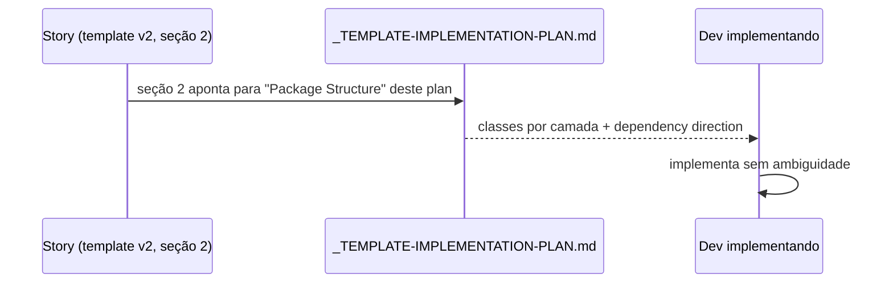

# História: `_TEMPLATE-IMPLEMENTATION-PLAN.md` ganha seção "Package Structure"

**ID:** story-0056-0005
**Chave Jira:** —
**Status:** Pendente

## 1. Dependências

| Blocked By | Blocks |
| :--- | :--- |
| story-0056-0001 | story-0056-0006 |

## 2. Regras Transversais Aplicáveis

| ID | Título |
| :--- | :--- |
| RULE-003 | Packages Hexagonal com direção validada |

## 3. Descrição

Como **autor de plan de implementação técnica**, eu quero adicionar uma seção `## Package Structure` ao `_TEMPLATE-IMPLEMENTATION-PLAN.md`, alinhada à seção 2 do RA9, para que o plan técnico detalhado sirva de referência explícita apontada pela seção 2 das Stories.

Diferente das stories 0056-0002/0003/0004, este template **não é sobrescrito** — é editado incrementalmente. A seção "Architecture Decisions" pré-existente é preservada e passa a ser a referência canônica que a seção 8 de Epic/Story pode linkar.

### 3.1 Nova seção a adicionar

```markdown
## Package Structure

> Alinhado com RA9 Seção 2. Detalha as classes específicas dentro de cada camada.

### Domain Layer
- `domain/<package>/` — classes: `<Entity|VO|Service>`
- Anti-patterns proibidos: <lista>

### Application Layer
- `application/<package>/` — UseCases: `<UseCase>`
- Portas outbound: `<Port>`

### Adapter Inbound
- `adapter/inbound/http|grpc|cli/<package>/` — handlers: `<Handler>`

### Adapter Outbound
- `adapter/outbound/<tecnologia>/<package>/` — implementações: `<Adapter>`

### Infrastructure
- `infrastructure/<package>/` — configs: `<Config>`

### Dependency Direction
<Declaração explícita: adapter → application → domain; nenhum domain → adapter>
```

## 3.5 Entrega de Valor

- **Valor Principal:** Plans técnicos explicitam classes por camada hexagonal, eliminando ambiguidade da implementação.
- **Métrica de Sucesso:** 100% dos novos plans gerados após merge contêm "Package Structure" preenchido.
- **Impacto no Negócio:** Dev pega o plan e sabe exatamente onde criar cada classe sem consultar o epic.

## 4. Definições de Qualidade Locais

### DoR Local
- [ ] Template `_TEMPLATE-IMPLEMENTATION-PLAN.md` atual identificado
- [ ] Seção "Architecture Decisions" existente preservada

### DoD Local
- [ ] Nova seção "Package Structure" inserida após "Affected Layers and Components"
- [ ] Template continua renderizável sem quebrar plans antigos que não usam a nova seção
- [ ] Teste estrutural valida presença da seção
- [ ] Smoke test passando

## 5. Contratos de Dados

### 5.1 Placeholders

| Placeholder | Tipo | Obrigatório | Descrição |
| :--- | :--- | :--- | :--- |
| `{{PKG_DOMAIN_CLASSES}}` | `List<String>` | Opcional | Classes no domain |
| `{{PKG_APPLICATION_USECASES}}` | `List<String>` | Opcional | UseCases |
| `{{PKG_ADAPTER_INBOUND}}` | `List<String>` | Opcional | Handlers |
| `{{PKG_ADAPTER_OUTBOUND}}` | `List<String>` | Opcional | Adapters |
| `{{PKG_INFRASTRUCTURE}}` | `List<String>` | Opcional | Configs |
| `{{DEPENDENCY_DIRECTION}}` | `String` | M | Declaração explícita |

## 6. Diagramas

### 6.1 Referência cruzada



## 7. Critérios de Aceite (Gherkin)

```gherkin
Cenario: Template sem a nova seção (degenerado)
  DADO o template sem Package Structure
  QUANDO teste estrutural rodar
  ENTÃO deve falhar com IMPLPLAN_MISSING_PACKAGE_STRUCTURE

Cenario: Renderização com todas as 5 camadas (happy path)
  DADO o template v2 editado
  QUANDO renderizar com classes em todas as camadas
  ENTÃO output contém as 5 subseções + "Dependency Direction"

Cenario: Renderização com camada vazia (error path controlado)
  DADO o template v2
  QUANDO uma camada (ex: Infrastructure) está vazia
  ENTÃO a subseção deve renderizar com `—`, não quebrar

Cenario: Compatibilidade com plans antigos (boundary)
  DADO plans técnicos pré-existentes (que não têm Package Structure)
  QUANDO lidos
  ENTÃO nenhum teste legado deve falhar (a seção é opcional retroativamente)
```

### 7.2 Mandatory
- [x] Degenerate · [x] Happy · [x] Error · [x] Boundary

## 8. Tasks

### TASK-0056-0005-001: Inserir seção "Package Structure" no template

- **Layer:** Doc
- **Test Type:** Verification
- **Size:** S
- **Dependencies:** —
- **Branch:** `feat/task-0056-0005-001-add-package-section`
- **Testability:** Config + VerificationTest
- **Files:**
  - `java/src/main/resources/shared/templates/_TEMPLATE-IMPLEMENTATION-PLAN.md`
- **Acceptance Criteria:**
  - [ ] Nova seção após "Affected Layers"
  - [ ] 5 subseções + Dependency Direction

### TASK-0056-0005-002: Adicionar placeholders e loops

- **Layer:** Doc
- **Test Type:** Unit
- **Size:** S
- **Dependencies:** TASK-0056-0005-001
- **Branch:** `feat/task-0056-0005-002-placeholders`
- **Testability:** Config + VerificationTest
- **Files:**
  - `java/src/main/resources/shared/templates/_TEMPLATE-IMPLEMENTATION-PLAN.md`
- **Acceptance Criteria:**
  - [ ] 6 placeholders adicionados

### TASK-0056-0005-003: Teste estrutural e backward compat

- **Layer:** Test
- **Test Type:** Verification
- **Size:** S
- **Dependencies:** TASK-0056-0005-002
- **Branch:** `feat/task-0056-0005-003-structure-test`
- **Testability:** Config + VerificationTest
- **Files:**
  - `java/src/test/java/dev/iadev/generator/templates/ImplPlanPackageStructureTest.java`
- **Acceptance Criteria:**
  - [ ] Valida presença da nova seção
  - [ ] Valida render sem a seção (plans antigos) não quebra

### TASK-0056-0005-004: [Test] Smoke/E2E — render via x-impl-plan

- **Layer:** Test
- **Test Type:** Smoke
- **Size:** S
- **Dependencies:** TASK-0056-0005-003
- **Branch:** `feat/task-0056-0005-004-smoke`
- **Testability:** Port + Adapter + IT
- **Files:**
  - `java/src/test/java/dev/iadev/smoke/ImplPlanPackageStructureSmokeTest.java`
- **Acceptance Criteria:**
  - [ ] Smoke renderiza plan completo com 5 camadas
