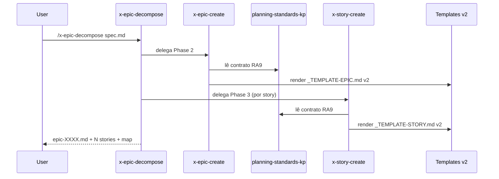

# História: Atualizar skills de plan para consumir templates v2 (RA9)

**ID:** story-0056-0006
**Chave Jira:** —
**Status:** Pendente

## 1. Dependências

| Blocked By | Blocks |
| :--- | :--- |
| story-0056-0002, story-0056-0003, story-0056-0004, story-0056-0005 | story-0056-0008 |

## 2. Regras Transversais Aplicáveis

| ID | Título |
| :--- | :--- |
| RULE-007 | Skills de plan propagam v2 coerentemente |
| RULE-005 | KP `planning-standards-kp` referenciado |

## 3. Descrição

Como **mantenedor das skills de plan**, eu quero atualizar `x-epic-create`, `x-epic-decompose`, `x-story-plan` e `x-task-plan` para (a) referenciarem o KP `planning-standards-kp` e (b) emitirem os placeholders RA9 (Packages, Decision Rationale) ao renderizarem os templates v2.

A mudança é majoritariamente textual (SKILL.md), mas cada skill precisa adicionar no seu workflow uma Phase explícita de "Preencher seção 2 (Packages) a partir da análise de camadas" e "Preencher seção 8 (Decision Rationale) extraindo decisões da spec/análise".

### 3.1 Mudanças por skill

| Skill | Nova Phase | Placeholders emitidos |
| :--- | :--- | :--- |
| `x-epic-create` | "Phase 2.5 — Package Catalog (hexagonal)" + "Phase 2.7 — Decision Rationale Extraction" | `{{PACKAGES_*}}`, `{{DECISION_RATIONALE}}` |
| `x-epic-decompose` | Propaga catálogo do épico para seção 2 de cada story | `{{PACKAGES_*}}` (subset), `{{DECISION_RATIONALE}}` |
| `x-story-plan` | "Phase 4.2 — Feature-level Decisions" antes do DoR check | `{{DECISION_RATIONALE}}` |
| `x-task-plan` | "Phase 5.1 — Local Decisions or N/A" | `{{DECISION_RATIONALE}}` ou literal `N/A` |

### 3.2 Referência ao KP

Cada SKILL.md passa a conter, na seção "Prerequisites":
```
- `.claude/skills/planning-standards-kp/SKILL.md` (9-section contract, rule âncoras, formato)
```

## 3.5 Entrega de Valor

- **Valor Principal:** Operadores invocam `/x-epic-decompose` normalmente; o output passa a ser RA9 conforme sem mudança de comando.
- **Métrica de Sucesso:** Smoke test roda `/x-epic-decompose` sobre spec sintética e 100% dos artefatos gerados (epic + stories + tasks) têm as 9 seções preenchidas.
- **Impacto no Negócio:** Migração invisível ao usuário — apenas o output melhora.

## 4. Definições de Qualidade Locais

### DoR Local
- [ ] Templates v2 mergeados (0002, 0003, 0004)
- [ ] `_TEMPLATE-IMPLEMENTATION-PLAN.md` com Package Structure (0005)
- [ ] KP `planning-standards-kp` disponível (0001)

### DoD Local
- [ ] 4 SKILL.md atualizados com referência ao KP e novas phases
- [ ] Testes atualizados (retrofit dos existentes + novos para phases RA9)
- [ ] Smoke test end-to-end `/x-epic-decompose` produz artefatos RA9

## 5. Contratos de Dados

### 5.1 Payload injetado na renderização (por skill)

| Skill | Campos obrigatórios novos |
| :--- | :--- |
| x-epic-create | `packagesByLayer: Map<Layer, List<String>>`, `decisions: List<Decision>` |
| x-epic-decompose | herda do epic-create; propaga subset para cada story |
| x-story-plan | `storyDecisions: List<Decision>` |
| x-task-plan | `taskDecision: Decision \| "N/A"` |

Onde `Decision = { decisao: String, motivo: String, alternativa: String, consequencia: String }`.

## 6. Diagramas

### 6.1 Fluxo integrado



## 7. Critérios de Aceite (Gherkin)

```gherkin
Cenario: Skill x-epic-create emite packages vazios (degenerado)
  DADO uma spec sem declaração de camadas
  QUANDO x-epic-create rodar
  ENTÃO o epic gerado tem seção 2 com todas as 5 camadas como `—`
  E o audit RA9_PACKAGES_MISSING emite WARNING (não bloqueia)

Cenario: Fluxo completo x-epic-decompose com 3 stories (happy path)
  DADO spec sintética com 3 stories declaradas
  QUANDO /x-epic-decompose spec.md rodar
  ENTÃO plans/epic-XXXX/ contém epic + 3 stories + map
  E cada story tem as 9 seções preenchidas ou com `—` quando não aplicável
  E cada task do breakdown tem as 9 seções (8 pode ser N/A)

Cenario: Skill não referencia KP (error path)
  DADO um SKILL.md atualizado sem a referência `@planning-standards-kp`
  QUANDO o audit de consistência rodar
  ENTÃO deve falhar com SKILL_MISSING_KP_REFERENCE

Cenario: Template não encontrado (boundary)
  DADO que `_TEMPLATE-STORY.md` foi removido
  QUANDO x-story-create rodar
  ENTÃO deve abortar com mensagem clara mencionando o template faltante (preservação do comportamento legado)
```

### 7.2 Mandatory
- [x] Degenerate · [x] Happy · [x] Error · [x] Boundary

## 8. Tasks

### TASK-0056-0006-001: Atualizar `x-epic-create` — referência ao KP + Phase 2.5 Packages

- **Layer:** Doc
- **Test Type:** Verification
- **Size:** M
- **Dependencies:** —
- **Branch:** `feat/task-0056-0006-001-update-epic-create`
- **Testability:** Config + VerificationTest
- **Files:**
  - `java/src/main/resources/targets/claude/skills/plan/x-epic-create/SKILL.md`
- **Acceptance Criteria:**
  - [ ] Referência ao KP em Prerequisites
  - [ ] Phase 2.5 e 2.7 presentes

### TASK-0056-0006-002: Atualizar `x-epic-decompose` — propagação de catálogo

- **Layer:** Doc
- **Test Type:** Verification
- **Size:** M
- **Dependencies:** TASK-0056-0006-001
- **Branch:** `feat/task-0056-0006-002-update-decompose`
- **Testability:** Config + VerificationTest
- **Files:**
  - `java/src/main/resources/targets/claude/skills/plan/x-epic-decompose/SKILL.md`
- **Acceptance Criteria:**
  - [ ] Propagação de packages do epic para stories documentada
  - [ ] Referência ao KP presente

### TASK-0056-0006-003: Atualizar `x-story-plan` e `x-task-plan` — seção 8

- **Layer:** Doc
- **Test Type:** Verification
- **Size:** M
- **Dependencies:** TASK-0056-0006-002
- **Branch:** `feat/task-0056-0006-003-update-story-task-plan`
- **Testability:** Config + VerificationTest
- **Files:**
  - `java/src/main/resources/targets/claude/skills/plan/x-story-plan/SKILL.md`
  - `java/src/main/resources/targets/claude/skills/plan/x-task-plan/SKILL.md`
- **Acceptance Criteria:**
  - [ ] Phase de Decision Rationale Extraction em story-plan
  - [ ] Phase de Local Decisions or N/A em task-plan
  - [ ] Referência ao KP em ambos

### TASK-0056-0006-004: [Test] Smoke/E2E — /x-epic-decompose produz artefatos RA9

- **Layer:** Test
- **Test Type:** E2E
- **Size:** M
- **Dependencies:** TASK-0056-0006-003
- **Branch:** `feat/task-0056-0006-004-smoke-decompose-ra9`
- **Testability:** Endpoint + APITest
- **Files:**
  - `java/src/test/java/dev/iadev/smoke/EpicDecomposeRa9SmokeTest.java`
  - `java/src/test/resources/specs/synthetic-ra9-spec.md` (fixture)
- **Acceptance Criteria:**
  - [ ] Decompose de spec sintética gera artefatos com as 9 seções
  - [ ] Seção 2 preenchida com pelo menos 1 package listado
  - [ ] Seção 8 preenchida com pelo menos 1 decisão no epic
