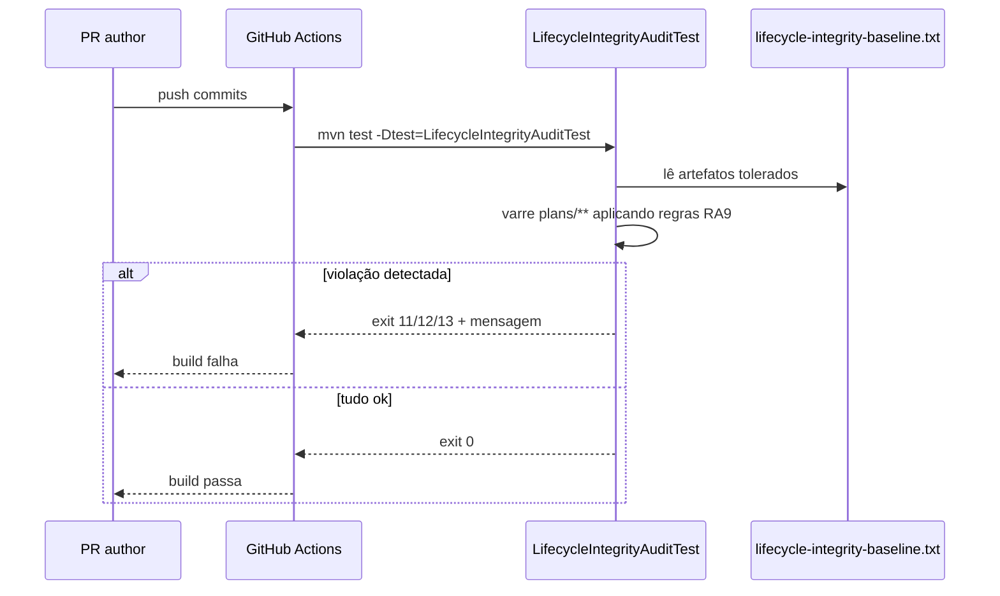

# História: Estender `LifecycleIntegrityAuditTest` para RA9

**ID:** story-0056-0007
**Chave Jira:** —
**Status:** Pendente

## 1. Dependências

| Blocked By | Blocks |
| :--- | :--- |
| story-0056-0002, story-0056-0003, story-0056-0004 | story-0056-0008 |

## 2. Regras Transversais Aplicáveis

| ID | Título |
| :--- | :--- |
| RULE-006 | Audit CI bloqueia regressões RA9 |
| RULE-002 | Decision Rationale obrigatória em Epic/Story |
| RULE-003 | Packages Hexagonal |

## 3. Descrição

Como **responsável pelo gate de qualidade CI**, eu quero estender `LifecycleIntegrityAuditTest` (EPIC-0046) com 3 novas regras que validem conformidade RA9 nos artefatos de planejamento, bloqueando PRs que adicionem Epic/Story/Task fora do padrão.

### 3.1 Novas regras de audit

| Código | Aplica-se a | Verifica |
| :--- | :--- | :--- |
| `RA9_SECTIONS_MISSING` | Epic, Story, Task | Ausência de qualquer um dos 9 headers `## N. <nome>` |
| `RA9_RATIONALE_EMPTY` | Epic, Story (NÃO Task) | Seção 8 presente mas sem item válido (corpo vazio, placeholder `{{...}}`, ou `TODO`). Regex match obrigatório em `**Decisão:**`, `**Motivo:**`, `**Alternativa descartada:**`, `**Consequência:**` |
| `RA9_PACKAGES_MISSING` | Epic, Story, Task | Seção 2 presente mas sem listar pelo menos uma das 5 camadas (ou uso inválido do marcador `—` em todas) |

### 3.2 Escape hatch

Mantém convenção de EPIC-0046: `<!-- audit-exempt -->` na linha imediatamente antes do artefato ou no topo do arquivo permite que o audit ignore. Uso deve ser raro e revisado.

### 3.3 Baseline

`java/src/test/resources/audits/lifecycle-integrity-baseline.txt` é atualizado para tolerar artefatos legados (épicos 0001-0055) — qualquer **novo** artefato adicionado precisa estar conforme RA9.

## 3.5 Entrega de Valor

- **Valor Principal:** CI falha build quando alguém tenta introduzir plan não-conforme; regressões RA9 ficam impossíveis.
- **Métrica de Sucesso:** Suite de audit com 100% pass rate após merge; PRs de teste com plans inválidos falham com mensagem clara.
- **Impacto no Negócio:** Enforcement automático → qualidade de plan não depende de code review manual.

## 4. Definições de Qualidade Locais

### DoR Local
- [ ] Templates v2 mergeados
- [ ] Baseline atual inspecionado

### DoD Local
- [ ] 3 regras novas implementadas em `LifecycleIntegrityAuditTest`
- [ ] Cada regra tem pelo menos 3 testes (happy/error/boundary)
- [ ] Baseline atualizado
- [ ] Mensagens de erro claras (referenciam rule + fix sugerido)
- [ ] Smoke: PR de teste com plan RA9-inválido falha build

## 5. Contratos de Dados

### 5.1 Formato das mensagens de erro

```
[RA9_SECTIONS_MISSING] plans/epic-0060/story-0060-0001.md
  Missing sections: [2. Packages (Hexagonal), 8. Decision Rationale]
  Fix: adicione os headers exatos conforme _TEMPLATE-STORY.md v2.
  Exempt with <!-- audit-exempt --> (last-resort only).
```

### 5.2 Exit codes (standalone CLI, não o JUnit test)

> Os exit codes abaixo aplicam-se apenas ao CLI standalone `dev.iadev.adapter.inbound.cli.LifecycleAuditCli` (EPIC-0046, invocável fora do Maven). Em CI via `mvn test -Dtest=LifecycleIntegrityAuditTest`, o JUnit retorna 0 (sucesso) ou 1 (falha) como qualquer teste — a identificação da regra violada fica na mensagem de assert, não no exit code.

| Code (CLI) | Significado |
| :--- | :--- |
| 0 | Todos os artefatos conformes |
| 11 | `RA9_SECTIONS_MISSING` detectado |
| 12 | `RA9_RATIONALE_EMPTY` detectado |
| 13 | `RA9_PACKAGES_MISSING` detectado |

## 6. Diagramas

### 6.1 Fluxo CI



## 7. Critérios de Aceite (Gherkin)

```gherkin
Cenario: Plan sem nenhuma das 9 seções (degenerado)
  DADO um novo epic-0060.md com apenas 3 seções
  QUANDO LifecycleIntegrityAuditTest rodar
  ENTÃO deve falhar com RA9_SECTIONS_MISSING listando 6 seções faltantes

Cenario: Plan conforme (happy path)
  DADO epic-0060/story-0060-0001.md com as 9 seções preenchidas
  QUANDO audit rodar
  ENTÃO deve passar (exit 0)

Cenario: Seção 8 com placeholder (error path)
  DADO story com `## 8. Decision Rationale\n\n{{DECISION_RATIONALE}}`
  QUANDO audit rodar
  ENTÃO deve falhar com RA9_RATIONALE_EMPTY

Cenario: Task com N/A válido (boundary)
  DADO task com `## 8. Decision Rationale\n\nN/A — VO imutável, sem trade-off`
  QUANDO audit rodar
  ENTÃO deve passar (N/A é aceito em Task)

Cenario: Artefato legado com audit-exempt (boundary)
  DADO plan legado com `<!-- audit-exempt -->` no topo
  QUANDO audit rodar
  ENTÃO deve pular esse arquivo silenciosamente

Cenario: Seção 2 com apenas `—` em todas camadas (error)
  DADO story com seção 2 preenchida mas com `—` em todas as 5 camadas
  QUANDO audit rodar
  ENTÃO deve falhar com RA9_PACKAGES_MISSING
```

### 7.2 Mandatory
- [x] Degenerate · [x] Happy · [x] Error · [x] Boundary

## 8. Tasks

### TASK-0056-0007-001: Adicionar regra `RA9_SECTIONS_MISSING`

- **Layer:** Domain
- **Test Type:** Unit
- **Size:** M
- **Dependencies:** —
- **Branch:** `feat/task-0056-0007-001-rule-sections-missing`
- **Testability:** Domain + UnitTest
- **Files:**
  - `java/src/main/java/dev/iadev/audit/Ra9SectionsChecker.java`
  - `java/src/test/java/dev/iadev/audit/Ra9SectionsCheckerTest.java`
- **Acceptance Criteria:**
  - [ ] Detecta ausência de cada um dos 9 headers
  - [ ] Mensagem lista seções faltantes

### TASK-0056-0007-002: Adicionar regra `RA9_RATIONALE_EMPTY` (Epic/Story only)

- **Layer:** Domain
- **Test Type:** Unit
- **Size:** M
- **Dependencies:** TASK-0056-0007-001
- **Branch:** `feat/task-0056-0007-002-rule-rationale-empty`
- **Testability:** Domain + UnitTest
- **Files:**
  - `java/src/main/java/dev/iadev/audit/Ra9RationaleChecker.java`
  - `java/src/test/java/dev/iadev/audit/Ra9RationaleCheckerTest.java`
- **Acceptance Criteria:**
  - [ ] Rejeita corpo vazio, placeholder, TODO
  - [ ] Exige 4 campos do micro-template
  - [ ] Pula Task (identificado por nome `task-*.md` ou path)

### TASK-0056-0007-003: Adicionar regra `RA9_PACKAGES_MISSING`

- **Layer:** Domain
- **Test Type:** Unit
- **Size:** S
- **Dependencies:** TASK-0056-0007-002
- **Branch:** `feat/task-0056-0007-003-rule-packages-missing`
- **Testability:** Domain + UnitTest
- **Files:**
  - `java/src/main/java/dev/iadev/audit/Ra9PackagesChecker.java`
  - `java/src/test/java/dev/iadev/audit/Ra9PackagesCheckerTest.java`
- **Acceptance Criteria:**
  - [ ] Detecta seção 2 vazia ou com `—` em todas camadas
  - [ ] Aceita pelo menos 1 camada preenchida

### TASK-0056-0007-004: Integrar 3 checkers em `LifecycleIntegrityAuditTest` + atualizar baseline

- **Layer:** Test
- **Test Type:** Verification
- **Size:** M
- **Dependencies:** TASK-0056-0007-003
- **Branch:** `feat/task-0056-0007-004-integrate-audit`
- **Testability:** Config + VerificationTest
- **Files:**
  - `java/src/test/java/dev/iadev/audit/LifecycleIntegrityAuditTest.java`
  - `java/src/test/resources/audits/lifecycle-integrity-baseline.txt`
- **Acceptance Criteria:**
  - [ ] Audit chama os 3 checkers
  - [ ] Baseline tolera artefatos 0001-0055
  - [ ] Novos artefatos violando RA9 falham

### TASK-0056-0007-005: [Test] Smoke/E2E — PR teste com plan inválido

- **Layer:** Test
- **Test Type:** Smoke
- **Size:** S
- **Dependencies:** TASK-0056-0007-004
- **Branch:** `feat/task-0056-0007-005-smoke-pr-invalid`
- **Testability:** Endpoint + APITest
- **Files:**
  - `java/src/test/java/dev/iadev/smoke/Ra9AuditSmokeTest.java`
  - `java/src/test/resources/fixtures/ra9-invalid-plan.md`
- **Acceptance Criteria:**
  - [ ] Fixture com plan inválido resulta em exit != 0
  - [ ] Mensagem contém código da regra violada
