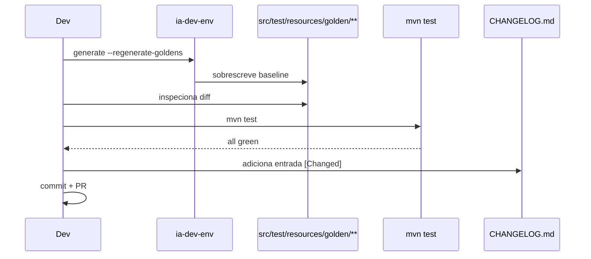

# História: Regenerar golden files + CHANGELOG

**ID:** story-0056-0008
**Chave Jira:** —
**Status:** Pendente

## 1. Dependências

| Blocked By | Blocks |
| :--- | :--- |
| story-0056-0006, story-0056-0007 | — |

## 2. Regras Transversais Aplicáveis

| ID | Título |
| :--- | :--- |
| RULE-004 | Substituição direta |

## 3. Descrição

Como **mantenedor do baseline de testes**, eu quero regenerar os golden files em `src/test/resources/golden/**` após a mudança de templates + skills (stories 0002-0007), e documentar a mudança em `CHANGELOG.md`.

### 3.1 Processo de regeneração

1. Executar `ia-dev-env generate` com `--regenerate-goldens` (ou equivalente) sobre um conjunto de projetos fixtures.
2. Comparar output manualmente para garantir que o diff é coerente com RA9 (9 seções, Rationale presente, Packages listados) e não introduz outras mudanças.
3. Commitar golden files atualizados.
4. Atualizar `CHANGELOG.md` com entrada `[Changed]` descrevendo a migração RA9.

### 3.2 Riscos controlados

- Diff pode ser grande; revisão em chunks por diretório.
- Qualquer discrepância inesperada (ex: seção renderizada em ordem errada) bloqueia o merge — investigar antes de aceitar.

## 3.5 Entrega de Valor

- **Valor Principal:** Baseline alinhado com o novo contrato RA9 → suite de testes torna-se a fonte da verdade para "o que um plan RA9 parece".
- **Métrica de Sucesso:** `mvn test` passa integralmente; `ia-dev-env generate` produz diff limpo contra golden em 3 projetos fixtures distintos.
- **Impacto no Negócio:** Épicos futuros (0057+) nascem com golden alinhado; nenhum débito técnico residual.

## 4. Definições de Qualidade Locais

### DoR Local
- [ ] Stories 0002-0007 mergeadas
- [ ] Suite atual (pre-regen) documentada em snapshot para comparação

### DoD Local
- [ ] Golden files regenerados
- [ ] Diff inspecionado e aprovado
- [ ] `mvn test` verde
- [ ] `ia-dev-env generate` em fixtures produz diff vazio
- [ ] `CHANGELOG.md` atualizado com entrada `[Changed] — RA9 Standardized Planning Templates (EPIC-0056)`

## 5. Contratos de Dados

### 5.1 Entrada do CHANGELOG

```markdown
## [X.Y.Z] - 2026-MM-DD

### Changed

- **Planning templates**: `_TEMPLATE-EPIC.md`, `_TEMPLATE-STORY.md`, `_TEMPLATE-TASK.md` reescritos com o modelo **RA9 (Rule-Aligned 9-Section)** — 9 seções fixas ancoradas em rules. Decision Rationale obrigatória em Epic/Story; opcional em Task. Nova seção "Packages (Hexagonal)" em todos os níveis. Substituição direta (sem coexistência v1+v2). Épicos 0001-0055 não são afetados; 0057+ nascem RA9. Enforcement via `LifecycleIntegrityAuditTest` (RA9_SECTIONS_MISSING, RA9_RATIONALE_EMPTY, RA9_PACKAGES_MISSING). Ver [EPIC-0056](plans/epic-0056/).
```

## 6. Diagramas

### 6.1 Fluxo de regeneração



## 7. Critérios de Aceite (Gherkin)

```gherkin
Cenario: Golden desatualizado (degenerado)
  DADO templates v2 mergeados mas golden v1
  QUANDO `mvn test` rodar
  ENTÃO testes de snapshot devem falhar, confirmando necessidade de regen

Cenario: Regeneração completa (happy path)
  DADO execução de ia-dev-env generate com flag de regen
  QUANDO comparar output contra golden atualizado
  ENTÃO diff deve ser vazio

Cenario: CHANGELOG ausente (error path)
  DADO commit sem entrada no CHANGELOG
  QUANDO hook de pre-commit rodar
  ENTÃO deve alertar ausência da entrada obrigatória do épico

Cenario: Diff introduz mudança inesperada (boundary)
  DADO regen gerou seção extra não documentada na spec
  QUANDO revisor inspecionar
  ENTÃO story bloqueia até que a discrepância seja investigada
```

### 7.2 Mandatory
- [x] Degenerate · [x] Happy · [x] Error · [x] Boundary

## 8. Tasks

### TASK-0056-0008-001: Regenerar golden files

- **Layer:** Config
- **Test Type:** Verification
- **Size:** L
- **Dependencies:** —
- **Branch:** `feat/task-0056-0008-001-regenerate-goldens`
- **Testability:** Config + VerificationTest
- **Files:**
  - `src/test/resources/golden/**` (múltiplos arquivos)
- **Acceptance Criteria:**
  - [ ] Golden files refletem templates v2
  - [ ] Nenhum arquivo não relacionado modificado

### TASK-0056-0008-002: Inspecionar diff e validar coerência RA9

- **Layer:** Doc
- **Test Type:** Verification
- **Size:** M
- **Dependencies:** TASK-0056-0008-001
- **Branch:** `feat/task-0056-0008-002-inspect-diff`
- **Testability:** Config + VerificationTest
- **Files:**
  - `plans/epic-0056/regen-diff-review.md` (relatório de revisão)
- **Acceptance Criteria:**
  - [ ] Relatório documenta que 9 seções aparecem em todos os goldens de Epic/Story/Task
  - [ ] Nenhuma mudança fora do escopo RA9

### TASK-0056-0008-003: Atualizar CHANGELOG.md

- **Layer:** Doc
- **Test Type:** Verification
- **Size:** S
- **Dependencies:** TASK-0056-0008-002
- **Branch:** `feat/task-0056-0008-003-changelog`
- **Testability:** Config + VerificationTest
- **Files:**
  - `CHANGELOG.md`
- **Acceptance Criteria:**
  - [ ] Entrada `[Changed]` com link para EPIC-0056

### TASK-0056-0008-004: [Test] Smoke/E2E — generate sobre 3 fixtures

- **Layer:** Test
- **Test Type:** Smoke
- **Size:** M
- **Dependencies:** TASK-0056-0008-003
- **Branch:** `feat/task-0056-0008-004-smoke-regen`
- **Testability:** Endpoint + APITest
- **Files:**
  - `java/src/test/java/dev/iadev/smoke/GoldenRegenSmokeTest.java`
- **Acceptance Criteria:**
  - [ ] Teste roda generate em 3 fixtures e compara com golden
  - [ ] Diff vazio em todos os 3
