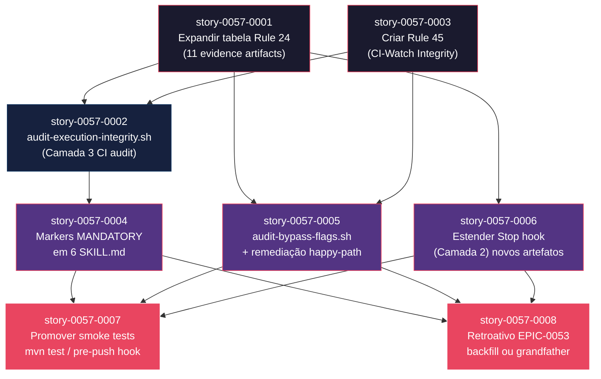

# Mapa de Implementação — EPIC-0057: Extensão da Rule 24 (Execution Integrity) — Pós-mortem EPIC-0053

**Gerado a partir das dependências BlockedBy/Blocks de cada história do epic-0057.**

---

## 1. Matriz de Dependências

| Story | Título | Chave Jira | Blocked By | Blocks | Status |
| :--- | :--- | :--- | :--- | :--- | :--- |
| [story-0057-0001](./story-0057-0001.md) | Expandir tabela "Mandatory Evidence Artifacts" na Rule 24 | — | — | story-0057-0002, story-0057-0005, story-0057-0006 | Pendente |
| [story-0057-0002](./story-0057-0002.md) | Implementar `scripts/audit-execution-integrity.sh` (Camada 3) | — | story-0057-0001, story-0057-0003 | story-0057-0004 | Pendente |
| [story-0057-0003](./story-0057-0003.md) | Criar Rule 45 (CI-Watch Integrity) | — | — | story-0057-0002, story-0057-0005 | Pendente |
| [story-0057-0004](./story-0057-0004.md) | Adicionar markers MANDATORY em 6 SKILL.md orquestradoras | — | story-0057-0002 | story-0057-0007, story-0057-0008 | Pendente |
| [story-0057-0005](./story-0057-0005.md) | Implementar `scripts/audit-bypass-flags.sh` e remediar flags em happy-path | — | story-0057-0001, story-0057-0003 | story-0057-0007, story-0057-0008 | Pendente |
| [story-0057-0006](./story-0057-0006.md) | Estender Stop hook (Camada 2) para novos artefatos | — | story-0057-0001 | story-0057-0007, story-0057-0008 | Pendente |
| [story-0057-0007](./story-0057-0007.md) | Promover smoke tests críticos para `mvn test` ou hook pre-push | — | story-0057-0004, story-0057-0005, story-0057-0006 | — | Pendente |
| [story-0057-0008](./story-0057-0008.md) | Aplicação retroativa EPIC-0053 — backfill ou baseline grandfather | — | story-0057-0004, story-0057-0005, story-0057-0006 | — | Pendente |

> **Valores de Status:** `Pendente` (padrão) · `Em Andamento` · `Concluída` · `Falha` · `Bloqueada` · `Parcial`

> **Nota:** story-0057-0005 e story-0057-0006 são paralelas em Phase 2 mas ambas dependem de story-0057-0001 (Foundation Layer). story-0057-0005 adiciona dependência também de story-0057-0003 (Rule 45). story-0057-0004 depende exclusivamente de story-0057-0002 — o script Camada 3 deve existir antes de fazer retrofit de markers, para poder validar que o enforcement detecta as evidências geradas pelos skills retrofitados.

---

## 2. Fases de Implementação

> As histórias são agrupadas em fases. Dentro de cada fase, as histórias podem ser implementadas **em paralelo**. Uma fase só pode iniciar quando todas as dependências das fases anteriores estiverem concluídas.

```
╔══════════════════════════════════════════════════════════════════════════════════╗
║              FASE 0 — Foundation Rules (paralelo)                              ║
║                                                                                ║
║   ┌────────────────────────────┐   ┌────────────────────────────┐              ║
║   │  story-0057-0001           │   │  story-0057-0003           │              ║
║   │  Expandir tabela Rule 24   │   │  Criar Rule 45             │              ║
║   │  (11 evidence artifacts)   │   │  (CI-Watch Integrity)      │              ║
║   └─────────────┬──────────────┘   └──────────────┬─────────────┘              ║
╚══════════════════╪══════════════════════════════════╪═══════════════════════════╝
                   │                                  │
                   └──────────────┬───────────────────┘
                                  ▼
╔══════════════════════════════════════════════════════════════════════════════════╗
║              FASE 1 — Core Enforcement (sequencial)                            ║
║                                                                                ║
║   ┌──────────────────────────────────────────────────────────────┐             ║
║   │  story-0057-0002                                             │             ║
║   │  Implementar audit-execution-integrity.sh (Camada 3)         │             ║
║   │  (← story-0057-0001 + story-0057-0003)                       │             ║
║   └──────────────────────────────┬───────────────────────────────┘             ║
╚═══════════════════════════════════╪════════════════════════════════════════════╝
                                    │
                                    ▼
╔══════════════════════════════════════════════════════════════════════════════════╗
║              FASE 2 — Retrofit + Hooks (paralelo)                              ║
║                                                                                ║
║   ┌──────────────────────┐  ┌──────────────────────┐  ┌──────────────────────┐ ║
║   │  story-0057-0004     │  │  story-0057-0005     │  │  story-0057-0006     │ ║
║   │  Markers MANDATORY   │  │  audit-bypass-flags  │  │  Estender Stop hook  │ ║
║   │  em 6 SKILL.md       │  │  + remediar happy-   │  │  (Camada 2) para     │ ║
║   │  (← 0002)            │  │  path flags          │  │  novos artefatos     │ ║
║   │                      │  │  (← 0001 + 0003)     │  │  (← 0001)            │ ║
║   └──────────┬───────────┘  └──────────┬───────────┘  └──────────┬───────────┘ ║
╚══════════════╪══════════════════════════╪═══════════════════════════╪════════════╝
               │                          │                           │
               └─────────────────┬────────┴───────────────────────────┘
                                 ▼
╔══════════════════════════════════════════════════════════════════════════════════╗
║              FASE 3 — Cross-cutting (paralelo)                                 ║
║                                                                                ║
║   ┌──────────────────────────────────┐  ┌──────────────────────────────────┐   ║
║   │  story-0057-0007                 │  │  story-0057-0008                 │   ║
║   │  Promover smoke tests para       │  │  Aplicação retroativa EPIC-0053   │   ║
║   │  mvn test / hook pre-push        │  │  backfill ou baseline grandfather │   ║
║   │  (← 0004 + 0005 + 0006)          │  │  (← 0004 + 0005 + 0006)          │   ║
║   └──────────────────────────────────┘  └──────────────────────────────────┘   ║
╚══════════════════════════════════════════════════════════════════════════════════╝
```

---

## 3. Caminho Crítico

> O caminho crítico (a sequência mais longa de dependências) determina o tempo mínimo de implementação do projeto.

```
story-0057-0001 ─┐
                 ├──→ story-0057-0002 ──→ story-0057-0004 ──┐
story-0057-0003 ─┘                                           ├──→ story-0057-0007
                 story-0057-0001 ──→ story-0057-0005 ────────┤
                                                              └──→ story-0057-0008
                 story-0057-0001 ──→ story-0057-0006 ────────┘
   Fase 0              Fase 1             Fase 2                   Fase 3
```

**4 fases no caminho crítico, 4 histórias na cadeia mais longa (0001 → 0002 → 0004 → 0007).**

Qualquer atraso em story-0057-0001 ou story-0057-0002 atrasa todo o épico. story-0057-0003 é caminho paralelo crítico — bloqueia story-0057-0002 assim como story-0057-0001. O maior risco de atraso está na Fase 0: as duas stories são independentes entre si mas ambas são pré-requisito de story-0057-0002.

---

## 4. Grafo de Dependências (Mermaid)



---

## 5. Resumo por Fase

| Fase | Histórias | Camada | Paralelismo | Pré-requisito |
| :--- | :--- | :--- | :--- | :--- |
| 0 | story-0057-0001, story-0057-0003 | Layer 0 (Foundation Rules) | 2 paralelas | — |
| 1 | story-0057-0002 | Layer 1 (Core Enforcement) | 1 sequencial | Fase 0 concluída |
| 2 | story-0057-0004, story-0057-0005, story-0057-0006 | Layer 2 (Retrofit + Hooks) | 3 paralelas | Fase 1 concluída |
| 3 | story-0057-0007, story-0057-0008 | Layer 3 (Cross-cutting) | 2 paralelas | Fase 2 concluída |

**Total: 8 histórias em 4 fases.**

> **Nota:** story-0057-0005 tem dependência de story-0057-0003 (Fase 0) além de story-0057-0001 (Fase 0) — ambas na mesma fase, portanto story-0057-0005 aguarda apenas a Fase 0 completa antes de iniciar. story-0057-0006 depende apenas de story-0057-0001, podendo iniciar assim que story-0057-0001 estiver concluída — mas na prática aguarda Fase 1 completa (story-0057-0002) para coerência de sequenciamento da equipe.

---

## 6. Detalhamento por Fase

### Fase 0 — Foundation Rules

| Story | Escopo Principal | Artefatos Chave |
| :--- | :--- | :--- |
| story-0057-0001 | Expandir tabela "Mandatory Evidence Artifacts" da Rule 24 com 6 novas entradas (de 5 para 11) | `java/.../rules/24-execution-integrity.md` (source of truth atualizado); `.claude/rules/24-execution-integrity.md` (golden regenerado) |
| story-0057-0003 | Criar Rule 45 (CI-Watch Integrity) consolidando RULE-045-* | `java/.../rules/45-ci-watch-integrity.md` (source of truth criado); `.claude/rules/45-ci-watch-integrity.md` (golden gerado) |

**Entregas da Fase 0:**

- Rule 24 com tabela expandida para 11 sub-skills auditáveis
- Rule 45 formal com 8 exit codes do `x-pr-watch-ci` e fallback matrix
- Golden files regenerados e `mvn verify` passando
- Base normativa completa para as Camadas 2, 3 e 4 das fases seguintes

### Fase 1 — Core Enforcement

| Story | Escopo Principal | Artefatos Chave |
| :--- | :--- | :--- |
| story-0057-0002 | Implementar `scripts/audit-execution-integrity.sh` (Camada 3) com exit codes 0/1/2/3, `--self-check`, baseline e integração CI | `scripts/audit-execution-integrity.sh`; `scripts/audit-execution-integrity.conf`; `audits/execution-integrity-baseline.txt`; `.github/workflows/ci.yml` (step adicionado) |

**Entregas da Fase 1:**

- Camada 3 CI audit operacional — PRs com evidências ausentes falham o build com `EIE_EVIDENCE_MISSING`
- Baseline criado com stories pré-Rule-24 grandfathered (se houver)
- Integração CI validada end-to-end

### Fase 2 — Retrofit + Hooks

| Story | Escopo Principal | Artefatos Chave |
| :--- | :--- | :--- |
| story-0057-0004 | Markers `MANDATORY TOOL CALL — NON-NEGOTIABLE (Rule 24)` em 6 SKILL.md orquestradoras | 6 SKILL.md na source of truth modificados; 6 goldens regenerados |
| story-0057-0005 | Script `audit-bypass-flags.sh` + remediação de flags bypass em happy-path | `scripts/audit-bypass-flags.sh`; 4 SKILL.md remedidados; goldens regenerados |
| story-0057-0006 | Stop hook estendido para verificar `.claude/state/pr-watch-*.json` e novos artefatos hard/soft | `hooks/verify-story-completion.sh` (source of truth estendido); golden regenerado |

**Entregas da Fase 2:**

- 14 gaps de prosa sem MANDATORY eliminados (Camada 1 reforçada)
- Flags bypass em happy-path reduzidas a zero
- Stop hook (Camada 2) verificando todos os 8+ artefatos da tabela expandida
- Developer recebe feedback imediato local quando sub-skill é pulada

### Fase 3 — Cross-cutting

| Story | Escopo Principal | Artefatos Chave |
| :--- | :--- | :--- |
| story-0057-0007 | Promoção de smoke tests críticos para `mvn test` ou hook pre-push | `pom.xml` (Opção A) ou hook pre-push (Opção B); `smoke-promotion-decision.md` |
| story-0057-0008 | Aplicação retroativa para EPIC-0053 — backfill de evidências ou grandfather no baseline | `epic-0053-retroactive-decision.md`; artefatos de backfill; `audits/execution-integrity-baseline.txt` (entries para stories grandfather) |

**Entregas da Fase 3:**

- `Epic0047CompressionSmokeTest` executando localmente antes do push
- EPIC-0053 com estado formalizado — evidências presentes ou grandfathered com rastreabilidade
- `scripts/audit-execution-integrity.sh` retornando exit 0 para todo o EPIC-0053

---

## 7. Observações Estratégicas

### Gargalo Principal

**story-0057-0001** é o gargalo máximo — bloqueia diretamente story-0057-0002 (Fase 1), story-0057-0005 (Fase 2) e story-0057-0006 (Fase 2). Qualquer atraso em story-0057-0001 atrasa 5 das 8 stories do épico. Recomendação: priorizar story-0057-0001 e story-0057-0003 em paralelo na Fase 0 e não iniciar Fase 1 antes de ambas estarem completas.

**story-0057-0002** é o segundo gargalo — bloqueia story-0057-0004 (Fase 2) e indiretamente story-0057-0007 e story-0057-0008 (Fase 3). É a única story com dois predecessores diretos (0001 + 0003), tornando-a o ponto de convergência crítico.

### Histórias Folha (sem dependentes)

- **story-0057-0007** — não bloqueia nenhuma outra. Candidata a absorver atrasos na Fase 3 sem impacto no épico.
- **story-0057-0008** — não bloqueia nenhuma outra. Pode ser executada após story-0057-0007 se a equipe preferir sequencial.

### Otimização de Tempo

- **Máximo paralelismo:** Fase 2 (3 stories simultâneas: 0004, 0005, 0006) e Fase 3 (2 stories simultâneas: 0007, 0008)
- **Início imediato:** story-0057-0001 e story-0057-0003 podem começar no dia 1 do épico, em paralelo, sem nenhum pré-requisito
- **Alocação ideal:** 1 desenvolvedor em story-0057-0001, 1 desenvolvedor em story-0057-0003 na Fase 0; time completo disponível para Fase 2 (maior janela de paralelismo)

### Dependências Cruzadas

Story-0057-0005 é a única com dois predecessores em Fase 0 (0001 E 0003). Isso cria uma dependência cruzada entre os dois ramos da Fase 0: um atraso em story-0057-0003 atrasa story-0057-0005 mesmo que story-0057-0001 já tenha concluído. O mesmo ocorre para story-0057-0002 — ambas as Fase 0 stories devem ser concluídas para desbloquear a Fase 1.

### Marco de Validação Arquitetural

**story-0057-0002** (Fase 1) é o marco de validação: com o script `audit-execution-integrity.sh` operacional, é possível verificar end-to-end que toda a cadeia de enforcement (Camada 1 → Camada 2 → Camada 3 → Camada 4) está funcional. A Fase 2 constrói sobre esse baseline e a Fase 3 confirma o funcionamento com dados reais (EPIC-0053).

---

## 8. Dependências entre Tasks (Cross-Story)

> As tasks seguem o padrão 1 task = 1 branch = 1 PR. Dependências cross-story relevantes listadas abaixo.

### 8.1 Dependências Cross-Story entre Tasks

| Task | Depends On | Story Source | Story Target | Tipo |
| :--- | :--- | :--- | :--- | :--- |
| TASK-0057-0002-001 | TASK-0057-0001-002 (golden regenerado) | story-0057-0001 | story-0057-0002 | schema (tabela de artefatos definida antes do script que a lê) |
| TASK-0057-0004-003 | TASK-0057-0002-003 (script operacional) | story-0057-0002 | story-0057-0004 | interface (script deve existir para validar evidências dos skills retrofitados) |
| TASK-0057-0006-001 | TASK-0057-0001-002 (golden regenerado) | story-0057-0001 | story-0057-0006 | schema (paths dos novos artefatos definidos antes do hook que os verifica) |
| TASK-0057-0008-002 | TASK-0057-0002-002 (exit codes implementados) | story-0057-0002 | story-0057-0008 | interface (script deve estar funcional para validar retroativo) |

> **Validação RULE-012:** Dependências cross-story são consistentes com as dependências de story declaradas. TASK de story-0057-0002 depende de TASK de story-0057-0001 (consistente com story-0057-0002 bloqueada por story-0057-0001). Nenhuma violação de consistência detectada.

### 8.2 Ordem de Merge (Topological Sort)

| Ordem | Task ID | Story | Parallelizável Com | Fase |
| :--- | :--- | :--- | :--- | :--- |
| 1 | TASK-0057-0001-001 | story-0057-0001 | TASK-0057-0003-001 | 0 |
| 2 | TASK-0057-0003-001 | story-0057-0003 | TASK-0057-0001-001 | 0 |
| 3 | TASK-0057-0001-002 | story-0057-0001 | TASK-0057-0003-002 | 0 |
| 4 | TASK-0057-0003-002 | story-0057-0003 | TASK-0057-0001-002 | 0 |
| 5 | TASK-0057-0001-003 | story-0057-0001 | TASK-0057-0003-003 | 0 |
| 6 | TASK-0057-0003-003 | story-0057-0003 | TASK-0057-0001-003 | 0 |
| 7 | TASK-0057-0002-001 | story-0057-0002 | — | 1 |
| 8 | TASK-0057-0002-002 | story-0057-0002 | — | 1 |
| 9 | TASK-0057-0002-003 | story-0057-0002 | — | 1 |
| 10 | TASK-0057-0004-001 | story-0057-0004 | TASK-0057-0005-001, TASK-0057-0006-001 | 2 |
| 11 | TASK-0057-0005-001 | story-0057-0005 | TASK-0057-0004-001, TASK-0057-0006-001 | 2 |
| 12 | TASK-0057-0006-001 | story-0057-0006 | TASK-0057-0004-001, TASK-0057-0005-001 | 2 |
| 13 | TASK-0057-0004-002 | story-0057-0004 | TASK-0057-0005-002, TASK-0057-0006-002 | 2 |
| 14 | TASK-0057-0005-002 | story-0057-0005 | TASK-0057-0004-002, TASK-0057-0006-002 | 2 |
| 15 | TASK-0057-0006-002 | story-0057-0006 | TASK-0057-0004-002, TASK-0057-0005-002 | 2 |
| 16 | TASK-0057-0004-003 | story-0057-0004 | TASK-0057-0005-003, TASK-0057-0006-003 | 2 |
| 17 | TASK-0057-0005-003 | story-0057-0005 | TASK-0057-0004-003, TASK-0057-0006-003 | 2 |
| 18 | TASK-0057-0006-003 | story-0057-0006 | TASK-0057-0004-003, TASK-0057-0005-003 | 2 |
| 19 | TASK-0057-0007-001 | story-0057-0007 | TASK-0057-0008-001 | 3 |
| 20 | TASK-0057-0008-001 | story-0057-0008 | TASK-0057-0007-001 | 3 |
| 21 | TASK-0057-0007-002 | story-0057-0007 | TASK-0057-0008-002 | 3 |
| 22 | TASK-0057-0008-002 | story-0057-0008 | TASK-0057-0007-002 | 3 |
| 23 | TASK-0057-0007-003 | story-0057-0007 | TASK-0057-0008-003 | 3 |
| 24 | TASK-0057-0008-003 | story-0057-0008 | TASK-0057-0007-003 | 3 |

**Total: 24 tasks em 4 fases de execução.**

---

## 8.5 Restrições de Paralelismo

> análise pulada — /x-parallel-eval não disponível (RULE-006 fail-open)
