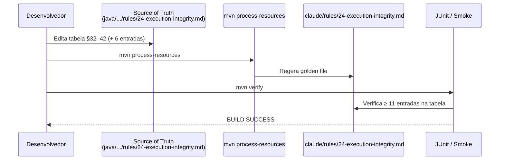

# História: Expandir tabela "Mandatory Evidence Artifacts" na Rule 24

**ID:** story-0057-0001
**Chave Jira:** —
**Status:** Pendente

> **Status Transitions:**
> valores permitidos `Pendente | Planejada | Em Andamento | Concluída | Falha | Bloqueada`.
> Transições válidas: `Pendente → Planejada | Em Andamento | Falha | Bloqueada`;
> `Planejada → Em Andamento | Falha | Bloqueada`;
> `Em Andamento → Concluída | Falha | Bloqueada`;
> reabertura `Concluída → Em Andamento` (via `x-status-reconcile --apply`) e
> `Falha → Pendente`; `Bloqueada → Pendente | Planejada | Em Andamento | Falha`.

## 1. Dependências

| Blocked By | Blocks |
| :--- | :--- |
| — | story-0057-0002, story-0057-0005, story-0057-0006 |

## 2. Regras Transversais Aplicáveis

| ID | Título |
| :--- | :--- |
| RULE-001 | Sub-skills declaradas em SKILL.md são tool calls obrigatórias |
| RULE-002 | Tabela "Mandatory Evidence Artifacts" é fonte da verdade para Camada 3 |
| RULE-006 | Rule 22 — Skill Visibility: internal skills referenciadas pelo nome canônico |

## 3. Descrição

Como **Tech Lead do ia-dev-environment**, eu quero expandir a tabela "Mandatory Evidence Artifacts" da Rule 24 com todas as sub-skills auditáveis do catálogo atual, garantindo que as Camadas 3 e 4 do enforcement de integridade de execução tenham cobertura completa sobre as invocações críticas do fluxo de story/task/release.

A Rule 24 §32–42 (arquivo `.claude/rules/24-execution-integrity.md`) lista apenas 5 sub-skills com artefatos de evidência mapeados: `x-internal-story-verify`, `x-review`, `x-review-pr`, `x-internal-story-report`, e `x-arch-plan`. O pós-mortem do EPIC-0053 revelou que `x-pr-watch-ci`, `x-pr-create`, `x-test-tdd`/`x-test-run`, `x-git-commit` (ciclo TDD), `x-dependency-audit`, e `x-threat-model` também produzem artefatos de evidência persistente — mas não estão mapeados, tornando as Camadas 3 (CI audit) e 4 (observabilidade) cegas a essas omissões.

Esta história é **Layer 0 (Foundation)**: sem ela, a Story 0057-0002 (script Camada 3) não tem definição completa de quais arquivos verificar, e a Story 0057-0006 (Stop hook) não sabe quais artefatos novos checar. A expansão é aditiva — a tabela existente não é reformulada, apenas acrescida de 6 novas entradas.

### 3.1 Critérios de expansão da tabela

A tabela na Rule 24 deve incluir TODA sub-skill que satisfaça pelo menos um dos critérios:
- Produz um arquivo persistente em `plans/epic-XXXX/` ou `.claude/state/`
- É declarada como invocação obrigatória em ao menos um orchestrator (x-story-implement, x-task-implement, x-release)
- Sua omissão silenciosa resulta em falta de evidência verificável por auditoria externa

As 6 novas entradas a adicionar (com path e camada de enforcement):

| Sub-skill | Artifact path | Enforced by |
| :--- | :--- | :--- |
| `x-pr-watch-ci` | `.claude/state/pr-watch-{PR_NUMBER}.json` | Camada 2 (Stop hook) |
| `x-pr-create` | evidência via `gh pr view --json url` capturado em log de telemetria | Camada 4 (observabilidade) |
| `x-test-tdd` / `x-test-run` | `plans/epic-XXXX/reports/test-run-STORY-ID.txt` (saída do mvn) | Camada 3 (soft) |
| `x-git-commit` (ciclo TDD) | evidência via `git log --oneline` da branch na época do PR | Camada 4 (observabilidade) |
| `x-dependency-audit` | `plans/epic-XXXX/reports/dependency-audit-STORY-ID.md` | Camada 3 |
| `x-threat-model` | `plans/epic-XXXX/plans/threat-model-story-STORY-ID.md` | Camada 3 (soft) |

### 3.2 Regeneração dos golden files

Após alterar `java/src/main/resources/targets/claude/rules/24-execution-integrity.md` (source of truth), os golden files devem ser regenerados (comando canônico do README §"Regenerating Golden Files"):
```bash
cd java
mvn compile test-compile
java -cp target/classes:target/test-classes:$(mvn dependency:build-classpath -q -DincludeScope=test -Dmdep.outputFile=/dev/stdout) \
  dev.iadev.golden.GoldenFileRegenerator
mvn verify
```

### 3.3 Atualização do `audits/execution-integrity-baseline.txt`

A tabela expandida não retroage sobre o baseline existente. O baseline é imutável para stories pré-Rule-24. Apenas novas stories (pós-merge desta story) passam a ser auditadas pelas novas entradas.

## 3.5 Entrega de Valor

- **Valor Principal:** Tabela "Mandatory Evidence Artifacts" com 11 sub-skills auditáveis (vs. 5 atuais) elimina a cegueira das Camadas 3 e 4 identificada no pós-mortem do EPIC-0053.
- **Métrica de Sucesso:** Script `scripts/audit-execution-integrity.sh` (Story 0057-0002) referencia as 11 entradas sem erros de "path pattern undefined"; Stop hook (Story 0057-0006) verifica `.claude/state/pr-watch-*.json` sem config adicional.
- **Impacto no Negócio:** `x-pr-watch-ci` não pode mais ser silenciosamente pulada sem que as Camadas 2, 3 e 4 detectem — fecha o blind spot comprovado pelo EPIC-0053.

## 4. Definições de Qualidade Locais

### DoR Local (Definition of Ready)

- [ ] Arquivo `java/src/main/resources/targets/claude/rules/24-execution-integrity.md` identificado como source of truth
- [ ] Lista de 6 novas sub-skills validada contra o catálogo atual (`ls .claude/skills/x-*/`)
- [ ] Paths de artefato confirmados como padrões existentes ou adotáveis no projeto
- [ ] `mvn verify` passando no branch base antes do início

### DoD Local (Definition of Done)

- [ ] `java/src/main/resources/targets/claude/rules/24-execution-integrity.md` atualizado com 6 novas entradas na tabela §32–42
- [ ] `.claude/rules/24-execution-integrity.md` regenerado (golden) e idêntico ao source of truth processado
- [ ] `mvn verify` passa incluindo smoke tests e coverage gates
- [ ] Pelo menos 1 teste automatizado verificando que a tabela na regra gerada tem ≥ 11 entradas
- [ ] Smoke test passando

### Global Definition of Done (DoD)

- **Cobertura:** ≥ 95% Line, ≥ 90% Branch
- **Testes Automatizados:** JUnit 5 — verificação do conteúdo do golden gerado
- **Relatório de Cobertura:** JaCoCo XML+HTML no artefato CI
- **Documentação:** Source of truth atualizada; golden regenerado
- **Persistência:** N/A
- **Performance:** `mvn verify` < 5 min

## 5. Contratos de Dados (Data Contract)

### 5.1 Estrutura da tabela expandida (Rule 24 §32–42)

| Campo | Tipo | M/O | Descrição | Exemplo |
| :--- | :--- | :--- | :--- | :--- |
| `Sub-skill` | `String` | M | Nome da skill auditada | `x-pr-watch-ci` |
| `Artifact path` | `String (glob pattern)` | M | Caminho relativo ao repo root | `.claude/state/pr-watch-{PR_NUMBER}.json` |
| `Enforced by` | `String` | M | Camada de enforcement responsável | `Camada 2 (Stop hook)` |

### 5.2 Artefatos de evidência por sub-skill

| Sub-skill (nova) | Path pattern | Enforcement layer | Tipo |
| :--- | :--- | :--- | :--- |
| `x-pr-watch-ci` | `.claude/state/pr-watch-{PR}.json` | Camada 2 | hard |
| `x-pr-create` | telemetry NDJSON (evento `gh pr create`) | Camada 4 | soft |
| `x-test-tdd`/`x-test-run` | `plans/epic-XXXX/reports/test-run-STORY-ID.txt` | Camada 3 | soft |
| `x-git-commit` (TDD) | `git log` da branch | Camada 4 | soft |
| `x-dependency-audit` | `plans/epic-XXXX/reports/dependency-audit-STORY-ID.md` | Camada 3 | hard |
| `x-threat-model` | `plans/epic-XXXX/plans/threat-model-story-STORY-ID.md` | Camada 3 | soft |

### 5.3 Error Codes Mapeados

| Código de saída | Error Code | Condição | Ação |
| :--- | :--- | :--- | :--- |
| 0 | `OK` | Tabela expandida e golden regenerado com sucesso | — |
| 1 | `REGEN_FAILED` | `mvn process-resources` falhou | Verificar erros de compilação no source of truth |
| 2 | `COVERAGE_GATE` | Coverage abaixo de 95% line / 90% branch | Adicionar testes antes do merge |

## 6. Diagramas

### 6.1 Fluxo de expansão da tabela



## 7. Critérios de Aceite (Gherkin)

```gherkin
Cenario: Tabela com zero entradas (degenerado — impossível em produção mas testável)
  DADO que a tabela "Mandatory Evidence Artifacts" na Rule 24 está vazia
  QUANDO o script de auditoria tenta verificar evidências de uma story
  ENTÃO o script retorna exit code 0 mas com aviso "tabela vazia — nenhuma sub-skill auditada"
  E nenhum false positive é gerado

Cenario: Tabela expandida com 11 entradas — happy path
  DADO que a tabela "Mandatory Evidence Artifacts" na Rule 24 tem 11 entradas (5 originais + 6 novas)
  E o golden `.claude/rules/24-execution-integrity.md` foi regenerado via `mvn process-resources`
  QUANDO o desenvolvedor executa `mvn verify`
  ENTÃO o build passa com cobertura ≥ 95% line e ≥ 90% branch
  E o arquivo golden contém as 11 sub-skills esperadas
  E as 6 novas entradas têm `Artifact path` e `Enforced by` preenchidos

Cenario: Tentativa de adicionar entrada sem Artifact path (erro)
  DADO que uma nova sub-skill é adicionada à tabela sem `Artifact path`
  QUANDO o test de validação de schema da tabela executa
  ENTÃO o teste falha com mensagem "Artifact path obrigatório em todas as entradas da tabela"
  E o build não avança para integração

Cenario: Regeneração do golden após edição no source of truth (boundary — execução idempotente)
  DADO que a tabela na source of truth tem 11 entradas
  QUANDO `mvn process-resources` é executado uma segunda vez sem alterações
  ENTÃO o golden gerado é byte-identical ao anterior
  E o `git diff` do golden mostra zero mudanças
  E o `mvn verify` passa sem falhas de regressão
```

### 7.1 Scenario Ordering (TPP)

Degenerado (tabela vazia) → Happy path (11 entradas, build passa) → Erro (entrada incompleta) → Boundary (idempotência).

### 7.2 Mandatory Scenario Categories

- [x] Degenerate cases — tabela vazia
- [x] Happy path — tabela expandida com 11 entradas e build passando
- [x] Error paths — entrada sem Artifact path
- [x] Boundary values — regeneração idempotente (at-min: 0 changes → at-max: all 6 added → past-max: duplicate entry rejected)

## 8. Tasks

### TASK-0057-0001-001: Atualizar tabela Mandatory Evidence Artifacts no source of truth

- **Layer:** Config (rules source of truth)
- **Test Type:** Verification
- **Size:** S
- **Dependencies:** —
- **Branch:** `feat/task-0057-0001-001-expand-evidence-table`
- **Testability:** Config + VerificationTest
- **Files:**
  - `java/src/main/resources/targets/claude/rules/24-execution-integrity.md`
- **Acceptance Criteria:**
  - [ ] Tabela §32–42 tem exatamente 11 entradas (5 originais + 6 novas)
  - [ ] Cada nova entrada tem `Sub-skill`, `Artifact path`, e `Enforced by` preenchidos
  - [ ] Nenhuma entrada existente foi alterada ou removida

### TASK-0057-0001-002: Regenerar golden e escrever teste de verificação da tabela

- **Layer:** Test
- **Test Type:** Verification
- **Size:** M
- **Dependencies:** TASK-0057-0001-001
- **Branch:** `feat/task-0057-0001-002-regen-golden-and-test`
- **Testability:** Config + VerificationTest
- **Files:**
  - `.claude/rules/24-execution-integrity.md` (golden regenerado)
  - `java/src/test/java/dev/iadev/.../Rule24EvidenceTableExpansionTest.java`
- **Acceptance Criteria:**
  - [ ] `mvn process-resources` regenera o golden sem erros
  - [ ] Teste JUnit verifica que o golden contém as strings das 11 sub-skills esperadas
  - [ ] `mvn verify` passa com coverage ≥ 95% line / ≥ 90% branch

### TASK-0057-0001-003: Smoke test — validar conteúdo do golden gerado

- **Layer:** Test
- **Test Type:** Smoke
- **Size:** S
- **Dependencies:** TASK-0057-0001-001, TASK-0057-0001-002
- **Branch:** `feat/task-0057-0001-003-smoke-evidence-table`
- **Testability:** Config + VerificationTest
- **Files:**
  - `java/src/test/java/dev/iadev/.../Rule24EvidenceTableSmokeTest.java`
- **Acceptance Criteria:**
  - [ ] Smoke test lê `.claude/rules/24-execution-integrity.md` e verifica ≥ 11 linhas de tabela
  - [ ] Smoke test verifica presença de `x-pr-watch-ci` e `x-dependency-audit` no golden
  - [ ] `mvn verify` passa com smoke incluído
