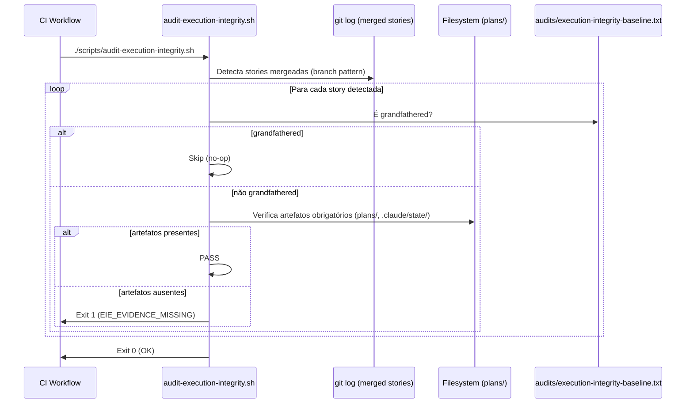

# História: Implementar `scripts/audit-execution-integrity.sh` (Camada 3)

**ID:** story-0057-0002
**Chave Jira:** —
**Status:** Pendente

> **Status Transitions (Rule 22 — lifecycle-integrity):**
> valores permitidos `Pendente | Planejada | Em Andamento | Concluída | Falha | Bloqueada`.
> Transições válidas: `Pendente → Planejada | Em Andamento | Falha | Bloqueada`;
> `Planejada → Em Andamento | Falha | Bloqueada`;
> `Em Andamento → Concluída | Falha | Bloqueada`;
> reabertura `Concluída → Em Andamento` (via `x-status-reconcile --apply`) e
> `Falha → Pendente`; `Bloqueada → Pendente | Planejada | Em Andamento | Falha`.
> Ver [`.claude/rules/22-lifecycle-integrity.md`](../.claude/rules/22-lifecycle-integrity.md).

## 1. Dependências

| Blocked By | Blocks |
| :--- | :--- |
| story-0057-0001, story-0057-0003 | story-0057-0004 |

## 2. Regras Transversais Aplicáveis

| ID | Título |
| :--- | :--- |
| RULE-001 | Sub-skills declaradas em SKILL.md são tool calls obrigatórias |
| RULE-002 | Tabela "Mandatory Evidence Artifacts" é fonte da verdade para Camada 3 |
| RULE-003 | Enforcement via scripts Bash — sem código Java runtime (Rule 14) |
| RULE-005 | Rule 21 — Story PRs targetam epic/0057; gate final para develop é manual |

## 3. Descrição

Como **Tech Lead do ia-dev-environment**, eu quero implementar o script `scripts/audit-execution-integrity.sh` que constitui a **Camada 3 (CI audit)** da Rule 24, garantindo que todo PR mergeado numa story branch tenha o conjunto completo de artefatos de evidência definidos pela tabela "Mandatory Evidence Artifacts" — e que o CI falhe com `EIE_EVIDENCE_MISSING` quando evidências estiverem ausentes.

Atualmente a Camada 3 está descrita na Rule 24 §§66–72 mas **o script não existe**. Toda vez que o LLM silenciosamente pula uma sub-skill, a falha só é detectada por testes de smoke em CI remoto (`mvn verify`) — caro e tardio. Com o script implementado, o CI bloqueia o merge do PR da story diretamente, surfaceando a falha no momento do PR review, não horas depois.

O script deve:
- Escanear stories mergeadas via `git log` (detecção por branch pattern `story-*` ou por commit message pattern)
- Verificar, para cada story detectada, se o conjunto de artefatos obrigatórios existe em `plans/epic-XXXX/plans/` e `plans/epic-XXXX/reports/`
- Consultar `audits/execution-integrity-baseline.txt` para grandfathering de stories pré-Rule-24
- Implementar `--self-check` que verifica sua própria infraestrutura (rule file, hook registrado, baseline presente)
- Retornar exit codes conforme Rule 24 §§66–72: 0/1/2/3

### 3.1 Exit codes obrigatórios (Rule 24 §§66–72)

| Exit | Code | Condição |
| :--- | :--- | :--- |
| 0 | `OK` | Todas as stories mergeadas têm evidências ou são grandfathered |
| 1 | `EIE_EVIDENCE_MISSING` | Ao menos uma story mergeada não tem artefatos obrigatórios |
| 2 | `EIE_BASELINE_CORRUPT` | `audits/execution-integrity-baseline.txt` malformado |
| 3 | `EIE_INVALID_EXEMPTION` | Marker `audit-exempt` sem reason |

### 3.2 Integração com CI workflow

O script deve ser chamado em `.github/workflows/ci.yml` no step de auditoria:
```yaml
- name: Audit Execution Integrity (Camada 3)
  run: scripts/audit-execution-integrity.sh
```

### 3.3 Compatibilidade com a tabela expandida (Story 0057-0001)

O script deve ler os padrões de artefato da tabela na Rule 24 (ou de um arquivo de configuração companion `scripts/audit-execution-integrity.conf`) para que a adição de novas entradas à tabela não exija modificação do script — apenas do arquivo de configuração.

### 3.4 Cláusula de imutabilidade do baseline

Stories mergeadas ANTES do merge desta story podem ser adicionadas ao baseline por uma única vez. Após o merge, o CI verifica que nenhuma nova entrada foi adicionada ao baseline (imutabilidade pós-rule-24).

## 3.5 Entrega de Valor

- **Valor Principal:** Camada 3 CI audit passa a existir — builds de PR de story falham imediatamente quando evidências obrigatórias estão ausentes, em vez de só falhar horas depois via `mvn verify` em CI remoto.
- **Métrica de Sucesso:** PR com `x-pr-watch-ci` pulada é bloqueado pelo CI com `EIE_EVIDENCE_MISSING` antes do merge; tempo de detecção reduz de ~60 min (CI remoto) para ~3 min (CI PR check).
- **Impacto no Negócio:** Regressões do tipo EPIC-0053 (6 task-PRs com skip silencioso) são impossíveis de mergerem sem que a Camada 3 dispare.

## 4. Definições de Qualidade Locais

### DoR Local (Definition of Ready)

- [ ] Story 0057-0001 concluída — tabela com 11 entradas disponível
- [ ] Story 0057-0003 concluída — Rule 45 disponível (contrato de CI-watch integrity)
- [ ] Arquivo `audits/execution-integrity-baseline.txt` existindo (pode estar vazio)
- [ ] Workflow CI `.github/workflows/ci.yml` identificado para integração

### DoD Local (Definition of Done)

- [ ] Script `scripts/audit-execution-integrity.sh` criado e executável (`chmod +x`)
- [ ] Exit codes 0, 1, 2, 3 implementados conforme spec da Rule 24
- [ ] `--self-check` implementado e retorna exit 0 no ambiente válido
- [ ] Integrado ao `.github/workflows/ci.yml`
- [ ] `audits/execution-integrity-baseline.txt` criado (com stories pré-Rule-24 se houver)
- [ ] Teste de integração (Bash/bats ou JUnit) cobrindo todos os 4 exit codes
- [ ] `mvn verify` passa incluindo smoke tests

### Global Definition of Done (DoD)

- **Cobertura:** ≥ 95% Line, ≥ 90% Branch
- **Testes Automatizados:** Teste Bash (bats ou equivalente) + JUnit de integração
- **Relatório de Cobertura:** JaCoCo XML+HTML
- **Documentação:** `scripts/audit-execution-integrity.sh --help` documenta usage
- **Persistência:** N/A
- **Performance:** Script completa em < 5s para repositório com até 100 epics

## 5. Contratos de Dados (Data Contract)

### 5.1 Parâmetros do script

| Parâmetro | Tipo | M/O | Descrição | Exemplo |
| :--- | :--- | :--- | :--- | :--- |
| `--self-check` | flag | O | Verifica infraestrutura do script e retorna exit 0/11/2 | `./scripts/audit-execution-integrity.sh --self-check` |
| `--story-id <ID>` | String | O | Audita apenas uma story específica | `--story-id story-0053-0001` |
| `--json` | flag | O | Emite resultado em JSON ao invés de texto | `--json` |

### 5.2 Formato de saída JSON (`--json`)

```json
{
  "status": "EIE_EVIDENCE_MISSING",
  "storiesAudited": 12,
  "storiesPassed": 11,
  "storiesFailed": 1,
  "failures": [
    {
      "storyId": "story-0053-0006",
      "missingArtifacts": [
        "plans/epic-0053/plans/review-story-0053-0006.md",
        ".claude/state/pr-watch-*.json"
      ]
    }
  ]
}
```

### 5.3 Error Codes Mapeados

| Exit | Code | Condição | Mensagem |
| :--- | :--- | :--- | :--- |
| 0 | `OK` | Todas as stories com evidências completas ou grandfathered | `Audit passed: N stories OK` |
| 1 | `EIE_EVIDENCE_MISSING` | Story sem artefato obrigatório | `EIE_EVIDENCE_MISSING: story-XXXX-YYYY missing: <path>` |
| 2 | `EIE_BASELINE_CORRUPT` | Baseline malformado | `EIE_BASELINE_CORRUPT: invalid line format at line N` |
| 3 | `EIE_INVALID_EXEMPTION` | `audit-exempt` sem reason | `EIE_INVALID_EXEMPTION: story-XXXX-YYYY has audit-exempt without reason` |

## 6. Diagramas

### 6.1 Fluxo de auditoria Camada 3



## 7. Critérios de Aceite (Gherkin)

```gherkin
Cenario: Nenhuma story mergeada (degenerado — repo limpo)
  DADO que não existe nenhuma story branch mergeada detectável via git log
  QUANDO o script `audit-execution-integrity.sh` é executado
  ENTÃO o script retorna exit code 0
  E a saída indica "0 stories auditadas"

Cenario: Story com todos os artefatos presentes (happy path)
  DADO que a story-0057-0001 foi mergeada na epic/0057
  E os artefatos `plans/epic-0057/plans/review-story-0057-0001.md` e `plans/epic-0057/reports/verify-envelope-story-0057-0001.json` existem
  QUANDO o script `audit-execution-integrity.sh` é executado
  ENTÃO o script retorna exit code 0
  E a saída indica "1 story auditada, 1 passou"

Cenario: Story com artefato ausente — x-pr-watch-ci pulada (erro)
  DADO que a story-0053-0006 foi mergeada
  E o arquivo `.claude/state/pr-watch-*.json` NÃO existe para essa story
  E a story-0053-0006 NÃO está no baseline
  QUANDO o script `audit-execution-integrity.sh` é executado
  ENTÃO o script retorna exit code 1 (EIE_EVIDENCE_MISSING)
  E a saída contém "story-0053-0006 missing: .claude/state/pr-watch-*.json"

Cenario: Story grandfathered no baseline (boundary — pré-Rule-24)
  DADO que a story-0051-0001 está listada em `audits/execution-integrity-baseline.txt`
  E os artefatos dessa story estão ausentes
  QUANDO o script `audit-execution-integrity.sh` é executado
  ENTÃO o script retorna exit code 0
  E a saída indica "story-0051-0001 grandfathered (baseline)"
  E nenhum EIE_EVIDENCE_MISSING é emitido para essa story
```

### 7.1 Scenario Ordering (TPP)

Degenerado (nenhuma story) → Happy path (story completa) → Erro (artefato ausente) → Boundary (grandfathered).

### 7.2 Mandatory Scenario Categories

- [x] Degenerate cases — nenhuma story mergeada
- [x] Happy path — story com artefatos completos
- [x] Error paths — artefato ausente (`EIE_EVIDENCE_MISSING`)
- [x] Boundary values — story grandfathered no baseline

## 8. Tasks

### TASK-0057-0002-001: Implementar script base com detecção de stories mergeadas

- **Layer:** Adapter (scripts/)
- **Test Type:** Integration
- **Size:** M
- **Dependencies:** —
- **Branch:** `feat/task-0057-0002-001-audit-script-base`
- **Testability:** Config + VerificationTest
- **Files:**
  - `scripts/audit-execution-integrity.sh`
  - `scripts/audit-execution-integrity.conf`
- **Acceptance Criteria:**
  - [ ] Script detecta stories mergeadas via `git log`
  - [ ] Script lê padrões de artefato do arquivo `.conf` companion
  - [ ] `--self-check` retorna exit 0 em ambiente válido

### TASK-0057-0002-002: Implementar verificação de artefatos e exit codes

- **Layer:** Adapter (scripts/)
- **Test Type:** Integration
- **Size:** M
- **Dependencies:** TASK-0057-0002-001
- **Branch:** `feat/task-0057-0002-002-audit-script-exit-codes`
- **Testability:** Config + VerificationTest
- **Files:**
  - `scripts/audit-execution-integrity.sh` (extensão)
  - `audits/execution-integrity-baseline.txt`
  - `java/src/test/java/dev/iadev/.../AuditExecutionIntegrityTest.java`
- **Acceptance Criteria:**
  - [ ] Exit codes 0, 1, 2, 3 implementados conforme spec
  - [ ] Baseline consultado para grandfathering
  - [ ] Teste JUnit/bats cobre todos os 4 exit codes

### TASK-0057-0002-003: Integrar ao CI workflow e smoke test

- **Layer:** Config (CI) + Test (Smoke)
- **Test Type:** Smoke
- **Size:** S
- **Dependencies:** TASK-0057-0002-001, TASK-0057-0002-002
- **Branch:** `feat/task-0057-0002-003-ci-integration-smoke`
- **Testability:** Migration + Smoke
- **Files:**
  - `.github/workflows/ci.yml`
  - `java/src/test/java/dev/iadev/.../AuditCamada3SmokeTest.java`
- **Acceptance Criteria:**
  - [ ] Step `Audit Execution Integrity (Camada 3)` adicionado ao CI
  - [ ] Smoke test valida que o script existe e é executável
  - [ ] `mvn verify` passa com smoke incluído
