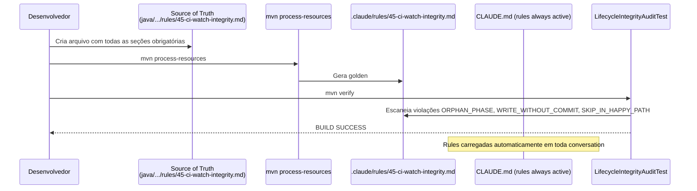

# História: Criar Rule 45 (CI-Watch Integrity)

**ID:** story-0057-0003
**Chave Jira:** —
**Status:** Pendente

> **Status Transitions:**
> valores permitidos `Pendente | Planejada | Em Andamento | Concluída | Falha | Bloqueada`.
> Transições válidas: `Pendente → Planejada | Em Andamento | Falha | Bloqueada`;
> `Planejada → Em Andamento | Falha | Bloqueada`;
> `Em Andamento → Concluída | Falha | Bloqueada`;
> reabertura `Concluída → Em Andamento` (via `x-status-reconcile --apply`) e
> `Falha → Pendente`; `Bloqueada → Pendente | Planejada | Em Andamento | Falha`.

## 1. Dependências

| Blocked By | Blocks |
| :--- | :--- |
| — | story-0057-0002, story-0057-0005 |

## 2. Regras Transversais Aplicáveis

| ID | Título |
| :--- | :--- |
| RULE-001 | Sub-skills declaradas em SKILL.md são tool calls obrigatórias |
| RULE-003 | Enforcement via scripts Bash — sem código Java runtime (Rule 14) |
| RULE-005 | Rule 21 — Story PRs targetam epic/0057; gate final para develop é manual |
| RULE-006 | Rule 22 — Skill Visibility: internal skills referenciadas pelo nome canônico |

## 3. Descrição

Como **Tech Lead do ia-dev-environment**, eu quero criar a **Rule 45 (CI-Watch Integrity)** como regra formal no sistema de regras, consolidando os `RULE-045-*` hoje referenciados apenas em `x-pr-watch-ci/SKILL.md`, garantindo que o contrato de CI-watch enforcement tenha uma autoridade única, formal e auditável pelo sistema de regras.

Atualmente os `RULE-045-*` (RULE-045-01 a RULE-045-05) estão documentados apenas dentro do SKILL.md da `x-pr-watch-ci`, sem regra formal separada no diretório `.claude/rules/`. Isso cria dois problemas: (1) o `LifecycleIntegrityAuditTest` (EPIC-0046) não tem como escanear uma regra de CI-watch — ela simplesmente não existe como arquivo `.md` de regra; (2) outros orchestrators que invocam `x-pr-watch-ci` não têm referência normativa para citar além do próprio SKILL.md.

Esta story cria o arquivo `java/src/main/resources/targets/claude/rules/45-ci-watch-integrity.md` (source of truth) com:
- Definição do contrato de CI-watch (quando é obrigatório, quando pode ser pulado)
- Tabela de exit codes do `x-pr-watch-ci` (8 exit codes conforme RULE-045-05)
- Fallback matrix (quando CI não responde, quando Copilot review não está disponível)
- Opt-out via `--no-ci-watch` (restrito a `## Recovery` e contextos de CI/automation)
- Referências cross-rule para Rule 24 (evidência), Rule 21 (epic branch), Rule 13 (Skill protocol)

### 3.1 Estrutura da Rule 45

A regra deve seguir o padrão dos arquivos de regra existentes (ex: Rule 24):
- Numeração: `45-ci-watch-integrity.md`
- Seções: Purpose, Exit Codes Matrix, Fallback Matrix, `--no-ci-watch` Constraints, Opt-out contexts, Forbidden, Audit

### 3.2 Exit codes do x-pr-watch-ci (RULE-045-05) — a formalizar

| Exit | Code | Significado |
| :--- | :--- | :--- |
| 0 | `CI_PASSED` | Todos os checks passaram + Copilot review OK |
| 1 | `CI_FAILED` | Ao menos um check CI falhou |
| 2 | `CI_TIMEOUT` | Timeout de polling excedido |
| 3 | `CI_ABORTED` | PR fechado ou cancelado durante polling |
| 4 | `COPILOT_CHANGES_REQUESTED` | Copilot pediu changes |
| 5 | `COPILOT_TIMEOUT` | Copilot não respondeu dentro do timeout |
| 6 | `PR_NOT_FOUND` | PR não encontrado via `gh pr view` |
| 7 | `CI_SKIPPED` | `--no-ci-watch` foi passado explicitamente |

### 3.3 Regeneração dos golden files

Após criar o arquivo source of truth, regenerar (comando canônico do README §"Regenerating Golden Files"):
```bash
cd java
mvn compile test-compile
java -cp target/classes:target/test-classes:$(mvn dependency:build-classpath -q -DincludeScope=test -Dmdep.outputFile=/dev/stdout) \
  dev.iadev.golden.GoldenFileRegenerator
```
O golden `.claude/rules/45-ci-watch-integrity.md` deve aparecer.

## 3.5 Entrega de Valor

- **Valor Principal:** `RULE-045-*` deixam de ser documentação inline num SKILL.md e se tornam uma regra formal carregada em todo conversation (rules are always active — CLAUDE.md). Orchestrators passam a ter referência normativa para citar ao invocar `x-pr-watch-ci`.
- **Métrica de Sucesso:** `ls .claude/rules/ | grep 45-ci-watch` retorna `45-ci-watch-integrity.md`; `LifecycleIntegrityAuditTest` escaneia a rule sem erros; Story 0057-0002 (script Camada 3) pode referenciar Rule 45 para a seção de CI-watch.
- **Impacto no Negócio:** Qualquer futuro orchestrator que pular `x-pr-watch-ci` tem uma regra carregável que o LLM lê automaticamente — Camada 1 (normativa) reforçada.

## 4. Definições de Qualidade Locais

### DoR Local (Definition of Ready)

- [ ] Arquivo `x-pr-watch-ci/SKILL.md` lido e RULE-045-* documentados extraídos
- [ ] Template de arquivo de regra identificado (padrão dos existentes em `.claude/rules/`)
- [ ] Numeração `45` confirmada como disponível (verificar `ls java/src/main/resources/targets/claude/rules/`)
- [ ] `mvn verify` passando no branch base

### DoD Local (Definition of Done)

- [ ] `java/src/main/resources/targets/claude/rules/45-ci-watch-integrity.md` criado com todas as seções obrigatórias
- [ ] Golden `.claude/rules/45-ci-watch-integrity.md` regenerado
- [ ] `LifecycleIntegrityAuditTest` passa sem novas violações
- [ ] Pelo menos 1 teste verificando existência e conteúdo mínimo da rule gerada
- [ ] `mvn verify` passa com coverage ≥ 95% line / ≥ 90% branch

### Global Definition of Done (DoD)

- **Cobertura:** ≥ 95% Line, ≥ 90% Branch
- **Testes Automatizados:** JUnit verifica existência e conteúdo da rule
- **Relatório de Cobertura:** JaCoCo XML+HTML
- **Documentação:** Source of truth criado; golden gerado; CLAUDE.md atualizado se necessário
- **Persistência:** N/A
- **Performance:** `mvn verify` < 5 min

## 5. Contratos de Dados (Data Contract)

### 5.1 Estrutura do arquivo de regra

| Seção | Obrigatória | Descrição |
| :--- | :--- | :--- |
| `# Rule 45 — CI-Watch Integrity` | M | Header com título |
| `## Purpose` | M | Propósito e escopo da rule |
| `## Exit Codes Matrix` | M | Tabela de 8 exit codes do x-pr-watch-ci |
| `## Fallback Matrix` | M | Comportamento quando CI não responde |
| `## --no-ci-watch Constraints` | M | Quando o opt-out é permitido |
| `## Forbidden` | M | O que é proibido |
| `## Audit` | M | Como a rule é auditada |

### 5.2 Tabela de exit codes

| Exit | Code | Condição |
| :--- | :--- | :--- |
| 0 | `CI_PASSED` | Todos os checks CI passaram |
| 1 | `CI_FAILED` | Ao menos um check CI falhou |
| 2 | `CI_TIMEOUT` | Timeout de polling excedido |
| 3 | `CI_ABORTED` | PR fechado durante polling |
| 4 | `COPILOT_CHANGES_REQUESTED` | Copilot pediu changes |
| 5 | `COPILOT_TIMEOUT` | Copilot não respondeu |
| 6 | `PR_NOT_FOUND` | PR não encontrado |
| 7 | `CI_SKIPPED` | `--no-ci-watch` passado |

### 5.3 Error Codes Mapeados

| Código de saída | Error Code | Condição | Ação |
| :--- | :--- | :--- | :--- |
| 0 | `OK` | Rule criada e golden gerado com sucesso | — |
| 1 | `REGEN_FAILED` | `mvn process-resources` falhou | Verificar erros no source of truth |
| 2 | `AUDIT_VIOLATION` | `LifecycleIntegrityAuditTest` detectou violação na nova rule | Corrigir violação antes do merge |

## 6. Diagramas

### 6.1 Fluxo de criação e propagação da Rule 45



## 7. Critérios de Aceite (Gherkin)

```gherkin
Cenario: Rule 45 inexistente antes desta story (degenerado)
  DADO que o arquivo `java/src/main/resources/targets/claude/rules/45-ci-watch-integrity.md` NÃO existe
  QUANDO o desenvolvedor verifica o diretório de rules
  ENTÃO nenhum golden `45-ci-watch-integrity.md` existe em `.claude/rules/`
  E o `LifecycleIntegrityAuditTest` não escaneia Rule 45

Cenario: Rule 45 criada com todas as seções obrigatórias (happy path)
  DADO que o arquivo source of truth `45-ci-watch-integrity.md` é criado com 7 seções obrigatórias
  E `mvn process-resources` é executado
  QUANDO o desenvolvedor executa `mvn verify`
  ENTÃO o golden `.claude/rules/45-ci-watch-integrity.md` existe
  E o golden contém a tabela de 8 exit codes do x-pr-watch-ci
  E o `LifecycleIntegrityAuditTest` passa sem violações para a Rule 45
  E `mvn verify` retorna BUILD SUCCESS com coverage ≥ 95% line

Cenario: Rule 45 com seção obrigatória ausente (erro)
  DADO que o arquivo source of truth `45-ci-watch-integrity.md` foi criado sem a seção `## Exit Codes Matrix`
  QUANDO o desenvolvedor executa `mvn verify`
  ENTÃO o `LifecycleIntegrityAuditTest` detecta `ORPHAN_PHASE` ou violação equivalente
  E o build falha com mensagem identificando a seção ausente
  E nenhum golden é aceito sem a seção

Cenario: Regeneração idempotente da Rule 45 (boundary)
  DADO que o source of truth foi criado e o golden foi gerado
  QUANDO `mvn process-resources` é executado uma segunda vez sem alterações no source of truth
  ENTÃO o golden é byte-identical ao anterior
  E `git diff` do golden mostra zero mudanças
  E `mvn verify` passa sem falhas de regressão
```

### 7.1 Scenario Ordering (TPP)

Degenerado (rule inexistente) → Happy path (rule completa, build passou) → Erro (seção ausente) → Boundary (idempotência da regeneração).

### 7.2 Mandatory Scenario Categories

- [x] Degenerate cases — rule inexistente
- [x] Happy path — rule criada, golden gerado, audit OK
- [x] Error paths — seção obrigatória ausente
- [x] Boundary values — regeneração idempotente

## 8. Tasks

### TASK-0057-0003-001: Extrair RULE-045-* do x-pr-watch-ci/SKILL.md e criar source of truth

- **Layer:** Config (rules source of truth)
- **Test Type:** Verification
- **Size:** M
- **Dependencies:** —
- **Branch:** `feat/task-0057-0003-001-create-rule-45`
- **Testability:** Config + VerificationTest
- **Files:**
  - `java/src/main/resources/targets/claude/rules/45-ci-watch-integrity.md`
- **Acceptance Criteria:**
  - [ ] Arquivo criado com as 7 seções obrigatórias
  - [ ] Tabela de 8 exit codes presente e completa
  - [ ] Seção `## --no-ci-watch Constraints` define contextos de opt-out permitidos

### TASK-0057-0003-002: Regenerar golden e escrever teste de verificação

- **Layer:** Test
- **Test Type:** Verification
- **Size:** M
- **Dependencies:** TASK-0057-0003-001
- **Branch:** `feat/task-0057-0003-002-regen-golden-rule45`
- **Testability:** Config + VerificationTest
- **Files:**
  - `.claude/rules/45-ci-watch-integrity.md` (golden regenerado)
  - `java/src/test/java/dev/iadev/.../Rule45CiWatchIntegrityTest.java`
- **Acceptance Criteria:**
  - [ ] `mvn process-resources` cria o golden sem erros
  - [ ] `LifecycleIntegrityAuditTest` passa sem violações para a Rule 45
  - [ ] Teste JUnit verifica presença das 8 entradas de exit code no golden

### TASK-0057-0003-003: Smoke test — Rule 45 carregável e auditável

- **Layer:** Test
- **Test Type:** Smoke
- **Size:** S
- **Dependencies:** TASK-0057-0003-001, TASK-0057-0003-002
- **Branch:** `feat/task-0057-0003-003-smoke-rule45`
- **Testability:** Migration + Smoke
- **Files:**
  - `java/src/test/java/dev/iadev/.../Rule45SmokeTest.java`
- **Acceptance Criteria:**
  - [ ] Smoke test verifica que `.claude/rules/45-ci-watch-integrity.md` existe
  - [ ] Smoke test verifica que o arquivo contém `CI_PASSED` e `CI_FAILED`
  - [ ] `mvn verify` passa com smoke incluído
