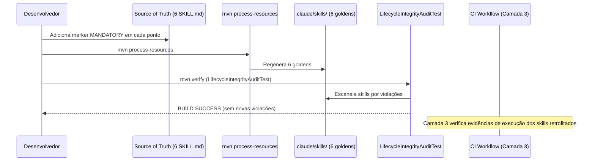

# História: Adicionar markers MANDATORY em 6 SKILL.md orquestradoras

**ID:** story-0057-0004
**Chave Jira:** —
**Status:** Pendente

> **Status Transitions (Rule 22 — lifecycle-integrity):**
> valores permitidos `Pendente | Planejada | Em Andamento | Concluída | Falha | Bloqueada`.
> Transições válidas: `Pendente → Planejada | Em Andamento | Falha | Bloqueada`;
> `Planejada → Em Andamento | Falha | Bloqueada`;
> `Em Andamento → Concluída | Falha | Bloqueada`;
> reabertura `Concluída → Em Andamento` (via `x-status-reconcile --apply`) e
> `Falha → Pendente`; `Bloqueada → Pendente | Planejada | Em Andamento | Falha`.
> Ver [`.claude/rules/22-lifecycle-integrity.md`](../.claude/rules/22-lifecycle-integrity.md).

## 1. Dependências

| Blocked By | Blocks |
| :--- | :--- |
| story-0057-0002 | story-0057-0007, story-0057-0008 |

## 2. Regras Transversais Aplicáveis

| ID | Título |
| :--- | :--- |
| RULE-001 | Sub-skills declaradas em SKILL.md são tool calls obrigatórias |
| RULE-002 | Tabela "Mandatory Evidence Artifacts" é fonte da verdade para Camada 3 |
| RULE-004 | Markers MANDATORY — NON-NEGOTIABLE obrigatórios em blocos de invocação |
| RULE-005 | Rule 21 — Story PRs targetam epic/0057; gate final para develop é manual |

## 3. Descrição

Como **Tech Lead do ia-dev-environment**, eu quero adicionar o marker `**MANDATORY TOOL CALL — NON-NEGOTIABLE (Rule 24)**` imediatamente antes de cada bloco `Skill(skill: "...", ...)` crítico em 6 SKILL.md orquestradoras, garantindo que a **Camada 1 (normativa)** da Rule 24 force o LLM a executar cada sub-skill explicitamente em vez de sumarizá-la ou pulá-la silenciosamente.

O pós-mortem do EPIC-0053 identificou 14 pontos em 8 arquivos SKILL.md onde sub-skills críticas são declaradas em prosa sem o marker explícito, criando ambiguidade sobre se o LLM deve executar ou apenas descrever a invocação. Esta story realiza o retrofit dos 6 pontos mais críticos identificados na spec:

| SKILL.md | Linha (aprox.) | Sub-skill afetada | Problema |
| :--- | :--- | :--- | :--- |
| `x-story-implement/SKILL.md` | 202 | `x-pr-watch-ci` | Invocação em prosa sem MANDATORY |
| `x-task-implement/SKILL.md` | 496 | `x-pr-watch-ci` | Invocação em prosa sem MANDATORY |
| `x-release/SKILL.md` | 1381 | `x-pr-watch-ci` | Invocação em prosa sem MANDATORY |
| `x-review/SKILL.md` | 99–155 | 9 specialists reviewers | Invocações em prosa sem MANDATORY |
| `x-epic-implement/SKILL.md` | 333 | `x-pr-fix-epic` | Invocação em prosa sem MANDATORY |
| `x-owasp-scan/SKILL.md` | 273 | `x-dependency-audit` | Invocação em prosa sem MANDATORY |

### 3.1 Formato exato do marker

O marker deve ser inserido imediatamente ANTES do bloco `Skill(...)`, no formato exato:

```markdown
**MANDATORY TOOL CALL — NON-NEGOTIABLE (Rule 24):** Invoke the `x-pr-watch-ci` skill via the Skill tool:

    Skill(skill: "x-pr-watch-ci", args: "--pr <PR_NUMBER> --timeout 600")
```

O marker está em negrito, na mesma linha que a instrução de invocação. O bloco `Skill(...)` fica na linha seguinte com indentação de 4 espaços (padrão Rule 13).

### 3.2 Regeneração dos golden files

Após alterar os SKILL.md na source of truth (`java/src/main/resources/targets/claude/skills/`), regenerar:
```bash
mvn process-resources
java -cp target/classes dev.iadev.GoldenFileRegenerator
mvn verify
```

### 3.3 Verificação de não-regressão

O `LifecycleIntegrityAuditTest` (EPIC-0046) escaneia skills por violações `WRITE_WITHOUT_COMMIT` e `SKIP_IN_HAPPY_PATH`. O retrofit não deve introduzir novas violações — apenas adicionar markers onde estão ausentes.

## 3.5 Entrega de Valor

- **Valor Principal:** 14 gaps de prosa sem MANDATORY eliminados — LLM não pode invocar a frase "executo x-pr-watch-ci" em vez de emitir o tool call, pois a Camada 1 (normativa, carregada em toda conversation) passa a ser explícita.
- **Métrica de Sucesso:** Grep por `MANDATORY TOOL CALL` nos 6 SKILL.md modificados retorna match em cada ponto de invocação crítica; `LifecycleIntegrityAuditTest` não regride.
- **Impacto no Negócio:** Regressões do tipo EPIC-0053 são detectáveis em Camada 1 (antes mesmo de Camada 3 CI audit) — o LLM lê o marker e sabe que a invocação é tool call, não prosa.

## 4. Definições de Qualidade Locais

### DoR Local (Definition of Ready)

- [ ] Story 0057-0002 concluída — script Camada 3 existe para validar evidências após retrofit
- [ ] Paths exatos nos 6 SKILL.md identificados (linha e arquivo)
- [ ] Formato do marker `MANDATORY TOOL CALL` confirmado com o padrão existente em `x-story-implement`
- [ ] `mvn verify` passando no branch base

### DoD Local (Definition of Ready)

- [ ] 6 SKILL.md modificados na source of truth com markers nos pontos identificados
- [ ] Golden files regenerados via `mvn process-resources` + `GoldenFileRegenerator`
- [ ] `LifecycleIntegrityAuditTest` passa sem novas violações
- [ ] Grep por `MANDATORY TOOL CALL` nos 6 goldens confirma presença dos markers
- [ ] `mvn verify` passa com coverage ≥ 95% line / ≥ 90% branch
- [ ] Smoke test valida markers nos goldens

### Global Definition of Done (DoD)

- **Cobertura:** ≥ 95% Line, ≥ 90% Branch
- **Testes Automatizados:** JUnit + grep-based smoke test
- **Relatório de Cobertura:** JaCoCo XML+HTML
- **Documentação:** Source of truth atualizado; goldens regenerados
- **Persistência:** N/A
- **Performance:** `mvn verify` < 5 min

## 5. Contratos de Dados (Data Contract)

### 5.1 Mapa de intervenções por SKILL.md

| SKILL.md (source of truth path) | Pontos de intervenção | Sub-skill | Tipo de marker |
| :--- | :--- | :--- | :--- |
| `skills/dev/x-story-implement/SKILL.md` | ~linha 202 | `x-pr-watch-ci` | MANDATORY TOOL CALL |
| `skills/dev/x-task-implement/SKILL.md` | ~linha 496 | `x-pr-watch-ci` | MANDATORY TOOL CALL |
| `skills/ops/x-release/SKILL.md` | ~linha 1381 | `x-pr-watch-ci` | MANDATORY TOOL CALL |
| `skills/review/x-review/SKILL.md` | linhas 99–155 (9 especialistas) | specialists | MANDATORY TOOL CALL (×9) |
| `skills/ops/x-epic-implement/SKILL.md` | ~linha 333 | `x-pr-fix-epic` | MANDATORY TOOL CALL |
| `skills/security/x-owasp-scan/SKILL.md` | ~linha 273 | `x-dependency-audit` | MANDATORY TOOL CALL |

### 5.2 Formato de marker (contrato)

```
**MANDATORY TOOL CALL — NON-NEGOTIABLE (Rule 24):** Invoke the `<skill-name>` skill via the Skill tool:

    Skill(skill: "<skill-name>", args: "<args>")
```

### 5.3 Error Codes Mapeados

| Código | Error Code | Condição | Ação |
| :--- | :--- | :--- | :--- |
| 0 | `OK` | Todos os markers adicionados e goldens regenerados | — |
| 1 | `AUDIT_REGRESSION` | `LifecycleIntegrityAuditTest` detectou nova violação | Corrigir antes do merge |
| 2 | `COVERAGE_GATE` | Coverage abaixo dos thresholds | Adicionar testes |

## 6. Diagramas

### 6.1 Fluxo de retrofit dos markers



## 7. Critérios de Aceite (Gherkin)

```gherkin
Cenario: SKILL.md sem marker antes do retrofit (degenerado — estado atual)
  DADO que `x-story-implement/SKILL.md` não tem `MANDATORY TOOL CALL` antes da invocação de `x-pr-watch-ci`
  QUANDO um grep por "MANDATORY TOOL CALL" é feito no arquivo
  ENTÃO o resultado é vazio (0 matches)

Cenario: Marker adicionado e golden regenerado (happy path)
  DADO que todos os 6 SKILL.md foram editados com markers MANDATORY nos pontos identificados
  E `mvn process-resources` foi executado
  QUANDO o desenvolvedor executa `mvn verify`
  ENTÃO grep por "MANDATORY TOOL CALL" nos 6 goldens retorna ao menos 1 match por arquivo
  E o `LifecycleIntegrityAuditTest` passa sem novas violações
  E `mvn verify` retorna BUILD SUCCESS com coverage ≥ 95% line

Cenario: Marker inserido fora do formato exato (erro)
  DADO que um marker foi inserido como `MANDATORY:` em vez de `**MANDATORY TOOL CALL — NON-NEGOTIABLE (Rule 24):**`
  QUANDO o teste de verificação de formato dos markers executa
  ENTÃO o teste falha com mensagem indicando formato incorreto
  E o build não avança para integração

Cenario: Regeneração idempotente dos 6 goldens (boundary — at-min: 1 skill, at-max: 6 skills)
  DADO que os 6 SKILL.md foram editados e os goldens foram regenerados
  QUANDO `mvn process-resources` é executado uma segunda vez sem alterações
  ENTÃO os 6 goldens são byte-identical aos anteriores
  E `git diff` dos goldens mostra zero mudanças
  E `mvn verify` passa sem falhas de regressão
```

### 7.1 Scenario Ordering (TPP)

Degenerado (sem marker — estado atual) → Happy path (markers adicionados, build passa) → Erro (formato incorreto) → Boundary (idempotência, at-min/at-max de skills).

### 7.2 Mandatory Scenario Categories

- [x] Degenerate cases — estado atual sem markers
- [x] Happy path — markers adicionados, build passa
- [x] Error paths — formato incorreto do marker
- [x] Boundary values — at-min (1 skill) / at-max (6 skills) / past-max (duplicação rejeitada)

## 8. Tasks

### TASK-0057-0004-001: Retrofit markers em x-story-implement, x-task-implement, x-release

- **Layer:** Config (skills source of truth)
- **Test Type:** Verification
- **Size:** M
- **Dependencies:** —
- **Branch:** `feat/task-0057-0004-001-markers-story-task-release`
- **Testability:** Config + VerificationTest
- **Files:**
  - `java/src/main/resources/targets/claude/skills/dev/x-story-implement/SKILL.md`
  - `java/src/main/resources/targets/claude/skills/dev/x-task-implement/SKILL.md`
  - `java/src/main/resources/targets/claude/skills/ops/x-release/SKILL.md`
- **Acceptance Criteria:**
  - [ ] `x-pr-watch-ci` precedida de MANDATORY em cada um dos 3 SKILL.md
  - [ ] Formato exato conforme spec §3.1

### TASK-0057-0004-002: Retrofit markers em x-review, x-epic-implement, x-owasp-scan

- **Layer:** Config (skills source of truth)
- **Test Type:** Verification
- **Size:** M
- **Dependencies:** —
- **Branch:** `feat/task-0057-0004-002-markers-review-epic-owasp`
- **Testability:** Config + VerificationTest
- **Files:**
  - `java/src/main/resources/targets/claude/skills/review/x-review/SKILL.md`
  - `java/src/main/resources/targets/claude/skills/ops/x-epic-implement/SKILL.md`
  - `java/src/main/resources/targets/claude/skills/security/x-owasp-scan/SKILL.md`
- **Acceptance Criteria:**
  - [ ] 9 specialists reviewers em `x-review` com markers MANDATORY
  - [ ] `x-pr-fix-epic` em `x-epic-implement` com marker MANDATORY
  - [ ] `x-dependency-audit` em `x-owasp-scan` com marker MANDATORY

### TASK-0057-0004-003: Regenerar goldens e smoke test de presença dos markers

- **Layer:** Test (Smoke)
- **Test Type:** Smoke
- **Size:** S
- **Dependencies:** TASK-0057-0004-001, TASK-0057-0004-002
- **Branch:** `feat/task-0057-0004-003-regen-and-smoke-markers`
- **Testability:** Migration + Smoke
- **Files:**
  - `.claude/skills/x-story-implement/SKILL.md` (golden)
  - `.claude/skills/x-task-implement/SKILL.md` (golden)
  - `.claude/skills/x-release/SKILL.md` (golden)
  - `.claude/skills/x-review/SKILL.md` (golden)
  - `.claude/skills/x-epic-implement/SKILL.md` (golden)
  - `.claude/skills/x-owasp-scan/SKILL.md` (golden)
  - `java/src/test/java/dev/iadev/.../MandatoryMarkersRetrofitSmokeTest.java`
- **Acceptance Criteria:**
  - [ ] `mvn process-resources` regenera todos os 6 goldens sem erros
  - [ ] Smoke test verifica presença de `MANDATORY TOOL CALL` em cada golden
  - [ ] `LifecycleIntegrityAuditTest` passa sem novas violações
  - [ ] `mvn verify` passa com coverage ≥ 95% line
