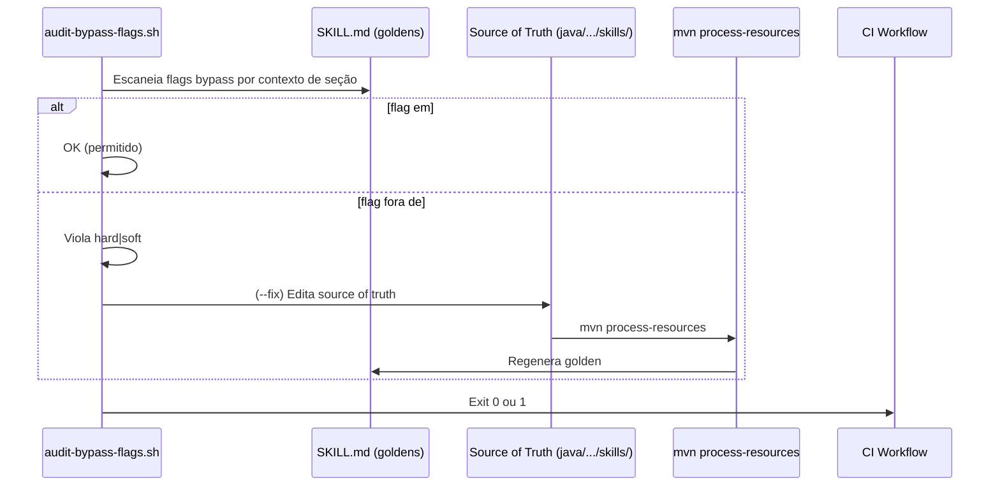

# História: Implementar `scripts/audit-bypass-flags.sh` e remediar flags em happy-path

**ID:** story-0057-0005
**Chave Jira:** —
**Status:** Pendente

> **Status Transitions:**
> valores permitidos `Pendente | Planejada | Em Andamento | Concluída | Falha | Bloqueada`.
> Transições válidas: `Pendente → Planejada | Em Andamento | Falha | Bloqueada`;
> `Planejada → Em Andamento | Falha | Bloqueada`;
> `Em Andamento → Concluída | Falha | Bloqueada`;
> reabertura `Concluída → Em Andamento` (via `x-status-reconcile --apply`) e
> `Falha → Pendente`; `Bloqueada → Pendente | Planejada | Em Andamento | Falha`.

## 1. Dependências

| Blocked By | Blocks |
| :--- | :--- |
| story-0057-0001, story-0057-0003 | story-0057-0007, story-0057-0008 |

## 2. Regras Transversais Aplicáveis

| ID | Título |
| :--- | :--- |
| RULE-001 | Sub-skills declaradas em SKILL.md são tool calls obrigatórias |
| RULE-003 | Enforcement via scripts Bash — sem código Java runtime (Rule 14) |
| RULE-004 | Markers MANDATORY — NON-NEGOTIABLE obrigatórios em blocos de invocação |
| RULE-005 | Rule 21 — Story PRs targetam epic/0057; gate final para develop é manual |

## 3. Descrição

Como **Tech Lead do ia-dev-environment**, eu quero implementar o script `scripts/audit-bypass-flags.sh` que detecta flags de bypass (`--no-ci-watch`, `--no-auto-remediation`, `--skip-pr-comments`, `--no-github-release`, `--no-jira`) usadas fora de contextos `## Recovery` ou `## Error Handling` em SKILL.md, e remediar os casos encontrados movendo as flags para o contexto correto ou removendo-as do happy-path.

A Rule 24 §30 proíbe o uso de flags bypass no happy-path: qualquer `--skip-*`, `--no-*` que efetivamente pula uma sub-skill obrigatória deve estar restrito a seções `## Recovery` (onde bypass intencional é documentado e revisado). O pós-mortem do EPIC-0053 revelou que `--no-ci-watch` e `--no-jira` aparecem em happy-paths de ao menos 3 orchestrators, criando contextos onde o LLM pode legitimamente invocar a flag sem entrar em modo de recuperação.

Esta story entrega dois artefatos complementares:
1. **Script de auditoria** (`scripts/audit-bypass-flags.sh`) — detecta flags bypass em happy-path e relata violações
2. **Remediação** — edita os SKILL.md identificados para mover flags para `## Recovery` ou remover do happy-path, e regenera os goldens

### 3.1 Flags a auditar

| Flag | Skill que a aceita | Violação quando |
| :--- | :--- | :--- |
| `--no-ci-watch` | `x-story-implement`, `x-task-implement`, `x-release` | Usada fora de `## Recovery` |
| `--no-auto-remediation` | `x-review-pr` | Usada fora de `## Recovery` |
| `--skip-pr-comments` | `x-pr-fix-epic` | Usada fora de `## Recovery` |
| `--no-github-release` | `x-release` | Usada fora de `## Recovery` |
| `--no-jira` | `x-epic-decompose`, `x-jira-create-stories` | Usada fora de `## Recovery` (ou como flag de integração legítima) |

**Nota sobre `--no-jira`:** Esta flag é de integração opcional (não é bypass de sub-skill obrigatória). O script deve classificá-la como `soft` (aviso, não violação hard) quando usada em happy-path, mas `hard` quando `x-jira-create-stories` é marcado como MANDATORY e a flag pula o step.

### 3.2 Algoritmo de detecção

O script escaneia cada SKILL.md nos goldens (`.claude/skills/`) procurando:
- Linhas contendo flags listadas em §3.1
- Contexto da linha (dentro de `## Recovery`/`## Error Handling` = OK; fora = violação)

Contexto determinado por: última linha `##` antes da ocorrência da flag. Se for `## Recovery` ou `## Error Handling` → permitido. Qualquer outro section header → violação.

### 3.3 Remediação dos SKILL.md identificados

Após o audit, os SKILL.md com violações hard são editados na source of truth:
- `--no-ci-watch` removido da seção happy-path; documentado apenas em `## Recovery`
- `--skip-pr-comments` movido para `## Recovery` com rationale documentado
- Goldens regenerados via `mvn process-resources`

## 3.5 Entrega de Valor

- **Valor Principal:** Flags bypass em happy-path reduzidas a zero — o LLM não tem mais "autorização implícita" para pular sub-skills críticas sem entrar no fluxo de Recovery documentado.
- **Métrica de Sucesso:** `scripts/audit-bypass-flags.sh` retorna exit 0 após a remediação; grep por `--no-ci-watch` nos SKILL.md de happy-path retorna 0 matches.
- **Impacto no Negócio:** Contexto de uso de flags bypass é agora explicitamente restrito e rastreável — qualquer novo uso em happy-path é detectado pelo script no CI.

## 4. Definições de Qualidade Locais

### DoR Local (Definition of Ready)

- [ ] Story 0057-0001 concluída — tabela com 11 sub-skills auditáveis disponível
- [ ] Story 0057-0003 concluída — Rule 45 disponível para referenciar opt-out correto de CI-watch
- [ ] Lista de flags a auditar (§3.1) validada contra SKILL.md atuais
- [ ] `mvn verify` passando no branch base

### DoD Local (Definition of Done)

- [ ] `scripts/audit-bypass-flags.sh` criado e executável
- [ ] Script retorna exit 0 após as remediações aplicadas
- [ ] SKILL.md identificados com violações hard editados na source of truth
- [ ] Goldens regenerados via `mvn process-resources`
- [ ] Teste de integração cobrindo flags em contexto correto vs. violação
- [ ] `mvn verify` passa com coverage ≥ 95% line / ≥ 90% branch

### Global Definition of Done (DoD)

- **Cobertura:** ≥ 95% Line, ≥ 90% Branch
- **Testes Automatizados:** Teste de integração Bash ou JUnit
- **Relatório de Cobertura:** JaCoCo XML+HTML
- **Documentação:** Script com `--help` documentando flags auditadas
- **Persistência:** N/A
- **Performance:** Script completa em < 10s para catálogo completo de skills

## 5. Contratos de Dados (Data Contract)

### 5.1 Parâmetros do script

| Parâmetro | Tipo | M/O | Descrição | Exemplo |
| :--- | :--- | :--- | :--- | :--- |
| `--skills-root <path>` | String | O | Raiz dos SKILL.md a escanear | `--skills-root .claude/skills/` |
| `--fix` | flag | O | Modo dry-run por padrão; com --fix aplica remediação | `--fix` |
| `--json` | flag | O | Saída em JSON | `--json` |

### 5.2 Saída JSON

```json
{
  "status": "BYPASS_FLAG_VIOLATION",
  "skillsScanned": 47,
  "violationsFound": 3,
  "violations": [
    {
      "skill": "x-story-implement",
      "flag": "--no-ci-watch",
      "line": 202,
      "context": "## Phase 2 — Implement",
      "severity": "hard"
    }
  ]
}
```

### 5.3 Error Codes Mapeados

| Exit | Code | Condição | Mensagem |
| :--- | :--- | :--- | :--- |
| 0 | `OK` | Nenhuma violação hard detectada | `Audit passed: N skills, 0 hard violations` |
| 1 | `BYPASS_FLAG_VIOLATION` | Ao menos uma violação hard detectada | `BYPASS_FLAG_VIOLATION: <skill>:<line> flag <flag> outside Recovery` |
| 2 | `SOFT_WARNINGS` | Apenas violações soft (aviso) | `N soft warnings found (use --json for details)` |

## 6. Diagramas

### 6.1 Fluxo de auditoria e remediação de flags bypass



## 7. Critérios de Aceite (Gherkin)

```gherkin
Cenario: Nenhuma flag bypass nos goldens (degenerado — estado ideal pós-remediação)
  DADO que todos os SKILL.md foram remediados
  QUANDO `scripts/audit-bypass-flags.sh` é executado
  ENTÃO o script retorna exit code 0
  E a saída indica "0 hard violations"

Cenario: Flag --no-ci-watch em ## Recovery (happy path — uso legítimo)
  DADO que `--no-ci-watch` aparece dentro da seção `## Recovery` de x-story-implement
  QUANDO o script de auditoria escaneia x-story-implement
  ENTÃO a flag é classificada como permitida (contexto correto)
  E nenhuma violação é reportada para essa ocorrência

Cenario: Flag --no-ci-watch em ## Phase 2 (erro — happy-path violation)
  DADO que `--no-ci-watch` aparece dentro de `## Phase 2 — Implement` de x-story-implement
  QUANDO o script de auditoria escaneia x-story-implement
  ENTÃO a violação é classificada como `hard`
  E o script retorna exit code 1 (BYPASS_FLAG_VIOLATION)
  E a saída indica o skill, linha e contexto da violação

Cenario: Flag --no-jira em happy-path de x-epic-decompose (boundary — soft vs hard)
  DADO que `--no-jira` aparece no happy-path de x-epic-decompose como flag de integração opcional
  QUANDO o script de auditoria escaneia x-epic-decompose
  ENTÃO a flag é classificada como `soft` (integração opcional, não bypass de MANDATORY)
  E o script retorna exit code 2 (SOFT_WARNINGS), não 1
  E a saída documenta o aviso mas não bloqueia
```

### 7.1 Scenario Ordering (TPP)

Degenerado (nenhuma flag — estado pós-remediação) → Happy path (flag em Recovery = OK) → Erro (flag em happy-path = violação hard) → Boundary (flag `--no-jira` soft vs hard).

### 7.2 Mandatory Scenario Categories

- [x] Degenerate cases — nenhuma flag bypass (estado ideal)
- [x] Happy path — flag em `## Recovery` (contexto correto)
- [x] Error paths — flag em happy-path (violação hard)
- [x] Boundary values — classificação soft vs hard (`--no-jira`)

## 8. Tasks

### TASK-0057-0005-001: Implementar script de auditoria de flags bypass

- **Layer:** Adapter (scripts/)
- **Test Type:** Integration
- **Size:** M
- **Dependencies:** —
- **Branch:** `feat/task-0057-0005-001-audit-bypass-flags-script`
- **Testability:** Config + VerificationTest
- **Files:**
  - `scripts/audit-bypass-flags.sh`
- **Acceptance Criteria:**
  - [ ] Script detecta flags bypass e determina contexto de seção (Recovery vs happy-path)
  - [ ] Exit codes 0, 1, 2 implementados conforme spec
  - [ ] `--json` output conforme schema §5.2

### TASK-0057-0005-002: Remediar flags em happy-path nos SKILL.md identificados

- **Layer:** Config (skills source of truth)
- **Test Type:** Verification
- **Size:** M
- **Dependencies:** TASK-0057-0005-001
- **Branch:** `feat/task-0057-0005-002-remediate-bypass-flags`
- **Testability:** Config + VerificationTest
- **Files:**
  - `java/src/main/resources/targets/claude/skills/core/dev/x-story-implement/SKILL.md`
  - `java/src/main/resources/targets/claude/skills/core/dev/x-task-implement/SKILL.md`
  - `java/src/main/resources/targets/claude/skills/core/ops/x-release/SKILL.md`
  - `java/src/main/resources/targets/claude/skills/core/pr/x-pr-fix-epic/SKILL.md`
- **Acceptance Criteria:**
  - [ ] Flags hard violations removidas do happy-path ou movidas para `## Recovery`
  - [ ] Goldens regenerados via `mvn process-resources`
  - [ ] `scripts/audit-bypass-flags.sh` retorna exit 0 após remediação

### TASK-0057-0005-003: Smoke test — auditoria e integração CI

- **Layer:** Test (Smoke) + Config (CI)
- **Test Type:** Smoke
- **Size:** S
- **Dependencies:** TASK-0057-0005-001, TASK-0057-0005-002
- **Branch:** `feat/task-0057-0005-003-smoke-bypass-flags`
- **Testability:** Migration + Smoke
- **Files:**
  - `.github/workflows/ci.yml`
  - `java/src/test/java/dev/iadev/.../BypassFlagsAuditSmokeTest.java`
- **Acceptance Criteria:**
  - [ ] Step `Audit Bypass Flags` adicionado ao CI workflow
  - [ ] Smoke test verifica que o script existe e retorna exit 0 no estado remediado
  - [ ] `mvn verify` passa com smoke incluído
