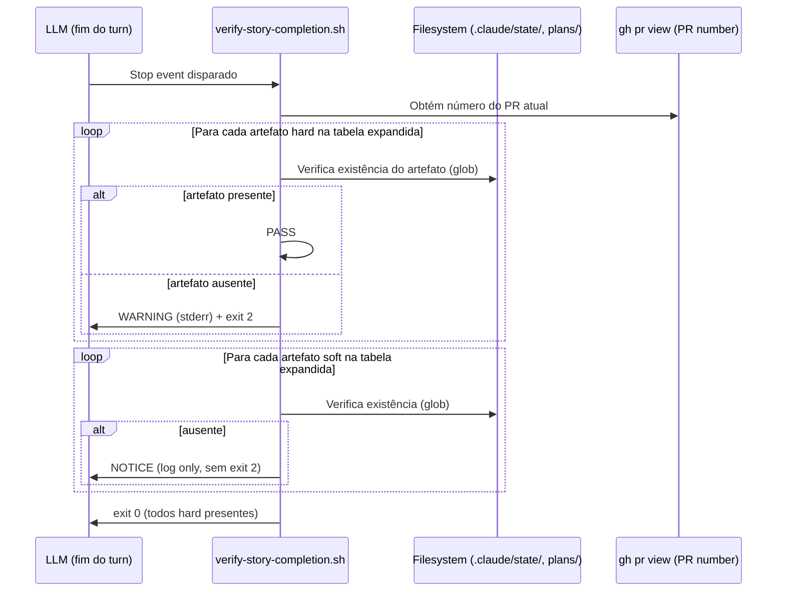

# História: Estender Stop hook (Camada 2) para novos artefatos

**ID:** story-0057-0006
**Chave Jira:** —
**Status:** Pendente

> **Status Transitions (Rule 22 — lifecycle-integrity):**
> valores permitidos `Pendente | Planejada | Em Andamento | Concluída | Falha | Bloqueada`.
> Transições válidas: `Pendente → Planejada | Em Andamento | Falha | Bloqueada`;
> `Planejada → Em Andamento | Falha | Bloqueada`;
> `Em Andamento → Concluída | Falha | Bloqueada`;
> reabertura `Concluída → Em Andamento` (via `x-status-reconcile --apply`) e
> `Falha → Pendente`; `Bloqueada → Pendente | Planejada | Em Andamento | Falha`.
> Ver [`.claude/rules/22-lifecycle-integrity.md`](../.claude/rules/22-lifecycle-integrity.md).

## 1. Dependências

| Blocked By | Blocks |
| :--- | :--- |
| story-0057-0001 | story-0057-0007, story-0057-0008 |

## 2. Regras Transversais Aplicáveis

| ID | Título |
| :--- | :--- |
| RULE-001 | Sub-skills declaradas em SKILL.md são tool calls obrigatórias |
| RULE-002 | Tabela "Mandatory Evidence Artifacts" é fonte da verdade para Camada 3 |
| RULE-003 | Enforcement via scripts Bash — sem código Java runtime (Rule 14) |
| RULE-005 | Rule 21 — Story PRs targetam epic/0057; gate final para develop é manual |

## 3. Descrição

Como **Tech Lead do ia-dev-environment**, eu quero estender o Stop hook (`verify-story-completion.sh`) da **Camada 2** para verificar `.claude/state/pr-watch-*.json` e todos os novos artefatos adicionados à tabela expandida da Rule 24 (Story 0057-0001), garantindo que o blind spot local seja eliminado — regressões do tipo EPIC-0053 são detectadas antes do push, não apenas em CI remoto.

O Stop hook atual (`verify-story-completion.sh`, Camada 2) verifica apenas os 5 artefatos originais da tabela da Rule 24. Com a expansão para 11 entradas (Story 0057-0001), o hook precisa verificar também os 6 novos artefatos — em particular `.claude/state/pr-watch-*.json` que é o artefato do `x-pr-watch-ci`, a sub-skill que foi silenciosamente pulada no EPIC-0053.

O Stop hook é o único enforcement que roda **localmente** no end do LLM turn, antes de qualquer push. É a Camada 2 conforme Rule 24 §§Camada-2. Sua extensão elimina o blind spot local que forçava depender de CI remoto (`mvn verify`) para detectar evidências ausentes.

### 3.1 Artefatos novos a verificar

| Artefato | Glob pattern | Sub-skill | Tipo |
| :--- | :--- | :--- | :--- |
| `.claude/state/pr-watch-*.json` | `.claude/state/pr-watch-[0-9]*.json` | `x-pr-watch-ci` | hard |
| `plans/epic-XXXX/reports/dependency-audit-STORY-ID.md` | `plans/epic-*/reports/dependency-audit-story-*.md` | `x-dependency-audit` | hard |
| `plans/epic-XXXX/reports/test-run-STORY-ID.txt` | `plans/epic-*/reports/test-run-story-*.txt` | `x-test-tdd`/`x-test-run` | soft |
| `plans/epic-XXXX/plans/threat-model-story-STORY-ID.md` | `plans/epic-*/plans/threat-model-story-*.md` | `x-threat-model` | soft |

### 3.2 Comportamento do hook estendido

O hook emite `WARNING` (exit code 2) para artefatos `hard` ausentes e `NOTICE` (log, sem exit 2) para artefatos `soft` ausentes. O comportamento de exit 2 (bloqueio do Claude Code) é mantido apenas para `hard` — consistente com a Rule 24 Camada 2 atual.

### 3.3 Verificação de `.claude/state/pr-watch-*.json`

O glob `.claude/state/pr-watch-[0-9]*.json` deve ser avaliado contra o número do PR da branch atual (detectado via `gh pr view --json number`). Se o arquivo `pr-watch-{PR_NUMBER}.json` não existir para o PR atual E a story foi marcada como concluída (via telemetria), o hook emite `WARNING` e exit 2.

### 3.4 Localização do hook

O hook está em `.claude/hooks/verify-story-completion.sh` (gerado a partir de `java/src/main/resources/targets/claude/hooks/verify-story-completion.sh` na source of truth). Após editar a source of truth, regenerar via `mvn process-resources`.

## 3.5 Entrega de Valor

- **Valor Principal:** Stop hook verifica `.claude/state/pr-watch-*.json` e artefatos da tabela expandida — blind spot local eliminado. Regressões detectadas em < 1s no end do LLM turn, vs. ~60 min em CI remoto.
- **Métrica de Sucesso:** LLM que pular `x-pr-watch-ci` recebe `WARNING` do Stop hook antes de fazer push; CI remoto se torna segunda linha de defesa, não única.
- **Impacto no Negócio:** Developer flow inclui feedback imediato local — pull request que chega ao CI já tem evidências validadas localmente.

## 4. Definições de Qualidade Locais

### DoR Local (Definition of Ready)

- [ ] Story 0057-0001 concluída — tabela com 11 entradas disponível (define novos artefatos)
- [ ] `verify-story-completion.sh` atual lido e compreendido (Camada 2 atual)
- [ ] Detecção do PR number via `gh pr view` validada no ambiente local
- [ ] `mvn verify` passando no branch base

### DoD Local (Definition of Done)

- [ ] `verify-story-completion.sh` estendido na source of truth para verificar os 4 novos padrões de glob
- [ ] Hook regenerado via `mvn process-resources`
- [ ] Teste de integração (Bash ou JUnit) verificando hook com e sem os novos artefatos
- [ ] Smoke test validando que o hook registrado em `settings.json` é o estendido
- [ ] `mvn verify` passa com coverage ≥ 95% line / ≥ 90% branch

### Global Definition of Done (DoD)

- **Cobertura:** ≥ 95% Line, ≥ 90% Branch
- **Testes Automatizados:** Teste Bash ou JUnit de integração
- **Relatório de Cobertura:** JaCoCo XML+HTML
- **Documentação:** Source of truth atualizado; hook regenerado; `settings.json` inalterado (hook já registrado)
- **Persistência:** N/A
- **Performance:** Hook completa em < 2s (leitura de filesystem apenas)

## 5. Contratos de Dados (Data Contract)

### 5.1 Artefatos verificados pelo hook estendido

| Artefato | Glob | Enforcement | Exit on missing |
| :--- | :--- | :--- | :--- |
| `verify-envelope-STORY-ID.json` | `plans/epic-*/reports/verify-envelope-story-*.json` | Camada 2 (original) | exit 2 |
| `review-story-STORY-ID.md` | `plans/epic-*/plans/review-story-*.md` | Camada 2 (original) | exit 2 |
| `techlead-review-story-STORY-ID.md` | `plans/epic-*/plans/techlead-review-story-*.md` | Camada 2 (original) | exit 2 |
| `story-completion-report-STORY-ID.md` | `plans/epic-*/reports/story-completion-report-*.md` | Camada 2 (original) | exit 2 |
| `pr-watch-{PR}.json` | `.claude/state/pr-watch-[0-9]*.json` | Camada 2 (**novo**) | exit 2 (hard) |
| `dependency-audit-STORY-ID.md` | `plans/epic-*/reports/dependency-audit-story-*.md` | Camada 2 (**novo**) | exit 2 (hard) |
| `test-run-STORY-ID.txt` | `plans/epic-*/reports/test-run-story-*.txt` | Camada 2 (**novo**) | log only (soft) |
| `threat-model-story-STORY-ID.md` | `plans/epic-*/plans/threat-model-story-*.md` | Camada 2 (**novo**) | log only (soft) |

### 5.2 Saída do hook estendido (stderr)

```
WARN [verify-story-completion] Missing hard artifact: .claude/state/pr-watch-621.json
     x-pr-watch-ci was not invoked for story-0053-0006 (PR #621).
     Invoke x-pr-watch-ci before completing the story.
     [Rule 24 — Camada 2]
```

### 5.3 Error Codes Mapeados

| Exit | Code | Condição | Mensagem |
| :--- | :--- | :--- | :--- |
| 0 | `OK` | Todos os artefatos hard presentes | — |
| 2 | `EVIDENCE_MISSING` | Ao menos um artefato hard ausente | `WARN [verify-story-completion] Missing hard artifact: <path>` |

## 6. Diagramas

### 6.1 Fluxo do Stop hook estendido (Camada 2)



## 7. Critérios de Aceite (Gherkin)

```gherkin
Cenario: Story sem PR ainda (degenerado — branch sem PR aberto)
  DADO que a branch da story não tem PR associado no GitHub
  QUANDO o Stop hook é disparado ao fim do LLM turn
  ENTÃO o hook não verifica `.claude/state/pr-watch-*.json` (não há PR number)
  E o hook retorna exit 0 sem warnings sobre pr-watch

Cenario: Story com todos os artefatos hard presentes (happy path)
  DADO que a story-0057-0001 tem PR aberto (ex: #700)
  E o arquivo `.claude/state/pr-watch-700.json` existe
  E todos os outros artefatos hard estão presentes em plans/
  QUANDO o Stop hook é disparado
  ENTÃO o hook retorna exit 0
  E nenhum WARNING é emitido no stderr

Cenario: x-pr-watch-ci pulada — pr-watch-*.json ausente (erro)
  DADO que a story-0057-0004 tem PR aberto (#721)
  E o arquivo `.claude/state/pr-watch-721.json` NÃO existe
  E os outros artefatos hard estão presentes
  QUANDO o Stop hook é disparado
  ENTÃO o hook emite `WARN [verify-story-completion] Missing hard artifact: .claude/state/pr-watch-721.json`
  E o hook retorna exit code 2
  E o Claude Code bloqueia o turn com a notificação de WARNING

Cenario: Artefato soft ausente — apenas log, sem bloqueio (boundary)
  DADO que a story-0057-0004 tem PR aberto
  E o arquivo `plans/epic-0057/reports/test-run-story-0057-0004.txt` NÃO existe
  E todos os artefatos hard estão presentes
  QUANDO o Stop hook é disparado
  ENTÃO o hook emite apenas NOTICE no log (sem exit 2)
  E o hook retorna exit 0 (sem bloqueio do turn)
```

### 7.1 Scenario Ordering (TPP)

Degenerado (sem PR → hook não verifica pr-watch) → Happy path (todos artefatos presentes, exit 0) → Erro (pr-watch ausente, exit 2) → Boundary (artefato soft ausente = log only, sem exit 2).

### 7.2 Mandatory Scenario Categories

- [x] Degenerate cases — branch sem PR (hook não verifica pr-watch)
- [x] Happy path — todos artefatos hard presentes
- [x] Error paths — pr-watch ausente, bloqueio exit 2
- [x] Boundary values — artefato soft ausente (log only, sem bloqueio)

## 8. Tasks

### TASK-0057-0006-001: Estender verify-story-completion.sh com verificação de pr-watch e dependency-audit

- **Layer:** Adapter (hooks/)
- **Test Type:** Integration
- **Size:** M
- **Dependencies:** —
- **Branch:** `feat/task-0057-0006-001-extend-stop-hook-hard-artifacts`
- **Testability:** Config + VerificationTest
- **Files:**
  - `java/src/main/resources/targets/claude/hooks/verify-story-completion.sh`
- **Acceptance Criteria:**
  - [ ] Hook verifica `.claude/state/pr-watch-{PR}.json` e `dependency-audit-story-*.md`
  - [ ] Exit 2 emitido quando artefatos hard ausentes
  - [ ] Glob patterns corretos conforme tabela §5.1

### TASK-0057-0006-002: Adicionar verificação soft (test-run, threat-model) e regenerar hook

- **Layer:** Adapter (hooks/) + Test
- **Test Type:** Integration
- **Size:** M
- **Dependencies:** TASK-0057-0006-001
- **Branch:** `feat/task-0057-0006-002-extend-stop-hook-soft-artifacts`
- **Testability:** Config + VerificationTest
- **Files:**
  - `java/src/main/resources/targets/claude/hooks/verify-story-completion.sh` (extensão)
  - `.claude/hooks/verify-story-completion.sh` (golden regenerado)
  - `java/src/test/java/dev/iadev/.../StopHookExtensionTest.java`
- **Acceptance Criteria:**
  - [ ] Hook registra NOTICE para artefatos soft ausentes sem exit 2
  - [ ] `mvn process-resources` regenera o golden
  - [ ] Teste de integração cobre hard (exit 2) e soft (exit 0 + log)

### TASK-0057-0006-003: Smoke test — hook registrado e funcional

- **Layer:** Test (Smoke)
- **Test Type:** Smoke
- **Size:** S
- **Dependencies:** TASK-0057-0006-001, TASK-0057-0006-002
- **Branch:** `feat/task-0057-0006-003-smoke-stop-hook`
- **Testability:** Migration + Smoke
- **Files:**
  - `java/src/test/java/dev/iadev/.../StopHookExtensionSmokeTest.java`
- **Acceptance Criteria:**
  - [ ] Smoke test verifica que `verify-story-completion.sh` existe e é executável
  - [ ] Smoke test verifica que o hook está registrado no `settings.json` sob `Stop`
  - [ ] Smoke test verifica que o arquivo contém referência a `pr-watch`
  - [ ] `mvn verify` passa com smoke incluído
