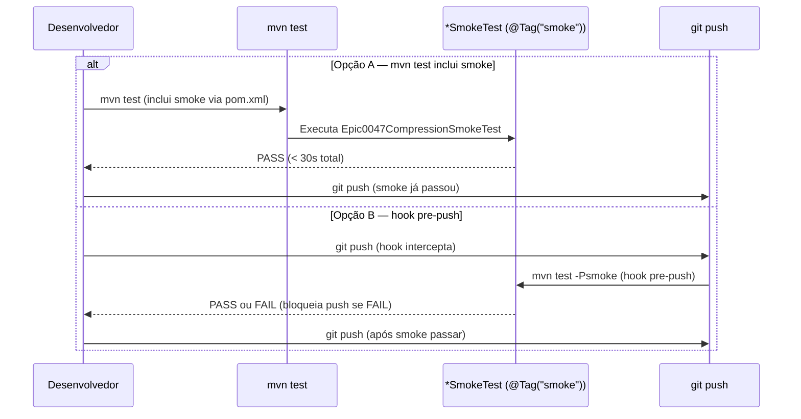

# História: Promover smoke tests críticos para `mvn test` ou hook pre-push

**ID:** story-0057-0007
**Chave Jira:** —
**Status:** Pendente

> **Status Transitions (Rule 22 — lifecycle-integrity):**
> valores permitidos `Pendente | Planejada | Em Andamento | Concluída | Falha | Bloqueada`.
> Transições válidas: `Pendente → Planejada | Em Andamento | Falha | Bloqueada`;
> `Planejada → Em Andamento | Falha | Bloqueada`;
> `Em Andamento → Concluída | Falha | Bloqueada`;
> reabertura `Concluída → Em Andamento` (via `x-status-reconcile --apply`) e
> `Falha → Pendente`; `Bloqueada → Pendente | Planejada | Em Andamento | Falha`.
> Ver [`.claude/rules/22-lifecycle-integrity.md`](../.claude/rules/22-lifecycle-integrity.md).

## 1. Dependências

| Blocked By | Blocks |
| :--- | :--- |
| story-0057-0004, story-0057-0005, story-0057-0006 | — |

## 2. Regras Transversais Aplicáveis

| ID | Título |
| :--- | :--- |
| RULE-001 | Sub-skills declaradas em SKILL.md são tool calls obrigatórias |
| RULE-003 | Enforcement via scripts Bash — sem código Java runtime (Rule 14) |
| RULE-005 | Rule 21 — Story PRs targetam epic/0057; gate final para develop é manual |

## 3. Descrição

Como **Tech Lead do ia-dev-environment**, eu quero promover o `Epic0047CompressionSmokeTest` e smoke tests congêneres do ciclo `mvn verify` (integration test phase) para `mvn test` (unit test phase) ou criar um hook Git `pre-push` que execute esses testes localmente, garantindo que regressões como a do EPIC-0053 sejam detectadas antes do push e não apenas em CI remoto.

No EPIC-0053, a falha foi detectada por `Epic0047CompressionSmokeTest` durante `mvn verify` na CI remota — aproximadamente 60 minutos após o push dos commits. O smoke test existia, mas só rodava no ciclo de integration tests, que não é executado por default no workflow local do desenvolvedor (apenas `mvn test` + commit + push). Resultado: 6 task-PRs foram mergeados antes que qualquer camada local detectasse o problema.

Esta story toma a decisão e a implementa: **promover `@Tag("smoke")` para participar de `mvn test`** (mudança de phase binding no `pom.xml`) OU **criar hook Git `pre-push`** que executa `mvn test -Psmoke` antes de qualquer push. A decisão entre as duas opções deve ser feita analisando impacto no tempo de build local.

### 3.1 Smoke tests candidatos à promoção

| Classe | Pacote | Tempo estimado | Impacto local atual |
| :--- | :--- | :--- | :--- |
| `Epic0047CompressionSmokeTest` | `dev.iadev.smoke` | ~15s | Apenas em `mvn verify` |
| `Epic0053SmokeTest` (se existir) | `dev.iadev.smoke` | ~10s | Apenas em `mvn verify` |
| Outros `@Tag("smoke")` em epics recentes | `dev.iadev.smoke` | variável | Apenas em `mvn verify` |

### 3.2 Critérios de decisão (opção A vs B)

**Opção A — Promover para `mvn test`:**
- Pro: smoke roda automaticamente em todo `mvn test`; sem setup adicional
- Con: aumenta tempo de `mvn test` local; pode impactar DX em máquinas lentas
- Viável se: todos os smoke selecionados completam em < 30s total

**Opção B — Hook Git pre-push:**
- Pro: developer vê output antes do push; não impacta `mvn test` baseline
- Con: requer setup por desenvolvedor (`git config core.hooksPath`) ou automação
- Viável se: smoke demora > 30s total ou se há risco de impacto DX significativo

A story deve executar a medição de tempo dos smoke candidatos e decidir entre A e B. A decisão é registrada em comentário no `pom.xml` ou no hook.

### 3.3 Smoke tests fora de escopo para promoção

Smoke tests que dependem de Docker, rede externa, ou credentials NÃO devem ser promovidos — apenas os que rodam em memória com filesystem local.

## 3.5 Entrega de Valor

- **Valor Principal:** Smoke tests críticos executam localmente antes do push — blind spot "CI remoto como única linha de defesa" eliminado para as regressões mais custosas.
- **Métrica de Sucesso:** `Epic0047CompressionSmokeTest` falha localmente (antes do push) quando a compressão regride; tempo adicional ao ciclo local < 30s.
- **Impacto no Negócio:** Developer feedback loop para regressões de protocolo encurta de ~60 min (CI remoto) para < 30s (local, pré-push).

## 4. Definições de Qualidade Locais

### DoR Local (Definition of Ready)

- [ ] Stories 0057-0004, 0057-0005, 0057-0006 concluídas (markers e hooks estendidos)
- [ ] Lista de smoke tests candidatos mapeada e tempos medidos (`mvn test -Dtest=*SmokeTest -Dskip.unit=true`)
- [ ] Decisão A vs B tomada com rationale documentado
- [ ] `mvn verify` passando no branch base

### DoD Local (Definition of Done)

- [ ] `Epic0047CompressionSmokeTest` rodando em `mvn test` (Opção A) OU hook pre-push configurado (Opção B)
- [ ] Decisão documentada em `plans/epic-0057/reports/smoke-promotion-decision.md`
- [ ] `mvn test` (Opção A) ou hook pre-push (Opção B) funcional em ambiente limpo
- [ ] Smoke tests promovidos passam sem falhas
- [ ] `mvn verify` passa com coverage ≥ 95% line / ≥ 90% branch

### Global Definition of Done (DoD)

- **Cobertura:** ≥ 95% Line, ≥ 90% Branch
- **Testes Automatizados:** Os próprios smoke tests promovidos são a evidência
- **Relatório de Cobertura:** JaCoCo XML+HTML
- **Documentação:** `smoke-promotion-decision.md` com rationale e medições de tempo
- **Persistência:** N/A
- **Performance:** Tempo adicional ao ciclo local < 30s

## 5. Contratos de Dados (Data Contract)

### 5.1 Documento de decisão (smoke-promotion-decision.md)

| Campo | Tipo | Descrição |
| :--- | :--- | :--- |
| `decisão` | `String (A|B)` | Opção escolhida |
| `rationale` | `String` | Justificativa técnica |
| `smoke_candidatos` | `List<{classe, tempo_ms}>` | Smoke tests promovidos e seus tempos |
| `tempo_total_ms` | `Integer` | Soma dos tempos dos smoke promovidos |
| `impacto_mvn_test` | `String` | Estimativa de impacto no ciclo local |

### 5.2 Configuração pom.xml (Opção A)

```xml
<!-- Smoke tests promovidos para mvn test phase (EPIC-0057 story-0057-0007) -->
<plugin>
  <groupId>org.apache.maven.plugins</groupId>
  <artifactId>maven-surefire-plugin</artifactId>
  <configuration>
    <groups>smoke,unit</groups>
  </configuration>
</plugin>
```

### 5.3 Error Codes Mapeados

| Código | Error Code | Condição | Ação |
| :--- | :--- | :--- | :--- |
| 0 | `OK` | Smoke tests promovidos e passando | — |
| 1 | `SMOKE_FAILED` | Smoke test promovido falha em `mvn test` | Corrigir regressão antes do merge |
| 2 | `TIME_EXCEEDED` | Tempo total > 30s após promoção | Avaliar Opção B (hook pre-push) |

## 6. Diagramas

### 6.1 Fluxo de promoção de smoke tests



## 7. Critérios de Aceite (Gherkin)

```gherkin
Cenario: Nenhum smoke test promovido antes desta story (degenerado — estado atual)
  DADO que @Tag("smoke") não está incluído nos groups do maven-surefire-plugin
  QUANDO o desenvolvedor executa `mvn test`
  ENTÃO `Epic0047CompressionSmokeTest` NÃO é executado
  E o teste só executa em `mvn verify`

Cenario: Smoke promovido para mvn test — happy path (Opção A)
  DADO que `pom.xml` foi atualizado para incluir `groups=smoke,unit`
  QUANDO o desenvolvedor executa `mvn test`
  ENTÃO `Epic0047CompressionSmokeTest` é executado
  E o tempo adicional total dos smoke é < 30s
  E o build retorna `BUILD SUCCESS`

Cenario: Regressão detectada localmente antes do push (happy path — evidência de valor)
  DADO que `Epic0047CompressionSmokeTest` foi promovido para `mvn test`
  E uma mudança regressiva foi introduzida em uma SKILL.md
  QUANDO o desenvolvedor executa `mvn test`
  ENTÃO `Epic0047CompressionSmokeTest` falha com mensagem clara
  E o push não acontece (desenvolvedor corrige localmente)

Cenario: Tempo total de smoke excede 30s (boundary — trigger de fallback para Opção B)
  DADO que todos os smoke candidatos foram medidos
  E o tempo total excede 30s
  QUANDO a decisão A vs B é avaliada
  ENTÃO a Opção B (hook pre-push) é escolhida e documentada
  E o hook pre-push executa os smoke antes de qualquer `git push`
```

### 7.1 Scenario Ordering (TPP)

Degenerado (sem smoke em mvn test) → Happy path (promovido, build passa) → Happy path 2 (regressão detectada localmente) → Boundary (tempo > 30s → Opção B).

### 7.2 Mandatory Scenario Categories

- [x] Degenerate cases — estado atual sem promoção
- [x] Happy path — smoke promovido, build passa
- [x] Error paths — regressão detectada localmente (prova de valor)
- [x] Boundary values — tempo > 30s (fallback para Opção B)

## 8. Tasks

### TASK-0057-0007-001: Medir tempos dos smoke candidatos e documentar decisão A vs B

- **Layer:** Test
- **Test Type:** Smoke
- **Size:** S
- **Dependencies:** —
- **Branch:** `feat/task-0057-0007-001-measure-smoke-times`
- **Testability:** Test-only (análise)
- **Files:**
  - `plans/epic-0057/reports/smoke-promotion-decision.md`
- **Acceptance Criteria:**
  - [ ] Todos os `@Tag("smoke")` identificados e tempos medidos
  - [ ] Decisão A ou B documentada com rationale
  - [ ] Soma dos tempos calculada e comparada ao threshold de 30s

### TASK-0057-0007-002: Implementar a opção escolhida (A ou B)

- **Layer:** Config (pom.xml ou hooks/)
- **Test Type:** Smoke
- **Size:** M
- **Dependencies:** TASK-0057-0007-001
- **Branch:** `feat/task-0057-0007-002-implement-smoke-promotion`
- **Testability:** Migration + Smoke
- **Files:**
  - `pom.xml` (Opção A) OU `.git/hooks/pre-push` template (Opção B)
- **Acceptance Criteria:**
  - [ ] `Epic0047CompressionSmokeTest` executa em `mvn test` (A) ou em hook pre-push (B)
  - [ ] Smoke passa em ambiente limpo
  - [ ] Tempo adicional ≤ 30s

### TASK-0057-0007-003: Teste de verificação da promoção e smoke test final

- **Layer:** Test (Smoke)
- **Test Type:** Smoke
- **Size:** S
- **Dependencies:** TASK-0057-0007-001, TASK-0057-0007-002
- **Branch:** `feat/task-0057-0007-003-smoke-promotion-verification`
- **Testability:** Migration + Smoke
- **Files:**
  - `java/src/test/java/dev/iadev/.../SmokePromotionVerificationTest.java`
- **Acceptance Criteria:**
  - [ ] Teste JUnit verifica que `Epic0047CompressionSmokeTest` está anotado com `@Tag("smoke")`
  - [ ] Teste JUnit verifica que o tag está nos groups configurados do surefire (Opção A) ou no hook (Opção B)
  - [ ] `mvn verify` passa com coverage ≥ 95% line
