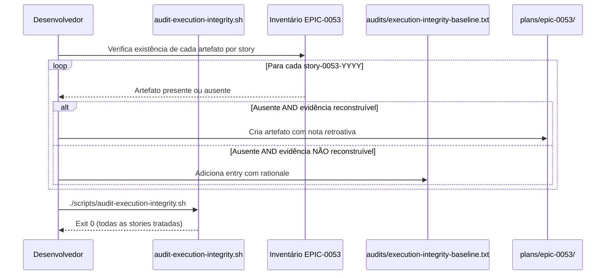

# História: Aplicação retroativa EPIC-0053 — backfill ou baseline grandfather

**ID:** story-0057-0008
**Chave Jira:** —
**Status:** Pendente

> **Status Transitions (Rule 22 — lifecycle-integrity):**
> valores permitidos `Pendente | Planejada | Em Andamento | Concluída | Falha | Bloqueada`.
> Transições válidas: `Pendente → Planejada | Em Andamento | Falha | Bloqueada`;
> `Planejada → Em Andamento | Falha | Bloqueada`;
> `Em Andamento → Concluída | Falha | Bloqueada`;
> reabertura `Concluída → Em Andamento` (via `x-status-reconcile --apply`) e
> `Falha → Pendente`; `Bloqueada → Pendente | Planejada | Em Andamento | Falha`.
> Ver [`.claude/rules/22-lifecycle-integrity.md`](../.claude/rules/22-lifecycle-integrity.md).

## 1. Dependências

| Blocked By | Blocks |
| :--- | :--- |
| story-0057-0004, story-0057-0005, story-0057-0006 | — |

## 2. Regras Transversais Aplicáveis

| ID | Título |
| :--- | :--- |
| RULE-001 | Sub-skills declaradas em SKILL.md são tool calls obrigatórias |
| RULE-002 | Tabela "Mandatory Evidence Artifacts" é fonte da verdade para Camada 3 |
| RULE-003 | Enforcement via scripts Bash — sem código Java runtime (Rule 14) |
| RULE-005 | Rule 21 — Story PRs targetam epic/0057; gate final para develop é manual |

## 3. Descrição

Como **Tech Lead do ia-dev-environment**, eu quero decidir e aplicar o tratamento retroativo para as 8 stories do EPIC-0053 (story-0053-0001 a story-0053-0008) em relação à Rule 24 expandida — escolhendo entre **backfill de evidências** (criar artefatos ausentes retroativamente) ou **grandfather via baseline** (adicionar ao `audits/execution-integrity-baseline.txt`) — garantindo que o script `audit-execution-integrity.sh` (Camada 3) passe sem `EIE_EVIDENCE_MISSING` para stories que foram mergeadas antes da Rule 24 ser expandida neste épico.

O pós-mortem do EPIC-0053 identificou que `x-pr-watch-ci` foi pulada em 6 task-PRs (#612–#617) e no PR final #619. Com a Camada 3 (Story 0057-0002) operacional e a tabela expandida (Story 0057-0001), o script de auditoria vai detectar evidências ausentes nessas stories — a menos que sejam tratadas.

**Critério de decisão entre backfill vs grandfather:**

| Opção | Quando aplicar | Risco |
| :--- | :--- | :--- |
| Backfill | Evidência pode ser reconstruída com fidelidade a partir de logs existentes (gh, git, telemetria) | Artefato criado post-hoc pode ser menos confiável |
| Grandfather | Evidência não pode ser reconstruída fielmente OU custo de backfill é alto vs valor | Baseline cresce; stories pré-Rule-24 ficam sem evidência formal |

Para o EPIC-0053 especificamente: stories task-level (0053-0001 a 0053-0008 são story PRs, não tasks) — verificar se evidências de `review`, `techlead-review`, `verify-envelope`, `story-completion-report` foram produzidas. Para `pr-watch-*.json` (nova entrada da tabela): se não existe e não pode ser reconstruído com fidelidade → grandfather.

### 3.1 Inventário de evidências do EPIC-0053

Para cada story do EPIC-0053, verificar:
- `plans/epic-0053/plans/review-story-0053-YYYY.md` — existente ou ausente?
- `plans/epic-0053/plans/techlead-review-story-0053-YYYY.md` — existente ou ausente?
- `plans/epic-0053/reports/verify-envelope-story-0053-YYYY.json` — existente ou ausente?
- `plans/epic-0053/reports/story-completion-report-story-0053-YYYY.md` — existente ou ausente?
- `.claude/state/pr-watch-*.json` para o PR de cada story — existente ou ausente?
- `plans/epic-0053/reports/dependency-audit-story-0053-YYYY.md` — existente ou ausente?

### 3.2 Decisão e aplicação

A decisão deve ser documentada por story em `plans/epic-0057/reports/epic-0053-retroactive-decision.md`. Para cada story:
- **BACKFILL:** Criar o artefato ausente com nota `<!-- retroactive-backfill: EPIC-0057 story-0057-0008 -->`
- **GRANDFATHER:** Adicionar linha a `audits/execution-integrity-baseline.txt`: `story-0053-YYYY  # pre-Rule-24-expanded, merged YYYY-MM-DD (PR #NNN), <reason>`

A imutabilidade do baseline (Rule 24 §Baseline) se aplica após o merge desta story: nenhuma entry nova pode ser adicionada ao baseline depois.

### 3.3 Verificação final

Após backfill e/ou grandfathering, `scripts/audit-execution-integrity.sh` deve retornar exit 0 para todas as stories do EPIC-0053.

## 3.5 Entrega de Valor

- **Valor Principal:** Estado do EPIC-0053 formalizado com rastreabilidade — cada story tem evidências presentes (backfill) ou está explicitamente grandfathered (baseline) com rationale documentado. O script Camada 3 passa em CI sem bloquear o merge por stories históricas.
- **Métrica de Sucesso:** `scripts/audit-execution-integrity.sh` retorna exit 0 após a aplicação retroativa; `audits/execution-integrity-baseline.txt` tem entries para todas as stories grandfathered com motivo claro.
- **Impacto no Negócio:** Debt técnico do EPIC-0053 em relação à Rule 24 expandida é liquidado formalmente, sem bloquear CI indefinidamente com evidências que não podem ser criadas retroativamente com fidelidade.

## 4. Definições de Qualidade Locais

### DoR Local (Definition of Ready)

- [ ] Stories 0057-0004, 0057-0005, 0057-0006 concluídas (enforcement operacional)
- [ ] `scripts/audit-execution-integrity.sh` (Story 0057-0002) operacional
- [ ] Inventário completo de evidências do EPIC-0053 feito (§3.1)
- [ ] `mvn verify` passando no branch base

### DoD Local (Definition of Done)

- [ ] `plans/epic-0057/reports/epic-0053-retroactive-decision.md` criado com decisão por story
- [ ] Para stories com backfill: artefatos criados com nota retroativa
- [ ] Para stories com grandfather: entries adicionadas ao `audits/execution-integrity-baseline.txt`
- [ ] `scripts/audit-execution-integrity.sh` retorna exit 0 para todas as stories do EPIC-0053
- [ ] `mvn verify` passa com coverage ≥ 95% line / ≥ 90% branch

### Global Definition of Done (DoD)

- **Cobertura:** ≥ 95% Line, ≥ 90% Branch
- **Testes Automatizados:** Teste de integração verificando exit 0 do script para EPIC-0053
- **Relatório de Cobertura:** JaCoCo XML+HTML
- **Documentação:** `epic-0053-retroactive-decision.md` com rationale por story
- **Persistência:** `audits/execution-integrity-baseline.txt` atualizado
- **Performance:** `scripts/audit-execution-integrity.sh` < 5s

## 5. Contratos de Dados (Data Contract)

### 5.1 Documento de decisão retroativa

| Campo | Tipo | Descrição |
| :--- | :--- | :--- |
| `storyId` | `String` | ID da story do EPIC-0053 |
| `decisão` | `String (BACKFILL|GRANDFATHER)` | Opção aplicada |
| `artefatos_ausentes` | `List<String>` | Artefatos que estavam ausentes |
| `evidencia_reconstruivel` | `Boolean` | Se o backfill é fidedigno |
| `pr_number` | `Integer` | Número do PR mergeado |
| `rationale` | `String` | Justificativa da decisão |

### 5.2 Formato do baseline entry

```
story-0053-0001  # pre-Rule-24-expanded, merged 2026-01-15 (PR #612), pr-watch não existia como artefato rastreável
story-0053-0002  # pre-Rule-24-expanded, merged 2026-01-15 (PR #613), pr-watch não existia como artefato rastreável
```

### 5.3 Nota de backfill em artefatos retroativos

```markdown
<!-- retroactive-backfill: EPIC-0057 story-0057-0008 (2026-04-23)
     Artefato criado post-hoc a partir de telemetria/gh/git-log.
     Evidence fidelity: MEDIUM — criado após o fato mas baseado em logs existentes. -->
```

### 5.4 Error Codes Mapeados

| Código | Error Code | Condição | Ação |
| :--- | :--- | :--- | :--- |
| 0 | `OK` | Script retorna exit 0 para EPIC-0053 após retroativo | — |
| 1 | `RETROACTIVE_INCOMPLETE` | Ao menos uma story do EPIC-0053 ainda tem `EIE_EVIDENCE_MISSING` | Completar backfill ou adicionar ao baseline |
| 2 | `BASELINE_IMMUTABILITY` | Nova entry adicionada ao baseline após o merge desta story | Reverter e documentar como exceção aprovada |

## 6. Diagramas

### 6.1 Fluxo de decisão retroativa



## 7. Critérios de Aceite (Gherkin)

```gherkin
Cenario: EPIC-0053 com todas as evidências ausentes antes do retroativo (degenerado)
  DADO que nenhuma story do EPIC-0053 tem evidências na tabela expandida
  E nenhuma está no baseline
  QUANDO `scripts/audit-execution-integrity.sh` é executado
  ENTÃO o script retorna exit 1 (EIE_EVIDENCE_MISSING) para múltiplas stories

Cenario: Todas as stories do EPIC-0053 tratadas — backfill + grandfather (happy path)
  DADO que o inventário foi feito e a decisão por story foi documentada
  E as stories com backfill têm artefatos criados com nota retroativa
  E as stories sem backfill fidedigno estão no baseline
  QUANDO `scripts/audit-execution-integrity.sh` é executado
  ENTÃO o script retorna exit 0
  E nenhuma story do EPIC-0053 aparece como EIE_EVIDENCE_MISSING

Cenario: Backfill com artefato de fidelidade baixa (erro — proibido)
  DADO que um artefato de `review-story-0053-0001.md` é criado retroativamente
  E o conteúdo é inventado (não baseado em logs existentes)
  QUANDO o tech lead revisa o PR desta story
  ENTÃO o PR é rejeitado com comentário "backfill de baixa fidelidade sem fonte rastreável"
  E a story é reclassificada para grandfather no baseline

Cenario: Nova entry adicionada ao baseline após merge desta story (boundary — imutabilidade)
  DADO que esta story foi mergeada em epic/0057
  QUANDO uma nova entry é adicionada ao `audits/execution-integrity-baseline.txt`
  ENTÃO o CI detecta a adição via `EIE_BASELINE_IMMUTABILITY` check
  E o build falha com mensagem "baseline é imutável após Rule 24 (EPIC-0057)"
```

### 7.1 Scenario Ordering (TPP)

Degenerado (evidências ausentes, sem tratamento) → Happy path (backfill + grandfather, script passa) → Erro (backfill de baixa fidelidade rejeitado) → Boundary (imutabilidade do baseline após merge).

### 7.2 Mandatory Scenario Categories

- [x] Degenerate cases — estado antes do retroativo (evidências ausentes)
- [x] Happy path — todas as stories tratadas, script passa
- [x] Error paths — backfill de baixa fidelidade rejeitado
- [x] Boundary values — imutabilidade do baseline pós-merge

## 8. Tasks

### TASK-0057-0008-001: Inventariar evidências do EPIC-0053 e documentar decisão por story

- **Layer:** Doc
- **Test Type:** Verification
- **Size:** S
- **Dependencies:** —
- **Branch:** `feat/task-0057-0008-001-epic-0053-inventory`
- **Testability:** Config + VerificationTest
- **Files:**
  - `plans/epic-0057/reports/epic-0053-retroactive-decision.md`
- **Acceptance Criteria:**
  - [ ] Todas as 8 stories do EPIC-0053 inventariadas com lista de artefatos ausentes
  - [ ] Decisão BACKFILL ou GRANDFATHER documentada por story com rationale
  - [ ] PR numbers e datas de merge registrados

### TASK-0057-0008-002: Aplicar backfill e/ou grandfather conforme decisão

- **Layer:** Config (plans/ + audits/)
- **Test Type:** Integration
- **Size:** M
- **Dependencies:** TASK-0057-0008-001
- **Branch:** `feat/task-0057-0008-002-apply-retroactive-treatment`
- **Testability:** Config + VerificationTest
- **Files:**
  - `plans/epic-0053/plans/*.md` (backfill onde aplicável)
  - `plans/epic-0053/reports/*.md` (backfill onde aplicável)
  - `audits/execution-integrity-baseline.txt` (grandfather entries)
- **Acceptance Criteria:**
  - [ ] Artefatos de backfill criados com nota retroativa correta
  - [ ] Baseline entries formatadas conforme spec §5.2
  - [ ] `scripts/audit-execution-integrity.sh` retorna exit 0 para EPIC-0053

### TASK-0057-0008-003: Smoke test — auditoria do EPIC-0053 passa após retroativo

- **Layer:** Test (Smoke)
- **Test Type:** Smoke
- **Size:** S
- **Dependencies:** TASK-0057-0008-001, TASK-0057-0008-002
- **Branch:** `feat/task-0057-0008-003-smoke-retroactive-epic0053`
- **Testability:** Migration + Smoke
- **Files:**
  - `java/src/test/java/dev/iadev/.../Epic0053RetroactiveSmokeTest.java`
- **Acceptance Criteria:**
  - [ ] Smoke test executa `audit-execution-integrity.sh --story-id story-0053-*` e verifica exit 0
  - [ ] Smoke test verifica que o baseline tem entries para as stories grandfathered
  - [ ] `mvn verify` passa com smoke incluído
