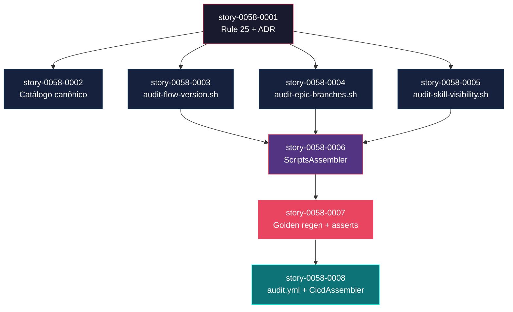
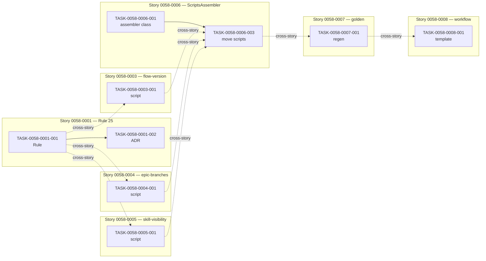

# Mapa de Implementação — EPIC-0058: Audit Scripts Lifecycle & Generation

**Gerado a partir das dependências Blocked By/Blocks de cada história do epic-0058.**

---

## 1. Matriz de Dependências

| Story | Título | Chave Jira | Blocked By | Blocks | Status |
| :--- | :--- | :--- | :--- | :--- | :--- |
| [story-0058-0001](./story-0058-0001.md) | Formalizar Rule 25 + ADR | — | — | 0058-0002, 0058-0003, 0058-0004, 0058-0005, 0058-0006 | Pendente |
| [story-0058-0002](./story-0058-0002.md) | Catálogo canônico `audit-gates-catalog.md` | — | 0058-0001 | — | Pendente |
| [story-0058-0003](./story-0058-0003.md) | `audit-flow-version.sh` (Rule 19) | — | 0058-0001 | 0058-0006 | Pendente |
| [story-0058-0004](./story-0058-0004.md) | `audit-epic-branches.sh` (Rule 21) | — | 0058-0001 | 0058-0006 | Pendente |
| [story-0058-0005](./story-0058-0005.md) | `audit-skill-visibility.sh` (Rule 22) | — | 0058-0001 | 0058-0006 | Pendente |
| [story-0058-0006](./story-0058-0006.md) | `ScriptsAssembler` + source-of-truth | — | 0058-0003, 0058-0004, 0058-0005 | 0058-0007 | Pendente |
| [story-0058-0007](./story-0058-0007.md) | Golden files regen + `GoldenFileTest` asserts | — | 0058-0006 | 0058-0008 | Pendente |
| [story-0058-0008](./story-0058-0008.md) | Workflow CI `audit.yml` + `CicdAssembler` | — | 0058-0007 | — | Pendente |

> **Valores de Status:** `Pendente` (padrão) · `Em Andamento` · `Concluída` · `Falha` · `Bloqueada` · `Parcial`

> **Nota:** 0058-0002 (catálogo) tem dependência apenas de 0058-0001 (Rule 25 definir convenção de naming) e pode executar em paralelo aos 3 scripts de gap-fill (0058-0003/0004/0005) — são independentes entre si; apenas 0058-0006 precisa dos 3 scripts concluídos para mover-los para source-of-truth.

---

## 2. Fases de Implementação

> As histórias são agrupadas em fases. Dentro de cada fase, as histórias podem ser implementadas **em paralelo**. Uma fase só pode iniciar quando todas as dependências das fases anteriores estiverem concluídas.

```
╔══════════════════════════════════════════════════════════════════════════╗
║                 FASE 0 — Foundation (Rule 25 + ADR)                    ║
║                                                                        ║
║   ┌─────────────────────────────────────────────────────────────┐      ║
║   │  story-0058-0001  Rule 25 "Audit Gate Lifecycle" + ADR      │      ║
║   └──────────────────────────┬──────────────────────────────────┘      ║
╚══════════════════════════════╪═════════════════════════════════════════╝
                               │
                               ▼
╔══════════════════════════════════════════════════════════════════════════╗
║             FASE 1 — Catalog + Gap-Fill Scripts (paralelo, 4 stories)  ║
║                                                                        ║
║   ┌─────────────┐ ┌─────────────┐ ┌─────────────┐ ┌─────────────┐     ║
║   │  0058-0002  │ │  0058-0003  │ │  0058-0004  │ │  0058-0005  │     ║
║   │  catálogo   │ │ flow-version│ │epic-branches│ │skill-visibility│   ║
║   └──────┬──────┘ └──────┬──────┘ └──────┬──────┘ └──────┬──────┘     ║
╚══════════╪═══════════════╪═══════════════╪═══════════════╪════════════╝
           │               │               │               │
          (leaf)           └───────────────┴───────────────┘
                                           │
                                           ▼
╔══════════════════════════════════════════════════════════════════════════╗
║             FASE 2 — Generation Pipeline (1 story, bottleneck)         ║
║                                                                        ║
║   ┌──────────────────────────────────────────────────────────┐         ║
║   │  story-0058-0006  ScriptsAssembler + source-of-truth     │         ║
║   │  (← precisa dos 3 scripts prontos)                       │         ║
║   └──────────────────────────┬───────────────────────────────┘         ║
╚══════════════════════════════╪═════════════════════════════════════════╝
                               │
                               ▼
╔══════════════════════════════════════════════════════════════════════════╗
║             FASE 3 — Golden Files (1 story)                            ║
║                                                                        ║
║   ┌──────────────────────────────────────────────────────────┐         ║
║   │  story-0058-0007  GoldenFileRegenerator + asserts        │         ║
║   └──────────────────────────┬───────────────────────────────┘         ║
╚══════════════════════════════╪═════════════════════════════════════════╝
                               │
                               ▼
╔══════════════════════════════════════════════════════════════════════════╗
║             FASE 4 — CI Wiring (1 story, fechamento do epic)           ║
║                                                                        ║
║   ┌──────────────────────────────────────────────────────────┐         ║
║   │  story-0058-0008  audit.yml + CicdAssembler              │         ║
║   └──────────────────────────────────────────────────────────┘         ║
╚══════════════════════════════════════════════════════════════════════════╝
```

---

## 3. Caminho Crítico

> O caminho crítico (a sequência mais longa de dependências) determina o tempo mínimo de implementação do projeto.

```
story-0058-0001 → story-0058-0003 (ou 0004/0005) → story-0058-0006 → story-0058-0007 → story-0058-0008
    Fase 0             Fase 1                         Fase 2              Fase 3             Fase 4
```

**5 fases no caminho crítico, 5 histórias na cadeia mais longa (0058-0001 → 0058-0003 → 0058-0006 → 0058-0007 → 0058-0008).**

Atrasos na Fase 0 (0058-0001) propagam-se integralmente. Atrasos na Fase 1 só impactam o caminho crítico quando ocorrem nas 3 stories de scripts (0058-0003/0004/0005); a story de catálogo (0058-0002) é leaf e pode acumular qualquer atraso sem afetar o término do epic. Fases 2-4 são sequenciais e qualquer atraso propaga 1:1.

Estimativa indicativa (sem binding): Fase 0 = 1 dia, Fase 1 = 3 dias (paralelo), Fase 2 = 2 dias, Fase 3 = 1 dia, Fase 4 = 1 dia. Total caminho crítico: ~8 dias úteis.

---

## 4. Grafo de Dependências (Mermaid)



---

## 5. Resumo por Fase

| Fase | Histórias | Camada | Paralelismo | Pré-requisito |
| :--- | :--- | :--- | :--- | :--- |
| 0 | story-0058-0001 | Foundation (Rule + ADR) | 1 | — |
| 1 | story-0058-0002, story-0058-0003, story-0058-0004, story-0058-0005 | Catalog + Scripts (doc + bash) | 4 paralelas | Fase 0 concluída |
| 2 | story-0058-0006 | Application (assembler Java) | 1 | 0058-0003, 0058-0004, 0058-0005 concluídas |
| 3 | story-0058-0007 | Test (golden + asserts) | 1 | Fase 2 concluída |
| 4 | story-0058-0008 | Config (CI workflow) | 1 | Fase 3 concluída |

**Total: 8 histórias em 5 fases.**

> **Nota:** paralelismo máximo na Fase 1 é 4 — vale investimento em workers paralelos se o operador tiver banda. Fases 2-4 são cada uma 1 story, representando sequência dura imposta pela natureza da entrega (não se pode regenerar golden sem assembler; não se pode escrever workflow sem scripts gerados).

---

## 6. Detalhamento por Fase

### Fase 0 — Foundation (Rule 25 + ADR)

| Story | Escopo Principal | Artefatos Chave |
| :--- | :--- | :--- |
| story-0058-0001 | Criar Rule 25 "Audit Gate Lifecycle" na source-of-truth, ADR correspondente, atualizar CLAUDE.md | `.claude/rules/25-audit-gate-lifecycle.md`, `adr/ADR-NNNN-audit-gate-lifecycle.md`, CLAUDE.md, `Epic0058Rule25SmokeTest` |

**Entregas da Fase 0:**

- Rule 25 publicada com 8 seções obrigatórias.
- ADR com status `Accepted`.
- Taxonomia formal de gates (Hook / CI script / Java test / Workflow) documentada.
- Exit codes padronizados (0/1/2/3 + códigos nomeados).
- Base normativa para as 7 stories subsequentes.

### Fase 1 — Catalog + Gap-Fill Scripts (paralelo)

| Story | Escopo Principal | Artefatos Chave |
| :--- | :--- | :--- |
| story-0058-0002 | Catálogo canônico consolidando 8+ gates + cross-refs nas 7 Rules alvo | `docs/audit-gates-catalog.md`, edições em `.claude/rules/{13,19,21,22,23,24,46}`, `Epic0058CatalogConsistencySmokeTest` |
| story-0058-0003 | Implementar script faltante Rule 19 com fixtures + bats + smoke | `scripts/audit-flow-version.sh`, fixtures, `scripts/tests/audit-flow-version.bats` |
| story-0058-0004 | Implementar script faltante Rule 21 com 3 checks independentes | `scripts/audit-epic-branches.sh`, fixtures (mock `gh`), bats |
| story-0058-0005 | Implementar script faltante Rule 22 com 4 checks + allowlist | `scripts/audit-skill-visibility.sh`, fixtures, `audits/skill-visibility-allowlist.txt`, bats |

**Entregas da Fase 1:**

- 3 scripts de auditoria fisicamente presentes em `/scripts/` raiz (gap fechado).
- Catálogo canônico publicado.
- 7 Rules com cross-ref de volta ao catálogo.
- 4 suites de teste (bats) + smokes Java integrando os scripts.

### Fase 2 — Generation Pipeline

| Story | Escopo Principal | Artefatos Chave |
| :--- | :--- | :--- |
| story-0058-0006 | `ScriptsAssembler` Java + mover 5 scripts para source-of-truth + registrar em `AssemblerFactory` + post-build compat | `ScriptsAssembler.java`, `ScriptsAssemblerTest`, `ScriptsAssemblerIT`, move de 5 scripts, AssemblerFactory edit, post-build step |

**Entregas da Fase 2:**

- Scripts viram artefato gerado.
- `ia-dev-env` passa a produzir `.claude/scripts/` em todo projeto criado.
- 23 assemblers ativos (22 + `ScriptsAssembler`).
- Cobertura ≥ 95% line / ≥ 90% branch no assembler novo.

### Fase 3 — Golden Files

| Story | Escopo Principal | Artefatos Chave |
| :--- | :--- | :--- |
| story-0058-0007 | Regenerar 9 perfis + estender `GoldenFileTest` com asserts explícitas | 45 arquivos golden, `GoldenFileTest.assertScriptsDirExists()`, `GoldenFileTest.assertScriptsPresent()` |

**Entregas da Fase 3:**

- 9 perfis com `.claude/scripts/` popular.
- Drift-zero garantido.
- Asserts explícitas protegem contra regressão silenciosa futura.

### Fase 4 — CI Wiring

| Story | Escopo Principal | Artefatos Chave |
| :--- | :--- | :--- |
| story-0058-0008 | Template `audit.yml.tmpl` + integração `CicdAssembler` + habilitar no próprio repo | `shared/ci/audit.yml.tmpl`, edição `CicdAssembler`, 9 goldens novos, `.github/workflows/audit.yml` raiz, `Epic0058AuditWorkflowSmokeTest` |

**Entregas da Fase 4:**

- Workflow CI roda em toda PR para `develop` e `epic/*`.
- 2 jobs: `audit-self-check` (fail-fast para scripts corrompidos) + `audit-matrix` (5 scripts em paralelo).
- Projetos gerados pelo `ia-dev-env` herdam workflow.
- Epic concluído: CLAUDE.md bloc "Concluded — EPIC-0058".

---

## 7. Observações Estratégicas

### Gargalo Principal

**story-0058-0006 (`ScriptsAssembler`)** é o gargalo central. Três razões:

1. Bloqueia 0058-0007 e, transitivamente, 0058-0008 (ou seja, 2 das 5 fases).
2. É a única story com cobertura ≥ 95% obrigatória (absolute gate Rule 05) — produz código Java novo em scope crítico.
3. Integra 3 stories predecessoras simultaneamente (os 3 scripts gap-fill).

Investir tempo de review profundo aqui (principalmente no padrão de `AssemblerFactory` registration) compensa porque erros aqui se propagam para goldens (0058-0007) e workflow (0058-0008).

### Histórias Folha (sem dependentes)

- **story-0058-0002** (catálogo): pode absorver atraso sem impacto no término do epic.
- **story-0058-0008** (workflow): é a última story; não bloqueia nada.

### Otimização de Tempo

- **Paralelismo máximo na Fase 1**: dispatch 4 workers em paralelo, 1 por story. Se apenas 2 workers disponíveis, priorizar 0058-0003/0004/0005 (críticas) sobre 0058-0002 (leaf).
- **Stories que podem começar imediatamente após 0058-0001 mergear**: 0058-0002, 0058-0003, 0058-0004, 0058-0005.
- **Alocação sugerida**: 1 engenheiro de plataforma em 0058-0006 (gargalo); 1 engenheiro sênior + 1 pleno em 0058-0003/0004/0005 (bash + bats); 1 tech writer em 0058-0001/0002 (docs).

### Dependências Cruzadas

Não há dependências cruzadas não declaradas. O único ponto de convergência (3-para-1) está na entrada da Fase 2: 0058-0003 + 0058-0004 + 0058-0005 convergem em 0058-0006.

### Marco de Validação Arquitetural

**story-0058-0006 (`ScriptsAssembler`)** é o marco de validação. Razões:

- Valida o padrão de criação de novo assembler (template para futuros tipos de artefato gerado).
- Exercita `AssemblerFactory` wiring — é o primeiro novo assembler desde a estrutura atual de 22.
- Confirma que a taxonomia da Rule 25 (layer "CI script") é implementável como "artefato gerado", não apenas "documentado".

Se 0058-0006 passar review, os 3 scripts bash (Fase 1) estão validados por contrato; se falhar, revisa-se as Fases 1 e 0 antes de continuar.

---

## 8. Dependências entre Tasks (Cross-Story)

> Esta seção é populada com as tasks declaradas em Section 8 de cada story. Dependências cross-story entre tasks individuais são mínimas neste epic — a maior parte da sincronização ocorre no nível de story (via Blocked By).

### 8.1 Dependências Cross-Story entre Tasks

| Task | Depends On | Story Source | Story Target | Tipo |
| :--- | :--- | :--- | :--- | :--- |
| TASK-0058-0006-003 | TASK-0058-0003-001, TASK-0058-0004-001, TASK-0058-0005-001 | 0058-0003, 0058-0004, 0058-0005 | 0058-0006 | data (scripts físicos) |
| TASK-0058-0006-004 | TASK-0058-0006-001 | 0058-0006 | 0058-0006 | interface (assembler class) |
| TASK-0058-0007-001 | TASK-0058-0006-005 | 0058-0006 | 0058-0007 | data (scripts em output) |
| TASK-0058-0008-002 | TASK-0058-0008-001 | 0058-0008 | 0058-0008 | config (template disponível) |
| TASK-0058-0008-004 | TASK-0058-0008-002 | 0058-0008 | 0058-0008 | data (goldens a regenerar) |

> **Validação RULE-012:** consistência cross-story task-vs-story validada — sem inconsistências. Dependências de tasks respeitam a ordem imposta pelas dependências de stories.

### 8.2 Ordem de Merge (Topological Sort)

| Ordem | Task ID | Story | Parallelizável Com | Fase |
| :--- | :--- | :--- | :--- | :--- |
| 1 | TASK-0058-0001-001 | 0058-0001 | — | 0 |
| 2 | TASK-0058-0001-002 | 0058-0001 | TASK-0058-0001-003, TASK-0058-0001-004 | 0 |
| 3 | TASK-0058-0002-001 | 0058-0002 | TASK-0058-0003-001, TASK-0058-0004-001, TASK-0058-0005-001 | 1 |
| 4 | TASK-0058-0003-001 | 0058-0003 | (paralelo) | 1 |
| 5 | TASK-0058-0004-001 | 0058-0004 | (paralelo) | 1 |
| 6 | TASK-0058-0005-001 | 0058-0005 | (paralelo) | 1 |
| 7 | TASK-0058-0006-001 | 0058-0006 | — | 2 |
| 8 | TASK-0058-0006-003 | 0058-0006 | TASK-0058-0006-004 | 2 |
| 9 | TASK-0058-0007-001 | 0058-0007 | — | 3 |
| 10 | TASK-0058-0007-002 | 0058-0007 | — | 3 |
| 11 | TASK-0058-0008-001 | 0058-0008 | — | 4 |
| 12 | TASK-0058-0008-002 | 0058-0008 | — | 4 |

**Total: 43 tasks em 5 fases de execução (distribuição por story: 5+5+5+5+6+7+4+6 = 43; nem todas detalhadas acima — visão resumida).**

### 8.3 Grafo de Dependências entre Tasks (Mermaid)



---

## 8.5 Restrições de Paralelismo

> Análise gerada manualmente (equivalente ao output esperado de `/x-parallel-eval --scope=epic`).

**Conflitos detectados:** 0 hard, 2 regen, 1 soft

### 8.5.1 Pares Serializados Dentro da Fase

| Fase | A | B | Categoria | Motivo |
| :--- | :--- | :--- | :--- | :--- |
| 1 | story-0058-0002 | story-0058-0003, 0058-0004, 0058-0005 | soft | Todos tocam `CHANGELOG.md` — requer merge sequencial OU usar `changelog-entry` sub-arquivos (EPIC-0041 pattern) |
| 1 | story-0058-0003 | story-0058-0004 | regen | Ambos podem tocar `scripts/README.md` se criado como índice; recomenda-se que apenas uma story crie o índice |
| 2 + 3 | story-0058-0006 | story-0058-0007 | regen | 0058-0007 consome golden gerado por 0058-0006 — sequência dura, não conflito |

### 8.5.2 Recomendação de Reagrupamento

- **Fase 1 (soft conflict em CHANGELOG):** manter paralelismo de 4 stories; resolver conflito via merge conflicts manuais ou adotar pattern de `CHANGELOG.md` com sub-sections por story. Impacto aceitável.
- **Fase 1 (regen em scripts/README.md):** atribuir criação do README a story-0058-0002 (catálogo) apenas; stories 0058-0003/0004/0005 não criam README próprio.
- **Fase 2 → 3:** sequência natural, não reagrupar.
