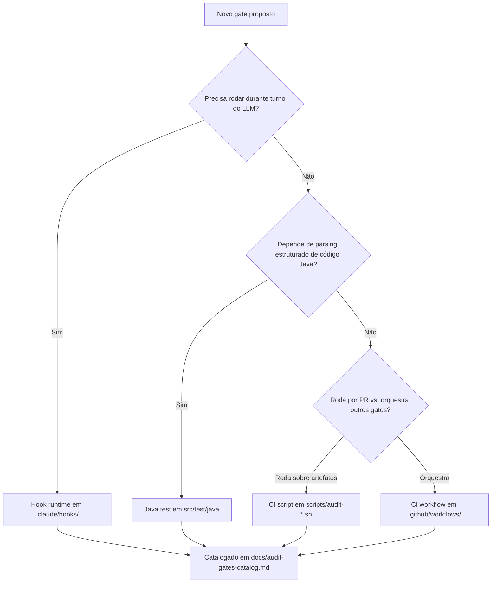

# História: Formalizar Rule 25 "Audit Gate Lifecycle" + ADR

**ID:** story-0058-0001
**Chave Jira:** —
**Status:** Concluída

## 1. Dependências

| Blocked By | Blocks |
| :--- | :--- |
| — | story-0058-0002, story-0058-0003, story-0058-0004, story-0058-0005, story-0058-0006 |

## 2. Regras Transversais Aplicáveis

| ID | Título |
| :--- | :--- |
| RULE-001 | Audit Gate Taxonomy (esta história cria a Rule 25) |
| RULE-002 | Audit Script Naming & Exit Codes |
| RULE-004 | Catalog-before-Add |

## 3. Descrição

Como **engenheiro de plataforma**, eu quero uma regra formal e um ADR documentando a taxonomia, naming, exit codes e matriz de decisão para gates de auditoria, garantindo que decisões futuras sobre onde colocar um novo gate sigam convenção explícita em vez de precedente ad hoc.

Atualmente, decisões sobre onde implementar um gate (Hook? CI script? Java test? Workflow?) são tomadas epic-a-epic sem orientação formal. EPIC-0046 escolheu Java test (`LifecycleIntegrityAuditTest`); EPIC-0050 escolheu CI script (`audit-model-selection.sh`); EPIC-0052 escolheu híbrido (hook + script + baseline). Essa fragmentação dificulta onboarding, review e reuso. Esta história estabelece a base normativa que as demais stories do epic consomem.

### 3.1 Conteúdo da Rule 25

- **Título:** `Rule 25 — Audit Gate Lifecycle`
- **Localização source-of-truth:** `java/src/main/resources/targets/claude/rules/25-audit-gate-lifecycle.md`
- **Localização output:** `.claude/rules/25-audit-gate-lifecycle.md`
- **Seções obrigatórias:**
  1. Purpose (propósito e problema de fragmentação).
  2. Taxonomia (4 camadas: Hook runtime / CI script / Java test / CI workflow) com tabela de critérios de escolha.
  3. Naming convention (`audit-{subject}.sh` para CI scripts; `verify-{subject}.sh` para hooks; `*AuditTest.java` ou `*Lint.java` para Java tests).
  4. Exit codes padronizados (0, 1, 2, 3) com códigos nomeados (`FLOW_VERSION_VIOLATION`, etc.).
  5. Flag `--self-check` obrigatória para CI scripts.
  6. Forbidden (introduzir gate sem entrada no catálogo; usar prefix diferente de `audit-`; emitir exit codes fora do contrato).
  7. Audit (como a própria Rule 25 é auditada — meta-gate reference).
  8. Related (cross-refs para Rules 13, 14, 19, 21, 22, 23, 24, 46).

### 3.2 Conteúdo do ADR

- **Arquivo:** `adr/ADR-NNNN-audit-gate-lifecycle.md` (NNNN = próximo disponível).
- **Status:** Proposed → Accepted na merge do PR desta história.
- **Context:** diagnóstico da fragmentação (3 scripts fantasmas + sem catálogo).
- **Decision:** adotar taxonomia + naming + exit codes de Rule 25.
- **Consequences:** (+) orientação formal, (-) tempo de review marginalmente maior por obrigar consulta à Rule 25 em novas PRs.
- **Alternatives considered:** (a) deixar ad hoc (rejeitado — fragmentação documentada); (b) forçar todos os gates a serem Java tests (rejeitado — Rule 14 scope guard + overhead de compilação).

### 3.3 Impacto em artefatos existentes

- `CLAUDE.md` raiz: adicionar 1 bloc "Concluded — EPIC-0058" (após merge final do epic; inicialmente adicionar "In progress") + linha no índice de Rules.
- `.claude/README.md`: atualizar seção Rules incluindo Rule 25.
- `java/src/main/resources/CLAUDE.md` (template): adicionar placeholder para Rule 25 ser referenciada em projetos gerados.
- Nenhum golden file dos 9 perfis altera apenas pela adição da Rule — o assembler `RulesAssembler` copia todos os `.md` automaticamente.

## 3.5 Entrega de Valor

- **Valor Principal:** convenção formal e versionada que desbloqueia as 7 stories subsequentes do epic e serve de referência para epics futuros envolvendo gates de governance. Elimina decisão ad hoc.
- **Métrica de Sucesso:** Rule 25 publicada em `.claude/rules/`; ADR em `adr/`; próxima epic que adicionar gate referencia Rule 25 em pelo menos 1 story (medido em 2 releases após merge).
- **Impacto no Negócio:** reviewers ganham orientação única; onboarding de novos engenheiros no padrão de auditoria cai de "ler 5 rules + 2 ADRs" para "ler Rule 25". Base para as stories 0058-0002 a 0058-0008.

## 4. Definições de Qualidade Locais

### DoR Local (Definition of Ready)

- [ ] Próximo ID de ADR identificado (scan `adr/ADR-*.md` e incrementar).
- [ ] Lista dos 8+ gates existentes identificada e pronta para servir de exemplo na taxonomia.
- [ ] Confirmar que Rule 25 é o próximo slot livre de numeração de rules (atualmente 24 é o último).

### DoD Local (Definition of Done)

- [ ] `java/src/main/resources/targets/claude/rules/25-audit-gate-lifecycle.md` criado.
- [ ] `adr/ADR-NNNN-audit-gate-lifecycle.md` criado com status `Accepted`.
- [ ] `CLAUDE.md` e `.claude/README.md` atualizados.
- [ ] Goldens regenerados (9 perfis) — `GoldenFileTest` verde.
- [ ] `CHANGELOG.md` com entrada em `## [Unreleased]` → `### Added`.
- [ ] `mvn verify` passa.
- [ ] PR targeta `epic/0058` com auto-merge (Rule 21).
- [ ] Pelo menos 1 teste automatizado verificando presença e estrutura da Rule 25 (smoke: `grep -q "## Taxonomy"` + assert no classloader).
- [ ] Smoke test passando.

### Global Definition of Done (DoD)

- **Cobertura:** ≥ 95% Line / ≥ 90% Branch (história majoritariamente docs; test gate aplica-se ao smoke test).
- **Testes Automatizados:** smoke `Epic0058Rule25SmokeTest` validando presença do arquivo e 6 sub-seções obrigatórias.
- **Relatório de Cobertura:** JaCoCo XML filtrado.
- **Documentação:** CHANGELOG, Rule, ADR, CLAUDE.md.
- **Persistência:** N/A.
- **Performance:** N/A.

## 5. Contratos de Dados

Story majoritariamente de documentação — contratos são contratos de estrutura do markdown.

### 5.1 Contract da Rule 25 (estrutura)

| Campo | Tipo | M/O | Validações | Exemplo |
| :--- | :--- | :--- | :--- | :--- |
| H1 Title | markdown heading | M | Literal `# Rule 25 — Audit Gate Lifecycle` | `# Rule 25 — Audit Gate Lifecycle` |
| Section `## Purpose` | markdown | M | Presente na primeira metade do arquivo | — |
| Section `## Taxonomy` | markdown + table | M | Contém tabela com ≥ 4 linhas (4 camadas) | — |
| Section `## Naming & Exit Codes` | markdown + table | M | Contém tabela de exit codes 0–3 | — |
| Section `## --self-check` | markdown | M | Descreve flag mandatória | — |
| Section `## Forbidden` | markdown list | M | ≥ 3 itens | — |
| Section `## Audit` | markdown | M | Auto-referencia audit-catalog | — |
| Section `## Related` | markdown list | M | Links para ≥ 7 Rules cruzadas | — |

### 5.2 Contract do ADR

| Campo | Tipo | M/O | Validações |
| :--- | :--- | :--- | :--- |
| `Status` field | YAML-like line | M | Valores `Proposed \| Accepted \| Superseded` |
| `Context` section | markdown | M | ≥ 3 parágrafos citando problema |
| `Decision` section | markdown | M | Bullet list com convenções |
| `Consequences` section | markdown | M | Separar `+` e `-` |
| `Alternatives` section | markdown | M | ≥ 2 alternativas com rationale de rejeição |

### 5.3 Error Codes Mapeados

N/A — story é gerativa, não runtime.

## 6. Diagramas

### 6.1 Fluxo de classificação (matriz de decisão)



## 7. Critérios de Aceite (Gherkin)

```gherkin
Cenario: Rule 25 inexistente (degenerate)
  DADO que o repositório não contém `25-audit-gate-lifecycle.md` na source-of-truth
  QUANDO qualquer story subsequente do epic tenta referenciar RULE-001
  ENTÃO a validação de pre-commit aborta com `UNRESOLVED_RULE_REFERENCE`

Cenario: Rule 25 criada com todas as seções (happy path)
  DADO que `java/src/main/resources/targets/claude/rules/25-audit-gate-lifecycle.md` existe
  QUANDO `Epic0058Rule25SmokeTest` executa
  E valida presença das 8 seções obrigatórias
  ENTÃO o teste passa com exit code 0
  E o `RulesAssembler` copia o arquivo para `.claude/rules/` em 9 perfis golden

Cenario: Rule 25 sem seção obrigatória (error path)
  DADO que a Rule 25 foi criada sem a seção `## Naming & Exit Codes`
  QUANDO `Epic0058Rule25SmokeTest` executa
  ENTÃO o teste falha com `MISSING_MANDATORY_SECTION`
  E aponta qual seção está ausente

Cenario: Golden drift após adicionar Rule 25 (boundary)
  DADO que a Rule 25 foi adicionada à source-of-truth
  QUANDO `mvn verify` executa `GoldenFileTest` sem regenerar goldens
  ENTÃO o teste falha em 9 perfis com diff apontando o arquivo novo
  E a solução documentada é executar `GoldenFileRegenerator` e commitar
```

### 7.1 Scenario Ordering (TPP)

Ordem: degenerate (Rule inexistente) → happy path (todas seções) → error path (seção faltando) → boundary (drift de golden).

### 7.2 Mandatory Scenario Categories

- [x] Degenerate (Rule inexistente)
- [x] Happy path (smoke test verde)
- [x] Error path (seção faltando)
- [x] Boundary (golden drift)

### 7.3 TDD Implementation Notes

Outer loop: cenário 2 é a acceptance test. Inner loop: TPP — primeiro testar que o arquivo existe; depois que cada seção individual existe; depois validar conteúdo.

## 8. Tasks

### TASK-0058-0001-001: Criar Rule 25 na source-of-truth

- **Layer:** Doc
- **Test Type:** Smoke
- **Size:** M
- **Dependencies:** —
- **Branch:** `feat/task-0058-0001-001-rule-25`
- **Testability:** Migration + Smoke (arquivo + smoke test)
- **Files:**
  - `java/src/main/resources/targets/claude/rules/25-audit-gate-lifecycle.md`
- **Acceptance Criteria:**
  - [ ] Arquivo criado com 8 seções obrigatórias
  - [ ] Matriz de decisão presente (tabela ≥ 4 linhas)
  - [ ] Cross-refs para Rules 13, 14, 19, 21, 22, 23, 24, 46

### TASK-0058-0001-002: Criar ADR correspondente

- **Layer:** Doc
- **Test Type:** Smoke
- **Size:** S
- **Dependencies:** TASK-0058-0001-001
- **Branch:** `feat/task-0058-0001-002-adr`
- **Testability:** Migration + Smoke
- **Files:**
  - `adr/ADR-NNNN-audit-gate-lifecycle.md` (NNNN = próximo ID)
  - `adr/README.md` (atualizar índice)
- **Acceptance Criteria:**
  - [ ] ADR status `Accepted`
  - [ ] Seções Context/Decision/Consequences/Alternatives presentes
  - [ ] Índice `adr/README.md` atualizado

### TASK-0058-0001-003: Atualizar CLAUDE.md e README

- **Layer:** Doc
- **Test Type:** Smoke
- **Size:** S
- **Dependencies:** TASK-0058-0001-001
- **Branch:** `feat/task-0058-0001-003-claudemd`
- **Testability:** Migration + Smoke
- **Files:**
  - `CLAUDE.md`
  - `.claude/README.md`
  - `java/src/main/resources/CLAUDE.md`
- **Acceptance Criteria:**
  - [ ] Rule 25 listada em índice
  - [ ] Bloc "In progress — EPIC-0058" adicionado a `CLAUDE.md`

### TASK-0058-0001-004: [Test] Smoke test Epic0058Rule25SmokeTest

- **Layer:** Test
- **Test Type:** Smoke
- **Size:** M
- **Dependencies:** TASK-0058-0001-001
- **Branch:** `feat/task-0058-0001-004-smoke-test`
- **Testability:** Config + VerificationTest
- **Files:**
  - `java/src/test/java/dev/iadev/epic0058/Epic0058Rule25SmokeTest.java`
- **Acceptance Criteria:**
  - [ ] Teste verifica presença do arquivo Rule 25
  - [ ] Teste valida cada uma das 8 seções obrigatórias
  - [ ] Teste falha com mensagem explicativa em cada categoria (ausente, seção faltando)

### TASK-0058-0001-005: Regenerar golden files + CHANGELOG

- **Layer:** Test
- **Test Type:** Smoke
- **Size:** S
- **Dependencies:** TASK-0058-0001-001, TASK-0058-0001-002, TASK-0058-0001-003
- **Branch:** `feat/task-0058-0001-005-golden`
- **Testability:** Migration + Smoke
- **Files:**
  - `java/src/test/resources/golden/**/.claude/rules/25-audit-gate-lifecycle.md` (9 perfis)
  - `CHANGELOG.md`
- **Acceptance Criteria:**
  - [ ] `GoldenFileRegenerator` executa limpo
  - [ ] `mvn verify` passa (GoldenFileTest + Epic0058Rule25SmokeTest)
  - [ ] CHANGELOG.md entry em `## [Unreleased]` → `### Added`
