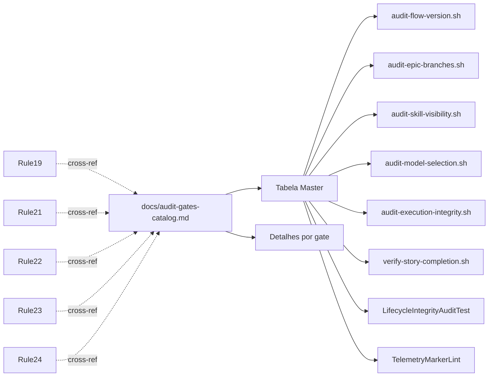

# História: Publicar catálogo canônico `docs/audit-gates-catalog.md`

**ID:** story-0058-0002
**Chave Jira:** —
**Status:** Concluída

## 1. Dependências

| Blocked By | Blocks |
| :--- | :--- |
| story-0058-0001 | — |

## 2. Regras Transversais Aplicáveis

| ID | Título |
| :--- | :--- |
| RULE-001 | Audit Gate Taxonomy |
| RULE-004 | Catalog-before-Add |

## 3. Descrição

Como **reviewer e tech lead**, eu quero um documento único que catalogue todos os gates de governance do repositório (Hook + CI script + Java test + Workflow) com colunas normalizadas, garantindo que eu possa responder "onde um gate roda e qual exit code usa" em segundos e não em 20 minutos de scan cruzado.

Hoje, para entender o conjunto completo de gates, é preciso ler 6 Rules + `.claude/hooks/` + `/scripts/` + 2 classes Java. O catálogo consolida em 1 tabela e vira referência formal exigida por RULE-004 (Catalog-before-Add) — qualquer novo gate precisa ser listado simultaneamente à sua Rule.

### 3.1 Escopo do catálogo

- Indexar **8+ gates existentes** (2 CI scripts existentes + 3 a criar nas stories 0058-0003/4/5 + hook `verify-story-completion.sh` + `LifecycleIntegrityAuditTest.java` + `TelemetryMarkerLint.java` + workflow quando criado em 0058-0008).
- Colunas mínimas: `Nome`, `Camada` (hook/script/java-test/workflow), `Rule`, `Localização`, `Exit Codes`, `Self-check`, `Invocado por`.
- Sections:
  1. Como ler este catálogo (1 parágrafo).
  2. Tabela master (ordenada por Camada → Rule).
  3. Detalhe por gate (1 sub-seção curta por gate, ≤ 10 linhas: propósito + exit codes + link para Rule).
  4. Sinalização: gates referenciados em Rules mas não catalogados = bug.
- Cross-refs de volta de cada Rule alvo (19, 21, 22, 23, 24, 13, 46) para o catálogo via 1 linha no final de cada Rule: `> **Catalogado em:** [docs/audit-gates-catalog.md](...)`.

### 3.2 Integração com Rule 25

Rule 25 §Audit mencionará "a Rule 25 é auditada por consistência com `docs/audit-gates-catalog.md`". Esta história NÃO cria o script que implementa essa auditoria — apenas documenta a expectativa. O audit de consistência fica em scope de story 0058-0005 (audit-skill-visibility.sh poderá ser ampliado — decisão em refinamento).

### 3.3 Impacto

- Novo arquivo: `docs/audit-gates-catalog.md`.
- Edição de 7 arquivos Rule (adicionar linha de cross-ref no rodapé).
- Atualizar `.claude/README.md` para listar o catálogo em seção "Referências".

## 3.5 Entrega de Valor

- **Valor Principal:** reviewers ganham fonte única de verdade sobre gates; RULE-004 ganha mecanismo de enforcement documental (PRs que introduzem gate sem catalogar são bloqueadas na review).
- **Métrica de Sucesso:** catálogo lista ≥ 8 gates em produção; 7 Rules têm cross-ref de volta; smoke test valida que toda Rule com `scripts/audit-*.sh` ou `.claude/hooks/verify-*.sh` tem linha no catálogo.
- **Impacto no Negócio:** redução de tempo médio de review de PRs que tocam Rule/audit estimado em 30%. Documento é também entregável para audit externo (compliance).

## 4. Definições de Qualidade Locais

### DoR Local

- [ ] Rule 25 mergeada (story 0058-0001 concluída).
- [ ] Lista autoritativa dos 8+ gates atuais levantada (scan das Rules 13, 19, 21, 22, 23, 24, 46).

### DoD Local

- [ ] `docs/audit-gates-catalog.md` criado com tabela master + detalhes.
- [ ] 7 Rules atualizadas com linha de cross-ref.
- [ ] `.claude/README.md` atualizado.
- [ ] `CHANGELOG.md` com entry em Added.
- [ ] Smoke test `Epic0058CatalogConsistencySmokeTest` valida: (a) arquivo existe, (b) toda Rule com `scripts/audit-` tem cross-ref, (c) número de linhas da tabela master ≥ 8.
- [ ] `mvn verify` passa.
- [ ] PR targeta `epic/0058`.

### Global DoD

- **Cobertura:** ≥ 95% Line / ≥ 90% Branch (gate aplicado ao smoke test).
- **Testes Automatizados:** `Epic0058CatalogConsistencySmokeTest`.
- **Documentação:** Catálogo + cross-refs + CHANGELOG.
- **Persistência:** N/A.
- **Performance:** N/A.

## 5. Contratos de Dados

### 5.1 Schema da tabela master

| Campo | Tipo | M/O | Validações | Exemplo |
| :--- | :--- | :--- | :--- | :--- |
| `Nome` | String | M | kebab-case; unique | `audit-flow-version.sh` |
| `Camada` | Enum | M | `hook \| ci-script \| java-test \| workflow` | `ci-script` |
| `Rule` | String | M | Pattern `Rule NN` | `Rule 19` |
| `Localização` | String (path) | M | Relativo à raiz repo | `scripts/audit-flow-version.sh` |
| `Exit Codes` | String | M | Lista CSV `0,1,2,3` ou N/A | `0,1,2` |
| `Self-check` | Bool | M | `Sim \| Não \| N/A` | `Sim` |
| `Invocado por` | String | M | Workflow/skill/hook que chama | `.github/workflows/audit.yml` |

### 5.2 Contrato de cross-ref em cada Rule

Linha literal a adicionar no final de cada Rule alvo:

```markdown
---

> **Catalogado em:** [`docs/audit-gates-catalog.md`](../../docs/audit-gates-catalog.md)
```

### 5.3 Error Codes Mapeados

N/A — story de documentação.

## 6. Diagramas

### 6.1 Estrutura do catálogo



## 7. Critérios de Aceite (Gherkin)

```gherkin
Cenario: Catálogo inexistente (degenerate)
  DADO que `docs/audit-gates-catalog.md` não existe
  QUANDO `Epic0058CatalogConsistencySmokeTest` executa
  ENTÃO o teste falha com `CATALOG_MISSING`

Cenario: Catálogo com todos os 8 gates (happy path)
  DADO que `docs/audit-gates-catalog.md` existe com tabela master válida
  E cada uma das 7 Rules tem linha de cross-ref
  QUANDO `Epic0058CatalogConsistencySmokeTest` executa
  ENTÃO o teste passa
  E reporta "8 gates catalogados, 7 Rules cross-referenced"

Cenario: Rule menciona script sem cross-ref (error)
  DADO que `.claude/rules/21-epic-branch-model.md` menciona `scripts/audit-epic-branches.sh`
  MAS não contém linha de cross-ref para o catálogo
  QUANDO o smoke test executa
  ENTÃO o teste falha com `RULE_MISSING_CATALOG_BACKREF: Rule 21`

Cenario: Gate no catálogo mas Rule inexistente (boundary)
  DADO que o catálogo lista `audit-foo.sh` apontando para `Rule 99`
  MAS `Rule 99` não existe no repositório
  QUANDO o smoke test executa
  ENTÃO o teste falha com `CATALOG_DANGLING_RULE_REFERENCE: Rule 99`
```

### 7.1 Scenario Ordering (TPP)

Ordem: catálogo ausente → happy path → Rule sem cross-ref → catálogo aponta Rule inexistente.

### 7.2 Mandatory Scenario Categories

- [x] Degenerate
- [x] Happy path
- [x] Error path
- [x] Boundary

## 8. Tasks

### TASK-0058-0002-001: Criar `docs/audit-gates-catalog.md`

- **Layer:** Doc
- **Test Type:** Smoke
- **Size:** M
- **Dependencies:** —
- **Branch:** `feat/task-0058-0002-001-catalog`
- **Testability:** Migration + Smoke
- **Files:**
  - `docs/audit-gates-catalog.md`
- **Acceptance Criteria:**
  - [ ] Tabela master com ≥ 8 gates
  - [ ] 1 sub-seção detalhe por gate
  - [ ] Colunas conformes Section 5.1

### TASK-0058-0002-002: Adicionar cross-ref nas 7 Rules alvo

- **Layer:** Doc
- **Test Type:** Smoke
- **Size:** S
- **Dependencies:** TASK-0058-0002-001
- **Branch:** `feat/task-0058-0002-002-crossrefs`
- **Testability:** Migration + Smoke
- **Files:**
  - `java/src/main/resources/targets/claude/rules/{13,19,21,22,23,24,46}-*.md`
- **Acceptance Criteria:**
  - [ ] Cada Rule alvo tem linha literal de cross-ref conforme Section 5.2
  - [ ] Goldens regenerados

### TASK-0058-0002-003: Atualizar `.claude/README.md`

- **Layer:** Doc
- **Test Type:** Smoke
- **Size:** S
- **Dependencies:** TASK-0058-0002-001
- **Branch:** `feat/task-0058-0002-003-readme`
- **Testability:** Migration + Smoke
- **Files:**
  - `java/src/main/resources/targets/claude/README.md` (ou equivalente source-of-truth)
- **Acceptance Criteria:**
  - [ ] Seção "Referências" lista catálogo com link

### TASK-0058-0002-004: [Test] Smoke `Epic0058CatalogConsistencySmokeTest`

- **Layer:** Test
- **Test Type:** Smoke
- **Size:** M
- **Dependencies:** TASK-0058-0002-001, TASK-0058-0002-002
- **Branch:** `feat/task-0058-0002-004-smoke-test`
- **Testability:** Config + VerificationTest
- **Files:**
  - `java/src/test/java/dev/iadev/epic0058/Epic0058CatalogConsistencySmokeTest.java`
- **Acceptance Criteria:**
  - [ ] Teste cobre os 4 cenários Gherkin
  - [ ] Cobertura line ≥ 95% / branch ≥ 90%

### TASK-0058-0002-005: Regenerar goldens + CHANGELOG

- **Layer:** Test
- **Test Type:** Smoke
- **Size:** S
- **Dependencies:** TASK-0058-0002-002
- **Branch:** `feat/task-0058-0002-005-golden`
- **Testability:** Migration + Smoke
- **Files:**
  - `java/src/test/resources/golden/**/.claude/rules/*.md` (9 perfis)
  - `CHANGELOG.md`
- **Acceptance Criteria:**
  - [ ] `GoldenFileRegenerator` limpo
  - [ ] `mvn verify` passa
  - [ ] CHANGELOG entry
