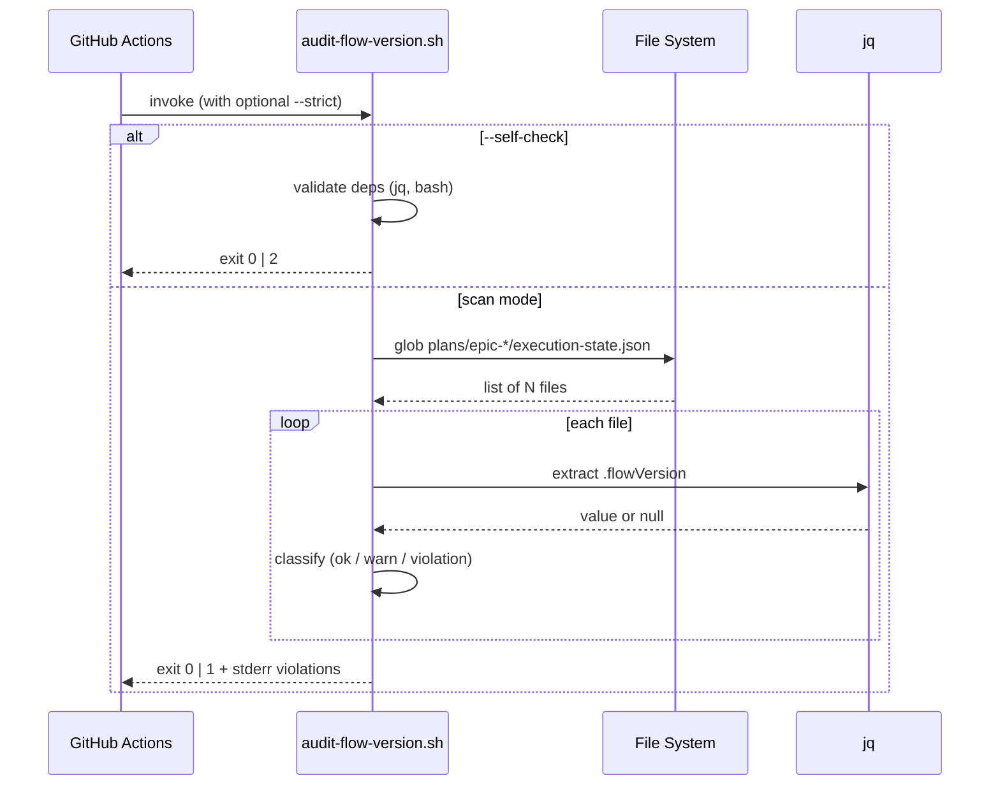

# História: Implementar `scripts/audit-flow-version.sh` (Rule 19)

**ID:** story-0058-0003
**Chave Jira:** —
**Status:** Pendente

## 1. Dependências

| Blocked By | Blocks |
| :--- | :--- |
| story-0058-0001 | story-0058-0006 |

## 2. Regras Transversais Aplicáveis

| ID | Título |
| :--- | :--- |
| RULE-001 | Audit Gate Taxonomy |
| RULE-002 | Audit Script Naming & Exit Codes |
| RULE-003 | Generation Parity |

## 3. Descrição

Como **engenheiro de CI**, eu quero um script bash `audit-flow-version.sh` que valide o campo `flowVersion` em todos os `plans/epic-*/execution-state.json`, garantindo que a Rule 19 (Backward Compatibility) pare de referenciar um script fantasma e que PRs introduzindo divergência de `flowVersion` sejam bloqueadas automaticamente.

Rule 19 linha 103 cita "CI script `scripts/audit-flow-version.sh` (or equivalent)" como mecanismo de enforcement — mas o script nunca foi implementado. Esta história fecha o gap entregando: (a) o script com fallback matrix completo, (b) fixtures de teste cobrindo os 4 casos de `flowVersion` (absente, `"1"`, `"2"`, inválido), (c) flag `--self-check` para auto-validação. Localização inicial: `/scripts/` (consistente com scripts existentes); na story 0058-0006 o mesmo arquivo será migrado para source-of-truth.

### 3.1 Comportamento esperado

1. Scanear `plans/epic-*/execution-state.json` (glob).
2. Para cada arquivo, extrair o campo `flowVersion` via `jq` (fallback `grep` se `jq` ausente).
3. Aplicar a fallback matrix da Rule 19:
   - Campo ausente → warning + exit não-zero se modo `--strict`; caso contrário warning apenas.
   - `"1"` ou `"2"` → OK silent.
   - Outro valor → exit 1 com código `FLOW_VERSION_VIOLATION`.
4. Modos:
   - default: warning para ausente, fail para inválido.
   - `--strict`: fail também para ausente.
   - `--self-check`: verifica apenas que o script é executável, deps disponíveis, e imprime versão/usage; exit 0 sempre que íntegro.
5. Output: 1 linha por violation em stderr, total sumarizado em stdout.

### 3.2 Estrutura do script

```bash
#!/usr/bin/env bash
set -euo pipefail

SELF_CHECK=0
STRICT=0
while [[ $# -gt 0 ]]; do
  case "$1" in
    --self-check) SELF_CHECK=1; shift ;;
    --strict) STRICT=1; shift ;;
    -h|--help) usage; exit 0 ;;
    *) echo "unknown arg: $1" >&2; exit 2 ;;
  esac
done

if [[ $SELF_CHECK -eq 1 ]]; then
  self_check && exit 0 || exit 2
fi

# main scan loop...
```

### 3.3 Fixtures

- `scripts/fixtures/audit-flow-version/valid-v1.json` — `flowVersion: "1"`.
- `scripts/fixtures/audit-flow-version/valid-v2.json` — `flowVersion: "2"`.
- `scripts/fixtures/audit-flow-version/missing.json` — campo ausente.
- `scripts/fixtures/audit-flow-version/invalid.json` — `flowVersion: "3"`.
- `scripts/fixtures/audit-flow-version/README.md` — descrição de uso dos fixtures em CI.

## 3.5 Entrega de Valor

- **Valor Principal:** Rule 19 passa a referenciar um script real; divergências de `flowVersion` detectadas automaticamente em toda PR.
- **Métrica de Sucesso:** script existe em `/scripts/`, executa `--self-check` em < 1s com exit 0, workflow CI (story 0058-0008) o invoca; zero referências a "script fantasma" em audit-catalog.
- **Impacto no Negócio:** bloqueio preventivo de regressão silenciosa documentada na Rule 19 — incidentes do tipo "flowVersion inconsistente pós-merge" vão a zero.

## 4. Definições de Qualidade Locais

### DoR Local

- [ ] Rule 25 publicada (naming e exit codes formalizados).
- [ ] `jq` disponível no runner CI (confirmar `.github/workflows/`).

### DoD Local

- [ ] `scripts/audit-flow-version.sh` criado, executável (`chmod +x`).
- [ ] `scripts/fixtures/audit-flow-version/` com 4 JSONs + README.
- [ ] Suite bats (`scripts/tests/audit-flow-version.bats` ou equivalente — shunit2/bash-tap) validando cenários Gherkin.
- [ ] `--self-check` exit 0 verde.
- [ ] `bash -n audit-flow-version.sh` + `shellcheck` passam sem warning.
- [ ] `CHANGELOG.md` entry em Added.
- [ ] PR targeta `epic/0058`.

### Global DoD

- **Cobertura:** cobertura medida via `bashcov` ou equivalente no script ≥ 90% das linhas exercidas pelos fixtures.
- **Testes Automatizados:** bats/shunit2 com ≥ 4 cenários; smoke integration via `mvn verify` registrando invocação do script.
- **Documentação:** header do script com descrição, usage, exit codes.

## 5. Contratos de Dados

### 5.1 CLI contract

| Campo | Formato | Request | Response | Origem/Regra |
| :--- | :--- | :--- | :--- | :--- |
| `--strict` | flag | opcional | altera severidade de `MISSING` | Rule 19 fallback matrix |
| `--self-check` | flag | opcional | retorna sanity-check exit 0/2 | Rule 25 §self-check |
| stdin | — | — | — | script não lê stdin |
| stdout | texto | — | sumário `checked N files, violations: M` | convenção |
| stderr | texto | — | 1 linha por violação: `<file>: <error_code>: <detail>` | convenção |

### 5.2 Response (exit codes)

| Exit | Código nomeado | Condição |
| :--- | :--- | :--- |
| 0 | OK | Todos os arquivos conformes ou apenas warnings em modo não-strict |
| 1 | `FLOW_VERSION_VIOLATION` | ≥ 1 arquivo com `flowVersion` inválido |
| 1 | `FLOW_VERSION_MISSING_STRICT` | ≥ 1 arquivo sem `flowVersion` em modo `--strict` |
| 2 | `DEPENDENCY_MISSING` | `jq` ausente e fallback grep falhou |
| 2 | `INVALID_ARGS` | Flag desconhecida |

### 5.3 Error Codes Mapeados (stderr format)

```
<path/to/execution-state.json>: FLOW_VERSION_VIOLATION: flowVersion="3" not in {1,2}
<path/to/execution-state.json>: FLOW_VERSION_MISSING: expected "1" or "2", field absent (warning)
```

## 6. Diagramas

### 6.1 Fluxo do script



## 7. Critérios de Aceite (Gherkin)

```gherkin
Cenario: Script ausente no filesystem (degenerate)
  DADO que `scripts/audit-flow-version.sh` não existe
  QUANDO `ls scripts/audit-flow-version.sh` é executado
  ENTÃO exit code é 2
  E `.claude/rules/19-backward-compatibility.md:103` permanece citando script fantasma

Cenario: Todos os execution-state.json válidos (happy path)
  DADO que existem `plans/epic-0049/execution-state.json` com `flowVersion="2"`
  E `plans/epic-0048/execution-state.json` com `flowVersion="1"`
  QUANDO `scripts/audit-flow-version.sh` executa
  ENTÃO exit code é 0
  E stdout contém `checked 2 files, violations: 0`

Cenario: Arquivo com flowVersion inválido (error)
  DADO que `plans/epic-0050/execution-state.json` tem `flowVersion="3"`
  QUANDO `scripts/audit-flow-version.sh` executa
  ENTÃO exit code é 1
  E stderr contém `FLOW_VERSION_VIOLATION: flowVersion="3" not in {1,2}`

Cenario: Arquivo sem flowVersion em modo strict (boundary)
  DADO que `plans/epic-0045/execution-state.json` não tem campo `flowVersion`
  QUANDO `scripts/audit-flow-version.sh --strict` executa
  ENTÃO exit code é 1
  E stderr contém `FLOW_VERSION_MISSING_STRICT`

Cenario: Self-check com jq disponível (boundary)
  DADO que `jq` está no PATH
  QUANDO `scripts/audit-flow-version.sh --self-check` executa
  ENTÃO exit code é 0
  E stdout contém `audit-flow-version.sh: OK (version ..., deps ok)`
```

### 7.1 Scenario Ordering (TPP)

Degenerate (script ausente) → happy path (todos válidos) → error (inválido) → boundary strict → boundary self-check.

### 7.2 Mandatory Scenario Categories

- [x] Degenerate
- [x] Happy path
- [x] Error path
- [x] Boundary (strict + self-check)

## 8. Tasks

### TASK-0058-0003-001: Implementar `scripts/audit-flow-version.sh`

- **Layer:** Adapter (bash script como output adapter de CI)
- **Test Type:** Integration
- **Size:** M
- **Dependencies:** —
- **Branch:** `feat/task-0058-0003-001-script`
- **Testability:** Port + Adapter + IT (adapter = bash, IT = bats)
- **Files:**
  - `scripts/audit-flow-version.sh`
- **Acceptance Criteria:**
  - [ ] Shebang + `set -euo pipefail`
  - [ ] Implementa `--strict`, `--self-check`, `-h/--help`
  - [ ] Exit codes conforme Section 5.2
  - [ ] Header com descrição de uso

### TASK-0058-0003-002: Fixtures de teste

- **Layer:** Test
- **Test Type:** Integration
- **Size:** S
- **Dependencies:** —
- **Branch:** `feat/task-0058-0003-002-fixtures`
- **Testability:** Config + VerificationTest
- **Files:**
  - `scripts/fixtures/audit-flow-version/valid-v1.json`
  - `scripts/fixtures/audit-flow-version/valid-v2.json`
  - `scripts/fixtures/audit-flow-version/missing.json`
  - `scripts/fixtures/audit-flow-version/invalid.json`
  - `scripts/fixtures/audit-flow-version/README.md`
- **Acceptance Criteria:**
  - [ ] 4 JSONs válidos + README

### TASK-0058-0003-003: [Test] Suite bats/shunit2

- **Layer:** Test
- **Test Type:** Integration
- **Size:** M
- **Dependencies:** TASK-0058-0003-001, TASK-0058-0003-002
- **Branch:** `feat/task-0058-0003-003-bats`
- **Testability:** Port + Adapter + IT
- **Files:**
  - `scripts/tests/audit-flow-version.bats`
- **Acceptance Criteria:**
  - [ ] Cobre os 5 cenários Gherkin
  - [ ] Fail-fast em asserts

### TASK-0058-0003-004: [Test] Smoke test Java integrando script

- **Layer:** Test
- **Test Type:** Smoke
- **Size:** S
- **Dependencies:** TASK-0058-0003-001
- **Branch:** `feat/task-0058-0003-004-smoke`
- **Testability:** Config + VerificationTest
- **Files:**
  - `java/src/test/java/dev/iadev/epic0058/AuditFlowVersionSmokeTest.java`
- **Acceptance Criteria:**
  - [ ] Invoca o script via `ProcessBuilder`
  - [ ] Valida exit 0 com fixtures válidos; exit 1 com inválido

### TASK-0058-0003-005: CHANGELOG + header do script

- **Layer:** Doc
- **Test Type:** Smoke
- **Size:** S
- **Dependencies:** TASK-0058-0003-001
- **Branch:** `feat/task-0058-0003-005-doc`
- **Testability:** Migration + Smoke
- **Files:**
  - `CHANGELOG.md`
- **Acceptance Criteria:**
  - [ ] Entry em Added
