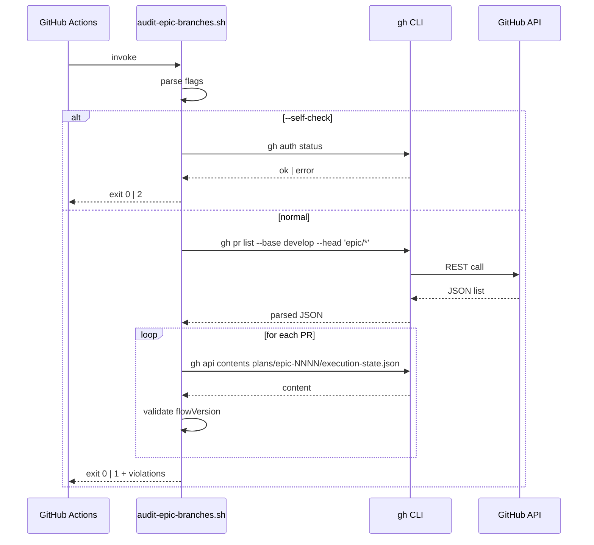

# História: Implementar `scripts/audit-epic-branches.sh` (Rule 21)

**ID:** story-0058-0004
**Chave Jira:** —
**Status:** Pendente

## 1. Dependências

| Blocked By | Blocks |
| :--- | :--- |
| story-0058-0001 | story-0058-0006 |

## 2. Regras Transversais Aplicáveis

| ID | Título |
| :--- | :--- |
| RULE-001 | Audit Gate Taxonomy |
| RULE-002 | Audit Script Naming & Exit Codes |
| RULE-003 | Generation Parity |

## 3. Descrição

Como **release manager**, eu quero um script bash `audit-epic-branches.sh` que valide o estado de PRs abertos `epic/* → develop`, garantindo que a Rule 21 (Epic Branch Model) tenha enforcement de CI em vez de apenas documentação; o script detecta violações como `flowVersion` inconsistente em PR de epic, force-push após primeiro merge, e branches `epic/*` órfãs sem PR aberto.

Rule 21 linha 71 cita "CI script `scripts/audit-epic-branches.sh` (or equivalent)" mas o script nunca foi implementado. Esta história entrega o script com 3 verificações independentes, fixtures mockando resposta de `gh pr list`, e flag `--self-check`.

### 3.1 Verificações

1. **`flowVersion` consistency.** Para cada PR aberto com base `develop` e head `epic/*`, extrair `plans/epic-XXXX/execution-state.json` do head commit (via `gh api`) e validar que `flowVersion == "2"` (ou `"1"` se houver evidência de `--legacy-flow` em `plans/epic-XXXX/execution-state.json` metadata).
2. **No force-push after merge.** Para cada branch `epic/*` com ≥ 1 merge commit incorporado, validar ausência de force-push posterior via `git reflog` (ou `gh api /repos/:owner/:repo/branches/:branch`).
3. **Orphan branch detection.** Branches `epic/*` locais sem PR aberto no origin por > 7 dias são flagadas como orphan (warning — não falha exit).

### 3.2 Integração `gh` CLI

- Pré-requisito: `gh auth status` OK.
- Fallback: se `gh` ausente, exit 2 com `GH_CLI_MISSING`.
- Queries:
  - `gh pr list --base develop --head 'epic/*' --json number,headRefName --state open` (o campo `flowVersion` NÃO é suportado por `gh pr list`; será obtido exclusivamente do arquivo no head commit).
  - `gh api` para ler `plans/epic-XXXX/execution-state.json` no head commit de cada PR e extrair `flowVersion`.
  - `gh api repos/:owner/:repo/branches/epic/NNNN` para cada branch ativa.

### 3.3 Flags

- `--strict`: orphan detection vira fail em vez de warning.
- `--self-check`: sanity check (gh instalado, autenticado, jq presente) — exit 0 se OK.
- `--skip-orphan-check`: pula verificação 3 (útil localmente).
- `-h | --help`: usage.

## 3.5 Entrega de Valor

- **Valor Principal:** Rule 21 ganha enforcement real; regressões de `flowVersion` em PRs epic são detectadas antes de merge; force-pushes silenciosos em `epic/*` com histórico de merges viram audit alert.
- **Métrica de Sucesso:** script `--self-check` exit 0 em < 2s; fixtures mockam 3 casos (PR OK, flowVersion errado, branch órfã) e o script responde com os exit codes corretos.
- **Impacto no Negócio:** reduz risco de perda silenciosa de story PRs (bug historicamente observado em EPIC-0049 pre-Rule-21).

## 4. Definições de Qualidade Locais

### DoR Local

- [ ] Rule 25 publicada.
- [ ] `gh` CLI disponível no runner CI (confirmar `.github/workflows/`).

### DoD Local

- [ ] `scripts/audit-epic-branches.sh` criado e executável.
- [ ] `scripts/fixtures/audit-epic-branches/` com 3 fixtures de resposta `gh` (mock) + README.
- [ ] Suite bats com 4+ cenários.
- [ ] `--self-check` exit 0.
- [ ] `shellcheck` limpo.
- [ ] CHANGELOG entry.
- [ ] PR targeta `epic/0058`.

### Global DoD

- **Cobertura:** cobertura de linhas ≥ 90% exercidas pelos fixtures.
- **Testes Automatizados:** bats + smoke Java test.
- **Documentação:** header + usage.

## 5. Contratos de Dados

### 5.1 CLI contract

| Campo | Formato | Request | Response | Origem/Regra |
| :--- | :--- | :--- | :--- | :--- |
| `--strict` | flag | opcional | orphan vira fail | Rule 21 invariant 2 |
| `--self-check` | flag | opcional | sanity check | Rule 25 §self-check |
| `--skip-orphan-check` | flag | opcional | pula verificação 3 | conveniência local |

### 5.2 Exit codes

| Exit | Código | Condição |
| :--- | :--- | :--- |
| 0 | OK | Todas verificações passam (ou apenas warnings) |
| 1 | `EPIC_BRANCH_VIOLATION` | ≥ 1 PR com flowVersion divergente |
| 1 | `EPIC_BRANCH_FORCE_PUSHED` | Force-push detectado após merge |
| 1 | `EPIC_BRANCH_ORPHAN_STRICT` | Branch órfã em modo `--strict` |
| 2 | `GH_CLI_MISSING` | `gh` ausente ou não autenticado |
| 2 | `INVALID_ARGS` | Flag desconhecida |

### 5.3 Response format (stderr)

```
PR #NNN (epic/0049 -> develop): EPIC_BRANCH_VIOLATION: flowVersion="1" but epic/0049 is not --legacy-flow
epic/0047: EPIC_BRANCH_FORCE_PUSHED: force-push detected at commit abc123 after merge of PR #NNN
epic/0045: EPIC_BRANCH_ORPHAN: no open PR targeting develop, last activity 14 days ago (warning)
```

## 6. Diagramas

### 6.1 Fluxo do script



## 7. Critérios de Aceite (Gherkin)

```gherkin
Cenario: Script ausente (degenerate)
  DADO que `scripts/audit-epic-branches.sh` não existe
  QUANDO CI invoca o gate
  ENTÃO o CI falha com "script not found"
  E Rule 21 linha 71 permanece fantasma

Cenario: Dois PRs epic válidos (happy path)
  DADO que PR #100 epic/0058 tem execution-state.json com flowVersion="2"
  E PR #101 epic/0057 tem flowVersion="2"
  E nenhuma branch tem force-push após merge
  QUANDO `scripts/audit-epic-branches.sh` executa
  ENTÃO exit code é 0
  E stdout contém `2 PRs validated, 0 violations`

Cenario: PR com flowVersion inconsistente (error)
  DADO que PR #102 epic/0056 tem flowVersion="1" sem flag --legacy-flow
  QUANDO o script executa
  ENTÃO exit code é 1
  E stderr contém `EPIC_BRANCH_VIOLATION: flowVersion="1" but epic/0056 is not --legacy-flow`

Cenario: Force-push detectado (boundary)
  DADO que epic/0055 tem merge commit de PR #103 em `abc123`
  E o HEAD atual `def456` não descende de `abc123`
  QUANDO o script executa
  ENTÃO exit code é 1
  E stderr contém `EPIC_BRANCH_FORCE_PUSHED`

Cenario: gh CLI ausente (boundary)
  DADO que `gh` não está no PATH
  QUANDO `scripts/audit-epic-branches.sh --self-check` executa
  ENTÃO exit code é 2
  E stderr contém `GH_CLI_MISSING`
```

### 7.1 Scenario Ordering (TPP)

Degenerate → happy path → error → boundary force-push → boundary dep missing.

### 7.2 Mandatory Scenario Categories

- [x] Degenerate
- [x] Happy path
- [x] Error path (flowVersion inconsistente)
- [x] Boundary (force-push, deps)

## 8. Tasks

### TASK-0058-0004-001: Implementar `scripts/audit-epic-branches.sh`

- **Layer:** Adapter
- **Test Type:** Integration
- **Size:** L
- **Dependencies:** —
- **Branch:** `feat/task-0058-0004-001-script`
- **Testability:** Port + Adapter + IT
- **Files:**
  - `scripts/audit-epic-branches.sh`
- **Acceptance Criteria:**
  - [ ] 3 verificações independentes implementadas
  - [ ] Flags `--strict`, `--self-check`, `--skip-orphan-check`
  - [ ] Exit codes conforme Section 5.2

### TASK-0058-0004-002: Fixtures (mock `gh` responses)

- **Layer:** Test
- **Test Type:** Integration
- **Size:** M
- **Dependencies:** —
- **Branch:** `feat/task-0058-0004-002-fixtures`
- **Testability:** Config + VerificationTest
- **Files:**
  - `scripts/fixtures/audit-epic-branches/pr-list-ok.json`
  - `scripts/fixtures/audit-epic-branches/pr-list-violation.json`
  - `scripts/fixtures/audit-epic-branches/branch-force-pushed.json`
  - `scripts/fixtures/audit-epic-branches/README.md`
- **Acceptance Criteria:**
  - [ ] 3 fixtures válidos
  - [ ] README descreve como injetar via `GH_CLI_STUB`

### TASK-0058-0004-003: [Test] Suite bats

- **Layer:** Test
- **Test Type:** Integration
- **Size:** M
- **Dependencies:** TASK-0058-0004-001, TASK-0058-0004-002
- **Branch:** `feat/task-0058-0004-003-bats`
- **Testability:** Port + Adapter + IT
- **Files:**
  - `scripts/tests/audit-epic-branches.bats`
- **Acceptance Criteria:**
  - [ ] 5 cenários cobertos
  - [ ] Stub de `gh` via PATH override

### TASK-0058-0004-004: [Test] Smoke Java

- **Layer:** Test
- **Test Type:** Smoke
- **Size:** S
- **Dependencies:** TASK-0058-0004-001
- **Branch:** `feat/task-0058-0004-004-smoke`
- **Testability:** Config + VerificationTest
- **Files:**
  - `java/src/test/java/dev/iadev/epic0058/AuditEpicBranchesSmokeTest.java`
- **Acceptance Criteria:**
  - [ ] Invoca `--self-check` e valida exit 0

### TASK-0058-0004-005: CHANGELOG

- **Layer:** Doc
- **Test Type:** Smoke
- **Size:** S
- **Dependencies:** TASK-0058-0004-001
- **Branch:** `feat/task-0058-0004-005-doc`
- **Testability:** Migration + Smoke
- **Files:**
  - `CHANGELOG.md`
- **Acceptance Criteria:**
  - [ ] Entry em Added
