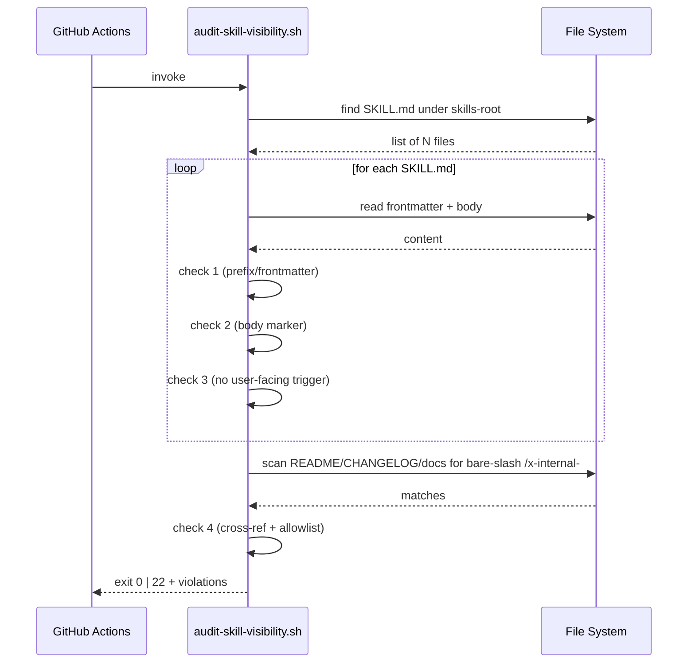

# História: Implementar `scripts/audit-skill-visibility.sh` (Rule 22)

**ID:** story-0058-0005
**Chave Jira:** —
**Status:** Concluída

## 1. Dependências

| Blocked By | Blocks |
| :--- | :--- |
| story-0058-0001 | story-0058-0006 |

## 2. Regras Transversais Aplicáveis

| ID | Título |
| :--- | :--- |
| RULE-001 | Audit Gate Taxonomy |
| RULE-002 | Audit Script Naming & Exit Codes |
| RULE-003 | Generation Parity |
| RULE-004 | Catalog-before-Add |

## 3. Descrição

Como **mantenedor do catálogo de skills**, eu quero um script bash `audit-skill-visibility.sh` que valide a convenção `x-internal-*` (Rule 22) em toda SKILL.md da source-of-truth, garantindo que violações de visibility (skill internal sem prefixo, frontmatter sem `visibility: internal`, body sem marker 🔒, cross-ref em docs user-facing) sejam detectadas automaticamente em PR.

Rule 22 linha 76 cita o script como `CI script` com exit code `SKILL_VISIBILITY_VIOLATION` (exit 22 — convenção do script em si, note: Rule 22 usa exit 22 por coincidência numérica, não pela Rule 02). Script nunca foi implementado. Esta história entrega o script com 4 checks, fixtures cobrindo pass/fail, flag `--self-check`.

### 3.1 Checks implementados (espelha Rule 22 §Audit Script)

1. **Prefix/frontmatter consistency.** Para cada `SKILL.md` sob `java/src/main/resources/targets/claude/skills/`, se o path contém `x-internal-`, o frontmatter DEVE ter `visibility: internal` + `user-invocable: false`. Conversamente, `visibility: internal` só em paths `x-internal-*`.
2. **Body marker present.** SKILLs internal DEVEM conter `🔒 **INTERNAL SKILL**` nas primeiras 10 linhas do corpo.
3. **No user-facing trigger.** Seção `## Triggers` de skills internal NÃO DEVE listar bare-slash commands.
4. **No cross-reference in user-facing docs.** README.md, CHANGELOG.md, e qualquer arquivo sob `docs/` NÃO DEVEM conter slash `/x-internal-` em prosa (exceto audit/migration docs que descrevem a convenção).

### 3.2 Flags

- `--skills-root <path>`: override da raiz de skills (default `java/src/main/resources/targets/claude/skills/`).
- `--fix`: para check (3) e (4), re-escreve arquivos automaticamente removendo bare-slash comentando-os (dangerous — exige confirmação `--yes`).
- `--self-check`: sanity (grep, bash, file presence).
- `-h | --help`.

### 3.3 Estrutura de escape

A Rule 22 permite cross-reference em "audit/migration docs explicitly describing the convention". O script detecta via allowlist (linha contendo `<!-- audit-exempt -->` acima da menção, ou arquivo listado em `audits/skill-visibility-allowlist.txt`).

## 3.5 Entrega de Valor

- **Valor Principal:** Rule 22 ganha enforcement CI; convenção `x-internal-*` autogerida sem precisar de review manual por arquivo. Fecha o último dos 3 gaps de scripts fantasmas.
- **Métrica de Sucesso:** script detecta violações introduzidas artificialmente em fixtures (4 cenários). `mvn verify` integra smoke test. Zero scripts fantasmas referenciados em Rules.
- **Impacto no Negócio:** protege a convenção contra drift em PRs futuros; skills extraídas por engineering team sem o prefixo correto viram CI fail em vez de passar silenciosamente.

## 4. Definições de Qualidade Locais

### DoR Local

- [ ] Rule 25 publicada.
- [ ] `grep -rE`, `awk` no PATH (padrão em `ubuntu-latest`).

### DoD Local

- [ ] `scripts/audit-skill-visibility.sh` criado, executável.
- [ ] `scripts/fixtures/audit-skill-visibility/` com 4 fixtures (pass + 3 falhas distintas).
- [ ] Suite bats com 5+ cenários.
- [ ] `--self-check` verde.
- [ ] `shellcheck` limpo.
- [ ] CHANGELOG entry.

### Global DoD

- **Cobertura:** ≥ 90% linhas script exercidas.
- **Testes Automatizados:** bats + smoke Java.
- **Documentação:** header + usage + exit codes.

## 5. Contratos de Dados

### 5.1 CLI contract

| Campo | Formato | Request | Response | Origem/Regra |
| :--- | :--- | :--- | :--- | :--- |
| `--skills-root <path>` | arg | opcional | altera raiz de scan | conveniência local |
| `--fix` | flag | opcional | re-escreve arquivos (require `--yes`) | opt-in destructive |
| `--yes` | flag | opcional | confirma `--fix` | guard |
| `--self-check` | flag | opcional | sanity | Rule 25 |

### 5.2 Exit codes

| Exit | Código | Condição |
| :--- | :--- | :--- |
| 0 | OK | Zero violações |
| 22 | `SKILL_VISIBILITY_VIOLATION` | ≥ 1 violação em check 1/2/3/4 (exit 22 legacy Rule 22) |
| 2 | `DEPENDENCY_MISSING` | grep/awk ausentes |
| 2 | `INVALID_ARGS` | flag desconhecida |
| 3 | `ALLOWLIST_CORRUPT` | `audits/skill-visibility-allowlist.txt` malformed |

### 5.3 Error format (stderr)

```
<file>: VISIBILITY_PREFIX_INCONSISTENCY: path contains x-internal- but frontmatter visibility != internal
<file>: VISIBILITY_MARKER_MISSING: path is x-internal-* but body lacks "🔒 **INTERNAL SKILL**" in first 10 lines
<file>: VISIBILITY_TRIGGER_FORBIDDEN: x-internal-* skill has bare-slash trigger "/x-internal-foo" in ## Triggers
<file>: VISIBILITY_CROSSREF_FORBIDDEN: user-facing doc mentions /x-internal- (no audit-exempt marker)
```

## 6. Diagramas

### 6.1 Fluxo



## 7. Critérios de Aceite (Gherkin)

```gherkin
Cenario: Script ausente (degenerate)
  DADO que `scripts/audit-skill-visibility.sh` não existe
  QUANDO CI invoca o gate
  ENTÃO CI falha com "script not found"

Cenario: 20 skills válidas (happy path)
  DADO que source-of-truth tem 15 public skills + 5 internal skills conformes
  QUANDO o script executa
  ENTÃO exit code é 0
  E stdout contém `scanned 20 SKILL.md, violations: 0`

Cenario: Skill internal sem marker (error check 2)
  DADO que `skills/core/internal/ops/x-internal-foo/SKILL.md` tem frontmatter correto
  MAS o corpo não contém `🔒 **INTERNAL SKILL**` nas primeiras 10 linhas
  QUANDO o script executa
  ENTÃO exit code é 22
  E stderr contém `VISIBILITY_MARKER_MISSING`

Cenario: Skill public com visibility: internal (error check 1 conversa)
  DADO que `skills/core/dev/x-foo/SKILL.md` (path sem x-internal-) tem `visibility: internal`
  QUANDO o script executa
  ENTÃO exit code é 22
  E stderr contém `VISIBILITY_PREFIX_INCONSISTENCY`

Cenario: README menciona /x-internal- sem allowlist (error check 4)
  DADO que `README.md` tem prosa `run /x-internal-status-update manually`
  E a linha não tem `<!-- audit-exempt -->`
  QUANDO o script executa
  ENTÃO exit code é 22
  E stderr contém `VISIBILITY_CROSSREF_FORBIDDEN`

Cenario: Allowlist corrompida (boundary)
  DADO que `audits/skill-visibility-allowlist.txt` tem linha sem `#` de comentário
  QUANDO o script executa
  ENTÃO exit code é 3
  E stderr contém `ALLOWLIST_CORRUPT`
```

### 7.1 Scenario Ordering (TPP)

Degenerate → happy path → error (check 2) → error (check 1 conversa) → error (check 4) → boundary (allowlist).

### 7.2 Mandatory Scenario Categories

- [x] Degenerate
- [x] Happy path
- [x] Error path (múltiplos checks)
- [x] Boundary (allowlist)

## 8. Tasks

### TASK-0058-0005-001: Implementar script

- **Layer:** Adapter
- **Test Type:** Integration
- **Size:** L
- **Dependencies:** —
- **Branch:** `feat/task-0058-0005-001-script`
- **Testability:** Port + Adapter + IT
- **Files:**
  - `scripts/audit-skill-visibility.sh`
- **Acceptance Criteria:**
  - [ ] 4 checks implementados
  - [ ] Flags completas
  - [ ] Exit 22 para violações (legacy Rule 22)

### TASK-0058-0005-002: Fixtures

- **Layer:** Test
- **Test Type:** Integration
- **Size:** M
- **Dependencies:** —
- **Branch:** `feat/task-0058-0005-002-fixtures`
- **Testability:** Config + VerificationTest
- **Files:**
  - `scripts/fixtures/audit-skill-visibility/pass/**`
  - `scripts/fixtures/audit-skill-visibility/fail-prefix/**`
  - `scripts/fixtures/audit-skill-visibility/fail-marker/**`
  - `scripts/fixtures/audit-skill-visibility/fail-crossref/README.md`
  - `scripts/fixtures/audit-skill-visibility/README.md`
- **Acceptance Criteria:**
  - [ ] 4 árvores de fixture completas

### TASK-0058-0005-003: Allowlist inicial

- **Layer:** Config
- **Test Type:** Verification
- **Size:** S
- **Dependencies:** TASK-0058-0005-001
- **Branch:** `feat/task-0058-0005-003-allowlist`
- **Testability:** Config + VerificationTest
- **Files:**
  - `audits/skill-visibility-allowlist.txt`
- **Acceptance Criteria:**
  - [ ] Lista inicial com arquivos de audit/migration legítimos
  - [ ] Header documentando convenção

### TASK-0058-0005-004: [Test] Suite bats

- **Layer:** Test
- **Test Type:** Integration
- **Size:** M
- **Dependencies:** TASK-0058-0005-001, TASK-0058-0005-002
- **Branch:** `feat/task-0058-0005-004-bats`
- **Testability:** Port + Adapter + IT
- **Files:**
  - `scripts/tests/audit-skill-visibility.bats`
- **Acceptance Criteria:**
  - [ ] 6 cenários cobertos

### TASK-0058-0005-005: [Test] Smoke Java

- **Layer:** Test
- **Test Type:** Smoke
- **Size:** S
- **Dependencies:** TASK-0058-0005-001
- **Branch:** `feat/task-0058-0005-005-smoke`
- **Testability:** Config + VerificationTest
- **Files:**
  - `java/src/test/java/dev/iadev/epic0058/AuditSkillVisibilitySmokeTest.java`
- **Acceptance Criteria:**
  - [ ] Exit 0 para `--self-check`
  - [ ] Exit 22 quando fixture `fail-marker` apontada via `--skills-root`

### TASK-0058-0005-006: CHANGELOG

- **Layer:** Doc
- **Test Type:** Smoke
- **Size:** S
- **Dependencies:** TASK-0058-0005-001
- **Branch:** `feat/task-0058-0005-006-doc`
- **Testability:** Migration + Smoke
- **Files:**
  - `CHANGELOG.md`
- **Acceptance Criteria:**
  - [ ] Entry em Added
