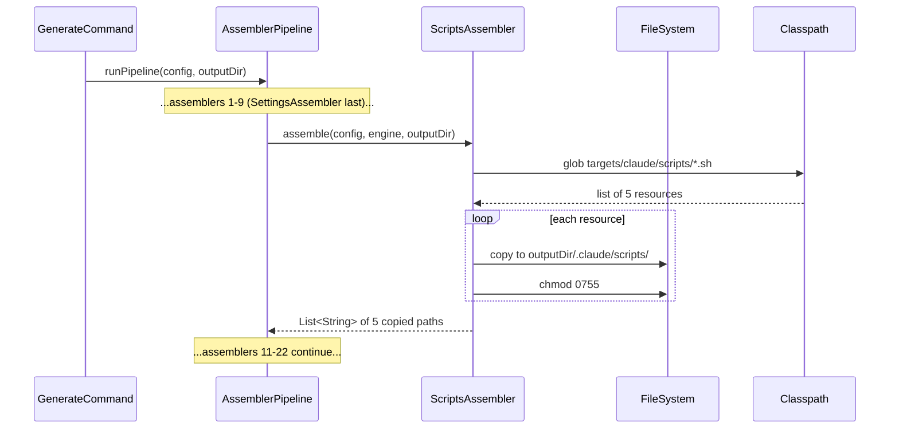

# História: Criar `ScriptsAssembler` + source-of-truth de scripts

**ID:** story-0058-0006
**Chave Jira:** —
**Status:** Pendente

## 1. Dependências

| Blocked By | Blocks |
| :--- | :--- |
| story-0058-0003, story-0058-0004, story-0058-0005 | story-0058-0007 |

## 2. Regras Transversais Aplicáveis

| ID | Título |
| :--- | :--- |
| RULE-001 | Audit Gate Taxonomy |
| RULE-003 | Generation Parity |
| RULE-005 | Backward Compatibility |

## 3. Descrição

Como **mantenedor do pipeline `ia-dev-env`**, eu quero um novo `ScriptsAssembler` que leia scripts de auditoria em `java/src/main/resources/targets/claude/scripts/` (source-of-truth) e os copie para `.claude/scripts/` no output (projeto gerado) com bit executável, garantindo que projetos criados pelo `ia-dev-env` herdem os 5 gates CI e que o próprio repositório do gerador tenha a mesma geração via seu próprio pipeline de build.

Hoje nenhum script é gerado — os 2 existentes (`audit-model-selection.sh`, `audit-execution-integrity.sh`) vivem apenas em `/scripts/` raiz. Esta história muda isso: os 5 scripts (2 existentes + 3 criados em stories 0058-0003/4/5) são movidos para source-of-truth, e o assembler passa a gerar tanto os 9 perfis golden quanto o `.claude/scripts/` de cada projeto futuro.

### 3.1 Localizações

| Artefato | Origem | Destino | Responsável |
| :--- | :--- | :--- | :--- |
| Source-of-truth | `java/src/main/resources/targets/claude/scripts/audit-*.sh` | (lido por assembler) | Esta história cria/move |
| Output projeto gerado | — | `<project>/.claude/scripts/*.sh` | `ScriptsAssembler` |
| Golden files | — | `java/src/test/resources/golden/{profile}/.claude/scripts/*.sh` | Story 0058-0007 regenera |
| Raiz repo (compatibilidade) | — | `/scripts/*.sh` | Post-build step (Maven exec plugin) ou symlink documentado |

### 3.2 Implementação

- Classe `ScriptsAssembler` em `dev.iadev.application.assembler`.
- Implementa `Assembler` interface (existente).
- Lê do classloader `targets/claude/scripts/**.sh` recursivamente.
- Copia para `<outputDir>/.claude/scripts/` preservando estrutura.
- Define `chmod +x` via `Files.setPosixFilePermissions` quando filesystem suporta; fallback silent em Windows.
- Retorna lista de paths copiados (contract de `Assembler.assemble`).

### 3.3 Registro no pipeline

- Adicionar `ScriptsAssembler` em `AssemblerFactory.java`:
  - Plataforma: `CLAUDE_CODE`.
  - Ordem: **entre `SettingsAssembler` (pos. 9) e `DocsAssembler` (pos. 10)** — conceitualmente faz parte do Claude Config.
  - Nova categoria opcional (posição 9.5) OU adicionado à categoria existente; decisão de design em refinamento.

### 3.4 Backward compatibility

- Os 2 scripts movidos (`audit-model-selection.sh`, `audit-execution-integrity.sh`) devem continuar acessíveis em `/scripts/` raiz pós-build — `mvn process-resources` acrescenta um post-step que copia `.claude/scripts/` → `/scripts/` (ou usa exec plugin). Alternativa: gitignore de `/scripts/` e geração pura. Decisão final em task de refinamento.
- Rules 19, 21, 22, 23, 24 NÃO precisam mudar o path referenciado (`scripts/audit-*.sh` permanece válido).
- Baseline `audits/execution-integrity-baseline.txt` permanece onde está.

### 3.6 Escopo

Não inclui:
- Criação dos 3 scripts novos (feito em stories 0058-0003/4/5).
- Regeneração de golden files (story 0058-0007).
- Workflow CI (story 0058-0008).

## 3.5 Entrega de Valor

- **Valor Principal:** scripts de auditoria viram artefato gerado; projetos criados pelo `ia-dev-env` herdam os 5 gates automaticamente — simetria com hooks alcançada.
- **Métrica de Sucesso:** `ScriptsAssembler` tem cobertura ≥ 95% linha / ≥ 90% branch; `AssemblerPipeline` executado em sandbox gera `.claude/scripts/` com 5 arquivos executáveis (`-rwxr-xr-x`); teste unitário assembler passa em isolation; `mvn verify` não quebra pelos movimentos.
- **Impacto no Negócio:** fim da duplicação manual de scripts entre projetos; governance única do `ia-dev-env` passa a propagar-se — aumenta drasticamente o valor do gerador.

## 4. Definições de Qualidade Locais

### DoR Local

- [ ] 3 scripts novos (0058-0003/4/5) mergeados no `epic/0058`.
- [ ] Layout atual de `AssemblerFactory.java` conhecido (22 assemblers + ordem).
- [ ] Padrão `HooksAssembler` revisado como template.

### DoD Local

- [ ] `ScriptsAssembler.java` implementado (cobertura ≥ 95% line / ≥ 90% branch).
- [ ] 5 scripts movidos para `java/src/main/resources/targets/claude/scripts/`.
- [ ] Registrado em `AssemblerFactory`.
- [ ] Teste unitário `ScriptsAssemblerTest` + teste de integração `ScriptsAssemblerIT`.
- [ ] `/scripts/` raiz continua contendo os 5 scripts pós-build (documentar mecanismo).
- [ ] `mvn verify` passa.
- [ ] PR targeta `epic/0058`.

### Global DoD

- **Cobertura:** ≥ 95% Line / ≥ 90% Branch (absolute gate — Rule 05).
- **Testes Automatizados:** unitário + integration + smoke.
- **Documentação:** `CLAUDE.md` atualizado na tabela de assemblers (22 → 23).
- **Persistência:** N/A.
- **Performance:** assembler acrescenta ≤ 500ms a `mvn process-resources`.

## 5. Contratos de Dados

### 5.1 Interface `Assembler` (existente, a implementar)

```java
public interface Assembler {
    List<String> assemble(
        ProjectConfig config,
        TemplateEngine engine,
        Path outputDir);
}
```

### 5.2 Contract de `ScriptsAssembler.assemble`

| Input | Tipo | Validação |
| :--- | :--- | :--- |
| `config` | `ProjectConfig` | Não nulo |
| `engine` | `TemplateEngine` | Não utilizado (scripts não têm placeholders) |
| `outputDir` | `Path` | Existente e writable |

| Output | Tipo | Descrição |
| :--- | :--- | :--- |
| return | `List<String>` | Paths relativos copiados, ex. `.claude/scripts/audit-flow-version.sh` |
| side effect | filesystem | 5 arquivos em `<outputDir>/.claude/scripts/` com permissão 0755 |

### 5.3 Error handling

| Cenário | Ação |
| :--- | :--- |
| Source-of-truth vazia (0 scripts) | Retornar `List.of()` com log warn |
| Filesystem sem suporte a POSIX permissions | Log warn, seguir sem `chmod` |
| `outputDir` não existe | `IOException` propagado |

## 6. Diagramas

### 6.1 Pipeline com novo assembler



## 7. Critérios de Aceite (Gherkin)

```gherkin
Cenario: Source-of-truth vazia (degenerate)
  DADO que `java/src/main/resources/targets/claude/scripts/` não tem arquivos
  QUANDO `ScriptsAssembler.assemble(config, engine, outputDir)` é invocado
  ENTÃO retorna lista vazia
  E emite log warn `ScriptsAssembler: no scripts found in source-of-truth`
  E `<outputDir>/.claude/scripts/` existe mas está vazio

Cenario: 5 scripts copiados com permissão executável (happy path)
  DADO que a source-of-truth tem 5 audit-*.sh
  QUANDO `ScriptsAssembler.assemble(...)` executa
  ENTÃO retorna lista com 5 paths relativos
  E cada arquivo em `<outputDir>/.claude/scripts/*.sh` tem permissão 0755 (POSIX systems)
  E conteúdo byte-for-byte idêntico à source-of-truth

Cenario: Assembler registrado em AssemblerFactory (error se ausente)
  DADO que `AssemblerFactory.buildAssemblers(options)` executa
  QUANDO o resultado é iterado
  ENTÃO a lista contém instância de `ScriptsAssembler`
  E sua posição está entre `SettingsAssembler` e `DocsAssembler`

Cenario: Filesystem sem suporte POSIX (boundary)
  DADO que `outputDir` está em filesystem NTFS/FAT sem POSIX permissions
  QUANDO `ScriptsAssembler.assemble(...)` executa
  ENTÃO retorna lista de 5 paths
  E emite log warn `chmod skipped: POSIX permissions unsupported`
  E nenhuma exceção é propagada

Cenario: Backward compatibility `/scripts/` (boundary)
  DADO que pós-`mvn package`, `/scripts/` raiz deve conter os 5 audit-*.sh
  QUANDO `mvn verify` completo executa
  ENTÃO `/scripts/audit-flow-version.sh` existe e é executável
  E seu conteúdo é idêntico a `<outputDir>/.claude/scripts/audit-flow-version.sh`
```

### 7.1 Scenario Ordering (TPP)

Degenerate (SOT vazia) → happy path → registro no factory → boundary POSIX → boundary backward compat.

### 7.2 Mandatory Scenario Categories

- [x] Degenerate
- [x] Happy path
- [x] Error path (registro ausente)
- [x] Boundary (POSIX, backward compat)

## 8. Tasks

### TASK-0058-0006-001: Criar `ScriptsAssembler.java`

- **Layer:** Application (assembler)
- **Test Type:** Unit
- **Size:** M
- **Dependencies:** —
- **Branch:** `feat/task-0058-0006-001-assembler`
- **Testability:** Domain + UnitTest (quase — é aplicação/assembler, mas unit testable)
- **Files:**
  - `java/src/main/java/dev/iadev/application/assembler/ScriptsAssembler.java`
- **Acceptance Criteria:**
  - [ ] Classe final, ≤ 120 linhas (Rule 03)
  - [ ] Constructor vazio (stateless)
  - [ ] `assemble(config, engine, outputDir)` implementado
  - [ ] Log para casos edge (SOT vazia, POSIX ausente)

### TASK-0058-0006-002: [Test] Unit `ScriptsAssemblerTest`

- **Layer:** Test
- **Test Type:** Unit
- **Size:** M
- **Dependencies:** TASK-0058-0006-001
- **Branch:** `feat/task-0058-0006-002-unit`
- **Testability:** Domain + UnitTest
- **Files:**
  - `java/src/test/java/dev/iadev/application/assembler/ScriptsAssemblerTest.java`
- **Acceptance Criteria:**
  - [ ] Cobre os 5 cenários Gherkin
  - [ ] Cobertura ≥ 95% line / ≥ 90% branch

### TASK-0058-0006-003: Mover 2 scripts existentes para source-of-truth

- **Layer:** Migration
- **Test Type:** Smoke
- **Size:** S
- **Dependencies:** TASK-0058-0006-001
- **Branch:** `feat/task-0058-0006-003-migrate`
- **Testability:** Migration + Smoke
- **Files:**
  - `java/src/main/resources/targets/claude/scripts/audit-model-selection.sh` (movido de `/scripts/`)
  - `java/src/main/resources/targets/claude/scripts/audit-execution-integrity.sh` (movido)
- **Acceptance Criteria:**
  - [ ] 2 arquivos em source-of-truth
  - [ ] `/scripts/` raiz permanece contendo-os (via post-build ou commit dual durante migração)

### TASK-0058-0006-004: Registrar em `AssemblerFactory`

- **Layer:** Config
- **Test Type:** Verification
- **Size:** S
- **Dependencies:** TASK-0058-0006-001
- **Branch:** `feat/task-0058-0006-004-factory`
- **Testability:** Config + VerificationTest
- **Files:**
  - `java/src/main/java/dev/iadev/application/assembler/AssemblerFactory.java`
- **Acceptance Criteria:**
  - [ ] `ScriptsAssembler` aparece em `buildAssemblers(options)` para `Platform.CLAUDE_CODE`
  - [ ] Posição entre `SettingsAssembler` e `DocsAssembler`
  - [ ] Teste `AssemblerFactoryTest` atualizado para esperar 23 assemblers

### TASK-0058-0006-005: [Test] Smoke integration `ScriptsAssemblerIT`

- **Layer:** Test
- **Test Type:** Integration
- **Size:** M
- **Dependencies:** TASK-0058-0006-001, TASK-0058-0006-003, TASK-0058-0006-004
- **Branch:** `feat/task-0058-0006-005-it`
- **Testability:** Port + Adapter + IT
- **Files:**
  - `java/src/test/java/dev/iadev/application/assembler/ScriptsAssemblerIT.java`
- **Acceptance Criteria:**
  - [ ] Executa pipeline completo em tmp dir
  - [ ] Valida que `<tmp>/.claude/scripts/` tem os 5 scripts executáveis
  - [ ] Conteúdo match source-of-truth

### TASK-0058-0006-006: Post-build compat `/scripts/`

- **Layer:** Config
- **Test Type:** Verification
- **Size:** S
- **Dependencies:** TASK-0058-0006-003
- **Branch:** `feat/task-0058-0006-006-postbuild`
- **Testability:** Config + VerificationTest
- **Files:**
  - `java/pom.xml` (possivelmente novo plugin exec)
  - `java/scripts/post-build-scripts-copy.sh` (se via exec)
- **Acceptance Criteria:**
  - [ ] Após `mvn package`, `/scripts/` raiz contém os 5 audit-*.sh
  - [ ] Teste verificação existência

### TASK-0058-0006-007: CLAUDE.md + CHANGELOG

- **Layer:** Doc
- **Test Type:** Smoke
- **Size:** S
- **Dependencies:** TASK-0058-0006-001
- **Branch:** `feat/task-0058-0006-007-doc`
- **Testability:** Migration + Smoke
- **Files:**
  - `CLAUDE.md`
  - `CHANGELOG.md`
- **Acceptance Criteria:**
  - [ ] Tabela de assemblers atualizada de 22 → 23
  - [ ] CHANGELOG entry em Added
