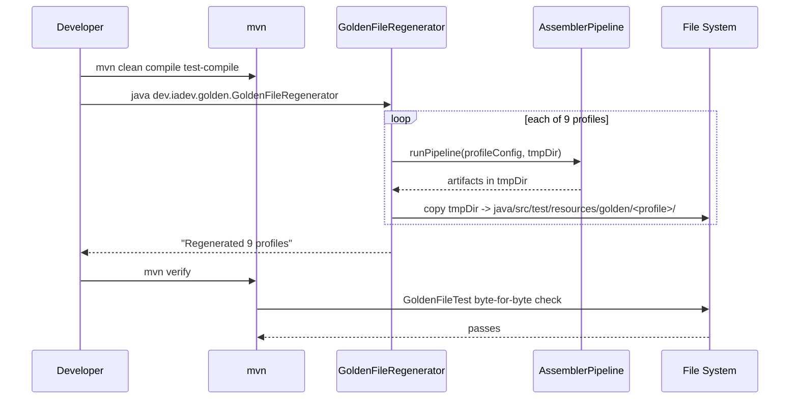

# História: Regenerar golden files e asserts GoldenFileTest

**ID:** story-0058-0007
**Chave Jira:** —
**Status:** Pendente

## 1. Dependências

| Blocked By | Blocks |
| :--- | :--- |
| story-0058-0006 | story-0058-0008 |

## 2. Regras Transversais Aplicáveis

| ID | Título |
| :--- | :--- |
| RULE-003 | Generation Parity |
| RULE-005 | Backward Compatibility |

## 3. Descrição

Como **mantenedor da suite golden**, eu quero regenerar os 9 golden files e adicionar asserts cobrindo o novo diretório `.claude/scripts/`, garantindo que o `ScriptsAssembler` criado em story 0058-0006 seja coberto pela trava de drift-zero que já protege todos os outros assemblers.

A suite golden (`GoldenFileTest`) compara byte-for-byte o output do pipeline contra árvores `.claude/` pré-gravadas em `java/src/test/resources/golden/{profile}/`. Sem esta história, qualquer mudança em script na source-of-truth passaria despercebida. Esta história: (a) usa `GoldenFileRegenerator` para popular os 9 perfis; (b) estende `GoldenFileTest` para explicitamente validar `.claude/scripts/` (atualmente o test já é genérico, mas nova assertion explícita garante detecção rápida de regressão).

### 3.1 Escopo

- Invocar `java -cp target/classes:target/test-classes dev.iadev.golden.GoldenFileRegenerator` — regenera 9 perfis.
- Commitar `java/src/test/resources/golden/{profile}/.claude/scripts/audit-*.sh` (5 arquivos × 9 perfis = 45 arquivos golden).
- Adicionar em `GoldenFileTest`:
  - Assertion específica `assertScriptsDirExists()` validando presença de `.claude/scripts/` com ≥ 5 arquivos `.sh`.
  - Assertion `assertScriptsExecutable()` validando permissão (em perfis POSIX).
- Permissões: golden files em Git ficam com `0644`; o assembler aplica `0755` em tempo de execução. Teste valida via metadata, não via filesystem direta.

### 3.2 Perfis impactados

9 perfis existentes (listados em `GoldenFileTest`):
- java-spring
- java-quarkus
- java-micronaut
- python-fastapi
- python-django
- typescript-nestjs
- typescript-express
- go-gin
- rust-axum

(Lista real a confirmar em refinamento; todos os perfis em `java/src/test/resources/golden/` devem receber o diretório novo.)

## 3.5 Entrega de Valor

- **Valor Principal:** drift-zero garantido entre source-of-truth e output em todos os 9 perfis; qualquer alteração futura em scripts sem regeneração falha em CI com diff preciso.
- **Métrica de Sucesso:** 9 perfis golden têm `.claude/scripts/` com 5 arquivos; `GoldenFileTest` passa; teste `assertScriptsDirExists()` cobre esse invariant explicitamente.
- **Impacto no Negócio:** projetos gerados pós-merge da epic têm scripts de governance; operadores percebem mudança em scripts imediatamente via CI.

## 4. Definições de Qualidade Locais

### DoR Local

- [ ] Story 0058-0006 mergeada (assembler existe e gera `.claude/scripts/`).
- [ ] 5 scripts completos em source-of-truth.
- [ ] Lista dos 9 perfis confirmada.

### DoD Local

- [ ] `GoldenFileRegenerator` executado para os 9 perfis.
- [ ] 45 novos arquivos golden commitados.
- [ ] `GoldenFileTest` estendido com 2 assertions.
- [ ] `mvn verify` passa em todos os perfis.
- [ ] CHANGELOG entry.
- [ ] PR targeta `epic/0058`.

### Global DoD

- **Cobertura:** golden files não têm cobertura mensurada (são fixtures); `GoldenFileTest` mantém ≥ 95% line / ≥ 90% branch.
- **Testes Automatizados:** `GoldenFileTest` parametrizado.
- **Documentação:** CHANGELOG.
- **Performance:** `mvn verify` acrescenta ≤ 2s ao total pelo diff extra (9 perfis × 5 arquivos).

## 5. Contratos de Dados

### 5.1 Estrutura esperada pós-regeneração

```
java/src/test/resources/golden/
├── java-spring/
│   └── .claude/
│       └── scripts/
│           ├── audit-flow-version.sh
│           ├── audit-epic-branches.sh
│           ├── audit-skill-visibility.sh
│           ├── audit-model-selection.sh
│           └── audit-execution-integrity.sh
├── java-quarkus/
│   └── ... (idem)
└── ... (7 outros perfis)
```

### 5.2 `GoldenFileTest` — novas assertions

| Assertion | Descrição | Escopo |
| :--- | :--- | :--- |
| `assertScriptsDirExists()` | `.claude/scripts/` existe | 9 perfis |
| `assertScriptsPresent(expectedNames)` | 5 nomes de arquivo esperados | 9 perfis |
| `assertScriptsByteForByte()` | Conteúdo idêntico a source-of-truth | (já coberto pela diff genérica, adicionado explicitamente para clareza) |

### 5.3 Error codes (via test failures)

| Failure | Significado |
| :--- | :--- |
| `GOLDEN_DIFF: <profile>/.claude/scripts/<file>` | Source-of-truth divergiu; regenerar |
| `MISSING_DIR: <profile>/.claude/scripts/` | Assembler não executou ou perfil desatualizado |
| `EXTRA_FILE: <profile>/.claude/scripts/<file>` | Arquivo órfão que não existe na SOT |

## 6. Diagramas

### 6.1 Regeneration flow



## 7. Critérios de Aceite (Gherkin)

```gherkin
Cenario: Goldens desatualizados após mover scripts (degenerate)
  DADO que `ScriptsAssembler` existe mas goldens ainda não foram regenerados
  QUANDO `mvn verify` executa `GoldenFileTest`
  ENTÃO o teste falha em 9 perfis
  E cada falha reporta `MISSING_DIR: <profile>/.claude/scripts/`

Cenario: Regeneração completa (happy path)
  DADO que `GoldenFileRegenerator` executa após story 0058-0006 mergeada
  QUANDO o regenerador completa
  ENTÃO 45 arquivos são criados (9 perfis × 5 scripts)
  E `mvn verify` executa `GoldenFileTest` com sucesso
  E stdout reporta "9 profiles, 0 diffs"

Cenario: Script alterado sem regeneração (error)
  DADO que `scripts/audit-flow-version.sh` source-of-truth foi editado
  E goldens não foram regenerados
  QUANDO `mvn verify` executa
  ENTÃO `GoldenFileTest` falha com `GOLDEN_DIFF` em 9 perfis
  E aponta exatamente a linha divergente

Cenario: Arquivo órfão (boundary)
  DADO que golden `java-spring/.claude/scripts/audit-obsolete.sh` existe
  MAS a source-of-truth não tem `audit-obsolete.sh`
  QUANDO `mvn verify` executa
  ENTÃO `GoldenFileTest` falha com `EXTRA_FILE`

Cenario: Asserts novas em GoldenFileTest (boundary)
  DADO que golden `python-fastapi/.claude/scripts/` está vazio (edge case simulado)
  QUANDO `mvn verify` executa
  ENTÃO `assertScriptsDirExists()` passa (dir existe)
  MAS `assertScriptsPresent()` falha com "expected 5 scripts, found 0"
```

### 7.1 Scenario Ordering (TPP)

Degenerate → happy path (regen) → error (script alterado) → boundary (órfão) → boundary (assert vazia).

### 7.2 Mandatory Scenario Categories

- [x] Degenerate
- [x] Happy path
- [x] Error path
- [x] Boundary

## 8. Tasks

### TASK-0058-0007-001: Executar `GoldenFileRegenerator`

- **Layer:** Migration
- **Test Type:** Smoke
- **Size:** S
- **Dependencies:** —
- **Branch:** `feat/task-0058-0007-001-regen`
- **Testability:** Migration + Smoke
- **Files:**
  - `java/src/test/resources/golden/**/.claude/scripts/*.sh` (45 files)
- **Acceptance Criteria:**
  - [ ] Comando executado limpo sem erros
  - [ ] 45 arquivos novos commitados

### TASK-0058-0007-002: Estender `GoldenFileTest`

- **Layer:** Test
- **Test Type:** Verification
- **Size:** M
- **Dependencies:** TASK-0058-0007-001
- **Branch:** `feat/task-0058-0007-002-asserts`
- **Testability:** Config + VerificationTest
- **Files:**
  - `java/src/test/java/dev/iadev/golden/GoldenFileTest.java`
- **Acceptance Criteria:**
  - [ ] `assertScriptsDirExists()` implementado
  - [ ] `assertScriptsPresent(List<String>)` implementado
  - [ ] Chamados após diff genérico, com mensagens explícitas
  - [ ] Cobertura do teste ≥ 95% line / ≥ 90% branch

### TASK-0058-0007-003: [Test] Smoke de regeneração idempotente

- **Layer:** Test
- **Test Type:** Smoke
- **Size:** S
- **Dependencies:** TASK-0058-0007-001
- **Branch:** `feat/task-0058-0007-003-idempotent`
- **Testability:** Config + VerificationTest
- **Files:**
  - `java/src/test/java/dev/iadev/golden/GoldenRegenerationIdempotencyIT.java`
- **Acceptance Criteria:**
  - [ ] Executa regenerator 2x seguidas
  - [ ] Valida que segunda execução não introduz diffs

### TASK-0058-0007-004: CHANGELOG

- **Layer:** Doc
- **Test Type:** Smoke
- **Size:** S
- **Dependencies:** TASK-0058-0007-001
- **Branch:** `feat/task-0058-0007-004-doc`
- **Testability:** Migration + Smoke
- **Files:**
  - `CHANGELOG.md`
- **Acceptance Criteria:**
  - [ ] Entry em Changed (9 golden profiles updated)
