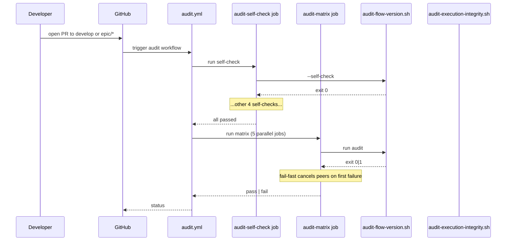

# História: Workflow CI `audit.yml` + integração `CicdAssembler`

**ID:** story-0058-0008
**Chave Jira:** —
**Status:** Pendente

## 1. Dependências

| Blocked By | Blocks |
| :--- | :--- |
| story-0058-0007 | — |

## 2. Regras Transversais Aplicáveis

| ID | Título |
| :--- | :--- |
| RULE-001 | Audit Gate Taxonomy |
| RULE-003 | Generation Parity |
| RULE-006 | CI Fail-Fast |

## 3. Descrição

Como **release manager**, eu quero um workflow GitHub Actions `audit.yml` (template em `shared/ci/`) que invoque os 5 scripts de auditoria em toda PR para `develop` e `epic/*`, com job `audit-self-check` executando todos os `--self-check` antes da matriz principal para detectar scripts corrompidos e abortar rápido, garantindo que o repositório do `ia-dev-env` E os projetos gerados por ele passem pelos mesmos 5 gates.

Esta história fecha o epic: `ScriptsAssembler` (story 0058-0006) gerou o `.claude/scripts/` com os 5 scripts; `GoldenFileTest` (story 0058-0007) trava drift; agora o workflow invoca-os em CI.

### 3.1 Estrutura do workflow

```yaml
name: audit
on:
  pull_request:
    branches: [ develop, 'epic/**' ]

jobs:
  audit-self-check:
    runs-on: ubuntu-latest
    steps:
      - uses: actions/checkout@v4
      - run: scripts/audit-flow-version.sh --self-check
      - run: scripts/audit-epic-branches.sh --self-check
      - run: scripts/audit-skill-visibility.sh --self-check
      - run: scripts/audit-model-selection.sh --self-check
      - run: scripts/audit-execution-integrity.sh --self-check

  audit-matrix:
    needs: [ audit-self-check ]
    runs-on: ubuntu-latest
    strategy:
      fail-fast: true
      matrix:
        script:
          - audit-flow-version.sh
          - audit-epic-branches.sh
          - audit-skill-visibility.sh
          - audit-model-selection.sh
          - audit-execution-integrity.sh
    steps:
      - uses: actions/checkout@v4
        with: { fetch-depth: 0 }
      - run: scripts/${{ matrix.script }}
```

### 3.2 Integração com `CicdAssembler`

- Template: `java/src/main/resources/shared/ci/audit.yml.tmpl`.
- `CicdAssembler` (já existente) copia templates para `.github/workflows/`.
- Adicionar template à lista de workflows processados.
- Regenerar goldens (novo arquivo entra no diff dos 9 perfis).

### 3.3 Self-check gate rationale

RULE-006 (fail-fast) exige que um script corrompido aborte antes de rodar o scan completo. O job `audit-self-check` garante isso: sem ele, um script com erro de syntax poderia retornar exit 0 e mascarar a falha.

### 3.4 Escopo

Inclui:
- Template do workflow + integração com `CicdAssembler`.
- Validação via `actionlint` local (step no próprio workflow ou job à parte).
- Testes: teste Java validando que o template está syntactically válido; teste smoke que o workflow é gerado em projetos.

Não inclui:
- Criação de workflow customizado para projetos gerados (genericidade do template cobre).
- Integração com Slack/outros canais de notificação.

## 3.5 Entrega de Valor

- **Valor Principal:** fecha o epic — todos os 5 gates rodam em toda PR para `develop` e `epic/*`; projetos gerados herdam workflow sem trabalho manual.
- **Métrica de Sucesso:** workflow `audit.yml` presente em 9 perfis golden; `actionlint` valida sintaxe; CI do próprio `ia-dev-environment` roda os 5 gates em PR #NNN do epic.
- **Impacto no Negócio:** governance completa e automatizada. Ao final das 8 stories, o epic entrega: 3 scripts faltantes criados, 1 assembler novo, 1 rule + ADR + catálogo, workflow CI operante. Nenhum gate fantasma nas Rules.

## 4. Definições de Qualidade Locais

### DoR Local

- [ ] Story 0058-0007 mergeada (goldens com `.claude/scripts/` regenerados).
- [ ] `actionlint` disponível localmente (fallback: instalar em CI job).

### DoD Local

- [ ] `java/src/main/resources/shared/ci/audit.yml.tmpl` criado.
- [ ] `CicdAssembler` processa o novo template.
- [ ] Goldens regenerados (9 perfis × 1 arquivo = 9 arquivos novos).
- [ ] `mvn verify` passa.
- [ ] `actionlint` local sem warnings.
- [ ] Workflow visível em `.github/workflows/audit.yml` do próprio repo.
- [ ] CI da PR desta história executa `audit.yml` com sucesso.
- [ ] CHANGELOG entry.

### Global DoD

- **Cobertura:** ≥ 95% Line / ≥ 90% Branch no `CicdAssembler` se modificado.
- **Testes Automatizados:** unit test `CicdAssemblerAuditWorkflowTest`; smoke `Epic0058AuditWorkflowSmokeTest`.
- **Documentação:** CHANGELOG + `CLAUDE.md` bloc "Concluded — EPIC-0058".
- **Performance:** workflow completo executa em ≤ 3min em `ubuntu-latest`.

## 5. Contratos de Dados

### 5.1 Schema `audit.yml` (conforme GitHub Actions)

| Chave | Tipo | M/O | Validação |
| :--- | :--- | :--- | :--- |
| `name` | String | M | Literal `audit` |
| `on.pull_request.branches` | List[String] | M | Contém `develop` e `epic/**` |
| `jobs.audit-self-check` | Job | M | Runs 5 `--self-check` steps |
| `jobs.audit-matrix` | Job | M | `needs: audit-self-check`, `fail-fast: true`, matrix ≥ 5 scripts |

### 5.2 Contract de template

| Placeholder | Substituído por | Origem |
| :--- | :--- | :--- |
| `{{PROJECT_NAME}}` | Nome do projeto gerado | `ProjectConfig.name` |
| nenhum (scripts hardcoded) | — | Lista fixa de 5 scripts matches source-of-truth |

### 5.3 Error codes propagados

| Gate fail | Exit workflow |
| :--- | :--- |
| `audit-self-check` fail | Job falha, `audit-matrix` não executa |
| Qualquer script em matrix exit ≠ 0 | Workflow fail-fast: cancela demais matrix jobs |

## 6. Diagramas

### 6.1 Workflow execution



## 7. Critérios de Aceite (Gherkin)

```gherkin
Cenario: Workflow não existe (degenerate)
  DADO que `.github/workflows/audit.yml` não existe
  QUANDO PR é aberta
  ENTÃO nenhum job de audit executa
  E os 5 gates não têm enforcement

Cenario: Workflow gerado e 5 gates passando (happy path)
  DADO que `audit.yml` existe
  E os 5 scripts estão íntegros
  QUANDO PR é aberta para `develop`
  ENTÃO `audit-self-check` passa em ≤ 30s
  E `audit-matrix` com 5 jobs paralelos termina em ≤ 2min
  E PR recebe status green de `audit`

Cenario: Script com erro de sintaxe (error via self-check)
  DADO que `audit-flow-version.sh` tem `set -euo pipefail` quebrado
  QUANDO PR é aberta
  ENTÃO `audit-self-check` falha no step do script quebrado
  E `audit-matrix` não executa
  E PR recebe status failing imediato

Cenario: Uma violação detectada na matrix (error via matrix)
  DADO que `plans/epic-0055/execution-state.json` tem `flowVersion="3"`
  E `audit-flow-version.sh` detecta
  QUANDO PR é aberta
  ENTÃO `audit-matrix/audit-flow-version.sh` falha com exit 1
  E `fail-fast` cancela os 4 jobs paralelos
  E PR recebe status fail

Cenario: `actionlint` invalida template (boundary)
  DADO que `audit.yml.tmpl` tem sintaxe inválida
  QUANDO `mvn verify` executa smoke test do template
  ENTÃO teste falha com `ACTIONLINT_SYNTAX_ERROR`
  E aponta linha exata

Cenario: Workflow em projeto gerado (boundary)
  DADO que `ia-dev-env generate --config sample.yaml` executa
  QUANDO o projeto resultante é inspecionado
  ENTÃO `.github/workflows/audit.yml` existe
  E contém os 5 scripts com `--self-check` + matrix
  E 9 perfis golden contêm o arquivo
```

### 7.1 Scenario Ordering (TPP)

Degenerate → happy path → error self-check → error matrix → boundary actionlint → boundary projeto gerado.

### 7.2 Mandatory Scenario Categories

- [x] Degenerate
- [x] Happy path
- [x] Error path (self-check + matrix)
- [x] Boundary (actionlint + generated project)

## 8. Tasks

### TASK-0058-0008-001: Criar template `audit.yml.tmpl`

- **Layer:** Config
- **Test Type:** Verification
- **Size:** M
- **Dependencies:** —
- **Branch:** `feat/task-0058-0008-001-template`
- **Testability:** Config + VerificationTest
- **Files:**
  - `java/src/main/resources/shared/ci/audit.yml.tmpl`
- **Acceptance Criteria:**
  - [ ] 2 jobs (`audit-self-check`, `audit-matrix`)
  - [ ] 5 scripts listados
  - [ ] `fail-fast: true`
  - [ ] `actionlint` local passa

### TASK-0058-0008-002: Integrar ao `CicdAssembler`

- **Layer:** Application
- **Test Type:** Unit
- **Size:** S
- **Dependencies:** TASK-0058-0008-001
- **Branch:** `feat/task-0058-0008-002-cicd`
- **Testability:** Domain + UnitTest
- **Files:**
  - `java/src/main/java/dev/iadev/application/assembler/CicdAssembler.java` (modificação)
- **Acceptance Criteria:**
  - [ ] `audit.yml.tmpl` incluído na lista de workflows processados
  - [ ] Teste unit `CicdAssemblerAuditWorkflowTest` valida copia

### TASK-0058-0008-003: [Test] Smoke Java

- **Layer:** Test
- **Test Type:** Smoke
- **Size:** M
- **Dependencies:** TASK-0058-0008-001, TASK-0058-0008-002
- **Branch:** `feat/task-0058-0008-003-smoke`
- **Testability:** Config + VerificationTest
- **Files:**
  - `java/src/test/java/dev/iadev/epic0058/Epic0058AuditWorkflowSmokeTest.java`
- **Acceptance Criteria:**
  - [ ] Roda pipeline em tmp, valida `.github/workflows/audit.yml` existe
  - [ ] Parse YAML e valida schema (job `audit-self-check` + `audit-matrix`)

### TASK-0058-0008-004: Regenerar goldens

- **Layer:** Migration
- **Test Type:** Smoke
- **Size:** S
- **Dependencies:** TASK-0058-0008-002
- **Branch:** `feat/task-0058-0008-004-golden`
- **Testability:** Migration + Smoke
- **Files:**
  - `java/src/test/resources/golden/**/.github/workflows/audit.yml` (9 perfis)
- **Acceptance Criteria:**
  - [ ] `GoldenFileRegenerator` limpo
  - [ ] `mvn verify` passa

### TASK-0058-0008-005: Habilitar workflow no próprio repo

- **Layer:** Config
- **Test Type:** Smoke
- **Size:** S
- **Dependencies:** TASK-0058-0008-001
- **Branch:** `feat/task-0058-0008-005-enable`
- **Testability:** Config + VerificationTest
- **Files:**
  - `.github/workflows/audit.yml` (cópia do template preenchida)
- **Acceptance Criteria:**
  - [ ] Arquivo presente no repo root
  - [ ] PR desta história aciona o workflow e passa

### TASK-0058-0008-006: CHANGELOG + "Concluded" bloc

- **Layer:** Doc
- **Test Type:** Smoke
- **Size:** S
- **Dependencies:** TASK-0058-0008-001
- **Branch:** `feat/task-0058-0008-006-doc`
- **Testability:** Migration + Smoke
- **Files:**
  - `CHANGELOG.md`
  - `CLAUDE.md`
- **Acceptance Criteria:**
  - [ ] CHANGELOG entry em Added (workflow)
  - [ ] CLAUDE.md bloc "Concluded — EPIC-0058 (Audit Scripts Lifecycle & Generation)" no topo das quotes
