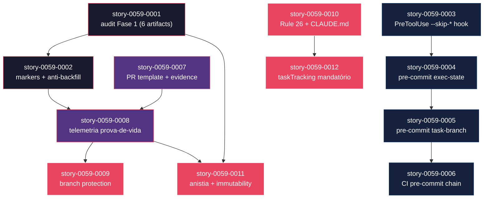

# Mapa de Implementação — EPIC-0059: Zero-Bypass Lifecycle Enforcement

**Gerado a partir das dependências BlockedBy/Blocks de cada história do epic-0059.**

---

## 1. Matriz de Dependências

| Story | Título | Chave Jira | Blocked By | Blocks | Status |
| :--- | :--- | :--- | :--- | :--- | :--- |
| story-0059-0001 | Estender `audit-execution-integrity.sh` para 6 artefatos Fase 1 | — | — | story-0059-0002, story-0059-0011 | Pendente |
| story-0059-0002 | Markers de origem em artefatos + audit anti-backfill | — | story-0059-0001 | story-0059-0008, story-0059-0011 | Pendente |
| story-0059-0003 | PreToolUse hook bloqueia `--skip-*` fora de Recovery | — | — | story-0059-0004 | Pendente |
| story-0059-0004 | Pre-commit hook protege `execution-state.json` | — | story-0059-0003 | story-0059-0005 | Pendente |
| story-0059-0005 | Pre-commit hook exige assinatura do orquestrador em branches `feat/task-*` | — | story-0059-0004 | story-0059-0006 | Pendente |
| story-0059-0006 | CI re-roda pre-commit chain no merge commit | — | story-0059-0005 | — | Pendente |
| story-0059-0007 | PR template + CI valida "Orchestrator Evidence" preenchida | — | — | story-0059-0008, story-0059-0009 | Pendente |
| story-0059-0008 | Telemetria como prova-de-vida do orquestrador | — | story-0059-0002, story-0059-0007 | story-0059-0009, story-0059-0011 | Pendente |
| story-0059-0009 | GitHub branch protection + CODEOWNERS | — | story-0059-0008 | — | Pendente |
| story-0059-0010 | Rule 26 + bloco "ZERO-BYPASS" em CLAUDE.md | — | — | story-0059-0012 | Pendente |
| story-0059-0011 | Anistia formal de EPIC-0054–0057 + immutability check | — | story-0059-0001, story-0059-0008 | — | Pendente |
| story-0059-0012 | `taskTracking.enabled=true` mandatório para `flowVersion=2` | — | story-0059-0010 | — | Pendente |

> **Valores de Status:** `Pendente` (padrão) · `Em Andamento` · `Concluída` · `Falha` · `Bloqueada` · `Parcial`

> **Nota:** Stories 0001, 0003, 0007, 0010 não têm dependências e podem iniciar imediatamente em paralelo. Stories de Phase 2 (0007, 0008) e Phase 3 (0009, 0010, 0011, 0012) têm touchpoints diferentes e podem ser paralelizadas dentro da fase.

---

## 2. Fases de Implementação

> As histórias são agrupadas em fases. Dentro de cada fase, as histórias podem ser implementadas **em paralelo** quando não têm dependências entre si. Uma fase só pode iniciar quando todas as dependências das fases anteriores estiverem concluídas.

```
╔══════════════════════════════════════════════════════════════════════════════╗
║              FASE 0 — Tampar o vazamento principal (sequencial)            ║
║                                                                            ║
║   ┌──────────────────────┐      ┌──────────────────────────────────────┐  ║
║   │  story-0059-0001     │ ──→  │  story-0059-0002                     │  ║
║   │  audit Fase 1        │      │  markers de origem + anti-backfill   │  ║
║   └──────────────────────┘      └──────────────────────────────────────┘  ║
╚═════════════════════════════╪═══════════════════════════════════╪══════════╝
                              │                                   │
                              ▼                                   ▼
╔══════════════════════════════════════════════════════════════════════════════╗
║              FASE 1 — Defesa upstream (sequencial)                         ║
║                                                                            ║
║  ┌────────────────┐  ┌────────────────┐  ┌────────────────┐  ┌──────────┐ ║
║  │story-0059-0003 │→ │story-0059-0004 │→ │story-0059-0005 │→ │  0006    │ ║
║  │PreToolUse hook │  │pre-commit exec │  │pre-commit task │  │CI chain  │ ║
║  └────────────────┘  └────────────────┘  └────────────────┘  └──────────┘ ║
╚═════════════════════════════════════════════════════════════════════════════╝
                              │
                              ▼
╔══════════════════════════════════════════════════════════════════════════════╗
║              FASE 2 — PR-gate intransponível (paralelo)                    ║
║                                                                            ║
║   ┌──────────────────────────┐      ┌──────────────────────────────────┐  ║
║   │  story-0059-0007         │      │  story-0059-0008                 │  ║
║   │  PR template + evidence  │ ──→  │  telemetria prova-de-vida         │  ║
║   └──────────────────────────┘      └──────────────────────────────────┘  ║
╚═════════════════════════════════════════════════════════════════════════════╝
                              │
                              ▼
╔══════════════════════════════════════════════════════════════════════════════╗
║              FASE 3 — Plataforma + normativa (paralelo)                    ║
║                                                                            ║
║  ┌────────────────┐  ┌────────────────┐  ┌─────────────────┐  ┌────────┐  ║
║  │story-0059-0009 │  │story-0059-0010 │  │story-0059-0011  │  │ 0012   │  ║
║  │branch protect  │  │Rule 26+CLAUDE  │  │anistia +        │  │task    │  ║
║  │+ CODEOWNERS    │  │.md normativo   │  │immutability     │  │tracking│  ║
║  └────────────────┘  └────────────────┘  └─────────────────┘  └────────┘  ║
╚═════════════════════════════════════════════════════════════════════════════╝
```

---

## 3. Caminho Crítico

> O caminho crítico determina o tempo mínimo de implementação do projeto.

```
story-0059-0001 → story-0059-0002 ─┐
                                    ├──→ story-0059-0008 → story-0059-0009
story-0059-0007 ───────────────────┘
     Fase 0           Fase 2              Fase 2              Fase 3
```

Caminho alternativo (independente):
```
story-0059-0003 → story-0059-0004 → story-0059-0005 → story-0059-0006
     Fase 1
```

**4 fases no caminho crítico principal, 5 histórias na cadeia mais longa (0001→0002→0008→0009→0011).**

Atrasos em story-0059-0001 ou story-0059-0007 impactam diretamente o PR-gate intransponível (Fase 2). São as histórias de maior ROI do épico.

---

## 4. Grafo de Dependências (Mermaid)



---

## 5. Resumo por Fase

| Fase | Histórias | Camada | Paralelismo | Pré-requisito |
| :--- | :--- | :--- | :--- | :--- |
| 0 | story-0059-0001, 0002 | CI Audit + Planning Skills | 1 sequencial → 1 | — |
| 1 | story-0059-0003, 0004, 0005, 0006 | Hooks (PreToolUse + pre-commit) + CI | 1 sequencial | Fase 0 não é pré-req (independente) |
| 2 | story-0059-0007, 0008 | PR Gate + Telemetria | 1 sequencial (0007→0008) | Fase 0 concluída (0002 bloqueia 0008) |
| 3 | story-0059-0009, 0010, 0011, 0012 | Plataforma + Normativa | 4 paralelas | Fase 2 concluída (0008 bloqueia 0009, 0011) |

**Total: 12 histórias em 4 fases.**

> **Nota:** Fase 1 pode ser executada em paralelo com Fase 0 (não há dependências cruzadas). O paralelismo máximo é na Fase 3 (4 stories simultâneas).

---

## 6. Detalhamento por Fase

### Fase 0 — Tampar o Vazamento Principal

| Story | Escopo Principal | Artefatos Chave |
| :--- | :--- | :--- |
| story-0059-0001 | Extender `audit-execution-integrity.sh` com 6 artefatos Fase 1 + baseline anistia inicial | `scripts/audit-execution-integrity.sh`, `audits/execution-integrity-baseline.txt` |
| story-0059-0002 | Emissão de frontmatter `generated-by` em 5 skills de planejamento + validação anti-backfill | SKILL.md de 5 skills + extensão do audit |

**Entregas da Fase 0:**

- CI gate rejeita PRs sem 6 artefatos de Fase 1 (`EIE_EVIDENCE_MISSING`)
- Artefatos gerados por skills carregam frontmatter com SHA autêntico
- Backfill retroativo detectado deterministicamente
- Stories de EPIC-0054–0057 inicialmente grandfathered

### Fase 1 — Defesa Upstream

| Story | Escopo Principal | Artefatos Chave |
| :--- | :--- | :--- |
| story-0059-0003 | Hook PreToolUse bloqueando `--skip-*` fora de recovery | `.claude/hooks/enforce-no-bypass-flags.sh` |
| story-0059-0004 | Pre-commit hook validando trailer em `execution-state.json` | `.githooks/pre-commit`, x-internal-status-update |
| story-0059-0005 | Pre-commit hook validando assinatura em branches `feat/task-*` | `.githooks/pre-commit`, x-git-commit |
| story-0059-0006 | Job CI re-rodando pre-commit chain (format/lint/compile) | `.github/workflows/ci-release.yml` |

**Entregas da Fase 1:**

- `--skip-verification` bloqueado pelo hook durante a sessão
- `execution-state.json` protegido de edição manual direta
- `git commit --no-verify` invalidado pelo CI
- Todo commit em task-branch rastreável ao `x-git-commit`

### Fase 2 — PR-Gate Intransponível

| Story | Escopo Principal | Artefatos Chave |
| :--- | :--- | :--- |
| story-0059-0007 | PR template com seção "Orchestrator Evidence" + `audit-pr-evidence.sh` | `.github/pull_request_template.md`, `scripts/audit-pr-evidence.sh` |
| story-0059-0008 | Validação de telemetria (`events.ndjson`) no audit + Stop hook de staging | `scripts/audit-execution-integrity.sh` (extensão), `.claude/hooks/stage-telemetry.sh` |

**Entregas da Fase 2:**

- PRs manuais detectados pela ausência da seção "Orchestrator Evidence"
- Orquestrador ausente detectado por falta de eventos `phase.start x-story-implement`
- `events.ndjson` é evidência commitada e validada no CI

### Fase 3 — Plataforma e Normativa

| Story | Escopo Principal | Artefatos Chave |
| :--- | :--- | :--- |
| story-0059-0009 | Branch protection GitHub + CODEOWNERS | `scripts/setup-branch-protection.sh`, `.github/CODEOWNERS` |
| story-0059-0010 | Rule 26 normativa + CLAUDE.md | `.claude/rules/26-zero-bypass-lifecycle.md`, `CLAUDE.md` |
| story-0059-0011 | Anistia formal EPIC-0054–0057 + immutability check | `audits/rule-26-baseline.txt`, `scripts/audit-baseline-immutability.sh`, ADR-0015 |
| story-0059-0012 | `taskTracking.enabled=true` obrigatório para `flowVersion=2` | Rule 19 update, `scripts/migrate-task-tracking-v2.sh`, `scripts/audit-flow-version.sh` |

**Entregas da Fase 3:**

- Todos os 9 audits são required status checks no GitHub
- Rule 26 carregada em toda sessão de Claude Code
- Anistia documentada em ADR-0015; imutabilidade garantida
- `flowVersion=2` exige `taskTracking.enabled=true`

---

## 7. Observações Estratégicas

### Gargalo Principal

**story-0059-0008** (Telemetria como prova-de-vida) é o maior gargalo: bloqueia story-0059-0009 (branch protection) e story-0059-0011 (anistia). Depende de story-0059-0002 e story-0059-0007, criando uma convergência de dois ramos independentes. Investir tempo nesta story com atenção especial ao formato de `events.ndjson` e à lógica de extração de STORY-IDs é crítico para o caminho crítico total.

### Histórias Folha (sem dependentes)

- **story-0059-0006**: Fim da cadeia da Fase 1; não bloqueia nenhuma outra.
- **story-0059-0009**: Fim da cadeia de branch protection.
- **story-0059-0010**: Não bloqueia diretamente (apenas 0012, que é simples).
- **story-0059-0011**: Folha — consolidação da anistia.
- **story-0059-0012**: Folha — alinhamento de configuração.

As histórias folha de Fase 3 (0009, 0010, 0011, 0012) podem ser executadas em paralelo, reduzindo Fase 3 de 4 dias para ~1 dia com alocação paralela.

### Otimização de Tempo

- **Paralelismo máximo em Fase 3**: 4 stories simultâneas se houver capacidade de execução paralela.
- **Fase 0 e Fase 1 podem rodar em paralelo**: não há dependências cruzadas entre as duas fases.
- **story-0059-0007 pode iniciar imediatamente**: sem dependências na Fase 2, pode ser desenvolvida durante a Fase 0 ou 1.
- **story-0059-0010 pode iniciar imediatamente**: sem dependências, pode ser desenvolvida em qualquer fase.

### Dependências Cruzadas

**story-0059-0008** é a maior convergência: depende de 0002 (Fase 0) e 0007 (Fase 2 independente). Ambos os ramos devem completar antes da implementação da telemetria. Qualquer atraso em 0002 ou 0007 atrasa diretamente o gate de PR.

**story-0059-0011** converge 0001 (Fase 0) e 0008 (Fase 2). A anistia formal só pode ser completada após o audit estendido (0001) e a telemetria (0008) estarem ambos funcionais.

### Marco de Validação Arquitetural

**story-0059-0001** deve servir como checkpoint de validação antes de Fase 2: com o audit de 6 artefatos Fase 1 funcional, é possível verificar que o próprio EPIC-0059 está sendo implementado corretamente (dogfooding via RULE-059-01). Se story-0059-0001 falhar para as stories do próprio EPIC-0059, há um problema de implementação que deve ser resolvido antes de prosseguir.

---

## 8. Dependências entre Tasks (Cross-Story)

### 8.1 Dependências Cross-Story entre Tasks

| Task | Depends On | Story Source | Story Target | Tipo |
| :--- | :--- | :--- | :--- | :--- |
| TASK-0059-0002-003 | TASK-0059-0001-001 | story-0059-0002 | story-0059-0001 | interface (audit script) |
| TASK-0059-0004-001 | TASK-0059-0003-001 | story-0059-0004 | story-0059-0003 | config (hook registration) |
| TASK-0059-0005-001 | TASK-0059-0004-002 | story-0059-0005 | story-0059-0004 | schema (pre-commit hook) |
| TASK-0059-0006-001 | TASK-0059-0005-002 | story-0059-0006 | story-0059-0005 | config (CI workflow) |
| TASK-0059-0008-001 | TASK-0059-0002-003 | story-0059-0008 | story-0059-0002 | interface (audit script) |
| TASK-0059-0008-001 | TASK-0059-0007-003 | story-0059-0008 | story-0059-0007 | interface (audit script) |
| TASK-0059-0011-001 | TASK-0059-0001-003 | story-0059-0011 | story-0059-0001 | data (baseline file) |
| TASK-0059-0011-002 | TASK-0059-0008-001 | story-0059-0011 | story-0059-0008 | interface (audit extended) |

### 8.2 Ordem de Merge (Topological Sort)

| Ordem | Task ID | Story | Fase |
| :--- | :--- | :--- | :--- |
| 1 | TASK-0059-0001-001 | story-0059-0001 | 0 |
| 2 | TASK-0059-0001-002 | story-0059-0001 | 0 |
| 3 | TASK-0059-0001-003 | story-0059-0001 | 0 |
| 4 | TASK-0059-0002-001 | story-0059-0002 | 0 |
| 5 | TASK-0059-0002-002 | story-0059-0002 | 0 |
| 6 | TASK-0059-0002-003 | story-0059-0002 | 0 |
| 7 (paralelo) | TASK-0059-0003-001 | story-0059-0003 | 1 |
| 7 (paralelo) | TASK-0059-0007-001 | story-0059-0007 | 2 |
| 7 (paralelo) | TASK-0059-0010-001 | story-0059-0010 | 3 |
| 8 | TASK-0059-0003-002 | story-0059-0003 | 1 |
| ... | ... | ... | ... |

**Total: 38 tasks em 4 fases de execução.**

## 8.5 Restrições de Paralelismo

> Análise de colisões baseada em File Footprint por story.

**Conflitos detectados:** 2 hard, 0 regen, 1 soft

### 8.5.1 Pares Serializados Dentro da Fase

| Fase | A | B | Categoria | Motivo |
| :--- | :--- | :--- | :--- | :--- |
| 0 | story-0059-0001 | story-0059-0002 | hard | Ambas escrevem em `scripts/audit-execution-integrity.sh` |
| 1 | story-0059-0004 | story-0059-0005 | hard | Ambas escrevem em `.githooks/pre-commit` |
| 3 | story-0059-0011 | story-0059-0012 | soft | Ambas tocam `scripts/audit-flow-version.sh` (story-0012 estende; story-0011 adiciona job CI) |

### 8.5.2 Recomendação de Reagrupamento

**Fase 0:** Serializar obrigatoriamente (dependência já declarada: 0001→0002). Sem mudança.

**Fase 1:** Serializar story-0059-0004 antes de story-0059-0005 (dependência já declarada). Sem mudança.

**Fase 3:** Serializar story-0059-0012 antes de story-0059-0011 (0012 estende o script que 0011 adiciona ao CI workflow). Adicionar dependência explícita: story-0059-0011 depende de story-0059-0012 para o passo de registro no CI.
