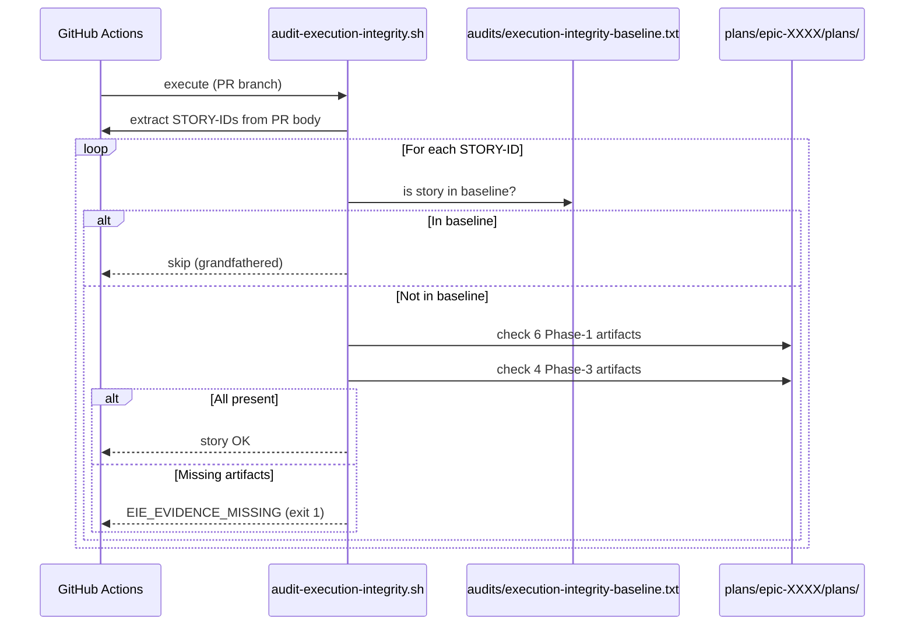

# História: Estender `audit-execution-integrity.sh` para os 6 Artefatos de Fase 1

**ID:** story-0059-0001
**Chave Jira:** —
**Status:** Pendente

> **Status Transitions (Rule 22 — lifecycle-integrity):**
> valores permitidos `Pendente | Planejada | Em Andamento | Concluída | Falha | Bloqueada`.
> Transições válidas: `Pendente → Planejada | Em Andamento | Falha | Bloqueada`;
> `Planejada → Em Andamento | Falha | Bloqueada`;
> `Em Andamento → Concluída | Falha | Bloqueada`;
> reabertura `Concluída → Em Andamento` (via `x-status-reconcile --apply`) e
> `Falha → Pendente`; `Bloqueada → Pendente | Planejada | Em Andamento | Falha`.
> Ver [`.claude/rules/22-lifecycle-integrity.md`](../../.claude/rules/22-lifecycle-integrity.md).

## 1. Dependências

| Blocked By | Blocks |
| :--- | :--- |
| — | story-0059-0002, story-0059-0011 |

## 2. Regras Transversais Aplicáveis

| ID | Título |
| :--- | :--- |
| [RULE-059-01] | Dogfooding obrigatório |
| [RULE-059-02] | Aceitação: prova que o gate dispara |
| [RULE-059-06] | Padronização de exit codes |

## 3. Descrição

Como **operador do lifecycle**, eu quero que `audit-execution-integrity.sh` valide a presença dos 6 artefatos de Fase 1 por story em cada PR, garantindo que nenhum PR seja mergeado sem evidência de execução da wave de planejamento do orquestrador.

O diagnóstico de EPIC-0059 revelou que o audit atual (`Camada 3`) verifica apenas 4 artefatos de Fase 3 (`verify-envelope`, `review`, `techlead-review`, `story-completion-report`). Isso permite que stories sejam mergeadas sem qualquer artefato de Fase 1 — exatamente o que ocorreu em EPIC-0054 a 0057. A correção é direta: adicionar os 6 paths obrigatórios da Fase 1 à lista mandatória.

Esta story é o "tampão" mais eficiente do EPIC-0059: com escopo SIMPLE e mudança cirúrgica no script de audit, bloqueia o bypass principal (surface `B` — Phase 1 wave artifacts ausentes) no CI gate que já existe.

### 3.1 Artefatos mandatórios adicionados (por STORY-ID)

Os seguintes paths são adicionados à lista `REQUIRED_PHASE_1_ARTIFACTS` do script:

- `plans/epic-XXXX/plans/arch-story-YYYY.md`
- `plans/epic-XXXX/plans/plan-story-YYYY.md`
- `plans/epic-XXXX/plans/tests-story-YYYY.md`
- `plans/epic-XXXX/plans/tasks-story-YYYY.md`
- `plans/epic-XXXX/plans/security-story-YYYY.md`
- `plans/epic-XXXX/plans/compliance-story-YYYY.md`

Onde `XXXX` é o epic ID e `YYYY` é o story ID extraídos do PR (via `gh pr view --json body`).

### 3.2 Self-check (`--self-check`)

O script deve expor `--self-check` que:
- Verifica que o array `REQUIRED_PHASE_1_ARTIFACTS` tem exatamente 6 entries.
- Verifica que o array `REQUIRED_PHASE_3_ARTIFACTS` tem exatamente 4 entries.
- Imprime `OK: 10 required artifacts configured` e retorna exit 0.
- Retorna exit 4 (`ENFORCEMENT_BROKEN`) se a contagem falhar.

### 3.3 Flag `--scope=fase1`

Adicionar flag `--scope=fase1` que executa apenas a verificação de Fase 1, sem validar Fase 3. Útil para debug e para os testes da própria story.

### 3.4 Anistia explícita (EPIC-0054 a 0057)

Adicionar todas as stories dos épicos EPIC-0054 a 0057 ao arquivo `audits/execution-integrity-baseline.txt`. Essas stories são consideradas mergeadas antes da Rule 24/Rule 26 e ficam isentas do gate retroativamente. Novas stories adicionadas ao baseline após este merge são bloqueadas pelo immutability check (story-0059-0011).

## 3.5 Entrega de Valor

- **Valor Principal:** CI gate passa a bloquear PRs sem planning artifacts, tornando o bypass de `/x-story-implement` Phase 1 detectável em ≤ 2 minutos após abertura do PR.
- **Métrica de Sucesso:** 100% dos PRs de story que tentam mergear sem 6 artefatos Fase 1 recebem `EIE_EVIDENCE_MISSING` no CI antes de qualquer revisão humana.
- **Impacto no Negócio:** Eliminação da raiz de EPIC-0054–0057 regression (0% → 100% de stories com planning artifacts). Garante que toda story entregue tem arch, plano, testes, tasks, security e compliance planejados antes do código.

## 4. Definições de Qualidade Locais

### DoR Local

- [ ] `scripts/audit-execution-integrity.sh` lido e estrutura atual compreendida
- [ ] Lista de stories de EPIC-0054, 0055, 0056, 0057 levantada para a baseline
- [ ] Formato atual de `audits/execution-integrity-baseline.txt` documentado

### DoD Local

- [ ] `REQUIRED_PHASE_1_ARTIFACTS` com 6 entradas implementado em `audit-execution-integrity.sh`
- [ ] Flag `--scope=fase1` funcional
- [ ] `--self-check` retorna exit 0 com 10 artifacts configurados
- [ ] `audits/execution-integrity-baseline.txt` atualizado com stories de EPIC-0054–0057
- [ ] Smoke test: PR sem arch-story.md → exit 1 `EIE_EVIDENCE_MISSING`
- [ ] Pelo menos 1 teste automatizado validando o critério de aceite principal
- [ ] Smoke test passando

### Global Definition of Done (DoD)

- **Cobertura:** ≥ 95% line, ≥ 90% branch (Rule 05 — absolute gate)
- **Testes Automatizados:** Smoke test que tenta PR sem artefatos e valida exit 1
- **Relatório de Cobertura:** JaCoCo XML (se script testado via Java shim)
- **Documentação:** CHANGELOG atualizado; CLAUDE.md menciona EPIC-0059
- **Persistência:** `audits/execution-integrity-baseline.txt` é arquivo de texto imutável após merge
- **Performance:** Script completa em < 30s para repositório padrão

## 5. Contratos de Dados

### 5.1 Input (detecção de STORY-IDs no PR)

| Campo | Tipo | M/O | Validações | Exemplo |
| :--- | :--- | :--- | :--- | :--- |
| PR body | `String` | M | Deve conter padrão `story-XXXX-YYYY` | `"Implements story-0059-0001"` |
| `--epic-id` | `String(4)` | O | 4 dígitos numéricos | `"0059"` |
| `--story-id` | `String(4)` | O | 4 dígitos numéricos | `"0001"` |
| `--scope` | `Enum` | O | `full` (default), `fase1`, `fase3` | `"fase1"` |

### 5.2 Output (JSON line, stdout)

| Campo | Tipo | Sempre presente | Descrição |
| :--- | :--- | :--- | :--- |
| `exitCode` | `Integer` | Sim | 0=OK, 1=violation, 2=corrupt, 3=invalid exemption, 4=enforcement broken |
| `storiesChecked` | `List<String>` | Sim | IDs das stories verificadas |
| `missingPhase1` | `Map<StoryId,List<Path>>` | Sim | Artefatos Fase 1 ausentes por story |
| `missingPhase3` | `Map<StoryId,List<Path>>` | Sim | Artefatos Fase 3 ausentes por story |

### 5.3 Exit Codes

| Exit | Código | Condição |
| :--- | :--- | :--- |
| 0 | `OK` | Todos artefatos presentes (ou na baseline) |
| 1 | `EIE_EVIDENCE_MISSING` | ≥ 1 story sem artefato mandatório |
| 2 | `EIE_BASELINE_CORRUPT` | baseline malformado |
| 3 | `EIE_INVALID_EXEMPTION` | `audit-exempt` sem reason |
| 4 | `EIE_ENFORCEMENT_BROKEN` | self-check falhou (contagem != 10) |

## 6. Diagramas

### 6.1 Fluxo do Audit CI



## 7. Critérios de Aceite (Gherkin)

```gherkin
Cenario: Audit passa quando nenhuma story está presente no PR
  DADO que o PR body não contém nenhum padrão "story-XXXX-YYYY"
  QUANDO o audit script é executado
  ENTÃO retorna exit 0
  E a saída JSON indica "storiesChecked": []

Cenario: Audit passa quando story tem todos os 10 artefatos presentes
  DADO que o PR implementa story-0059-0099
  E os 6 artefatos Fase 1 existem em plans/epic-0059/plans/
  E os 4 artefatos Fase 3 existem em plans/epic-0059/reports/
  QUANDO o audit é executado
  ENTÃO retorna exit 0
  E "missingPhase1" está vazio
  E "missingPhase3" está vazio

Cenario: Audit falha quando story não tem nenhum artefato Fase 1
  DADO que o PR implementa story-0059-0099
  E nenhum artefato de Phase 1 existe em plans/epic-0059/plans/
  QUANDO o audit é executado
  ENTÃO retorna exit 1 (EIE_EVIDENCE_MISSING)
  E "missingPhase1" contém 6 paths ausentes para story-0059-0099

Cenario: Audit passa para story na baseline (anistia)
  DADO que story-0057-0003 está em audits/execution-integrity-baseline.txt
  E story-0057-0003 não tem nenhum artefato de Fase 1
  QUANDO o audit é executado para PR que menciona story-0057-0003
  ENTÃO retorna exit 0
  E a saída menciona "grandfathered: story-0057-0003"

Cenario: Self-check retorna OK quando 10 artefatos estão configurados
  DADO que o script tem 6 entradas em REQUIRED_PHASE_1_ARTIFACTS
  E 4 entradas em REQUIRED_PHASE_3_ARTIFACTS
  QUANDO audit --self-check é executado
  ENTÃO retorna exit 0
  E imprime "OK: 10 required artifacts configured"

Cenario: Audit com --scope=fase1 valida apenas 6 artefatos
  DADO que story-0059-0099 tem os 6 artefatos de Fase 1
  MAS não tem os 4 artefatos de Fase 3
  QUANDO o audit é executado com --scope=fase1
  ENTÃO retorna exit 0
  E não verifica Fase 3

Cenario: Baseline corrompido retorna exit 2
  DADO que audits/execution-integrity-baseline.txt contém linha malformada
  QUANDO o audit é executado
  ENTÃO retorna exit 2 (EIE_BASELINE_CORRUPT)
```

### 7.1 Scenario Ordering (TPP)

Cenários ordenados de degenerate (PR sem stories) → happy path → error paths → boundary values (baseline).

## 8. Tasks

### TASK-0059-0001-001: Adicionar REQUIRED_PHASE_1_ARTIFACTS ao audit-execution-integrity.sh

- **Layer:** Adapter (script CI)
- **Test Type:** Smoke
- **Size:** M
- **Dependencies:** —
- **Branch:** `feat/task-0059-0001-001-extend-audit-phase1`
- **Testability:** Domain + UnitTest (script + bats/shunit test)
- **Files:**
  - `scripts/audit-execution-integrity.sh`
  - `src/test/bash/audit-execution-integrity-phase1.bats`
- **Acceptance Criteria:**
  - [ ] Array `REQUIRED_PHASE_1_ARTIFACTS` com 6 paths template
  - [ ] Loop de verificação para cada path por STORY-ID
  - [ ] Exit 1 quando qualquer dos 6 está ausente

### TASK-0059-0001-002: Adicionar flag --scope=fase1 e --self-check

- **Layer:** Adapter (script CI)
- **Test Type:** Unit
- **Size:** S
- **Dependencies:** TASK-0059-0001-001
- **Branch:** `feat/task-0059-0001-002-scope-selfcheck`
- **Testability:** Domain + UnitTest
- **Files:**
  - `scripts/audit-execution-integrity.sh`
  - `src/test/bash/audit-execution-integrity-flags.bats`
- **Acceptance Criteria:**
  - [ ] `--scope=fase1` pula verificação Fase 3
  - [ ] `--self-check` conta artifacts e valida = 10
  - [ ] Exit 4 se contagem != 10

### TASK-0059-0001-003: Popular audits/execution-integrity-baseline.txt (EPIC-0054–0057)

- **Layer:** Config
- **Test Type:** Verification
- **Size:** M
- **Dependencies:** TASK-0059-0001-001
- **Branch:** `feat/task-0059-0001-003-amnesty-baseline`
- **Testability:** Config + VerificationTest
- **Files:**
  - `audits/execution-integrity-baseline.txt`
  - `src/test/bash/audit-baseline-amnesty.bats`
- **Acceptance Criteria:**
  - [ ] Todas as stories de EPIC-0054, 0055, 0056, 0057 listadas com comentário `# amnesty EPIC-0059`
  - [ ] Smoke: audit executado contra PR de story-0057-0003 → exit 0 (grandfathered)
  - [ ] Formato da linha validado: `story-XXXX-YYYY  # <reason>`
