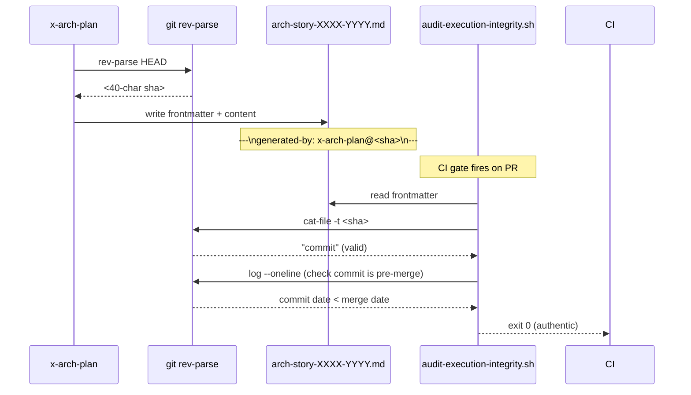

# História: Markers de Origem em Artefatos + Audit Anti-Backfill

**ID:** story-0059-0002
**Chave Jira:** —
**Status:** Pendente

> **Status Transitions (Rule 22 — lifecycle-integrity):**
> valores permitidos `Pendente | Planejada | Em Andamento | Concluída | Falha | Bloqueada`.
> Ver [`.claude/rules/22-lifecycle-integrity.md`](../../.claude/rules/22-lifecycle-integrity.md).

## 1. Dependências

| Blocked By | Blocks |
| :--- | :--- |
| story-0059-0001 | story-0059-0008, story-0059-0011 |

## 2. Regras Transversais Aplicáveis

| ID | Título |
| :--- | :--- |
| [RULE-059-01] | Dogfooding obrigatório |
| [RULE-059-02] | Aceitação: prova que o gate dispara |
| [RULE-059-03] | Proibição de auto-isenção |
| [RULE-059-06] | Padronização de exit codes |

## 3. Descrição

Como **operador do lifecycle**, eu quero que todo artefato de planejamento contenha um frontmatter `generated-by` com a skill e o commit SHA que o gerou, e que o audit rejeite artefatos sem esta marca ou com SHA inválido, garantindo que backfill retroativo seja detectável e bloqueado.

O bypass surface `I` (backfill retroativo de evidência) foi observado no commit `d460d0319` de EPIC-0057 (`feat(retroactive): backfill EPIC-0053 evidence`). Com markers de origem, um artefato manualmente criado ou copiado não terá um SHA que faça parte da história do PR, tornando a fraude detectável.

As skills de planejamento (`x-arch-plan`, `x-internal-story-build-plan`, `x-test-plan`, `x-task-plan`) serão modificadas para emitir o frontmatter automaticamente no topo de cada artefato gerado. O audit extende sua verificação para validar presença e autenticidade do marker.

### 3.1 Frontmatter gerado (formato obrigatório)

```markdown
---
generated-by: x-arch-plan@<40-char-git-sha>
generated-at: 2026-04-26T14:32:00Z
story-id: story-0059-0001
---
```

- `generated-by`: `<skill-name>@<git-sha-do-commit-HEAD-quando-skill-rodou>`
- `generated-at`: timestamp ISO-8601 UTC
- `story-id`: ID da story para a qual o artefato foi gerado
- SHA é capturado via `git rev-parse HEAD` no momento de execução da skill

### 3.2 Validação pelo audit

Para cada artefato de Fase 1 de uma story não-grandfathered:
1. Verifica presença do bloco frontmatter YAML delimitado por `---`
2. Extrai `generated-by` e valida formato `<skill>@<40-hex-chars>`
3. Verifica que o SHA existe na história Git do repositório: `git cat-file -t <sha>` retorna `commit`
4. Verifica que o commit que adicionou o artefato ao repositório é anterior ao merge commit do PR (anti-backfill: o artefato não pode ter sido commitado DEPOIS que o código principal já estava mergeado)

### 3.3 Isenção legítima de backfill

Para casos documentados de backfill com aprovação humana:
- Linha `<!-- audit-exempt: backfill <link-incident> -->` no artefato (primeira linha após frontmatter)
- Requer review humana via CODEOWNERS (configurado em story-0059-0009)
- O audit valida que o link do incidente está preenchido (não vazio)

### 3.4 Skills que emitem o frontmatter

- `x-arch-plan` → `arch-story-XXXX-YYYY.md`
- `x-internal-story-build-plan` → `plan-story-XXXX-YYYY.md`
- `x-test-plan` → `tests-story-XXXX-YYYY.md`
- `x-task-plan` → (via `x-lib-task-decomposer`) → `tasks-story-XXXX-YYYY.md`
- Security e compliance assessments (`x-story-implement` Phase 1E, 1F) → `security-story-XXXX-YYYY.md`, `compliance-story-XXXX-YYYY.md`

## 3.5 Entrega de Valor

- **Valor Principal:** Backfill retroativo de evidência é detectável deterministicamente: qualquer artefato sem frontmatter válido ou com SHA não-pertencente à história do PR é rejeitado no CI gate.
- **Métrica de Sucesso:** `audit-execution-integrity.sh --scope=fase1` rejeita PR com artefato manually-created (sem frontmatter) com exit 1 em < 30s.
- **Impacto no Negócio:** Elimina surface `I` de bypass; o "commit de backfill retroativo" detectado em EPIC-0057 passaria a falhar o CI imediatamente. Garante autenticidade completa da cadeia de evidência.

## 4. Definições de Qualidade Locais

### DoR Local

- [ ] story-0059-0001 concluída (audit já valida presença dos 6 artefatos Fase 1)
- [ ] Skills de planejamento (`x-arch-plan`, etc.) lidas — ponto de injeção do frontmatter identificado
- [ ] Formato YAML frontmatter delimitado por `---` compatível com parsers existentes

### DoD Local

- [ ] `generated-by` frontmatter emitido por todas as 6 skills de planning
- [ ] `audit-execution-integrity.sh` valida presença e autenticidade do SHA
- [ ] Anti-backfill check: SHA deve existir no histórico Git
- [ ] `<!-- audit-exempt: backfill <link> -->` aceito como isenção explícita
- [ ] Smoke test: artefato sem frontmatter → exit 1
- [ ] Smoke test: artefato com SHA fictício → exit 1
- [ ] Pelo menos 1 teste automatizado validando critério de aceite principal

### Global Definition of Done (DoD)

- **Cobertura:** ≥ 95% line, ≥ 90% branch
- **Testes Automatizados:** Smoke tests contra cenários de backfill
- **Documentação:** CHANGELOG atualizado
- **TDD Compliance:** Red-Green-Refactor obrigatório

## 5. Contratos de Dados

### 5.1 Frontmatter (formato canônico)

| Campo | Tipo | M/O | Validações | Exemplo |
| :--- | :--- | :--- | :--- | :--- |
| `generated-by` | `String` | M | `^[a-z-]+@[0-9a-f]{40}$` | `x-arch-plan@abc123...` |
| `generated-at` | `String` | M | ISO-8601 UTC | `2026-04-26T14:32:00Z` |
| `story-id` | `String` | M | `^story-\d{4}-\d{4}$` | `story-0059-0001` |

### 5.2 Exit Codes do Audit (Fase 1 estendida)

| Exit | Código | Condição |
| :--- | :--- | :--- |
| 0 | `OK` | Artefatos presentes, frontmatter válido, SHA autêntico |
| 1 | `EIE_EVIDENCE_MISSING` | Artefato ausente ou frontmatter inválido ou SHA não encontrado |
| 1 | `EIE_BACKFILL_DETECTED` | Artefato adicionado após merge commit do PR |
| 2 | `EIE_BASELINE_CORRUPT` | Baseline malformado |
| 3 | `EIE_INVALID_EXEMPTION` | `audit-exempt` sem link de incidente |

## 6. Diagramas

### 6.1 Fluxo de Geração e Validação de Frontmatter



## 7. Critérios de Aceite (Gherkin)

```gherkin
Cenario: Artefato sem frontmatter falha o audit
  DADO que plans/epic-0059/plans/arch-story-0059-0099.md existe
  MAS não tem bloco frontmatter YAML
  QUANDO o audit é executado para o PR que implementa story-0059-0099
  ENTÃO retorna exit 1 (EIE_EVIDENCE_MISSING)
  E a mensagem indica "missing generated-by frontmatter"

Cenario: Artefato com frontmatter válido e SHA autêntico passa
  DADO que arch-story-0059-0099.md tem frontmatter com SHA real do repositório
  E o commit que adicionou o arquivo é anterior ao merge do PR
  QUANDO o audit é executado
  ENTÃO retorna exit 0

Cenario: Artefato com SHA fictício (40 chars mas inexistente) falha
  DADO que arch-story-0059-0099.md tem "generated-by: x-arch-plan@0000000000000000000000000000000000000000"
  QUANDO o audit é executado
  ENTÃO retorna exit 1 (EIE_EVIDENCE_MISSING)
  E a mensagem indica "SHA not found in git history"

Cenario: Backfill detectado quando artefato commitado após merge
  DADO que o código de story-0059-0099 foi mergeado em develop
  E arch-story-0059-0099.md foi adicionado em commit posterior ao merge
  QUANDO o audit é executado
  ENTÃO retorna exit 1 (EIE_BACKFILL_DETECTED)
  E a mensagem indica "artifact added after story merge"

Cenario: Isenção explícita aceita quando link de incidente preenchido
  DADO que arch-story-0059-0099.md tem "<!-- audit-exempt: backfill https://issue/123 -->"
  QUANDO o audit é executado
  ENTÃO retorna exit 0
  E a saída indica "exemption accepted: backfill https://issue/123"

Cenario: Isenção vazia rejeitada
  DADO que arch-story-0059-0099.md tem "<!-- audit-exempt: backfill -->" (sem link)
  QUANDO o audit é executado
  ENTÃO retorna exit 3 (EIE_INVALID_EXEMPTION)

Cenario: x-arch-plan gera frontmatter automaticamente
  DADO que x-arch-plan é executado para story-0059-0099
  QUANDO o artefato arch-story-0059-0099.md é gerado
  ENTÃO o arquivo começa com bloco --- YAML
  E contém "generated-by: x-arch-plan@<sha-atual>"
  E contém "story-id: story-0059-0099"
```

## 8. Tasks

### TASK-0059-0002-001: Emitir frontmatter em x-arch-plan e x-internal-story-build-plan

- **Layer:** Adapter (SKILL.md + script)
- **Test Type:** Unit
- **Size:** M
- **Dependencies:** —
- **Branch:** `feat/task-0059-0002-001-frontmatter-planning-skills`
- **Testability:** Domain + UnitTest
- **Files:**
  - `.claude/skills/x-arch-plan/SKILL.md`
  - `.claude/skills/x-internal-story-build-plan/SKILL.md`
  - `java/src/main/resources/targets/claude/skills/.../SKILL.md` (source of truth)
  - `src/test/bash/frontmatter-emission.bats`
- **Acceptance Criteria:**
  - [ ] Ambas as skills adicionam instrução de emissão do frontmatter no início do artefato gerado
  - [ ] Template inclui `generated-by: <skill>@$(git rev-parse HEAD)`
  - [ ] `generated-at` usa `date -u +%Y-%m-%dT%H:%M:%SZ`

### TASK-0059-0002-002: Emitir frontmatter em x-test-plan e skills de security/compliance

- **Layer:** Adapter (SKILL.md)
- **Test Type:** Unit
- **Size:** S
- **Dependencies:** TASK-0059-0002-001
- **Branch:** `feat/task-0059-0002-002-frontmatter-remaining-skills`
- **Testability:** Domain + UnitTest
- **Files:**
  - `.claude/skills/x-test-plan/SKILL.md`
  - `.claude/skills/x-story-implement/SKILL.md` (Phase 1E e 1F)
  - `src/test/bash/frontmatter-emission-remaining.bats`
- **Acceptance Criteria:**
  - [ ] x-test-plan emite frontmatter em tests-story-*.md
  - [ ] Phase 1E emite frontmatter em security-story-*.md
  - [ ] Phase 1F emite frontmatter em compliance-story-*.md

### TASK-0059-0002-003: Adicionar validação de SHA e anti-backfill ao audit

- **Layer:** Adapter (script CI)
- **Test Type:** Smoke
- **Size:** M
- **Dependencies:** TASK-0059-0002-001, TASK-0059-0002-002
- **Branch:** `feat/task-0059-0002-003-audit-anti-backfill`
- **Testability:** Port + Adapter + IT
- **Files:**
  - `scripts/audit-execution-integrity.sh`
  - `src/test/bash/audit-anti-backfill.bats`
- **Acceptance Criteria:**
  - [ ] Audit lê frontmatter de cada artefato Fase 1
  - [ ] `git cat-file -t <sha>` valida autenticidade
  - [ ] Data do commit do artefato comparada ao merge date do PR
  - [ ] Exit 1 com `EIE_BACKFILL_DETECTED` quando artefato é posterior ao merge
  - [ ] `<!-- audit-exempt: backfill <url> -->` aceito; URL vazia → exit 3
