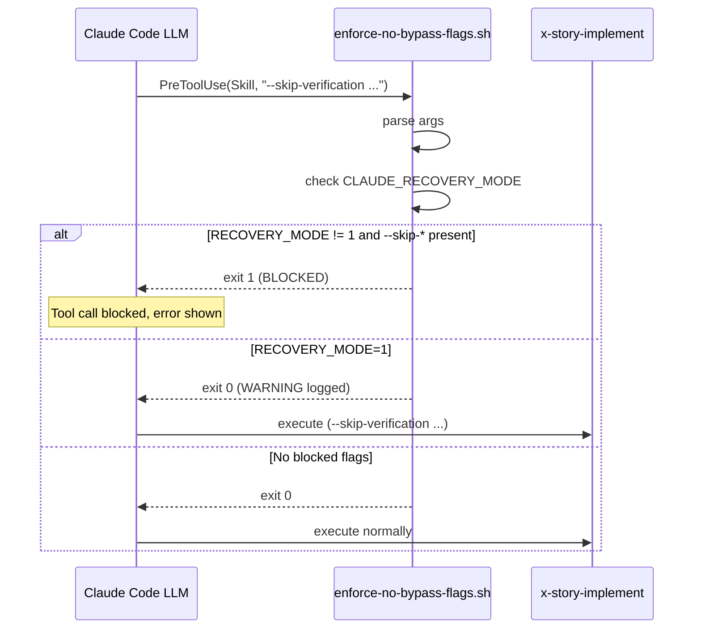

# História: PreToolUse Hook Bloqueia `--skip-*` Fora de Recovery

**ID:** story-0059-0003
**Chave Jira:** —
**Status:** Pendente

> **Status Transitions (Rule 22 — lifecycle-integrity):**
> valores permitidos `Pendente | Planejada | Em Andamento | Concluída | Falha | Bloqueada`.
> Ver [`.claude/rules/22-lifecycle-integrity.md`](../../.claude/rules/22-lifecycle-integrity.md).

## 1. Dependências

| Blocked By | Blocks |
| :--- | :--- |
| — | story-0059-0004 |

## 2. Regras Transversais Aplicáveis

| ID | Título |
| :--- | :--- |
| [RULE-059-01] | Dogfooding obrigatório |
| [RULE-059-02] | Aceitação: prova que o gate dispara |
| [RULE-059-07] | Env var policy: sem escape por variável |

## 3. Descrição

Como **operador do lifecycle**, eu quero que um PreToolUse hook bloqueie invocações de skills com flags `--skip-verification`, `--skip-review`, `--skip-smoke`, `--skip-pr-comments` ou `--no-ci-watch` fora de contexto de recovery, garantindo que o happy-path nunca pule uma fase obrigatória do orquestrador.

O bypass surface `G` (flags `--skip-*` em runtime) é silencioso: o operador pode passar `--skip-verification` ao invocar `/x-story-implement` e os artefatos de Fase 3 nunca são gerados. O hook PreToolUse `enforce-no-bypass-flags.sh` intercepta qualquer chamada à ferramenta `Skill` e inspeciona os args antes de permitir a execução.

O mecanismo de escape legítimo é `CLAUDE_RECOVERY_MODE=1`: quando a variável de ambiente está definida (setada por `x-internal-story-resume` em cenários de retomada com `staleWarnings != []`), o hook permite `--skip-*` sem bloquear. Isso preserva o fluxo de recovery sem comprometer o happy-path.

### 3.1 Flags bloqueadas

As seguintes flags são bloqueadas fora de `CLAUDE_RECOVERY_MODE=1`:

| Flag | Skill alvo |
| :--- | :--- |
| `--skip-verification` | `x-story-implement`, `x-task-implement` |
| `--skip-review` | `x-story-implement`, `x-epic-implement` |
| `--skip-smoke` | `x-story-implement`, `x-internal-story-verify` |
| `--skip-pr-comments` | `x-pr-fix-epic` |
| `--no-ci-watch` | `x-story-implement`, `x-release` |
| `--no-auto-remediation` | `x-story-implement` |

### 3.2 Integração com `settings.json`

O hook é registrado em `.claude/settings.json` na seção `hooks.PreToolUse` com matcher `Skill`:

```json
{
  "hooks": {
    "PreToolUse": [
      {
        "matcher": "Skill",
        "hooks": [
          { "type": "command", "command": ".claude/hooks/enforce-no-bypass-flags.sh" }
        ]
      }
    ]
  }
}
```

### 3.3 Comportamento do hook

1. Lê o JSON de input do stdin (Claude Code injeta o payload do tool call)
2. Extrai o campo `args` da chamada `Skill`
3. Para cada flag bloqueada: verifica se está presente no `args`
4. Se flag detectada e `CLAUDE_RECOVERY_MODE != 1`: imprime erro no stderr e sai com código não-zero (bloqueia o tool call)
5. Se `CLAUDE_RECOVERY_MODE=1`: imprime WARNING e permite (sai com código 0)
6. Se nenhuma flag bloqueada: sai com código 0 silenciosamente

### 3.4 RULE-059-07 compliance

O hook NÃO respeita `CLAUDE_SKIP_AUDIT=1`, `CLAUDE_NO_ENFORCE=1` ou qualquer variável de bypass. Apenas `CLAUDE_RECOVERY_MODE=1` é honrada.

## 3.5 Entrega de Valor

- **Valor Principal:** Bypass por flags `--skip-*` em happy-path é bloqueado na camada de ferramenta — antes da skill ser executada, não depois.
- **Métrica de Sucesso:** Qualquer invocação `Skill(skill: "x-story-implement", args: "--skip-verification ...")` fora de modo recovery retorna erro antes de executar a skill.
- **Impacto no Negócio:** Elimina surface `G` de bypass. Operador recebe feedback imediato durante a sessão em vez de descobrir o bypass horas depois no CI.

## 4. Definições de Qualidade Locais

### DoR Local

- [ ] Mecanismo de PreToolUse hook no Claude Code compreendido (formato do stdin JSON)
- [ ] `CLAUDE_RECOVERY_MODE=1` definido como env var canônica em `x-internal-story-resume`
- [ ] Lista exaustiva de flags bloqueadas revisada e validada com o PO

### DoD Local

- [ ] `.claude/hooks/enforce-no-bypass-flags.sh` criado e executável
- [ ] Hook registrado em `.claude/settings.json` com matcher `Skill`
- [ ] `CLAUDE_RECOVERY_MODE=1` permite flags sem bloquear
- [ ] Smoke test: `Skill(x-story-implement, --skip-verification)` → bloqueado
- [ ] Smoke test: `Skill(x-story-implement, --help)` → permitido
- [ ] Pelo menos 1 teste automatizado

### Global Definition of Done (DoD)

- **Cobertura:** ≥ 95% line, ≥ 90% branch
- **TDD Compliance:** Red-Green-Refactor obrigatório
- **Testes Automatizados:** Smoke de hook bloqueando e permitindo

## 5. Contratos de Dados

### 5.1 Input do hook (stdin, JSON)

| Campo | Tipo | M/O | Descrição |
| :--- | :--- | :--- | :--- |
| `tool_name` | `String` | M | Sempre `"Skill"` |
| `tool_input.skill` | `String` | M | Nome da skill |
| `tool_input.args` | `String` | M | Argumentos passados |
| `tool_input.model` | `String` | O | Tier do modelo |

### 5.2 Exit Codes do Hook

| Exit | Condição |
| :--- | :--- |
| 0 | Nenhuma flag bloqueada detectada, ou recovery mode ativo |
| 1 | Flag `--skip-*` detectada fora de recovery mode — tool call bloqueado |

## 6. Diagramas

### 6.1 Fluxo do Hook PreToolUse



## 7. Critérios de Aceite (Gherkin)

```gherkin
Cenario: Hook permite invocação sem flags bloqueadas
  DADO que CLAUDE_RECOVERY_MODE não está definida
  QUANDO Skill(x-story-implement, "--story-id story-0059-0001") é invocado
  ENTÃO o hook retorna exit 0
  E a skill é executada normalmente

Cenario: Hook bloqueia --skip-verification em happy path
  DADO que CLAUDE_RECOVERY_MODE não está definida
  QUANDO Skill(x-story-implement, "--skip-verification --story-id story-0059-0001") é invocado
  ENTÃO o hook retorna exit 1
  E a skill NÃO é executada
  E o stderr contém "BLOCKED: --skip-verification não permitido fora de recovery mode"

Cenario: Hook bloqueia --no-ci-watch em happy path
  DADO que CLAUDE_RECOVERY_MODE não está definida
  QUANDO Skill(x-story-implement, "--no-ci-watch") é invocado
  ENTÃO o hook retorna exit 1

Cenario: Hook permite --skip-verification em recovery mode
  DADO que CLAUDE_RECOVERY_MODE=1 está definida
  QUANDO Skill(x-story-implement, "--skip-verification") é invocado
  ENTÃO o hook retorna exit 0
  E o stderr contém "WARNING: --skip-verification permitido (recovery mode)"
  E a skill é executada

Cenario: Hook não é afetado por CLAUDE_SKIP_AUDIT=1
  DADO que CLAUDE_SKIP_AUDIT=1 está definida
  E CLAUDE_RECOVERY_MODE não está definida
  QUANDO Skill(x-story-implement, "--skip-verification") é invocado
  ENTÃO o hook retorna exit 1 (BLOCKED)
  E ignora CLAUDE_SKIP_AUDIT

Cenario: Hook permite invocação de skill não-orquestradora
  DADO que CLAUDE_RECOVERY_MODE não está definida
  QUANDO Skill(x-git-commit, "--skip-verification") é invocado
  ENTÃO o hook retorna exit 0
  E não bloqueia (x-git-commit não é orchestrator)
```

## 8. Tasks

### TASK-0059-0003-001: Criar enforce-no-bypass-flags.sh

- **Layer:** Adapter (hook script)
- **Test Type:** Smoke
- **Size:** M
- **Dependencies:** —
- **Branch:** `feat/task-0059-0003-001-enforce-no-bypass-hook`
- **Testability:** Port + Adapter + IT
- **Files:**
  - `.claude/hooks/enforce-no-bypass-flags.sh`
  - `src/test/bash/enforce-no-bypass-flags.bats`
- **Acceptance Criteria:**
  - [ ] Parse stdin JSON para extrair `tool_input.args`
  - [ ] Verifica flags bloqueadas contra whitelist
  - [ ] Respeita `CLAUDE_RECOVERY_MODE=1`
  - [ ] Exit 1 quando bloqueado; stderr com mensagem clara

### TASK-0059-0003-002: Registrar hook em .claude/settings.json

- **Layer:** Config
- **Test Type:** Verification
- **Size:** S
- **Dependencies:** TASK-0059-0003-001
- **Branch:** `feat/task-0059-0003-002-register-hook-settings`
- **Testability:** Config + VerificationTest
- **Files:**
  - `.claude/settings.json`
  - `src/test/bash/settings-hook-registration.bats`
- **Acceptance Criteria:**
  - [ ] `PreToolUse` array em settings.json contém entry com matcher `Skill`
  - [ ] Command aponta para `.claude/hooks/enforce-no-bypass-flags.sh`
  - [ ] `--self-check` do hook valida que a registration está correta

### TASK-0059-0003-003: Documentar CLAUDE_RECOVERY_MODE em SKILL.md dos orquestradores

- **Layer:** Doc
- **Test Type:** Verification
- **Size:** S
- **Dependencies:** TASK-0059-0003-001
- **Branch:** `feat/task-0059-0003-003-recovery-mode-docs`
- **Testability:** Config + VerificationTest
- **Files:**
  - `.claude/skills/x-story-implement/SKILL.md` (## Recovery section)
  - `.claude/skills/x-epic-implement/SKILL.md` (## Recovery section)
- **Acceptance Criteria:**
  - [ ] Seção `## Recovery` em x-story-implement documenta `CLAUDE_RECOVERY_MODE=1`
  - [ ] Explicação clara de quando e como usar o env var
