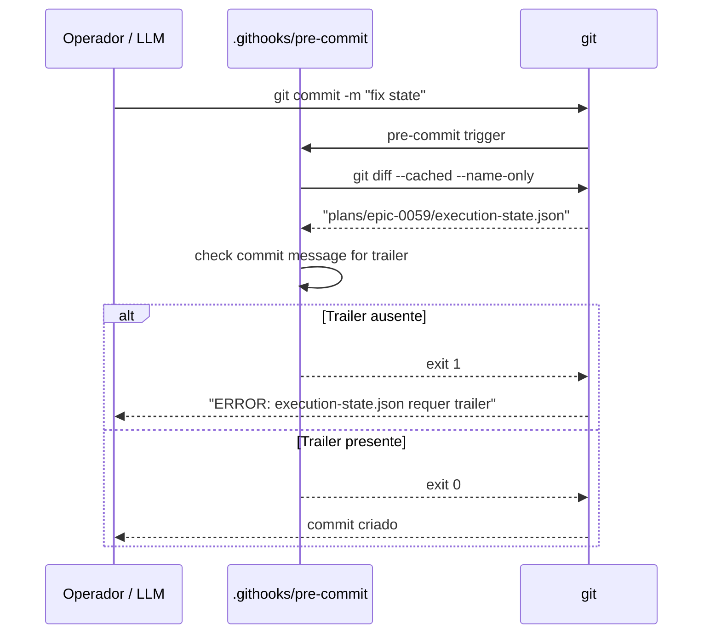

# História: Pre-commit Hook Protege `execution-state.json`

**ID:** story-0059-0004
**Chave Jira:** —
**Status:** Pendente

> **Status Transitions (Rule 22 — lifecycle-integrity):**
> valores permitidos `Pendente | Planejada | Em Andamento | Concluída | Falha | Bloqueada`.
> Ver [`.claude/rules/22-lifecycle-integrity.md`](../../.claude/rules/22-lifecycle-integrity.md).

## 1. Dependências

| Blocked By | Blocks |
| :--- | :--- |
| story-0059-0003 | story-0059-0005 |

## 2. Regras Transversais Aplicáveis

| ID | Título |
| :--- | :--- |
| [RULE-059-01] | Dogfooding obrigatório |
| [RULE-059-02] | Aceitação: prova que o gate dispara |
| [RULE-059-07] | Env var policy: sem escape por variável |

## 3. Descrição

Como **operador do lifecycle**, eu quero que commits que tocam `plans/epic-*/execution-state.json` sejam rejeitados localmente se a mensagem do commit não contém o trailer `x-internal-status-update: <sha>`, garantindo que o estado de execução só seja mutado pelo orquestrador canônico.

O bypass surface `F` (edição direta de `execution-state.json`) permite que o operador force-complete uma story editando o JSON sem rodar o orquestrador. O pre-commit hook cria uma barreira local: o commit só passa se o trailer foi injetado pela skill `x-internal-status-update`.

O trailer `x-internal-status-update: <sha>` é injetado automaticamente pela skill quando ela faz mutações no arquivo. A validação é feita pelo hook antes de cada commit local.

### 3.1 Trailer canônico

```
x-internal-status-update: <40-char-git-sha-da-skill>
```

- A skill `x-internal-status-update` injeta o trailer via `git commit -m "..." -m "x-internal-status-update: $(git rev-parse HEAD)"`
- O pre-commit hook verifica que o trailer está presente na mensagem do commit corrente

### 3.2 Sweep de call-sites

Antes de ativar o hook, todos os call-sites que escrevem em `execution-state.json` diretamente devem ser migrados para usar `x-internal-status-update`. A story inclui um sweep de verificação: `grep -r 'execution-state.json' .claude/skills/ | grep -v x-internal-status-update` deve retornar vazio.

### 3.3 Rejeição do commit

```bash
# .githooks/pre-commit snippet
if git diff --cached --name-only | grep -q 'execution-state.json'; then
  if ! git_message_contains_trailer "x-internal-status-update"; then
    echo "ERROR: execution-state.json pode ser mutado apenas por x-internal-status-update"
    echo "Use a skill x-internal-status-update ou adicione o trailer manualmente para operações de recovery"
    exit 1
  fi
fi
```

### 3.4 Recovery escape

Em operações de recovery documentadas (ex: state corruption), o operador pode adicionar o trailer manualmente com aprovação humana documentada. O hook valida apenas a presença do trailer, não a autenticidade do SHA (diferente do audit de artefatos).

## 3.5 Entrega de Valor

- **Valor Principal:** Edição manual de `execution-state.json` é bloqueada no commit local antes de chegar ao repositório — o state permanece autêntico e auditável.
- **Métrica de Sucesso:** `git commit` com `execution-state.json` staged sem trailer → exit 1 com mensagem clara em < 1s.
- **Impacto no Negócio:** Elimina surface `F`. A integridade do estado de execução das stories é garantida: apenas o orquestrador pode mutar o state, mantendo o audit trail completo.

## 4. Definições de Qualidade Locais

### DoR Local

- [ ] story-0059-0003 concluída (hook de PreToolUse já ativo)
- [ ] Lista de call-sites que tocam `execution-state.json` fora de `x-internal-status-update` levantada
- [ ] Mecanismo de trailer `git commit -m` documentado

### DoD Local

- [ ] Hook `.githooks/pre-commit` criado/estendido com verificação de trailer
- [ ] Sweep de call-sites: nenhum `execution-state.json` escrito fora de `x-internal-status-update`
- [ ] `x-internal-status-update` injeta trailer automaticamente
- [ ] Smoke test: commit com `execution-state.json` sem trailer → exit 1
- [ ] Smoke test: commit com `execution-state.json` com trailer → permitido

### Global Definition of Done (DoD)

- **Cobertura:** ≥ 95% line, ≥ 90% branch
- **TDD Compliance:** Red-Green-Refactor obrigatório

## 5. Contratos de Dados

### 5.1 Trailer Format

| Campo | Tipo | Formato | Exemplo |
| :--- | :--- | :--- | :--- |
| `x-internal-status-update` | `String(40)` | `[0-9a-f]{40}` | `abc123...` (SHA da skill) |

### 5.2 Exit Codes do Hook

| Exit | Condição |
| :--- | :--- |
| 0 | `execution-state.json` não staged, ou trailer presente |
| 1 | `execution-state.json` staged sem trailer |

## 6. Diagramas

### 6.1 Fluxo do Pre-commit Hook



## 7. Critérios de Aceite (Gherkin)

```gherkin
Cenario: Commit sem execution-state.json passa normalmente
  DADO que apenas arquivos de código estão staged
  QUANDO git commit é executado
  ENTÃO o pre-commit hook retorna exit 0
  E o commit é criado

Cenario: Commit com execution-state.json e trailer válido passa
  DADO que plans/epic-0059/execution-state.json está staged
  E a mensagem do commit contém "x-internal-status-update: abc123..."
  QUANDO git commit é executado
  ENTÃO o pre-commit hook retorna exit 0

Cenario: Commit com execution-state.json sem trailer é rejeitado
  DADO que plans/epic-0059/execution-state.json está staged
  E a mensagem do commit não contém "x-internal-status-update:"
  QUANDO git commit é executado
  ENTÃO o pre-commit hook retorna exit 1
  E o stderr contém "execution-state.json pode ser mutado apenas por x-internal-status-update"
  E o commit NÃO é criado

Cenario: x-internal-status-update injeta trailer automaticamente
  DADO que x-internal-status-update é invocado para atualizar story-0059-0001 para Concluída
  QUANDO a skill executa e comita a mudança
  ENTÃO o commit tem trailer "x-internal-status-update: <sha>"
  E o pre-commit hook permite o commit

Cenario: Sweep confirma que nenhum call-site escreve diretamente no JSON
  DADO que o sweep grep é executado
  QUANDO grep -r 'execution-state.json' .claude/skills/ | grep -v x-internal-status-update
  ENTÃO não retorna nenhuma linha (zero matches)
```

## 8. Tasks

### TASK-0059-0004-001: Sweep e migrar call-sites de execution-state.json

- **Layer:** Adapter (SKILL.md)
- **Test Type:** Verification
- **Size:** M
- **Dependencies:** —
- **Branch:** `feat/task-0059-0004-001-sweep-callsites`
- **Testability:** Config + VerificationTest
- **Files:**
  - Todos os SKILL.md que tocam `execution-state.json`
  - `src/test/bash/execution-state-callsites.bats`
- **Acceptance Criteria:**
  - [ ] Sweep: `grep -r 'execution-state.json' .claude/skills/ | grep -v x-internal-status-update` retorna vazio
  - [ ] Todo call-site migrado para usar `x-internal-status-update`

### TASK-0059-0004-002: Adicionar injeção de trailer em x-internal-status-update

- **Layer:** Adapter (SKILL.md)
- **Test Type:** Unit
- **Size:** S
- **Dependencies:** TASK-0059-0004-001
- **Branch:** `feat/task-0059-0004-002-trailer-injection`
- **Testability:** Domain + UnitTest
- **Files:**
  - `.claude/skills/x-internal-status-update/SKILL.md`
  - `src/test/bash/trailer-injection.bats`
- **Acceptance Criteria:**
  - [ ] Skill adiciona `-m "x-internal-status-update: $(git rev-parse HEAD)"` ao commit
  - [ ] Trailer aparece no git log do commit gerado

### TASK-0059-0004-003: Criar/estender .githooks/pre-commit para validar trailer

- **Layer:** Adapter (git hook)
- **Test Type:** Smoke
- **Size:** M
- **Dependencies:** TASK-0059-0004-002
- **Branch:** `feat/task-0059-0004-003-precommit-hook-state`
- **Testability:** Port + Adapter + IT
- **Files:**
  - `.githooks/pre-commit`
  - `src/test/bash/precommit-execution-state.bats`
- **Acceptance Criteria:**
  - [ ] Hook detecta `execution-state.json` no staged files
  - [ ] Valida presença de trailer na mensagem corrente
  - [ ] Exit 1 sem trailer; exit 0 com trailer
