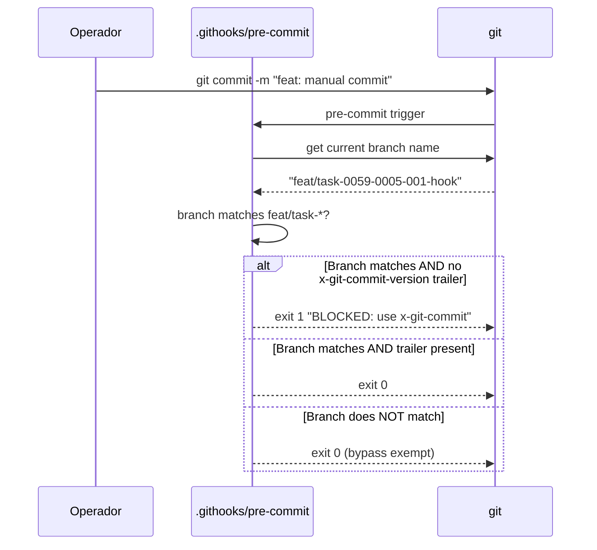

# História: Pre-commit Hook Exige Assinatura do Orquestrador em Branches `feat/task-*`

**ID:** story-0059-0005
**Chave Jira:** —
**Status:** Pendente

> **Status Transitions (Rule 22 — lifecycle-integrity):**
> valores permitidos `Pendente | Planejada | Em Andamento | Concluída | Falha | Bloqueada`.
> Ver [`.claude/rules/22-lifecycle-integrity.md`](../../.claude/rules/22-lifecycle-integrity.md).

## 1. Dependências

| Blocked By | Blocks |
| :--- | :--- |
| story-0059-0004 | story-0059-0006 |

## 2. Regras Transversais Aplicáveis

| ID | Título |
| :--- | :--- |
| [RULE-059-01] | Dogfooding obrigatório |
| [RULE-059-02] | Aceitação: prova que o gate dispara |
| [RULE-059-07] | Env var policy: sem escape por variável |

## 3. Descrição

Como **operador do lifecycle**, eu quero que commits em branches com padrão `feat/task-XXXX-YYYY-NNN-*` exijam um trailer `x-git-commit-version: <sha>` injetado por `x-git-commit`, garantindo que todo commit em branches de task passou pelo fluxo TDD do orquestrador.

O bypass surface `D` (commits manuais fora de `x-git-commit`) é detectável pelo padrão de branch: se a branch se chama `feat/task-*` mas os commits não têm a assinatura de `x-git-commit`, o TDD loop foi bypassado. O pre-commit hook valida esse invariante.

Branches que não casam `feat/task-XXXX-YYYY-NNN-*` (ex: `feat/story-*`, `fix/typo`, `chore/cleanup`) são isentas deste hook específico. Para garantir que PRs de stories referenciem pelo menos uma STORY-ID, o `audit-execution-integrity.sh` (story-0059-0001) já valida isso separadamente.

### 3.1 Trailer canônico injetado por `x-git-commit`

```
x-git-commit-version: <40-char-sha>
```

- A skill `x-git-commit` injeta o trailer em cada commit que produz
- O SHA referencia o HEAD no momento em que `x-git-commit` foi executado

### 3.2 Detecção de branch pattern

O hook detecta se a branch corrente casa `feat/task-[0-9]{4}-[0-9]{4}-[0-9]{3}-.*`. Se sim, valida trailer. Se não, permite sem verificação.

### 3.3 Sweep de `x-git-commit` injection

A skill `x-git-commit` precisa ser auditada para garantir que injeta o trailer em todos os casos. Um teste de aceitação valida que o commit produzido por `x-git-commit` contém o trailer.

## 3.5 Entrega de Valor

- **Valor Principal:** Commits manuais em branches de task (fora do ciclo TDD) são detectados e bloqueados localmente — o git log torna-se evidência confiável do processo TDD.
- **Métrica de Sucesso:** `git commit` sem trailer em `feat/task-*` branch → exit 1 em < 1s.
- **Impacto no Negócio:** Elimina surface `D`. Garante que toda mudança de código em task branch foi feita via `x-git-commit`, preservando o contrato TDD (Red-Green-Refactor com commits atômicos).

## 4. Definições de Qualidade Locais

### DoR Local

- [ ] story-0059-0004 concluída (pre-commit hook base já existe)
- [ ] Mecanismo de trailer injection em `x-git-commit` verificado
- [ ] Regex de branch `feat/task-XXXX-YYYY-NNN-*` validada com exemplos reais

### DoD Local

- [ ] Pre-commit hook estendido com validação de branch pattern
- [ ] `x-git-commit` injeta `x-git-commit-version` em todos os commits produzidos
- [ ] Branches que não casam `feat/task-*` são isentas
- [ ] Smoke test: commit manual em `feat/task-*` → exit 1
- [ ] Smoke test: commit via `x-git-commit` em `feat/task-*` → exit 0

### Global Definition of Done (DoD)

- **Cobertura:** ≥ 95% line, ≥ 90% branch
- **TDD Compliance:** Red-Green-Refactor obrigatório

## 5. Contratos de Dados

### 5.1 Detecção de Branch

| Campo | Regex | Exemplo match | Exemplo non-match |
| :--- | :--- | :--- | :--- |
| Branch corrente | `^feat/task-[0-9]{4}-[0-9]{4}-[0-9]{3}-` | `feat/task-0059-0005-001-hook` | `feat/story-0059-0005-hook` |

### 5.2 Trailer

| Trailer | Formato | Injetado por |
| :--- | :--- | :--- |
| `x-git-commit-version` | `[0-9a-f]{40}` | `x-git-commit` skill |

## 6. Diagramas

### 6.1 Fluxo do Hook em Branch task-*



## 7. Critérios de Aceite (Gherkin)

```gherkin
Cenario: Commit em branch não-task passa sem verificação de trailer
  DADO que a branch corrente é "feat/story-0059-0005-description"
  QUANDO git commit é executado sem trailer x-git-commit-version
  ENTÃO o hook retorna exit 0
  E o commit é criado

Cenario: Commit em branch task com trailer válido passa
  DADO que a branch corrente é "feat/task-0059-0005-001-hook"
  E o commit tem trailer "x-git-commit-version: abc123..."
  QUANDO git commit é executado
  ENTÃO o hook retorna exit 0

Cenario: Commit manual em branch task sem trailer é rejeitado
  DADO que a branch corrente é "feat/task-0059-0005-001-hook"
  E o commit NÃO tem trailer "x-git-commit-version:"
  QUANDO git commit é executado
  ENTÃO o hook retorna exit 1
  E o stderr contém "BLOCKED: commits em feat/task-* requerem x-git-commit-version"

Cenario: x-git-commit injeta trailer em commits de task branch
  DADO que x-git-commit é executado em feat/task-0059-0005-001-hook
  QUANDO a skill produz um commit
  ENTÃO o commit contém trailer "x-git-commit-version: <sha-40-chars>"
  E o pre-commit hook permite o commit

Cenario: Branch sem prefixo feat/ é isenta
  DADO que a branch corrente é "chore/cleanup-typo"
  QUANDO git commit é executado sem trailer
  ENTÃO o hook retorna exit 0
```

## 8. Tasks

### TASK-0059-0005-001: Adicionar injeção de trailer x-git-commit-version em x-git-commit

- **Layer:** Adapter (SKILL.md)
- **Test Type:** Unit
- **Size:** S
- **Dependencies:** —
- **Branch:** `feat/task-0059-0005-001-gitcommit-trailer`
- **Testability:** Domain + UnitTest
- **Files:**
  - `.claude/skills/x-git-commit/SKILL.md`
  - `src/test/bash/git-commit-trailer.bats`
- **Acceptance Criteria:**
  - [ ] `x-git-commit` adiciona `-m "x-git-commit-version: $(git rev-parse HEAD)"` ao commit
  - [ ] Trailer presente no git log

### TASK-0059-0005-002: Estender .githooks/pre-commit com validação de branch task-*

- **Layer:** Adapter (git hook)
- **Test Type:** Smoke
- **Size:** M
- **Dependencies:** TASK-0059-0005-001
- **Branch:** `feat/task-0059-0005-002-precommit-task-branch`
- **Testability:** Port + Adapter + IT
- **Files:**
  - `.githooks/pre-commit`
  - `src/test/bash/precommit-task-branch.bats`
- **Acceptance Criteria:**
  - [ ] Regex de branch `feat/task-[0-9]{4}-[0-9]{4}-[0-9]{3}-` implementada
  - [ ] Hook valida trailer somente em branches que casam
  - [ ] Exit 1 sem trailer em task branch; exit 0 caso contrário
