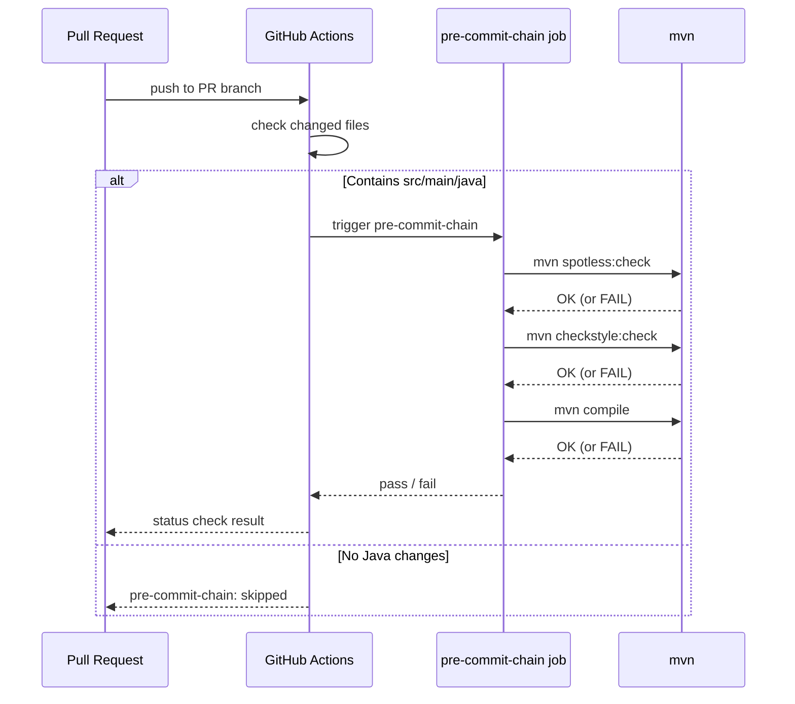

# História: CI Re-roda Pre-commit Chain no Merge Commit

**ID:** story-0059-0006
**Chave Jira:** —
**Status:** Pendente

> **Status Transitions (Rule 22 — lifecycle-integrity):**
> valores permitidos `Pendente | Planejada | Em Andamento | Concluída | Falha | Bloqueada`.
> Ver [`.claude/rules/22-lifecycle-integrity.md`](../../.claude/rules/22-lifecycle-integrity.md).

## 1. Dependências

| Blocked By | Blocks |
| :--- | :--- |
| story-0059-0005 | — |

## 2. Regras Transversais Aplicáveis

| ID | Título |
| :--- | :--- |
| [RULE-059-01] | Dogfooding obrigatório |
| [RULE-059-02] | Aceitação: prova que o gate dispara |
| [RULE-059-06] | Padronização de exit codes |

## 3. Descrição

Como **operador do lifecycle**, eu quero que o CI re-execute a pre-commit chain (`format → lint → compile`) no merge commit de cada PR, garantindo que `git commit --no-verify` local não permita que código mal-formatado ou com falhas de lint seja mergeado.

O bypass surface `E` (`git commit --no-verify`) é o mais fácil de usar: um único flag remove todos os pre-commit hooks locais. O CI já valida o build completo, mas não re-executa especificamente a chain de pre-commit com os mesmos parâmetros. Esta story adiciona um job dedicado no workflow de CI que:

1. Para cada commit do PR, verifica que `mvn spotless:check` (format) passa
2. Verifica que `mvn checkstyle:check` (lint) passa
3. Verifica que `mvn compile` retorna exit 0
4. Cache de `~/.m2` para evitar re-build pesado

O job só é executado quando há diferença em `src/main/java/**` (condicional no workflow).

### 3.1 Job de CI: `pre-commit-chain`

```yaml
# .github/workflows/ci-release.yml (novo job)
pre-commit-chain:
  name: Pre-commit Chain (format/lint/compile)
  runs-on: ubuntu-latest
  if: contains(toJSON(github.event.pull_request.changed_files), 'src/main/java')
  steps:
    - uses: actions/checkout@v4
    - uses: actions/setup-java@v4
      with:
        java-version: '21'
        cache: maven
    - name: Format check (Spotless)
      run: mvn spotless:check -q
    - name: Lint check (Checkstyle)
      run: mvn checkstyle:check -q
    - name: Compile
      run: mvn compile -q
```

### 3.2 Cache para performance

O job usa `actions/cache` para `~/.m2/repository` com chave derivada de `pom.xml` hash. Estimativa de economia: de ~4min para ~1min em re-runs (cache hit).

### 3.3 Condicional de execução

Job só roda quando o PR toca `src/main/java/**`. PRs que tocam apenas `plans/`, `.claude/`, ou `scripts/` não trigam o job (economia de CI time).

## 3.5 Entrega de Valor

- **Valor Principal:** `git commit --no-verify` local não permite bypass de format/lint — o CI valida independentemente e bloqueia o merge.
- **Métrica de Sucesso:** PR com commit `--no-verify` que viola Spotless → CI `pre-commit-chain` falha antes do merge approval.
- **Impacto no Negócio:** Elimina surface `E`. Garante que todo código mergeado passou pela mesma chain de qualidade que os pre-commit hooks locais aplicariam.

## 4. Definições de Qualidade Locais

### DoR Local

- [ ] story-0059-0005 concluída (chain local já definida e documentada)
- [ ] Workflow `.github/workflows/ci-release.yml` lido e estrutura compreendida
- [ ] Spotless e Checkstyle Maven plugins configurados no `pom.xml`

### DoD Local

- [ ] Job `pre-commit-chain` adicionado ao workflow CI
- [ ] Cache de `~/.m2` funcional (cache hit em re-run)
- [ ] Condicional `if: contains(...)` funcional — ignora PRs sem Java
- [ ] Smoke test: PR com arquivo Java mal-formatado → job falha

### Global Definition of Done (DoD)

- **Cobertura:** ≥ 95% line, ≥ 90% branch
- **TDD Compliance:** Red-Green-Refactor obrigatório

## 5. Contratos de Dados

### 5.1 Condições do Job

| Trigger | Condicional | Resultado |
| :--- | :--- | :--- |
| PR com diff em `src/main/java/**` | `true` | Job executa |
| PR apenas em `plans/`, `.claude/` | `false` | Job skipped |
| PR em `scripts/` apenas | `false` | Job skipped |

### 5.2 Exit Codes (passos individuais)

| Passo | Exit 0 | Exit 1+ |
| :--- | :--- | :--- |
| `mvn spotless:check` | Código formatado corretamente | Violação de format |
| `mvn checkstyle:check` | Sem violações de lint | Violação de lint |
| `mvn compile` | Compilação OK | Erro de compilação |

## 6. Diagramas

### 6.1 Fluxo do Job CI



## 7. Critérios de Aceite (Gherkin)

```gherkin
Cenario: Job não é executado para PR sem mudanças Java
  DADO que o PR modifica apenas plans/epic-0059/story-0059-0006.md
  QUANDO o CI é trigado pelo push
  ENTÃO o job pre-commit-chain fica em status "skipped"
  E não consome créditos de CI

Cenario: Job passa para código corretamente formatado e compilável
  DADO que o PR modifica src/main/java/... com código válido e formatado
  QUANDO o job pre-commit-chain executa
  ENTÃO mvn spotless:check retorna exit 0
  E mvn checkstyle:check retorna exit 0
  E mvn compile retorna exit 0
  E o status check fica verde

Cenario: Job falha para código com violação de Spotless
  DADO que o PR contém Java com formatação incorreta (via --no-verify local)
  QUANDO o job pre-commit-chain executa
  ENTÃO mvn spotless:check retorna exit 1
  E o PR fica bloqueado para merge

Cenario: Cache de ~/.m2 é utilizado em re-runs
  DADO que o job já executou uma vez com sucesso
  QUANDO o job é re-executado com mesmo pom.xml
  ENTÃO o passo de cache restore é bem-sucedido
  E o job completa em < 90s (sem download de dependências)

Cenario: Job falha para código que não compila
  DADO que o PR introduz erro de compilação
  QUANDO o job pre-commit-chain executa
  ENTÃO mvn compile retorna exit 1
  E o status check fica vermelho
```

## 8. Tasks

### TASK-0059-0006-001: Adicionar job pre-commit-chain ao workflow CI

- **Layer:** Config
- **Test Type:** Smoke
- **Size:** M
- **Dependencies:** —
- **Branch:** `feat/task-0059-0006-001-ci-precommit-job`
- **Testability:** Config + VerificationTest
- **Files:**
  - `.github/workflows/ci-release.yml`
- **Acceptance Criteria:**
  - [ ] Job `pre-commit-chain` definido com 3 passos (spotless, checkstyle, compile)
  - [ ] Condicional `if:` restringe execução a PRs com Java
  - [ ] Cache de `~/.m2` configurado com chave derivada de `pom.xml`

### TASK-0059-0006-002: Validar cache e performance do job

- **Layer:** Test
- **Test Type:** Smoke
- **Size:** S
- **Dependencies:** TASK-0059-0006-001
- **Branch:** `feat/task-0059-0006-002-ci-cache-validation`
- **Testability:** Migration + Smoke
- **Files:**
  - `.github/workflows/ci-release.yml`
  - `src/test/bash/ci-cache-perf.bats`
- **Acceptance Criteria:**
  - [ ] PR de teste com arquivo Java formatado → job verde
  - [ ] PR de teste com Java mal-formatado → job vermelho
  - [ ] Re-run com cache hit < 90s documentado

### TASK-0059-0006-003: Documentar bypass surface E como fechada em CHANGELOG

- **Layer:** Doc
- **Test Type:** Verification
- **Size:** S
- **Dependencies:** TASK-0059-0006-001
- **Branch:** `feat/task-0059-0006-003-changelog-surface-e`
- **Testability:** Config + VerificationTest
- **Files:**
  - `CHANGELOG.md`
- **Acceptance Criteria:**
  - [ ] CHANGELOG tem entrada `### Added` descrevendo o job
  - [ ] Menciona closure da bypass surface E
