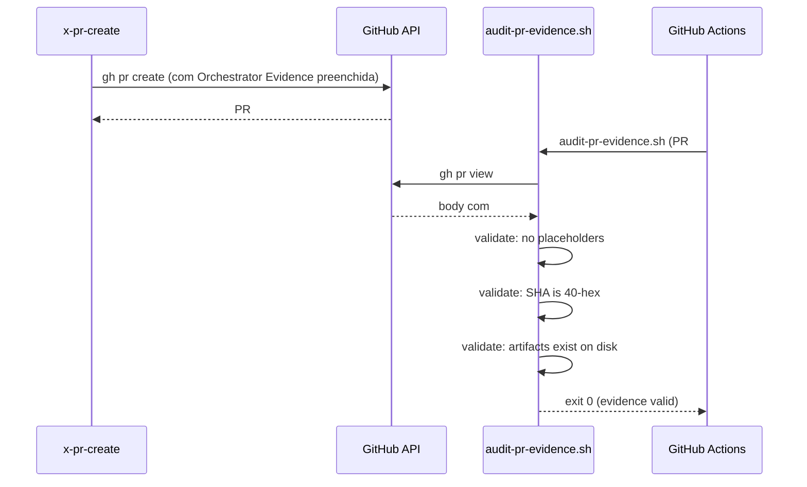

# História: PR Template + CI Valida "Orchestrator Evidence" Preenchida

**ID:** story-0059-0007
**Chave Jira:** —
**Status:** Pendente

> **Status Transitions (Rule 22 — lifecycle-integrity):**
> valores permitidos `Pendente | Planejada | Em Andamento | Concluída | Falha | Bloqueada`.
> Ver [`.claude/rules/22-lifecycle-integrity.md`](../../.claude/rules/22-lifecycle-integrity.md).

## 1. Dependências

| Blocked By | Blocks |
| :--- | :--- |
| — | story-0059-0008, story-0059-0009 |

## 2. Regras Transversais Aplicáveis

| ID | Título |
| :--- | :--- |
| [RULE-059-01] | Dogfooding obrigatório |
| [RULE-059-02] | Aceitação: prova que o gate dispara |
| [RULE-059-06] | Padronização de exit codes |

## 3. Descrição

Como **operador do lifecycle**, eu quero que todo PR tenha uma seção "## Orchestrator Evidence" preenchida pela skill `x-pr-create` com as story IDs implementadas, o commit SHA do orquestrador e a lista de artefatos, e que o CI rejeite PRs com essa seção vazia ou ausente, garantindo que PRs manuais (fora do fluxo `x-pr-create`) sejam detectados imediatamente.

O bypass surface `A` (skip completo do orquestrador) e `C` (gh pr create manual) são expostos por PRs que chegam sem a seção de evidência. Esta story cria o chokepoint: a seção "Orchestrator Evidence" é estruturada, obrigatória no PR body, e validada por `audit-pr-evidence.sh` antes de qualquer merge.

O arquivo `.github/pull_request_template.md` define a estrutura; `x-pr-create` preenche automaticamente; PRs criados via `gh pr create` manual ou via GitHub UI ficam com placeholders → rejeitados pelo audit.

### 3.1 Estrutura da seção "Orchestrator Evidence"

```markdown
## Orchestrator Evidence

<!-- Preenchido automaticamente por x-pr-create. Não editar manualmente. -->

| Campo | Valor |
| :--- | :--- |
| Story IDs | story-XXXX-YYYY, story-XXXX-ZZZZ |
| Orchestrator Commit SHA | abc123def456... |
| Invocation Skill | x-story-implement |
| Phase 1 Artifacts | plans/epic-XXXX/plans/arch-story-XXXX-YYYY.md, ... |
| Phase 3 Artifacts | plans/epic-XXXX/reports/verify-envelope-XXXX-YYYY.json, ... |
```

Placeholders detectados pelo audit: `story-XXXX-YYYY` (literal), `abc123def456...` (literal), ou campos vazios.

### 3.2 Modificações em `x-pr-create`

A skill `x-pr-create` estende o PR body com a seção `## Orchestrator Evidence`:
- `Story IDs`: extraído de `execution-state.json` (current story)
- `Orchestrator Commit SHA`: `git log --grep="x-story-implement" -1 --format="%H"`
- `Invocation Skill`: `x-story-implement` (hardcoded para story PRs)
- `Phase 1 Artifacts`: lista dos 6 artefatos existentes
- `Phase 3 Artifacts`: lista dos 4 artefatos existentes

### 3.3 Audit `audit-pr-evidence.sh` (novo)

Script CI que valida o body do PR:
1. `gh pr view --json body` extrai o body
2. Verifica presença de `## Orchestrator Evidence`
3. Verifica que `Story IDs` não é placeholder
4. Verifica que `Orchestrator Commit SHA` não é placeholder e é SHA válido (40 hex chars)
5. Verifica que cada artefato listado existe no filesystem

## 3.5 Entrega de Valor

- **Valor Principal:** PRs criados manualmente (sem `x-pr-create`) são detectados em CI antes de qualquer review humana — a seção "Orchestrator Evidence" ausente ou com placeholders é suficiente para rejeição.
- **Métrica de Sucesso:** `audit-pr-evidence.sh` retorna exit 1 para 100% dos PRs manuais (sem a seção preenchida) em < 30s.
- **Impacto no Negócio:** Elimina surfaces `A` e `C`. Todo PR mergeado tem evidência rastreável do orquestrador que o gerou, tornando o bypass detectável mesmo para revisores humanos.

## 4. Definições de Qualidade Locais

### DoR Local

- [ ] `x-pr-create` skill lida — ponto de injeção da seção identificado
- [ ] `.github/pull_request_template.md` não existe (ou estrutura existente documentada)
- [ ] Formato de `gh pr view --json body` compreendido

### DoD Local

- [ ] `.github/pull_request_template.md` criado com seção obrigatória
- [ ] `x-pr-create` preenche a seção automaticamente
- [ ] `audit-pr-evidence.sh` criado com exit codes do RULE-059-06
- [ ] Smoke test: PR manual sem seção → exit 1
- [ ] Smoke test: PR via x-pr-create → exit 0

### Global Definition of Done (DoD)

- **Cobertura:** ≥ 95% line, ≥ 90% branch
- **TDD Compliance:** Red-Green-Refactor obrigatório

## 5. Contratos de Dados

### 5.1 PR Template (campos obrigatórios)

| Campo | Tipo | Placeholder detectado | Válido quando |
| :--- | :--- | :--- | :--- |
| Story IDs | `String` | `story-XXXX-YYYY` (literal) | Pattern `story-[0-9]{4}-[0-9]{4}` |
| Orchestrator Commit SHA | `String(40)` | `abc123def456...` (literal) | `[0-9a-f]{40}` |
| Invocation Skill | `String` | vazio ou `x-story-implement` (literal) | Nome real de skill |
| Phase 1 Artifacts | `List<Path>` | ausente | ≥ 6 paths listados |
| Phase 3 Artifacts | `List<Path>` | ausente | ≥ 4 paths listados |

### 5.2 Exit Codes de `audit-pr-evidence.sh`

| Exit | Código | Condição |
| :--- | :--- | :--- |
| 0 | `OK` | Seção presente, sem placeholders, SHA válido, artefatos existem |
| 1 | `PRE_EVIDENCE_MISSING` | Seção ausente ou com placeholders |
| 2 | `PRE_BASELINE_CORRUPT` | Baseline de PRs grandfathered malformado |
| 3 | `PRE_INVALID_EXEMPTION` | `audit-exempt` sem reason |
| 4 | `PRE_ENFORCEMENT_BROKEN` | script --self-check falhou |

## 6. Diagramas

### 6.1 Fluxo de Criação e Validação de PR



## 7. Critérios de Aceite (Gherkin)

```gherkin
Cenario: Audit passa para PR criado via x-pr-create com seção preenchida
  DADO que x-pr-create criou PR com seção "## Orchestrator Evidence"
  E a seção tem Story IDs reais, SHA válido e artefatos existentes
  QUANDO audit-pr-evidence.sh é executado
  ENTÃO retorna exit 0

Cenario: Audit falha para PR sem seção Orchestrator Evidence
  DADO que o PR foi criado manualmente via "gh pr create --body '## Summary...'"
  E o body não tem seção "## Orchestrator Evidence"
  QUANDO audit-pr-evidence.sh é executado
  ENTÃO retorna exit 1 (PRE_EVIDENCE_MISSING)
  E a mensagem indica "## Orchestrator Evidence section missing"

Cenario: Audit falha para PR com placeholders não substituídos
  DADO que o PR tem seção "## Orchestrator Evidence"
  MAS "Story IDs" contém "story-XXXX-YYYY" (placeholder literal)
  QUANDO audit-pr-evidence.sh é executado
  ENTÃO retorna exit 1 (PRE_EVIDENCE_MISSING)

Cenario: Audit falha quando SHA do orquestrador não é válido (40 hex)
  DADO que "Orchestrator Commit SHA" contém "abc123def456..." (placeholder)
  QUANDO audit-pr-evidence.sh é executado
  ENTÃO retorna exit 1

Cenario: x-pr-create preenche a seção automaticamente
  DADO que x-pr-create é invocado com story-id story-0059-0007
  QUANDO a skill cria o PR
  ENTÃO o body tem "## Orchestrator Evidence" preenchida
  E "Story IDs" contém "story-0059-0007"
  E "Orchestrator Commit SHA" tem 40 hex chars
  E lista os 6 artefatos de Fase 1

Cenario: PR de chore/docs com --no-story-evidence é isento
  DADO que o PR é criado com flag --no-story-evidence (ex: PR de CHANGELOG)
  QUANDO audit-pr-evidence.sh é executado
  ENTÃO retorna exit 0
  E registra "no evidence required (--no-story-evidence)"
```

## 8. Tasks

### TASK-0059-0007-001: Criar .github/pull_request_template.md com seção obrigatória

- **Layer:** Doc
- **Test Type:** Verification
- **Size:** S
- **Dependencies:** —
- **Branch:** `feat/task-0059-0007-001-pr-template`
- **Testability:** Config + VerificationTest
- **Files:**
  - `.github/pull_request_template.md`
- **Acceptance Criteria:**
  - [ ] Arquivo criado com seção `## Orchestrator Evidence` incluindo todos os campos
  - [ ] Placeholders documentados claramente como "preenchido por x-pr-create"

### TASK-0059-0007-002: Estender x-pr-create para preencher Orchestrator Evidence

- **Layer:** Adapter (SKILL.md)
- **Test Type:** Unit
- **Size:** M
- **Dependencies:** TASK-0059-0007-001
- **Branch:** `feat/task-0059-0007-002-xprcreate-evidence`
- **Testability:** Domain + UnitTest
- **Files:**
  - `.claude/skills/x-pr-create/SKILL.md`
  - `src/test/bash/pr-create-evidence.bats`
- **Acceptance Criteria:**
  - [ ] x-pr-create injeta `## Orchestrator Evidence` no body
  - [ ] SHA extraído de `git log --grep="x-story-implement" -1 --format="%H"`
  - [ ] Artefatos listados são os existentes em `plans/`

### TASK-0059-0007-003: Criar audit-pr-evidence.sh com todos os exit codes

- **Layer:** Adapter (script CI)
- **Test Type:** Smoke
- **Size:** M
- **Dependencies:** TASK-0059-0007-002
- **Branch:** `feat/task-0059-0007-003-audit-pr-evidence`
- **Testability:** Port + Adapter + IT
- **Files:**
  - `scripts/audit-pr-evidence.sh`
  - `src/test/bash/audit-pr-evidence.bats`
- **Acceptance Criteria:**
  - [ ] Todos os 5 exit codes implementados (0-4)
  - [ ] `--self-check` retorna exit 0 quando configurado corretamente
  - [ ] Smoke: PR sem seção → exit 1; PR com seção válida → exit 0
