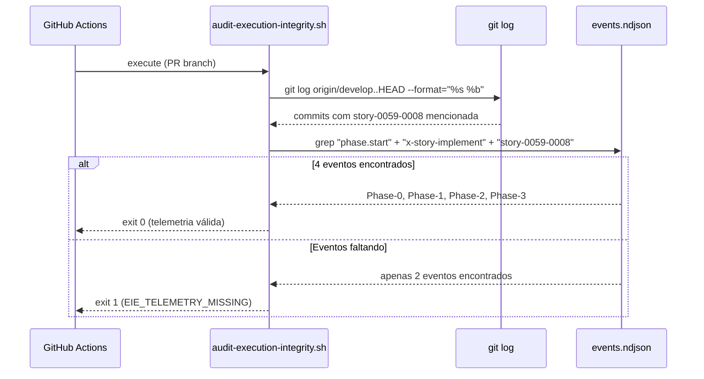
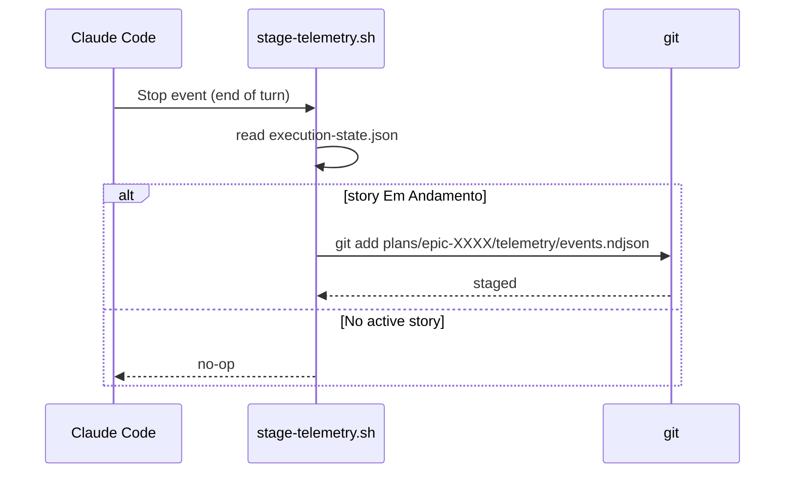

# História: Telemetria como Prova-de-Vida do Orquestrador

**ID:** story-0059-0008
**Chave Jira:** —
**Status:** Pendente

> **Status Transitions (Rule 22 — lifecycle-integrity):**
> valores permitidos `Pendente | Planejada | Em Andamento | Concluída | Falha | Bloqueada`.
> Ver [`.claude/rules/22-lifecycle-integrity.md`](../../.claude/rules/22-lifecycle-integrity.md).

## 1. Dependências

| Blocked By | Blocks |
| :--- | :--- |
| story-0059-0002, story-0059-0007 | story-0059-0009, story-0059-0011 |

## 2. Regras Transversais Aplicáveis

| ID | Título |
| :--- | :--- |
| [RULE-059-01] | Dogfooding obrigatório |
| [RULE-059-02] | Aceitação: prova que o gate dispara |
| [RULE-059-06] | Padronização de exit codes |
| [RULE-059-07] | Env var policy: sem escape por variável |

## 3. Descrição

Como **operador do lifecycle**, eu quero que o audit de evidência valide a presença de eventos de telemetria de `x-story-implement` em `plans/epic-XXXX/telemetry/events.ndjson` para cada STORY-ID referenciada no PR, garantindo que a ausência completa do orquestrador seja detectada deterministicamente.

Esta story fecha o bypass mais crítico: surface `A` (skip completo do orquestrador) e surface `H` (telemetria sem eventos do orquestrador). O diagnóstico de EPIC-0057 mostrou que a telemetria é o único rastro confiável da execução real do orquestrador — 171 eventos registrados mas nenhum de `x-story-implement`. Com esta story, esse rastro ausente se torna um bloqueio de CI.

A telemetria precisa ser commitada no repositório (incluída no staging antes do push). Um Stop hook garante que `events.ndjson` é adicionado ao staging ao final de cada turn do LLM quando há atividade de story em progresso.

### 3.1 Eventos mandatórios por STORY-ID

Para cada `story-XXXX-YYYY` mencionada nos commits do PR, o audit exige presença em `events.ndjson`:

| Evento | Phase | Obrigatório? |
| :--- | :--- | :--- |
| `phase.start x-story-implement Phase-0-Prepare` | Phase 0 | Sim |
| `phase.start x-story-implement Phase-1-Plan` OU `[phase-1] skipped — PRE_PLANNED` | Phase 1 | Sim (um ou outro) |
| `phase.start x-story-implement Phase-2-Implement` | Phase 2 | Sim |
| `phase.start x-story-implement Phase-3-Verify` | Phase 3 | Sim |

Formato esperado de cada evento em NDJSON:
```json
{"event":"phase.start","skill":"x-story-implement","phase":"Phase-0-Prepare","storyId":"story-0059-0008","timestamp":"2026-04-26T14:00:00Z"}
```

### 3.2 Hook de staging automático de `events.ndjson`

Stop hook adicional: `.claude/hooks/stage-telemetry.sh`
- Detecta se há story em andamento via `execution-state.json`
- Se `storyStatuses[currentStory].status == "Em Andamento"`: adiciona `events.ndjson` ao git staging (`git add plans/epic-XXXX/telemetry/events.ndjson`)
- `events.ndjson` é git-tracked como evidência commitada

### 3.3 Detecção de STORY-ID nos commits do PR

O audit extrai STORY-IDs dos commits do PR via:
```bash
git log origin/develop..HEAD --format="%s %b" | grep -oP "story-\d{4}-\d{4}" | sort -u
```

Para cada STORY-ID extraída, valida os 4 eventos obrigatórios em `events.ndjson`.

### 3.4 Tolerância a Phase 1 skipada

Quando Phase 1 foi legitimamente pulada (pre-planned), o evento alternativo `[phase-1] skipped — PRE_PLANNED` é aceito como substituto. O audit valida a presença de um ou do outro.

## 3.5 Entrega de Valor

- **Valor Principal:** O bypass estilo EPIC-0057 (orquestrador completamente ausente) é detectado deterministicamente pela ausência de eventos `phase.start x-story-implement` na telemetria commitada.
- **Métrica de Sucesso:** `audit-execution-integrity.sh` detecta ausência de eventos de telemetria e retorna exit 1 para 100% dos PRs sem execução do orquestrador.
- **Impacto no Negócio:** Elimina surfaces `A` e `H`. É a defesa mais robusta: não pode ser bypassada sem também adulterar a telemetria commitada (detectável pelo anti-backfill de story-0059-0002).

## 4. Definições de Qualidade Locais

### DoR Local

- [ ] story-0059-0002 concluída (frontmatter de artefatos + anti-backfill implementado)
- [ ] story-0059-0007 concluída (PR template com seção de evidência)
- [ ] Formato de `events.ndjson` e campos obrigatórios documentados

### DoD Local

- [ ] `audit-execution-integrity.sh` estendido com validação de telemetria
- [ ] `.claude/hooks/stage-telemetry.sh` criado e registrado como Stop hook
- [ ] Extração de STORY-IDs dos commits do PR funcional
- [ ] Tolerância a Phase-1-PRE_PLANNED implementada
- [ ] Smoke test: PR sem eventos de `x-story-implement` → exit 1
- [ ] Smoke test: PR com todos os 4 eventos → exit 0

### Global Definition of Done (DoD)

- **Cobertura:** ≥ 95% line, ≥ 90% branch
- **TDD Compliance:** Red-Green-Refactor obrigatório

## 5. Contratos de Dados

### 5.1 Evento NDJSON (formato canônico)

| Campo | Tipo | M/O | Validações | Exemplo |
| :--- | :--- | :--- | :--- | :--- |
| `event` | `String` | M | `phase.start` \| `phase.end` | `"phase.start"` |
| `skill` | `String` | M | nome da skill | `"x-story-implement"` |
| `phase` | `String` | M | `Phase-N-Name` | `"Phase-0-Prepare"` |
| `storyId` | `String` | M | `story-\d{4}-\d{4}` | `"story-0059-0008"` |
| `timestamp` | `String` | M | ISO-8601 UTC | `"2026-04-26T14:00:00Z"` |

### 5.2 Eventos Mandatórios (validação do audit)

| Skill | Phase | Aceita alternativa? |
| :--- | :--- | :--- |
| `x-story-implement` | `Phase-0-Prepare` | Não |
| `x-story-implement` | `Phase-1-Plan` | Sim: `[phase-1] skipped — PRE_PLANNED` |
| `x-story-implement` | `Phase-2-Implement` | Não |
| `x-story-implement` | `Phase-3-Verify` | Não |

### 5.3 Exit Codes (extensão do audit)

| Exit | Código | Condição |
| :--- | :--- | :--- |
| 0 | `OK` | Todos os eventos presentes para todas as stories |
| 1 | `EIE_TELEMETRY_MISSING` | ≥ 1 story sem evento obrigatório em events.ndjson |
| 1 | `EIE_EVIDENCE_MISSING` | Sobreposição — ambas as falhas reportadas |

## 6. Diagramas

### 6.1 Fluxo de Validação de Telemetria



### 6.2 Stop Hook de Staging Automático



## 7. Critérios de Aceite (Gherkin)

```gherkin
Cenario: Audit passa quando todos os 4 eventos estão presentes
  DADO que o PR menciona story-0059-0008 nos commits
  E events.ndjson contém os 4 eventos phase.start de x-story-implement
  QUANDO audit-execution-integrity.sh é executado
  ENTÃO retorna exit 0

Cenario: Audit falha quando nenhum evento de x-story-implement existe
  DADO que o PR menciona story-0059-0008 nos commits
  MAS events.ndjson não tem nenhum evento "phase.start x-story-implement"
  QUANDO audit-execution-integrity.sh é executado
  ENTÃO retorna exit 1 (EIE_TELEMETRY_MISSING)
  E a mensagem indica "no x-story-implement telemetry for story-0059-0008"

Cenario: Audit aceita Phase-1 como PRE_PLANNED
  DADO que events.ndjson tem Phase-0, Phase-2, Phase-3 de x-story-implement
  E tem "[phase-1] skipped — PRE_PLANNED" para a story
  QUANDO audit é executado
  ENTÃO retorna exit 0 (Phase 1 skipped é aceito)

Cenario: Audit falha quando Phase-2 está ausente mesmo com outros presentes
  DADO que events.ndjson tem Phase-0, Phase-1, Phase-3 mas NÃO Phase-2
  QUANDO audit é executado
  ENTÃO retorna exit 1 (EIE_TELEMETRY_MISSING)
  E indica "Phase-2-Implement missing for story-0059-0008"

Cenario: Stop hook adiciona events.ndjson ao staging quando story está Em Andamento
  DADO que execution-state.json indica story-0059-0008 Em Andamento
  QUANDO stage-telemetry.sh é executado (Stop event)
  ENTÃO git status mostra events.ndjson como staged
  E o commit subsequente inclui o arquivo

Cenario: EPIC-0057 bypass é detectado (regressão)
  DADO que nenhum evento de x-story-implement existe em events.ndjson
  E events.ndjson tem 171 outros eventos (como em EPIC-0057)
  QUANDO audit é executado para qualquer story mencionada
  ENTÃO retorna exit 1 (EIE_TELEMETRY_MISSING) para cada story
```

## 8. Tasks

### TASK-0059-0008-001: Estender audit-execution-integrity.sh com validação de telemetria

- **Layer:** Adapter (script CI)
- **Test Type:** Smoke
- **Size:** L
- **Dependencies:** —
- **Branch:** `feat/task-0059-0008-001-audit-telemetry`
- **Testability:** Port + Adapter + IT
- **Files:**
  - `scripts/audit-execution-integrity.sh`
  - `src/test/bash/audit-telemetry.bats`
- **Acceptance Criteria:**
  - [ ] Extração de STORY-IDs dos commits do PR via `git log`
  - [ ] Validação dos 4 eventos obrigatórios em `events.ndjson`
  - [ ] Tolerância a `[phase-1] skipped — PRE_PLANNED`
  - [ ] Exit 1 `EIE_TELEMETRY_MISSING` quando eventos ausentes

### TASK-0059-0008-002: Criar .claude/hooks/stage-telemetry.sh Stop hook

- **Layer:** Adapter (hook script)
- **Test Type:** Smoke
- **Size:** M
- **Dependencies:** TASK-0059-0008-001
- **Branch:** `feat/task-0059-0008-002-stage-telemetry-hook`
- **Testability:** Port + Adapter + IT
- **Files:**
  - `.claude/hooks/stage-telemetry.sh`
  - `.claude/settings.json` (registro Stop hook)
  - `src/test/bash/stage-telemetry.bats`
- **Acceptance Criteria:**
  - [ ] Hook detecta story Em Andamento via `execution-state.json`
  - [ ] `git add events.ndjson` executado quando story ativa
  - [ ] Registrado em settings.json como Stop hook

### TASK-0059-0008-003: Documentar events.ndjson como evidência commitada

- **Layer:** Doc
- **Test Type:** Verification
- **Size:** S
- **Dependencies:** TASK-0059-0008-002
- **Branch:** `feat/task-0059-0008-003-telemetry-docs`
- **Testability:** Config + VerificationTest
- **Files:**
  - `.claude/skills/x-story-implement/SKILL.md` (seção telemetria como evidência)
  - `CHANGELOG.md`
- **Acceptance Criteria:**
  - [ ] x-story-implement documenta que events.ndjson é evidência commitada
  - [ ] CHANGELOG menciona telemetria como prova-de-vida
