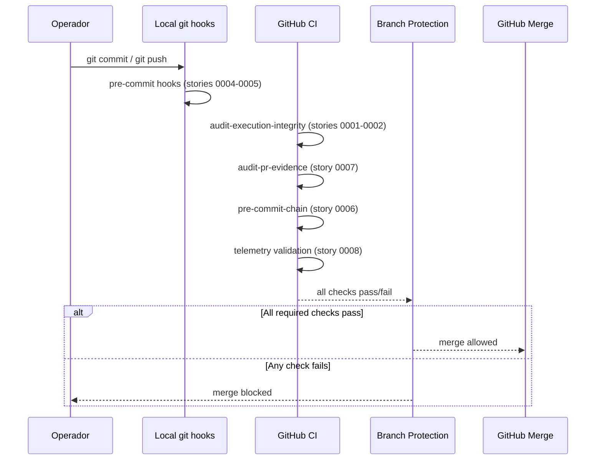

# História: GitHub Branch Protection + CODEOWNERS

**ID:** story-0059-0009
**Chave Jira:** —
**Status:** Pendente

> **Status Transitions (Rule 22 — lifecycle-integrity):**
> valores permitidos `Pendente | Planejada | Em Andamento | Concluída | Falha | Bloqueada`.
> Ver [`.claude/rules/22-lifecycle-integrity.md`](../../.claude/rules/22-lifecycle-integrity.md).

## 1. Dependências

| Blocked By | Blocks |
| :--- | :--- |
| story-0059-0008 | — |

## 2. Regras Transversais Aplicáveis

| ID | Título |
| :--- | :--- |
| [RULE-059-01] | Dogfooding obrigatório |
| [RULE-059-04] | Baseline é crítico (CODEOWNERS) |
| [RULE-059-06] | Padronização de exit codes |

## 3. Descrição

Como **operador do lifecycle**, eu quero que os required status checks do GitHub para `develop` e `main` incluam todos os audits do EPIC-0059 e que CODEOWNERS proteja os arquivos críticos de enforcement, garantindo que a proteção de branch seja a última linha de defesa caso todos os outros gates passem.

O bypass surface `K` (branch protection fraca) é o único que está fora do repositório — só pode ser configurado via API do GitHub. Esta story documenta e automatiza essa configuração via script idempotente `scripts/setup-branch-protection.sh`.

Esta story é SIMPLE scope: não cria novos mecanismos de enforcement (esses já foram criados em stories 0001–0008), apenas garante que eles são required status checks e que os arquivos críticos têm proteção de review humana.

### 3.1 Required Status Checks para `develop` e `main`

```
- audit-execution-integrity
- audit-bypass-flags
- audit-phase-gates
- audit-task-hierarchy
- audit-model-selection
- audit-pr-evidence                    (novo, story-0059-0007)
- LifecycleIntegrityAuditTest
- RA9-audit
- pre-commit-chain                     (novo, story-0059-0006)
```

### 3.2 CODEOWNERS para arquivos críticos

```
# .github/CODEOWNERS
# Enforcement infrastructure — requires human review
.claude/rules/                    @edercnj
.claude/hooks/                    @edercnj
scripts/audit-*.sh                @edercnj
audits/*-baseline.txt             @edercnj
.github/CODEOWNERS                @edercnj
.github/pull_request_template.md  @edercnj
```

### 3.3 Script `scripts/setup-branch-protection.sh`

Script idempotente que configura via `gh api`:
```bash
gh api repos/{owner}/{repo}/branches/develop/protection \
  --method PUT \
  --field required_status_checks='{"strict":true,"contexts":["audit-execution-integrity",...]}'  \
  --field enforce_admins=true \
  --field required_pull_request_reviews='{"required_approving_review_count":1}'
```

### 3.4 Documentação `.github/SETUP-PROTECTION.md`

Documento explicando:
- Quais checks devem ser ativados e por quê
- Como rodar `setup-branch-protection.sh`
- Como verificar que as proteções estão ativas via `gh api`

## 3.5 Entrega de Valor

- **Valor Principal:** Branch protection garante que nenhum merge pode acontecer sem todos os audits passando — mesmo se um admin tentar forçar.
- **Métrica de Sucesso:** `gh api repos/{owner}/{repo}/branches/develop/protection | jq '.required_status_checks.contexts'` lista todos os 9 audits.
- **Impacto no Negócio:** Elimina surface `K`. A proteção de branch é o "teto de vidro" do enforcement: mesmo que um operador encontre uma forma de passar nos audits localmente, o merge requer os checks do CI remoto.

## 4. Definições de Qualidade Locais

### DoR Local

- [ ] story-0059-0008 concluída (todos os audits criados e testados)
- [ ] GitHub API access token disponível para configuração
- [ ] Nome dos GitHub Actions jobs documentado (para os `contexts` da proteção)

### DoD Local

- [ ] `.github/SETUP-PROTECTION.md` criado
- [ ] `scripts/setup-branch-protection.sh` idempotente e documentado
- [ ] `.github/CODEOWNERS` atualizado com arquivos críticos
- [ ] Self-check: `gh api` confirma checks configurados

### Global Definition of Done (DoD)

- **Cobertura:** ≥ 95% line, ≥ 90% branch (script Bash testado via bats)
- **TDD Compliance:** Red-Green-Refactor obrigatório

## 5. Contratos de Dados

### 5.1 CODEOWNERS Paths Protegidos

| Path | Owner | Justificativa |
| :--- | :--- | :--- |
| `.claude/rules/` | `@edercnj` | Rules carregadas em toda conversa |
| `.claude/hooks/` | `@edercnj` | Hooks de enforcement runtime |
| `scripts/audit-*.sh` | `@edercnj` | Scripts de CI audit |
| `audits/*-baseline.txt` | `@edercnj` | Baselines imutáveis (RULE-059-04) |
| `.github/CODEOWNERS` | `@edercnj` | Auto-referencial |
| `.github/pull_request_template.md` | `@edercnj` | Template de evidência |

## 6. Diagramas

### 6.1 Fluxo de Proteção em Camadas



## 7. Critérios de Aceite (Gherkin)

```gherkin
Cenario: setup-branch-protection.sh configura todos os 9 checks
  DADO que o script tem acesso ao GitHub API
  QUANDO scripts/setup-branch-protection.sh é executado
  ENTÃO gh api confirma 9 required status checks em develop
  E enforce_admins é true

Cenario: Script é idempotente (segunda execução não falha)
  DADO que o script já foi executado uma vez
  QUANDO executado novamente com os mesmos parâmetros
  ENTÃO retorna exit 0 sem erros
  E a configuração permanece idêntica

Cenario: CODEOWNERS requer review para alteração de audit scripts
  DADO que um PR modifica scripts/audit-execution-integrity.sh
  QUANDO o PR é aberto
  ENTÃO @edercnj é solicitado como reviewer obrigatório
  E o PR não pode ser mergeado sem a aprovação

Cenario: Merge sem checks passando é bloqueado pelo GitHub
  DADO que audit-execution-integrity falha para o PR
  QUANDO alguém tenta fazer merge
  ENTÃO o GitHub bloqueia o merge com "Required status check failed"
```

## 8. Tasks

### TASK-0059-0009-001: Criar scripts/setup-branch-protection.sh

- **Layer:** Adapter (script ops)
- **Test Type:** Smoke
- **Size:** M
- **Dependencies:** —
- **Branch:** `feat/task-0059-0009-001-branch-protection-script`
- **Testability:** Migration + Smoke
- **Files:**
  - `scripts/setup-branch-protection.sh`
  - `src/test/bash/branch-protection.bats`
- **Acceptance Criteria:**
  - [ ] Script configura os 9 required status checks via `gh api`
  - [ ] Idempotente: segunda execução retorna exit 0
  - [ ] `--dry-run` imprime o JSON que seria enviado sem executar

### TASK-0059-0009-002: Criar .github/CODEOWNERS e SETUP-PROTECTION.md

- **Layer:** Doc
- **Test Type:** Verification
- **Size:** S
- **Dependencies:** TASK-0059-0009-001
- **Branch:** `feat/task-0059-0009-002-codeowners-docs`
- **Testability:** Config + VerificationTest
- **Files:**
  - `.github/CODEOWNERS`
  - `.github/SETUP-PROTECTION.md`
- **Acceptance Criteria:**
  - [ ] CODEOWNERS protege os 6 paths críticos
  - [ ] SETUP-PROTECTION.md documenta todos os checks e como configurar
