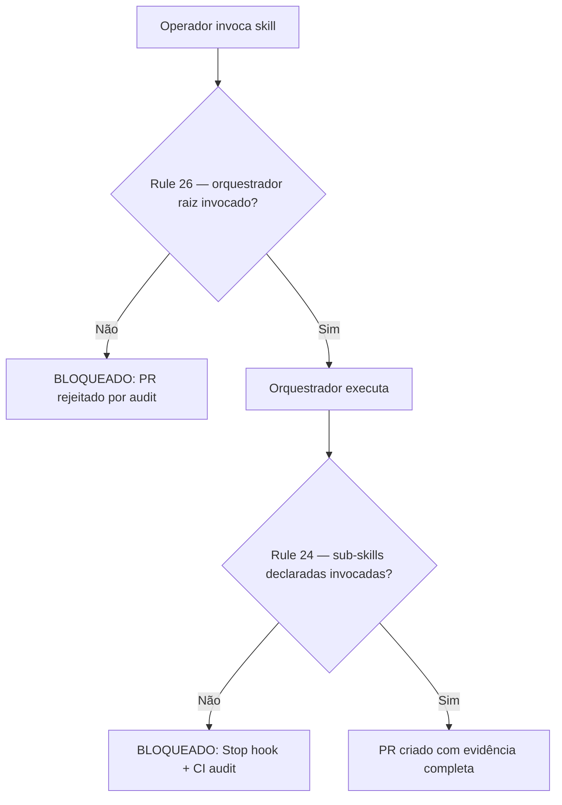

# História: Rule 26 + Bloco "ZERO-BYPASS" em CLAUDE.md

**ID:** story-0059-0010
**Chave Jira:** —
**Status:** Pendente

> **Status Transitions (Rule 22 — lifecycle-integrity):**
> valores permitidos `Pendente | Planejada | Em Andamento | Concluída | Falha | Bloqueada`.
> Ver [`.claude/rules/22-lifecycle-integrity.md`](../../.claude/rules/22-lifecycle-integrity.md).

## 1. Dependências

| Blocked By | Blocks |
| :--- | :--- |
| — | story-0059-0012 |

## 2. Regras Transversais Aplicáveis

| ID | Título |
| :--- | :--- |
| [RULE-059-01] | Dogfooding obrigatório |
| [RULE-059-05] | Rule 26 é carregada em toda conversa |

## 3. Descrição

Como **operador do lifecycle**, eu quero que o contrato Zero-Bypass Lifecycle seja codificado como Rule 26 normativa (carregada em toda conversa) e que o CLAUDE.md contenha um bloco "ZERO-BYPASS LIFECYCLE — INEGOCIÁVEL" no mesmo padrão da seção "EXECUTION INTEGRITY — NÃO NEGOCIÁVEL", garantindo que todo LLM iniciando uma sessão saiba que o bypass do orquestrador é proibido.

Esta story é complementar a Rule 24 (Execution Integrity — que garante que sub-skills declaradas são invocadas); Rule 26 garante que o orquestrador raiz é invocado. A distinção explícita é necessária porque Rule 24 assume que o orquestrador está rodando; Rule 26 proíbe que o operador pule o orquestrador inteiramente.

Sem deprecation window: vale para todo PR aberto APÓS o merge do EPIC-0059. PRs abertos antes (em EPIC-0054–0057) ficam na baseline (story-0059-0011).

### 3.1 Conteúdo de Rule 26

`.claude/rules/26-zero-bypass-lifecycle.md`:

- Purpose: distinção Rule 24 vs Rule 26
- Non-bypass Contract: lista das 12 surfaces catalogadas e o que é proibido
- Enforcement Layers: referencia os 4 layers (Camadas 1-4) implementados em EPIC-0059
- Exceptions: apenas `--legacy-flow` em epics pre-EPIC-0049 (Rule 19) e hotfixes documentados
- Forbidden: o que não pode ser feito
- Audit: referência ao `audit-execution-integrity.sh` estendido

### 3.2 Bloco CLAUDE.md

Adicionar após a seção de EPIC-0055 (mais recente relevante):

```markdown
> **ZERO-BYPASS LIFECYCLE — INEGOCIÁVEL:** Toda story/task DEVE ser implementada
> via `/x-story-implement`. Nenhum PR pode ser mergeado sem:
> (1) 6 artefatos de Fase 1 em `plans/epic-XXXX/plans/`;
> (2) 4 artefatos de Fase 3 em `plans/epic-XXXX/reports/`;
> (3) Eventos de telemetria de `x-story-implement` em `events.ndjson`;
> (4) Seção "## Orchestrator Evidence" preenchida no PR body.
> Bypass é detectado e bloqueado em CI. Não há escape hatch para happy-path.
> Ver [Rule 26](.claude/rules/26-zero-bypass-lifecycle.md) e [EPIC-0059](plans/epic-0059/).
```

### 3.3 Atualização do índice de rules em CLAUDE.md

Adicionar linha ao índice:

```
| 26 | `26-zero-bypass-lifecycle.md` | zero-bypass lifecycle contract |
```

## 3.5 Entrega de Valor

- **Valor Principal:** Toda sessão de Claude Code tem o contrato Zero-Bypass como instrução normativa — o LLM não pode "não saber" que o bypass é proibido.
- **Métrica de Sucesso:** `grep -r "26-zero-bypass" .claude/rules/` retorna o arquivo; CLAUDE.md contém o bloco normativo.
- **Impacto no Negócio:** Garante que o enforcement seja persistente e evolua com o projeto. Documenta explicitamente a diferença Rule 24/Rule 26 para futuros maintainers.

## 4. Definições de Qualidade Locais

### DoR Local

- [ ] Conteúdo de Rule 24 lido para garantir distinção clara
- [ ] CLAUDE.md lido — ponto de inserção identificado (após EPIC-0055)
- [ ] Índice de rules lido — número 26 disponível

### DoD Local

- [ ] `.claude/rules/26-zero-bypass-lifecycle.md` criado com todas as seções
- [ ] CLAUDE.md com bloco "ZERO-BYPASS LIFECYCLE — INEGOCIÁVEL" adicionado
- [ ] Índice de rules atualizado com Rule 26
- [ ] Self-check: arquivo existe e é carregado pelo sistema

### Global Definition of Done (DoD)

- **Cobertura:** N/A (story de documentação — cobertura via VerificationTest)
- **TDD Compliance:** Red-Green-Refactor obrigatório (mesmo para docs, cria o arquivo via teste primeiro)

## 5. Contratos de Dados

### 5.1 Estrutura de Rule 26

| Seção | Conteúdo | Obrigatório? |
| :--- | :--- | :--- |
| `## Purpose` | Distinção Rule 24 vs 26 | Sim |
| `## Non-bypass Contract` | 12 surfaces catalogadas | Sim |
| `## Enforcement Layers` | Referência às 4 camadas (Camadas 1-4) | Sim |
| `## Exceptions` | `--legacy-flow` + hotfixes documentados | Sim |
| `## Forbidden` | Lista do que é proibido | Sim |
| `## Audit` | Referência ao audit-execution-integrity.sh | Sim |

## 6. Diagramas

### 6.1 Relação Rule 24 vs Rule 26



## 7. Critérios de Aceite (Gherkin)

```gherkin
Cenario: Arquivo Rule 26 criado e acessível
  DADO que a story é implementada
  QUANDO ls .claude/rules/26-zero-bypass-lifecycle.md é executado
  ENTÃO o arquivo existe
  E contém todas as 6 seções obrigatórias

Cenario: CLAUDE.md contém bloco ZERO-BYPASS
  DADO que o arquivo CLAUDE.md é lido
  QUANDO grep "ZERO-BYPASS LIFECYCLE" CLAUDE.md é executado
  ENTÃO retorna a linha com o bloco normativo

Cenario: Índice de rules lista Rule 26
  DADO que o índice em CLAUDE.md é lido
  QUANDO grep "26-zero-bypass" CLAUDE.md é executado
  ENTÃO retorna a entrada do índice

Cenario: Rule 26 distingue claramente de Rule 24
  DADO que .claude/rules/26-zero-bypass-lifecycle.md é lido
  QUANDO a seção Purpose é inspecionada
  ENTÃO menciona Rule 24 (sub-skills) vs Rule 26 (orquestrador raiz)
```

## 8. Tasks

### TASK-0059-0010-001: Criar .claude/rules/26-zero-bypass-lifecycle.md

- **Layer:** Doc
- **Test Type:** Verification
- **Size:** M
- **Dependencies:** —
- **Branch:** `feat/task-0059-0010-001-rule-26`
- **Testability:** Config + VerificationTest
- **Files:**
  - `.claude/rules/26-zero-bypass-lifecycle.md`
  - `java/src/main/resources/targets/claude/rules/26-zero-bypass-lifecycle.md`
  - `src/test/bash/rule-26-structure.bats`
- **Acceptance Criteria:**
  - [ ] Arquivo criado com 6 seções obrigatórias
  - [ ] Purpose distingue Rule 24 vs Rule 26
  - [ ] 12 surfaces catalogadas em Non-bypass Contract

### TASK-0059-0010-002: Atualizar CLAUDE.md com bloco normativo e índice

- **Layer:** Doc
- **Test Type:** Verification
- **Size:** S
- **Dependencies:** TASK-0059-0010-001
- **Branch:** `feat/task-0059-0010-002-claude-md-zero-bypass`
- **Testability:** Config + VerificationTest
- **Files:**
  - `CLAUDE.md`
  - `java/src/main/resources/targets/claude/CLAUDE.md`
  - `src/test/bash/claude-md-rule26.bats`
- **Acceptance Criteria:**
  - [ ] Bloco "ZERO-BYPASS LIFECYCLE — INEGOCIÁVEL" adicionado
  - [ ] Índice de rules atualizado com linha para Rule 26
  - [ ] Link para `plans/epic-0059/` presente no bloco
