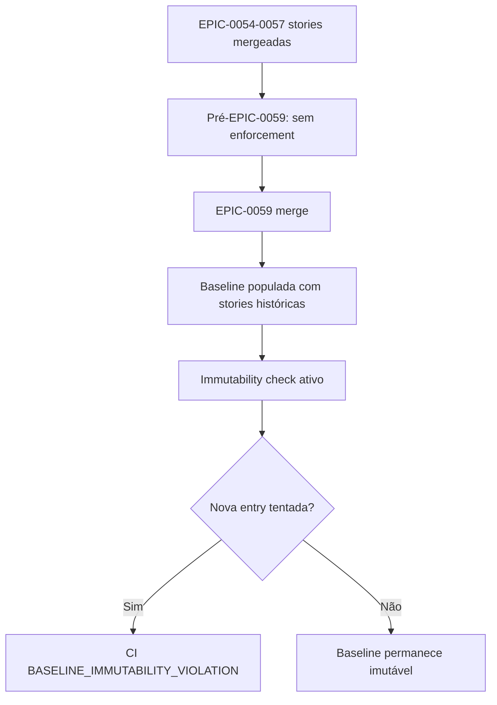

# História: Anistia Formal de EPIC-0054–0057 + Immutability Check

**ID:** story-0059-0011
**Chave Jira:** —
**Status:** Pendente

> **Status Transitions (Rule 22 — lifecycle-integrity):**
> valores permitidos `Pendente | Planejada | Em Andamento | Concluída | Falha | Bloqueada`.
> Ver [`.claude/rules/22-lifecycle-integrity.md`](../../.claude/rules/22-lifecycle-integrity.md).

## 1. Dependências

| Blocked By | Blocks |
| :--- | :--- |
| story-0059-0001, story-0059-0008 | — |

## 2. Regras Transversais Aplicáveis

| ID | Título |
| :--- | :--- |
| [RULE-059-01] | Dogfooding obrigatório |
| [RULE-059-03] | Proibição de auto-isenção |
| [RULE-059-04] | Baseline é crítico (CODEOWNERS) |

## 3. Descrição

Como **operador do lifecycle**, eu quero que todas as stories de EPIC-0054 a 0057 sejam adicionadas formalmente a `audits/execution-integrity-baseline.txt` e ao novo `audits/rule-26-baseline.txt`, e que um CI check valide que esses arquivos são imutáveis após o merge do EPIC-0059, garantindo que a anistia seja explícita e controlada.

O diagnóstico identificou que EPIC-0054, 0055, 0056 e 0057 tiveram stories mergeadas sem os artefatos e telemetria agora exigidos pelo EPIC-0059. Antes de ativar os gates, é necessário grandfathear essas stories na baseline — caso contrário, todos os PRs históricos dessas branches seriam retroativamente rejeitados.

A decisão de anistia é documentada em ADR-0015. O immutability check garante que ninguém pode adicionar novas entries à baseline após o EPIC-0059 mergear, mantendo o regime estrito para novos epics.

### 3.1 Inventário de stories para anistia

Levantar todas as stories mergeadas nos epics:
- EPIC-0054: stories 0054-0001 a 0054-000N
- EPIC-0055: stories 0055-0001 a 0055-000N
- EPIC-0056: stories 0056-0001 a 0056-000N
- EPIC-0057: stories 0057-0001 a 0057-000N

Fonte: `git log --grep="story-005[4567]-" --oneline epic/005[4567]` + `plans/epic-005[4567]/execution-state.json`.

### 3.2 Formato de entrada na baseline

```
story-0054-0001  # amnesty EPIC-0059: story merged pre-zero-bypass-enforcement (2026-04-26)
story-0055-0003  # amnesty EPIC-0059: story merged pre-zero-bypass-enforcement (2026-04-26)
```

### 3.3 `audits/rule-26-baseline.txt` (novo)

Arquivo para artefatos especificamente referentes ao enforcement de Rule 26. Segue o mesmo formato do `execution-integrity-baseline.txt`.

### 3.4 Immutability check

Script `audit-baseline-immutability.sh`:
- Compara o conteúdo dos baseline files com o commit que introduziu o EPIC-0059 merge
- Qualquer linha adicionada APÓS esse commit falha o build com `BASELINE_IMMUTABILITY_VIOLATION`
- Exceção: `<!-- baseline-correction: <reason> -->` permite correção com review humana via CODEOWNERS

### 3.5 ADR-0015

`adr/ADR-0015-zero-bypass-amnesty.md` documenta:
- Razão da anistia (stories mergeadas antes do enforcement)
- Lista dos epics anistiados
- Data de corte (merge date do EPIC-0059)
- Consequências (imutabilidade após corte)

## 3.5 Entrega de Valor

- **Valor Principal:** Anistia formal e documentada para 4 épicos históricos, sem quebrar retroativamente os builds existentes, com imutabilidade garantida para o futuro.
- **Métrica de Sucesso:** `audit-execution-integrity.sh` retorna exit 0 para todos os PRs históricos de EPIC-0054–0057; exit 1 para qualquer tentativa de adicionar nova entry à baseline após merge.
- **Impacto no Negócio:** Elimina o risco de retrocompabilidade. O enforcement é "clean break" — não penaliza o passado, mas é absoluto para o futuro.

## 4. Definições de Qualidade Locais

### DoR Local

- [ ] story-0059-0001 concluída (baseline de execution-integrity já funcional)
- [ ] story-0059-0008 concluída (telemetria como gate também funcional)
- [ ] Inventário completo de stories de EPIC-0054–0057 levantado

### DoD Local

- [ ] `audits/execution-integrity-baseline.txt` populado com stories de EPIC-0054–0057
- [ ] `audits/rule-26-baseline.txt` criado e populado
- [ ] `scripts/audit-baseline-immutability.sh` criado
- [ ] `adr/ADR-0015-zero-bypass-amnesty.md` criado
- [ ] Smoke test: adição de nova entry à baseline após corte → exit 1

### Global Definition of Done (DoD)

- **Cobertura:** ≥ 95% line, ≥ 90% branch
- **TDD Compliance:** Red-Green-Refactor obrigatório

## 5. Contratos de Dados

### 5.1 Formato da Baseline

| Campo | Formato | Exemplo |
| :--- | :--- | :--- |
| Story ID | `story-[0-9]{4}-[0-9]{4}` | `story-0057-0003` |
| Comentário | `# amnesty EPIC-0059: <reason> (<date>)` | `# amnesty EPIC-0059: pre-zero-bypass (2026-04-26)` |

### 5.2 Exit Codes de `audit-baseline-immutability.sh`

| Exit | Código | Condição |
| :--- | :--- | :--- |
| 0 | `OK` | Nenhuma linha adicionada após corte |
| 1 | `BASELINE_IMMUTABILITY_VIOLATION` | Nova entry detectada após EPIC-0059 merge |
| 2 | `BASELINE_CORRUPT` | Arquivo malformado |
| 4 | `ENFORCEMENT_BROKEN` | Cutoff commit não encontrado |

## 6. Diagramas

### 6.1 Ciclo de Vida da Baseline



## 7. Critérios de Aceite (Gherkin)

```gherkin
Cenario: Audit passa para stories de EPIC-0057 grandfathered
  DADO que story-0057-0003 está na baseline
  E não tem nenhum artefato de Fase 1
  QUANDO audit-execution-integrity.sh é executado
  ENTÃO retorna exit 0
  E indica "grandfathered: story-0057-0003"

Cenario: Immutability check bloqueia nova entry após corte
  DADO que o EPIC-0059 foi mergeado
  E alguém tenta adicionar "story-0059-0099" à baseline
  QUANDO audit-baseline-immutability.sh é executado
  ENTÃO retorna exit 1 (BASELINE_IMMUTABILITY_VIOLATION)
  E indica "story-0059-0099 added after cutoff"

Cenario: ADR-0015 existe e é bem formado
  DADO que a story é concluída
  QUANDO ls adr/ADR-0015-zero-bypass-amnesty.md é executado
  ENTÃO o arquivo existe
  E contém seções: Context, Decision, Consequences

Cenario: Baseline cobre todas as stories de EPIC-0054 a 0057
  DADO que os epics históricos têm N stories
  QUANDO grep -c "story-005[4567]-" audits/execution-integrity-baseline.txt é executado
  ENTÃO o count é igual ao número real de stories nos 4 epics
```

## 8. Tasks

### TASK-0059-0011-001: Inventariar e popular baseline com stories de EPIC-0054–0057

- **Layer:** Config
- **Test Type:** Verification
- **Size:** M
- **Dependencies:** —
- **Branch:** `feat/task-0059-0011-001-populate-baseline`
- **Testability:** Config + VerificationTest
- **Files:**
  - `audits/execution-integrity-baseline.txt`
  - `audits/rule-26-baseline.txt`
  - `src/test/bash/baseline-coverage.bats`
- **Acceptance Criteria:**
  - [ ] Inventário via `git log --grep="story-005[4567]"` + `execution-state.json`
  - [ ] Todas as stories dos 4 epics na baseline
  - [ ] Formato correto com comentário de amnesty

### TASK-0059-0011-002: Criar scripts/audit-baseline-immutability.sh

- **Layer:** Adapter (script CI)
- **Test Type:** Smoke
- **Size:** M
- **Dependencies:** TASK-0059-0011-001
- **Branch:** `feat/task-0059-0011-002-immutability-check`
- **Testability:** Port + Adapter + IT
- **Files:**
  - `scripts/audit-baseline-immutability.sh`
  - `src/test/bash/baseline-immutability.bats`
- **Acceptance Criteria:**
  - [ ] Detecta entries adicionadas após o cutoff commit
  - [ ] Exit 1 com `BASELINE_IMMUTABILITY_VIOLATION` para entradas novas
  - [ ] `--self-check` valida que o cutoff commit existe

### TASK-0059-0011-003: Criar ADR-0015 e registrar em workflow CI

- **Layer:** Doc
- **Test Type:** Verification
- **Size:** S
- **Dependencies:** TASK-0059-0011-002
- **Branch:** `feat/task-0059-0011-003-adr-0015`
- **Testability:** Config + VerificationTest
- **Files:**
  - `adr/ADR-0015-zero-bypass-amnesty.md`
  - `.github/workflows/ci-release.yml` (adicionar audit-baseline-immutability)
- **Acceptance Criteria:**
  - [ ] ADR-0015 com Context, Decision, Consequences
  - [ ] Job de CI roda `audit-baseline-immutability.sh` em cada PR
