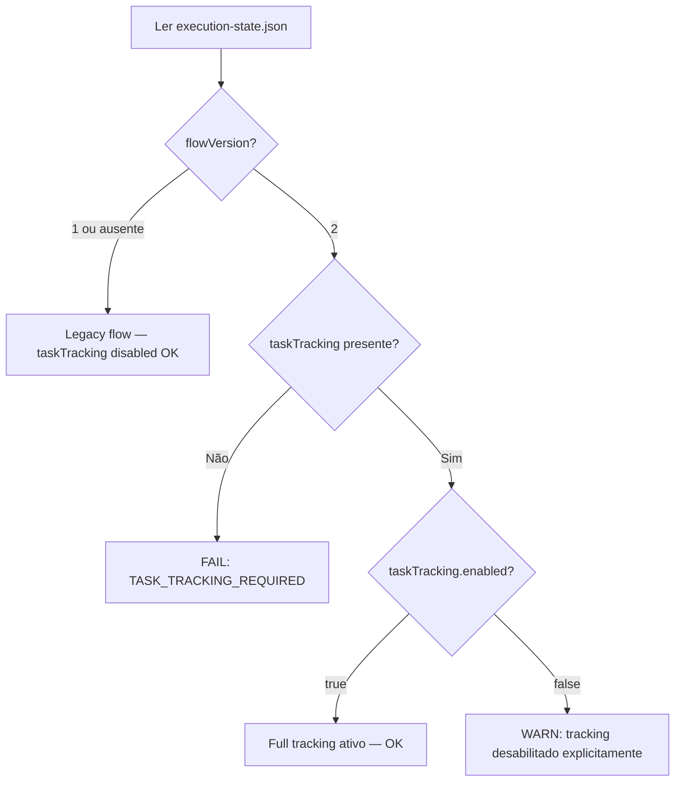

# História: `taskTracking.enabled=true` Mandatório para `flowVersion=2`

**ID:** story-0059-0012
**Chave Jira:** —
**Status:** Pendente

> **Status Transitions (Rule 22 — lifecycle-integrity):**
> valores permitidos `Pendente | Planejada | Em Andamento | Concluída | Falha | Bloqueada`.
> Ver [`.claude/rules/22-lifecycle-integrity.md`](../../.claude/rules/22-lifecycle-integrity.md).

## 1. Dependências

| Blocked By | Blocks |
| :--- | :--- |
| story-0059-0010 | — |

## 2. Regras Transversais Aplicáveis

| ID | Título |
| :--- | :--- |
| [RULE-059-01] | Dogfooding obrigatório |
| [RULE-059-06] | Padronização de exit codes |

## 3. Descrição

Como **operador do lifecycle**, eu quero que `execution-state.json` com `flowVersion=2` exija `taskTracking.enabled=true`, e que epics existentes com `flowVersion=2` e `taskTracking` ausente ou desabilitado sejam migrados automaticamente, garantindo que o bypass surface `J` (taskTracking ausente vira no-op silencioso) seja eliminado.

O bypass surface `J` ocorre quando Rule 19 fallback matrix silenciosamente trata `taskTracking` ausente como `enabled=false`, tornando todos os phase gates no-ops. Com `flowVersion=2`, a intenção é sempre usar o tracking completo — o fallback para disabled deve ser uma configuração explícita, não um silêncio perigoso.

Esta story é SIMPLE scope: modifica Rule 19 (em CLAUDE.md e no arquivo da rule), adiciona o check de CI, e cria o script de migração para epics ativos.

### 3.1 Mudança na Rule 19

Atualizar a tabela de fallback de `taskTracking` em Rule 19:

| Condição | `flowVersion` | Comportamento atual | Comportamento novo |
| :--- | :--- | :--- | :--- |
| `taskTracking` ausente | `"1"` | `enabled=false` + WARN | Sem mudança |
| `taskTracking` ausente | `"2"` | `enabled=false` + WARN | **FALHA com `TASK_TRACKING_REQUIRED`** |
| `taskTracking.enabled=false` | `"2"` | tracking disabled | **WARN (explícito mas suspeito)** |
| `taskTracking.enabled=true` | `"2"` | full tracking | Sem mudança |

### 3.2 Deprecation window

- Após EPIC-0059 merge: `flowVersion=2` + `taskTracking` ausente → WARN por 1 release
- Após 2 releases: falha com `TASK_TRACKING_REQUIRED`

### 3.3 Script de migração

`scripts/migrate-task-tracking-v2.sh`:
- Scan: `find plans/epic-*/execution-state.json`
- Para cada file com `flowVersion=2` e `taskTracking` ausente ou `enabled=false`:
  - Adiciona/atualiza `"taskTracking": {"enabled": true}` via `jq`
- Idempotente: re-executar não modifica files já migrados
- Log: lista de files migrados e não-migrados

### 3.4 Audit CI

Script `audit-flow-version.sh` (extensão — Rule 19 §Audit):
- Adicionar check: `flowVersion=2` + `taskTracking` ausente → exit 1 `FLOW_VERSION_VIOLATION`

## 3.5 Entrega de Valor

- **Valor Principal:** Elimina o silêncio perigoso: `flowVersion=2` com `taskTracking` ausente deixa de ser um no-op válido e passa a ser um erro detectável no CI.
- **Métrica de Sucesso:** `audit-flow-version.sh` detecta 100% dos `execution-state.json` com `flowVersion=2` e `taskTracking` ausente.
- **Impacto no Negócio:** Elimina surface `J`. Garante que todos os epics modernos (`flowVersion=2`) têm phase gates e task tracking ativos — a visibilidade de execução (4 níveis de hierarquia de task) é obrigatória, não opcional.

## 4. Definições de Qualidade Locais

### DoR Local

- [ ] story-0059-0010 concluída (Rule 26 normativa ativa)
- [ ] Lista de `execution-state.json` com `flowVersion=2` levantada
- [ ] Formato atual de `audit-flow-version.sh` lido

### DoD Local

- [ ] Rule 19 atualizada com nova tabela de fallback para `flowVersion=2`
- [ ] `scripts/migrate-task-tracking-v2.sh` criado e testado
- [ ] `audit-flow-version.sh` estendido com check de `taskTracking`
- [ ] Todos os epics ativos com `flowVersion=2` migrados
- [ ] Smoke test: `execution-state.json` com `flowVersion=2` sem `taskTracking` → audit exit 1

### Global Definition of Done (DoD)

- **Cobertura:** ≥ 95% line, ≥ 90% branch
- **TDD Compliance:** Red-Green-Refactor obrigatório

## 5. Contratos de Dados

### 5.1 `execution-state.json` (após migração)

| Campo | flowVersion 1 | flowVersion 2 (após EPIC-0059) |
| :--- | :--- | :--- |
| `taskTracking` | optional (default disabled) | **obrigatório** |
| `taskTracking.enabled` | `false` default | `true` obrigatório |

### 5.2 Exit Codes (extensão de `audit-flow-version.sh`)

| Exit | Código | Condição |
| :--- | :--- | :--- |
| 0 | `OK` | `flowVersion=2` + `taskTracking.enabled=true` |
| 1 | `FLOW_VERSION_VIOLATION` | `flowVersion=2` + `taskTracking` ausente |
| 1 | `FLOW_VERSION_VIOLATION` | `flowVersion=2` + `taskTracking.enabled=false` (WARN first release, FAIL second) |

## 6. Diagramas

### 6.1 Lógica de Fallback Atualizada



## 7. Critérios de Aceite (Gherkin)

```gherkin
Cenario: audit-flow-version.sh passa para flowVersion=2 com taskTracking.enabled=true
  DADO que execution-state.json tem flowVersion="2" e taskTracking.enabled=true
  QUANDO audit-flow-version.sh é executado
  ENTÃO retorna exit 0

Cenario: audit-flow-version.sh falha para flowVersion=2 sem taskTracking
  DADO que execution-state.json tem flowVersion="2" MAS sem campo taskTracking
  QUANDO audit-flow-version.sh é executado
  ENTÃO retorna exit 1 (FLOW_VERSION_VIOLATION)
  E a mensagem indica "taskTracking required for flowVersion=2"

Cenario: audit-flow-version.sh permite flowVersion=1 sem taskTracking (backward compat)
  DADO que execution-state.json tem flowVersion="1" e sem taskTracking
  QUANDO audit-flow-version.sh é executado
  ENTÃO retorna exit 0 (legacy flow não é afetado)

Cenario: Script de migração adiciona taskTracking.enabled=true em epics ativos
  DADO que plans/epic-0059/execution-state.json tem flowVersion="2" e sem taskTracking
  QUANDO migrate-task-tracking-v2.sh é executado
  ENTÃO execution-state.json tem taskTracking.enabled=true
  E flowVersion permanece "2"

Cenario: Script de migração é idempotente
  DADO que migration já foi executada
  QUANDO migrate-task-tracking-v2.sh é executado novamente
  ENTÃO o arquivo não é modificado
  E o script retorna exit 0

Cenario: flowVersion=2 com taskTracking.enabled=false gera WARN
  DADO que execution-state.json tem flowVersion="2" e taskTracking.enabled=false
  QUANDO audit-flow-version.sh é executado
  ENTÃO retorna exit 0 (WARN somente — primeiro release)
  E stderr contém "WARN: taskTracking.enabled=false is suspicious for flowVersion=2"
```

## 8. Tasks

### TASK-0059-0012-001: Atualizar Rule 19 com nova tabela de fallback para flowVersion=2

- **Layer:** Doc
- **Test Type:** Verification
- **Size:** S
- **Dependencies:** —
- **Branch:** `feat/task-0059-0012-001-rule19-tasktracking`
- **Testability:** Config + VerificationTest
- **Files:**
  - `.claude/rules/19-backward-compatibility.md`
  - `java/src/main/resources/targets/claude/rules/19-backward-compatibility.md`
  - `src/test/bash/rule19-tasktracking.bats`
- **Acceptance Criteria:**
  - [ ] Tabela de fallback atualizada
  - [ ] `TASK_TRACKING_REQUIRED` documentado como novo error code
  - [ ] Deprecation window de 1 release documentado

### TASK-0059-0012-002: Criar scripts/migrate-task-tracking-v2.sh

- **Layer:** Adapter (script ops)
- **Test Type:** Unit
- **Size:** M
- **Dependencies:** TASK-0059-0012-001
- **Branch:** `feat/task-0059-0012-002-migrate-tasktracking`
- **Testability:** Domain + UnitTest
- **Files:**
  - `scripts/migrate-task-tracking-v2.sh`
  - `src/test/bash/migrate-tasktracking.bats`
- **Acceptance Criteria:**
  - [ ] Scan de `plans/epic-*/execution-state.json`
  - [ ] Adiciona `taskTracking.enabled=true` onde `flowVersion=2` e ausente
  - [ ] Idempotente
  - [ ] Log claro de arquivos migrados

### TASK-0059-0012-003: Estender audit-flow-version.sh com check de taskTracking

- **Layer:** Adapter (script CI)
- **Test Type:** Smoke
- **Size:** M
- **Dependencies:** TASK-0059-0012-002
- **Branch:** `feat/task-0059-0012-003-audit-flow-version-tracking`
- **Testability:** Port + Adapter + IT
- **Files:**
  - `scripts/audit-flow-version.sh`
  - `src/test/bash/audit-flow-version-tracking.bats`
- **Acceptance Criteria:**
  - [ ] `flowVersion=2` sem `taskTracking` → exit 1 `FLOW_VERSION_VIOLATION`
  - [ ] `flowVersion=1` sem `taskTracking` → exit 0 (legacy OK)
  - [ ] `flowVersion=2` + `enabled=false` → exit 0 com WARN (1st release) ou exit 1 (2nd release)
  - [ ] Executar migração antes do audit (ou rodar script como pre-req)
