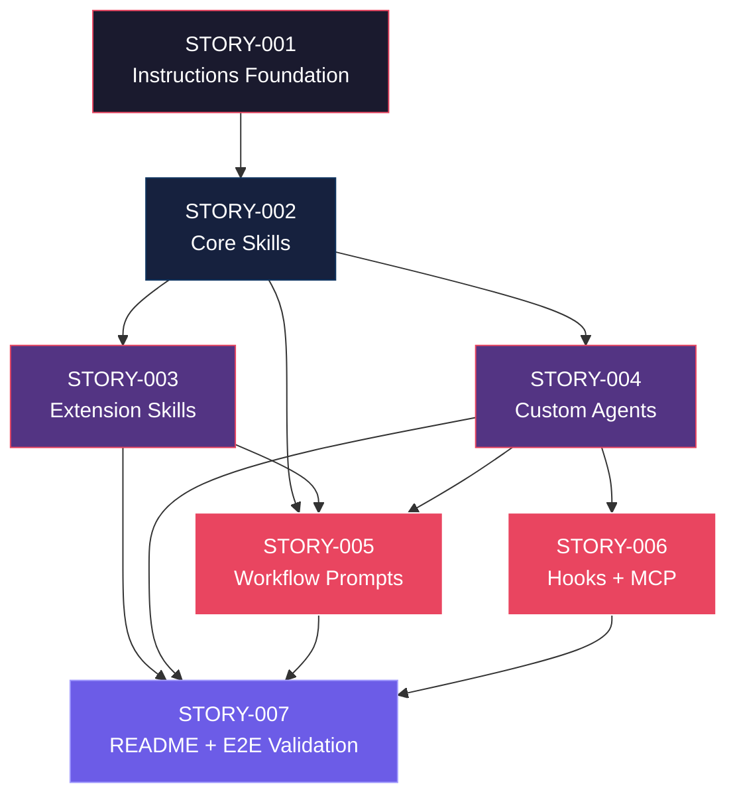

# Mapa de Implementação — Estrutura `.github/` para GitHub Copilot

**Gerado a partir das dependências BlockedBy/Blocks de cada história do EPIC-001.**

---

## 1. Matriz de Dependências

| Story | Título | Blocked By | Blocks | Status |
| :--- | :--- | :--- | :--- | :--- |
| STORY-001 | Fundação de Instructions do Copilot | — | STORY-002 | Pending |
| STORY-002 | Skills Core: Story/Planning e Development | STORY-001 | STORY-003, STORY-004, STORY-005 | Pending |
| STORY-003 | Skills de Extensão: Review, Testing e Infrastructure | STORY-002 | STORY-005, STORY-007 | Pending |
| STORY-004 | Custom Agents em formato .agent.md | STORY-002 | STORY-005, STORY-006, STORY-007 | Pending |
| STORY-005 | Prompts de Composição de Workflows (.prompt.md) | STORY-002, STORY-003, STORY-004 | STORY-007 | Pending |
| STORY-006 | Cross-cutting Config: Hooks JSON + MCP | STORY-004 | STORY-007 | Pending |
| STORY-007 | README e Validação End-to-End da estrutura Copilot | STORY-003, STORY-004, STORY-005, STORY-006 | — | Pending |

> **Nota:** STORY-007 concentra convergência de governança e validação; qualquer atraso em STORY-005 ou STORY-006 impacta diretamente o fechamento do épico.

---

## 2. Fases de Implementação

> As histórias são agrupadas em fases. Dentro de cada fase, as histórias podem ser implementadas **em paralelo**.

```
╔══════════════════════════════════════════════════════════════════════════╗
║                   FASE 0 — Foundation                                  ║
║                                                                        ║
║   ┌──────────────────────────────────────────────────────────┐          ║
║   │  STORY-001  Instructions base                            │          ║
║   └──────────────────────────┬───────────────────────────────┘          ║
╚══════════════════════════════╪══════════════════════════════════════════╝
                               │
                               ▼
╔══════════════════════════════════════════════════════════════════════════╗
║                   FASE 1 — Core                                         ║
║                                                                        ║
║   ┌──────────────────────────────────────────────────────────┐          ║
║   │  STORY-002  Skills core                                  │          ║
║   └──────────────────────────┬───────────────────────────────┘          ║
╚══════════════════════════════╪══════════════════════════════════════════╝
                               │
                               ▼
╔══════════════════════════════════════════════════════════════════════════╗
║                   FASE 2 — Extensions (paralelo)                        ║
║                                                                        ║
║   ┌─────────────┐                               ┌─────────────┐         ║
║   │  STORY-003  │  Skills extensão              │  STORY-004  │ Agents  ║
║   └──────┬──────┘                               └──────┬──────┘         ║
╚══════════╪══════════════════════════════════════════════╪════════════════╝
           │                                              │
           ▼                                              ▼
╔══════════════════════════════════════════════════════════════════════════╗
║                   FASE 3 — Compositions/Cross-cutting (paralelo)        ║
║                                                                        ║
║   ┌─────────────┐                               ┌─────────────┐         ║
║   │  STORY-005  │  Workflow prompts             │  STORY-006  │ Hooks+MCP║
║   └──────┬──────┘                               └──────┬──────┘         ║
╚══════════╪══════════════════════════════════════════════╪════════════════╝
           │                                              │
           └──────────────────────────────┬───────────────┘
                                          ▼
╔══════════════════════════════════════════════════════════════════════════╗
║                   FASE 4 — Governança e Validação                       ║
║                                                                        ║
║   ┌──────────────────────────────────────────────────────────┐          ║
║   │  STORY-007  README + validação end-to-end               │          ║
║   └──────────────────────────────────────────────────────────┘          ║
╚══════════════════════════════════════════════════════════════════════════╝
```

---

## 3. Caminho Crítico

```
STORY-001 → STORY-002 → STORY-004 → STORY-005 → STORY-007
                         └────────→ STORY-006 ───────────┘
             STORY-002 → STORY-003 ──────────────────────┘
 Fase 0        Fase 1      Fase 2         Fase 3    Fase 4
```

**5 fases no caminho crítico, 5 histórias na cadeia mais longa (STORY-001 → STORY-002 → STORY-004 → STORY-005 → STORY-007).**

---

## 4. Grafo de Dependências (Mermaid)



---

## 5. Resumo por Fase

| Fase | Histórias | Camada | Paralelismo | Pré-requisito |
| :--- | :--- | :--- | :--- | :--- |
| 0 | STORY-001 | Foundation | 1 | — |
| 1 | STORY-002 | Core | 1 | STORY-001 |
| 2 | STORY-003, STORY-004 | Extensions | 2 paralelas | STORY-002 |
| 3 | STORY-005, STORY-006 | Compositions + Cross-cutting | 2 paralelas | STORY-003/004 |
| 4 | STORY-007 | Cross-cutting | 1 | STORY-003,004,005,006 |

**Total: 7 histórias em 5 fases.**

---

## 6. Detalhamento por Fase

### Fase 0 — Foundation

| Story | Escopo Principal | Artefatos Chave |
| :--- | :--- | :--- |
| STORY-001 | Instructions globais e contextuais | `.github/copilot-instructions.md`, `.github/instructions/*.instructions.md` |

**Entregas da Fase 0:**
- Base de contexto do Copilot operacional.

### Fase 1 — Core

| Story | Escopo Principal | Artefatos Chave |
| :--- | :--- | :--- |
| STORY-002 | Skills de maior valor | `.github/skills/x-story-*`, `.github/skills/x-dev-*`, `layer-templates` |

**Entregas da Fase 1:**
- Padrão de skills estabilizado com progressive disclosure.

### Fase 2 — Extensions

| Story | Escopo Principal | Artefatos Chave |
| :--- | :--- | :--- |
| STORY-003 | Skills de review/testing/infra/ops | `.github/skills/x-review*`, `x-test*`, `run-*`, `k8s-*`, etc. |
| STORY-004 | Agentes especializados | `.github/agents/*.agent.md` |

**Entregas da Fase 2:**
- Catálogo avançado de skills e agentes com boundaries.

### Fase 3 — Compositions/Cross-cutting

| Story | Escopo Principal | Artefatos Chave |
| :--- | :--- | :--- |
| STORY-005 | Prompts de workflow completo | `.github/prompts/*.prompt.md` |
| STORY-006 | Hooks + MCP | `.github/hooks/*.json`, `.github/copilot-mcp.json` |

**Entregas da Fase 3:**
- Orquestração de fluxos + automações de runtime.

### Fase 4 — Governança e Validação

| Story | Escopo Principal | Artefatos Chave |
| :--- | :--- | :--- |
| STORY-007 | README + validação final | `.github/README.md`, relatório Go/No-Go |

**Entregas da Fase 4:**
- Estrutura documentada e validada para adoção.

---

## 7. Observações Estratégicas

### Gargalo Principal

**STORY-002** é o maior gargalo (bloqueia STORY-003, STORY-004 e parte da composição em STORY-005).

### Histórias Folha (sem dependentes)

**STORY-007** é história folha e representa o marco final de aceite.

### Otimização de Tempo

- Máximo paralelismo nas fases 2 e 3 (2 histórias em paralelo).
- Times podem dividir streams: skills, agents, prompts/config.

### Dependências Cruzadas

**STORY-005** e **STORY-007** são convergências importantes entre ramos de skills, agents e config.

### Marco de Validação Arquitetural

**STORY-002** valida o padrão arquitetural de skills antes da expansão da camada 2.
