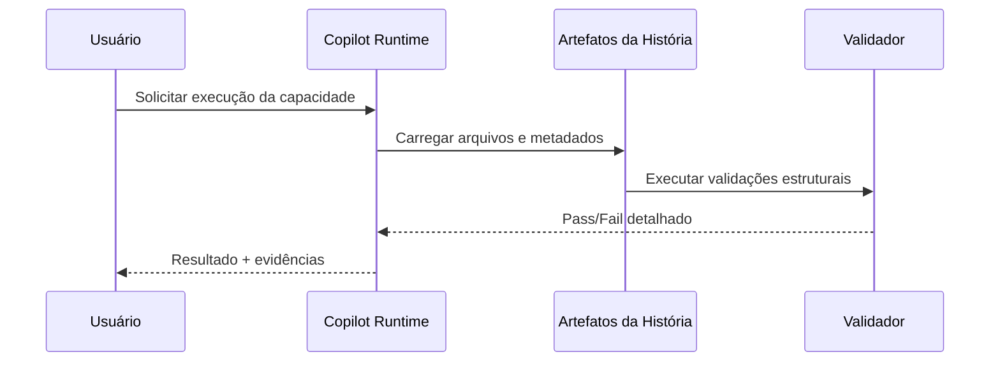

# História: Skills Core: Story/Planning e Development

**ID:** STORY-002

## 1. Dependências

| Blocked By | Blocks |
| :--- | :--- |
| STORY-001 | STORY-003, STORY-004, STORY-005 |

## 2. Regras Transversais Aplicáveis

| ID | Título |
| :--- | :--- |
| RULE-001 | Paridade funcional entre .claude e .github |
| RULE-002 | Aderência às convenções oficiais do Copilot |
| RULE-003 | Sem duplicação de conteúdo técnico (usar referências) |
| RULE-004 | Idioma em inglês, exceto skills de story em pt-BR |
| RULE-005 | Progressive disclosure em 3 níveis para skills |

## 3. Descrição

Como **Maintainer de Enablement**, eu quero adaptar skills `x-story-*`, `x-dev-*` e `layer-templates` para `.github/skills/`, garantindo que os fluxos de planejamento e implementação sejam acionados com precisão.

Estabelece o padrão canônico de `SKILL.md` com frontmatter mínimo e descrição orientada a trigger.

Implementa progressive disclosure em 3 níveis como base para todas as skills de extensão.

### 3.1 Frontmatter padronizado

- Campos obrigatórios: `name` e `description`.
- `name` em lowercase-hyphens.
- Description específica para roteamento correto.

### 3.2 Progressive disclosure

- Nível 1: frontmatter enxuto.
- Nível 2: body operacional.
- Nível 3: referências deep-dive.

## 4. Definições de Qualidade Locais

### DoR Local (Definition of Ready)

- [ ] Dependências de `Blocked By` concluídas.
- [ ] Convenções de naming/frontmatter validadas para o componente.
- [ ] Critérios de aceite e evidências de teste definidos.

### DoD Local (Definition of Done)

- [ ] Artefatos da história criados no formato exigido.
- [ ] Validação estrutural da história aprovada sem erro crítico.
- [ ] Evidências de execução registradas para revisão.

### Global Definition of Done (DoD)

- **Cobertura:** validação de 100% dos artefatos `.github/` gerados neste épico.
- **Testes Automatizados:** checks de naming, frontmatter, links relativos e carregamento de skills/prompts.
- **Relatório de Cobertura:** saída consolidada pass/fail por componente.
- **Documentação:** README da `.github/` atualizado com estrutura e fluxo de uso.
- **Persistência:** arquivos versionados com ordenação determinística e sem duplicação literal.
- **Performance:** hooks síncronos dentro do timeout configurado (<= 60s).

## 5. Contratos de Dados (Data Contract)

**Skill Metadata Contract:**

| Campo | Formato | Request | Response | Origem / Regra |
| :--- | :--- | :--- | :--- | :--- |
| `skill_id` | string | M | - | Slug da skill |
| `frontmatter.name` | lowercase-hyphens | M | - | Identificador de trigger |
| `frontmatter.description` | string | M | - | Intenção de uso |
| `disclosure_levels` | integer(3) | M | - | frontmatter/body/references |

## 6. Diagramas

### 6.1 Fluxo principal



## 7. Critérios de Aceite (Gherkin)

```gherkin
Cenario: Fluxo de sucesso de STORY-002
  DADO que os pré-requisitos da história estão atendidos
  QUANDO a implementação é executada conforme o contrato
  ENTÃO o resultado esperado da capacidade é entregue
  E os artefatos obrigatórios ficam disponíveis

Cenario: Violação de regra transversal em STORY-002
  DADO que uma regra do épico não foi respeitada
  QUANDO a validação de conformidade roda
  ENTÃO a história é reprovada com evidência objetiva
  E a correção é marcada como bloqueadora

Cenario: Input malformado em STORY-002
  DADO que um arquivo obrigatório está malformado
  QUANDO o parser do Copilot tenta carregar o artefato
  ENTÃO o carregamento falha com erro explícito
  E o relatório identifica arquivo e campo inválido

Cenario: Edge case de concorrência/ordem em STORY-002
  DADO que duas alterações paralelas ocorrem na mesma camada
  QUANDO a validação de dependências é executada
  ENTÃO a ordem de execução respeita o DAG definido
  E não há regressão de artefatos já válidos
```

## 8. Sub-tarefas

- [ ] [Dev] Implementar artefatos e estrutura da história.
- [ ] [Dev] Garantir aderência a naming/frontmatter do Copilot.
- [ ] [Test] Executar validação estrutural e de dependências.
- [ ] [Test] Cobrir cenário de erro e edge case da história.
- [ ] [Doc] Atualizar documentação de uso e manutenção.
