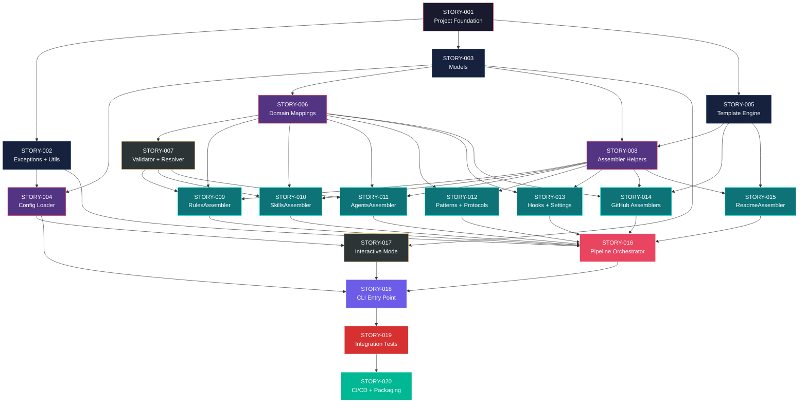

# Mapa de Implementação — Migração ia-dev-environment Python → Node.js/TypeScript

**Gerado a partir das dependências BlockedBy/Blocks de cada história do EPIC-001.**

---

## 1. Matriz de Dependências

| Story | Título | Blocked By | Blocks | Status |
| :--- | :--- | :--- | :--- | :--- |
| STORY-001 | Setup do Projeto Node.js + TypeScript | — | STORY-002, STORY-003, STORY-005 | Pendente |
| STORY-002 | Exceptions e Utilitários | STORY-001 | STORY-004, STORY-016 | Pendente |
| STORY-003 | Models — Interfaces e Classes TypeScript | STORY-001 | STORY-004, STORY-006, STORY-007, STORY-008, STORY-017 | Pendente |
| STORY-004 | Config Loader + Migração v2→v3 | STORY-002, STORY-003 | STORY-017, STORY-018 | Pendente |
| STORY-005 | Template Engine (Nunjucks) | STORY-001 | STORY-008, STORY-014, STORY-015 | Pendente |
| STORY-006 | Domain Layer — Mappings e Constantes | STORY-003 | STORY-007, STORY-009, STORY-010, STORY-011, STORY-012, STORY-013, STORY-014 | Pendente |
| STORY-007 | Domain Layer — Validator, Resolver, Skill Registry | STORY-003, STORY-006 | STORY-009, STORY-010, STORY-011 | Pendente |
| STORY-008 | Assembler Helpers | STORY-003, STORY-005 | STORY-009, STORY-010, STORY-011, STORY-012, STORY-013, STORY-014, STORY-015 | Pendente |
| STORY-009 | RulesAssembler | STORY-006, STORY-007, STORY-008 | STORY-016 | Pendente |
| STORY-010 | SkillsAssembler | STORY-006, STORY-007, STORY-008 | STORY-016 | Pendente |
| STORY-011 | AgentsAssembler | STORY-006, STORY-007, STORY-008 | STORY-016 | Pendente |
| STORY-012 | PatternsAssembler + ProtocolsAssembler | STORY-006, STORY-008 | STORY-016 | Pendente |
| STORY-013 | HooksAssembler + SettingsAssembler | STORY-006, STORY-008 | STORY-016 | Pendente |
| STORY-014 | GitHub Assemblers | STORY-005, STORY-006, STORY-008 | STORY-016 | Pendente |
| STORY-015 | ReadmeAssembler | STORY-005, STORY-008 | STORY-016 | Pendente |
| STORY-016 | Pipeline Orchestrator | STORY-002, STORY-009..015 | STORY-018 | Pendente |
| STORY-017 | Interactive Mode | STORY-003, STORY-004 | STORY-018 | Pendente |
| STORY-018 | CLI Entry Point | STORY-004, STORY-016, STORY-017 | STORY-019 | Pendente |
| STORY-019 | Testes de Integração + Paridade | STORY-018 | STORY-020 | Pendente |
| STORY-020 | CI/CD, Packaging e Documentação | STORY-019 | — | Pendente |

> **Nota:** STORY-016 é o ponto de convergência principal — depende de todos os assemblers (009-015) e do módulo de exceptions/utils (002). STORY-018 é o segundo ponto de convergência, integrando pipeline, config loader e interactive mode.

---

## 2. Fases de Implementação

> As histórias são agrupadas em fases. Dentro de cada fase, as histórias podem ser implementadas **em paralelo**. Uma fase só pode iniciar quando todas as dependências das fases anteriores estiverem concluídas.

```
╔══════════════════════════════════════════════════════════════════════════╗
║                   FASE 0 — Foundation (1 story)                        ║
║                                                                        ║
║   ┌─────────────────────────────────────────────────────────┐          ║
║   │  STORY-001  Setup do Projeto Node.js + TypeScript       │          ║
║   └──────────────────────────┬──────────────────────────────┘          ║
╚══════════════════════════════╪═════════════════════════════════════════╝
                               │
                               ▼
╔══════════════════════════════════════════════════════════════════════════╗
║                   FASE 1 — Core Primitives (3 paralelas)               ║
║                                                                        ║
║   ┌─────────────┐  ┌─────────────┐  ┌─────────────┐                   ║
║   │  STORY-002  │  │  STORY-003  │  │  STORY-005  │                   ║
║   │  Exceptions │  │  Models     │  │  Template   │                   ║
║   │  + Utils    │  │             │  │  Engine     │                   ║
║   └──────┬──────┘  └──────┬──────┘  └──────┬──────┘                   ║
╚══════════╪════════════════╪════════════════╪══════════════════════════╝
           │                │                │
           ▼                ▼                ▼
╔══════════════════════════════════════════════════════════════════════════╗
║                   FASE 2 — Core Domain (3 paralelas)                   ║
║                                                                        ║
║   ┌─────────────┐  ┌─────────────┐  ┌─────────────┐                   ║
║   │  STORY-004  │  │  STORY-006  │  │  STORY-008  │                   ║
║   │  Config     │  │  Domain     │  │  Assembler  │                   ║
║   │  Loader     │  │  Mappings   │  │  Helpers    │                   ║
║   └──────┬──────┘  └──────┬──────┘  └──────┬──────┘                   ║
╚══════════╪════════════════╪════════════════╪══════════════════════════╝
           │                │                │
           ▼                ▼                ▼
╔══════════════════════════════════════════════════════════════════════════╗
║                   FASE 3 — Domain Logic + Interactive (2 paralelas)     ║
║                                                                        ║
║   ┌──────────────────────────────┐  ┌─────────────┐                   ║
║   │  STORY-007  Validator,       │  │  STORY-017  │                   ║
║   │  Resolver, Skill Registry    │  │  Interactive │                   ║
║   └──────────────┬───────────────┘  └──────┬──────┘                   ║
╚══════════════════╪═════════════════════════╪══════════════════════════╝
                   │                         │
                   ▼                         │
╔══════════════════════════════════════════════════════════════════════════╗
║              FASE 4 — Assemblers (7 paralelas, máximo paralelismo)      ║
║                                                                        ║
║  ┌───────────┐ ┌───────────┐ ┌───────────┐ ┌───────────┐              ║
║  │ STORY-009 │ │ STORY-010 │ │ STORY-011 │ │ STORY-012 │              ║
║  │ Rules     │ │ Skills    │ │ Agents    │ │ Patterns  │              ║
║  │ Assembler │ │ Assembler │ │ Assembler │ │ Protocols │              ║
║  └─────┬─────┘ └─────┬─────┘ └─────┬─────┘ └─────┬─────┘              ║
║                                                                        ║
║  ┌───────────┐ ┌───────────┐ ┌───────────┐                            ║
║  │ STORY-013 │ │ STORY-014 │ │ STORY-015 │                            ║
║  │ Hooks +   │ │ GitHub    │ │ Readme    │                            ║
║  │ Settings  │ │ Assemblers│ │ Assembler │                            ║
║  └─────┬─────┘ └─────┬─────┘ └─────┬─────┘                            ║
╚════════╪═════════════╪═════════════╪═════════════════════════════════╝
         │             │             │
         ▼             ▼             ▼
╔══════════════════════════════════════════════════════════════════════════╗
║                   FASE 5 — Pipeline Integration (1 story)              ║
║                                                                        ║
║   ┌──────────────────────────────────────────────────────────┐         ║
║   │  STORY-016  Pipeline Orchestrator                         │         ║
║   │  (← STORY-002, STORY-009..015)                            │         ║
║   └──────────────────────────┬───────────────────────────────┘         ║
╚══════════════════════════════╪═════════════════════════════════════════╝
                               │
                               ▼
╔══════════════════════════════════════════════════════════════════════════╗
║                   FASE 6 — CLI (1 story)                               ║
║                                                                        ║
║   ┌──────────────────────────────────────────────────────────┐         ║
║   │  STORY-018  CLI Entry Point                               │         ║
║   │  (← STORY-004, STORY-016, STORY-017)                      │         ║
║   └──────────────────────────┬───────────────────────────────┘         ║
╚══════════════════════════════╪═════════════════════════════════════════╝
                               │
                               ▼
╔══════════════════════════════════════════════════════════════════════════╗
║                   FASE 7 — Validation (1 story)                        ║
║                                                                        ║
║   ┌──────────────────────────────────────────────────────────┐         ║
║   │  STORY-019  Testes de Integração + Paridade               │         ║
║   └──────────────────────────┬───────────────────────────────┘         ║
╚══════════════════════════════╪═════════════════════════════════════════╝
                               │
                               ▼
╔══════════════════════════════════════════════════════════════════════════╗
║                   FASE 8 — Release (1 story)                           ║
║                                                                        ║
║   ┌──────────────────────────────────────────────────────────┐         ║
║   │  STORY-020  CI/CD, Packaging e Documentação               │         ║
║   └──────────────────────────────────────────────────────────┘         ║
╚══════════════════════════════════════════════════════════════════════════╝
```

---

## 3. Caminho Crítico

> O caminho crítico (a sequência mais longa de dependências) determina o tempo mínimo de implementação do projeto.

```
STORY-001 ──→ STORY-003 ──→ STORY-006 ──→ STORY-007 ──→ STORY-009 ──→ STORY-016 ──→ STORY-018 ──→ STORY-019 ──→ STORY-020
  Fase 0         Fase 1         Fase 2         Fase 3         Fase 4         Fase 5         Fase 6         Fase 7         Fase 8
```

**9 fases no caminho crítico, 9 histórias na cadeia mais longa (STORY-001 → 003 → 006 → 007 → 009 → 016 → 018 → 019 → 020).**

Qualquer atraso no caminho crítico impacta diretamente a data de entrega final. As fases 4 (assemblers) e 1 (core primitives) oferecem o maior paralelismo para absorver variações.

---

## 4. Grafo de Dependências (Mermaid)



---

## 5. Resumo por Fase

| Fase | Histórias | Camada | Paralelismo | Pré-requisito |
| :--- | :--- | :--- | :--- | :--- |
| 0 | STORY-001 | Foundation | 1 | — |
| 1 | STORY-002, STORY-003, STORY-005 | Core Primitives | 3 paralelas | Fase 0 concluída |
| 2 | STORY-004, STORY-006, STORY-008 | Core Domain | 3 paralelas | Fase 1 concluída |
| 3 | STORY-007, STORY-017 | Domain Logic + Interactive | 2 paralelas | Fase 2 concluída |
| 4 | STORY-009..015 | Assemblers | 7 paralelas | Fase 3 concluída (007) + Fase 2 (006, 008) |
| 5 | STORY-016 | Pipeline Integration | 1 | Fase 4 concluída + STORY-002 |
| 6 | STORY-018 | CLI | 1 | Fase 5 + STORY-004 + STORY-017 |
| 7 | STORY-019 | Validation | 1 | Fase 6 concluída |
| 8 | STORY-020 | Release | 1 | Fase 7 concluída |

**Total: 20 histórias em 9 fases.**

> **Nota:** A Fase 4 oferece o maior potencial de paralelismo (7 stories simultâneas). STORY-017 (Interactive Mode) pode começar na Fase 3 pois depende apenas de STORY-003 e STORY-004, executando em paralelo com os assemblers.

---

## 6. Detalhamento por Fase

### Fase 0 — Foundation

| Story | Escopo Principal | Artefatos Chave |
| :--- | :--- | :--- |
| STORY-001 | Inicialização do projeto Node.js/TypeScript | `package.json`, `tsconfig.json`, `tsup.config.ts`, `vitest.config.ts`, estrutura de diretórios |

**Entregas da Fase 0:**

- Projeto compilável com `npm run build`
- Test runner funcional com `npm run test`
- CLI stub com `npx ia-dev-env --help`

### Fase 1 — Core Primitives

| Story | Escopo Principal | Artefatos Chave |
| :--- | :--- | :--- |
| STORY-002 | Exceções + atomic output + path validation | `src/exceptions.ts`, `src/utils.ts` |
| STORY-003 | 17 models com fromDict factories | `src/models.ts` |
| STORY-005 | Nunjucks wrapper com placeholder replacement | `src/template-engine.ts` |

**Entregas da Fase 1:**

- Error handling customizado funcional
- Escrita atômica e validação de paths
- Todos os data models desserializáveis
- Template engine renderizando Nunjucks identicamente ao Jinja2

### Fase 2 — Core Domain

| Story | Escopo Principal | Artefatos Chave |
| :--- | :--- | :--- |
| STORY-004 | YAML loading, v2→v3 migration, validation | `src/config.ts` |
| STORY-006 | 7 módulos de mappings e constantes | `src/domain/*.ts` (7 arquivos) |
| STORY-008 | Copy helpers, conditions, consolidator, auditor | `src/assembler/copy-helpers.ts`, `conditions.ts`, `consolidator.ts`, `auditor.ts` |

**Entregas da Fase 2:**

- Config loader completo com migração v2→v3
- Todos os mappings de stack, patterns, protocols, KP routing
- Primitivas de assembler compartilhadas

### Fase 3 — Domain Logic + Interactive

| Story | Escopo Principal | Artefatos Chave |
| :--- | :--- | :--- |
| STORY-007 | Validator, resolver, skill registry | `src/domain/validator.ts`, `resolver.ts`, `skill-registry.ts` |
| STORY-017 | Prompts interativos com inquirer | `src/interactive.ts` |

**Entregas da Fase 3:**

- Validação de compatibilidade framework↔language
- Resolução de stack com valores computados
- Modo interativo completo

### Fase 4 — Assemblers

| Story | Escopo Principal | Artefatos Chave |
| :--- | :--- | :--- |
| STORY-009 | RulesAssembler (540 linhas, 4+ layers) | `src/assembler/rules-assembler.ts` |
| STORY-010 | SkillsAssembler (285 linhas, feature-gated) | `src/assembler/skills-assembler.ts` |
| STORY-011 | AgentsAssembler (262 linhas, checklist injection) | `src/assembler/agents-assembler.ts` |
| STORY-012 | PatternsAssembler + ProtocolsAssembler | `src/assembler/patterns-assembler.ts`, `protocols-assembler.ts` |
| STORY-013 | HooksAssembler + SettingsAssembler | `src/assembler/hooks-assembler.ts`, `settings-assembler.ts` |
| STORY-014 | 6 GitHub Assemblers | `src/assembler/github-*.ts` (6 arquivos) |
| STORY-015 | ReadmeAssembler (431 linhas) | `src/assembler/readme-assembler.ts` |

**Entregas da Fase 4:**

- Todos os 14 assemblers funcionais individualmente
- Testes de paridade por assembler
- ~2.000 linhas TypeScript de lógica de geração

### Fase 5 — Pipeline Integration

| Story | Escopo Principal | Artefatos Chave |
| :--- | :--- | :--- |
| STORY-016 | Orquestração dos 14 assemblers + atomic output | `src/assembler/index.ts` |

**Entregas da Fase 5:**

- Pipeline completo executando todos os assemblers na ordem correta
- Atomic output funcional
- Dry-run mode

### Fase 6 — CLI

| Story | Escopo Principal | Artefatos Chave |
| :--- | :--- | :--- |
| STORY-018 | Comandos generate e validate com commander | `src/cli.ts`, `src/index.ts` |

**Entregas da Fase 6:**

- CLI completa e funcional
- Tabela de resultado com classificação de arquivos
- Error handling com exit codes

### Fase 7 — Validation

| Story | Escopo Principal | Artefatos Chave |
| :--- | :--- | :--- |
| STORY-019 | Testes E2E + verificação byte-for-byte com Python | `tests/integration/`, `tests/fixtures/`, `src/verifier.ts` |

**Entregas da Fase 7:**

- 10+ fixtures de teste com reference outputs
- Suite de paridade byte-for-byte passando
- Coverage total ≥ 95% line, ≥ 90% branch

### Fase 8 — Release

| Story | Escopo Principal | Artefatos Chave |
| :--- | :--- | :--- |
| STORY-020 | CI/CD + npm packaging + remoção Python + docs | `.github/workflows/`, README.md atualizado |

**Entregas da Fase 8:**

- CI/CD funcional no GitHub Actions
- Pacote npm publicável
- Código Python removido
- README completo

---

## 7. Observações Estratégicas

### Gargalo Principal

**STORY-006 (Domain Mappings)** é o maior gargalo — bloqueia 7 stories downstream (007, 009, 010, 011, 012, 013, 014). Investir mais tempo em STORY-006 para garantir que todos os mappings estejam corretos e completos evita retrabalho cascata nos assemblers. Um erro nos mappings se propaga para o output de todos os assemblers.

### Histórias Folha (sem dependentes)

**STORY-020 (CI/CD + Packaging)** é a única história que não bloqueia nenhuma outra. É candidata a absorver atrasos sem impacto no caminho crítico. Tarefas parciais (como configurar o CI workflow) podem começar antes se necessário.

### Otimização de Tempo

- **Máximo paralelismo na Fase 4:** 7 assemblers podem ser implementados simultaneamente por desenvolvedores diferentes. Esta é a fase onde a alocação de equipe tem maior impacto.
- **Início imediato:** STORY-001 pode começar imediatamente, sem pré-requisitos.
- **Trabalho antecipado em STORY-017:** Interactive mode depende apenas de Models + Config Loader, podendo avançar na Fase 3 sem esperar pelos assemblers.
- **Fase 1 com 3 paralelas:** Exceptions, Models e Template Engine são completamente independentes.

### Dependências Cruzadas

- **STORY-016 (Pipeline)** é o ponto de convergência mais complexo: depende de STORY-002 (Fase 1) e todas as 7 stories de assembler (Fase 4). Só pode começar após a conclusão completa da Fase 4.
- **STORY-018 (CLI)** converge 3 ramos: Config Loader (via STORY-004), Pipeline (via STORY-016), e Interactive (via STORY-017). Requer que todas as 3 correntes estejam completas.

### Marco de Validação Arquitetural

**STORY-009 (RulesAssembler)** deve servir como checkpoint de validação antes de expandir para os demais assemblers. O RulesAssembler é o mais complexo (540 linhas, 4+ layers) e exercita o maior número de primitivas: template engine, copy helpers, consolidator, auditor, version resolver, KP routing. Se o RulesAssembler produzir output byte-for-byte idêntico ao Python, é forte indicativo de que a arquitetura está correta para os demais assemblers.

**Validação recomendada após STORY-009:**
- Output de rules/ byte-for-byte idêntico ao Python para 3+ configs
- Template engine produzindo output idêntico
- Version resolver funcionando com fallback
- Consolidator agrupando corretamente

Se a validação do STORY-009 falhar, investigar antes de paralelizar os demais assemblers.
